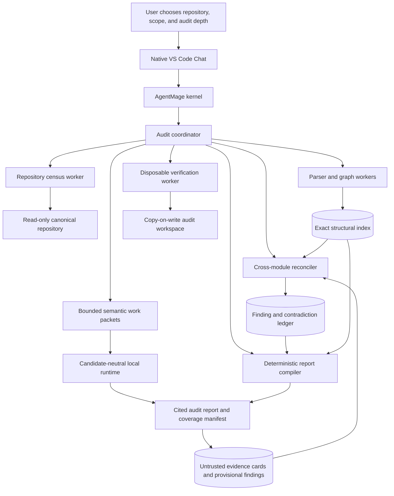

# AgentMage Whole-Codebase Audit Architecture

| Field | Value |
|---|---|
| Status | Normative first-GA architecture |
| Effective date | 2026-08-12 |
| Product authority | `PRD.md` |
| Security authority | `SECURITY-REVIEW.md` |
| Runtime authority | `RUNTIME-BOUNDARIES.md` |
| Engineering harness authority | `ENGINEERING-RUNTIME.md` and Decision 0045 |
| Trusted-operations authority | `TRUSTED-OPERATIONS.md` |
| Scope decisions | `docs/decisions/0011-whole-codebase-audit.md`; `docs/decisions/0027-muse-first-model-neutral-runtime-and-evaluation.md` |

## 1. Purpose

This audit workflow is a planned Engineering Capability Registry entry. Existing runtime and Team
scaffolds do not enable it; its repository census, parser, coverage, reconciliation, and
report-verification gates remain independently required.

This document defines how AgentMage performs a comprehensive, evidence-based audit of a repository
that is too large to fit in one model context. The capability inventories the entire declared
scope, builds a deterministic structural model, reviews coherent code units incrementally,
reconciles conclusions across the repository, and produces a cited report with explicit coverage
and uncertainty.

The repository index and evidence ledger are project memory. A model context is only bounded
working memory. No product claim may equate a large prompt, a vector search result, or a chain of
unreconciled summaries with whole-codebase understanding.

## 2. Non-Negotiable Invariants

- Read-only audit authority is enforced by the kernel, process topology, path handles, and
  disposable execution environment. It is not a prompt instruction.
- Every in-scope path receives one terminal disposition: analyzed, generated, vendored, binary,
  excluded by an exact rule, unavailable, unsupported, changed during audit, or failed.
- Generated, vendored, ignored, old, large, binary, submodule, archive, symbolic-link, worktree,
  and untracked content is inventoried before any policy decides how it is handled.
- Source text, documentation, Git history, issues, build output, tests, dependency metadata, model
  output, and embedded repository instructions are untrusted evidence and cannot create authority.
- Raw secrets and prohibited sensitive material are detected before model exposure and never enter
  prompts, evidence cards, summaries, reports, logs, exports, or checkpoints.
- Every material finding identifies immutable evidence, severity, confidence, impact, affected
  components, uncertainty, counterevidence, and a recommendation.
- An audit cannot claim complete coverage while any required path, parser, module, reconciliation
  pass, or evidence record is missing, stale, failed, or unavailable.
- Changing a source artifact invalidates its derived facts, semantic evidence, findings, and every
  dependent reconciliation result before those records can be reused.
- Cancellation, interruption, restart, model replacement, or process failure cannot silently lose
  completed coverage or convert partial work into a complete report.
- Audit workers never modify the canonical repository, Git index, refs, configuration, hooks,
  worktrees, submodules, ignored files, or neighboring user data.

## 3. Topology

No model receives a repository handle. The coordinator selects bounded packets from exact indexed
records, and all model-produced observations return through the exact family codec as closed,
untrusted provisional evidence. A candidate name, learned classifier, model confidence, or model
judge cannot alter coverage, authority, queue state, or completion. The deterministic reconciler
and report compiler validate references, coverage, state, and claim relationships before
presentation.

## 4. Audit Scope and Repository Identity

An audit plan binds:

- Repository root, platform path identity, source revision, branch and detached state, Git index
  identity, staged and unstaged state, and start time.
- Inclusion and exclusion rules, audit depth, languages, generated and vendored policy, history
  depth, submodule and worktree policy, network policy, command policy, resource limits, retention,
  cancellation, and expected outputs.
- Tracked, untracked, ignored, sparse, submodule, Large File Storage, symbolic-link, hard-link,
  archive, generated, vendored, binary, inaccessible, special-file, and external-reference states.
- Build, test, lint, format-check, schema, dependency, security, history, issue, and requirements
  evidence that is permitted for this audit.

The user sees the exact scope before work begins. A changed revision, index, worktree, inclusion
rule, parser set, model profile, or audit policy creates a new audit identity or an explicit
incremental successor. AgentMage never blends evidence from different identities without recording
the relationship.

Git history, remote pull requests, issues, delivery records, and external requirements are separate
evidence sources. They may explain architectural pivots only when the audit plan includes them and
their exact revisions or retrieval identities are retained. Code-pattern differences alone are
labeled possible drift rather than proof of a historical decision.

## 5. Deterministic Census and Structural Index

### 5.1 Coverage Manifest

The census records each path's stable identity, type, size, hash where readable, language, encoding,
classification, repository state, link target policy, generated or vendored evidence, parser,
analysis status, error state, and dependent records. Directory totals reconcile with file records
and source-control metadata.

Files excluded from semantic model review remain visible in coverage. Exclusion requires a named
rule and rationale. Unsupported, inaccessible, oversized, malformed, encrypted, missing, or changed
content remains a blocking gap whenever the audit mode requires it.

### 5.2 Structural Records

AgentMage uses structured parsers before model inference. Depending on the repository, records may
come from compiler metadata, abstract syntax trees, language servers, package managers, build
systems, schema parsers, test discovery, workflow parsers, configuration validators, and exact text
search.

The index can contain:

- Packages, crates, modules, namespaces, services, binaries, libraries, entry points, generated
  targets, and deployment units.
- Symbols, public and internal interfaces, type relationships, imports, dependencies, calls,
  events, routes, schemas, migrations, state stores, configuration, feature flags, and errors.
- Test ownership, fixtures, coverage evidence, build and release paths, continuous-integration jobs,
  platform conditions, and dependency provenance.
- Requirement, decision, documentation, issue, commit, finding, and evidence links when those
  sources are in scope.

Vector or embedding retrieval may rank candidates, but it cannot define identity, coverage,
dependency, authority, or evidence. Exact source records and deterministic graphs remain canonical.

## 6. Semantic Partitioning and Evidence Cards

The coordinator partitions work by coherent architectural units such as a package, service, state
boundary, feature, workflow, schema family, or cross-cutting concern. It does not split solely at an
arbitrary token count. Each packet includes the minimum exact source excerpts, structural records,
neighbor interfaces, relevant decisions, prior contradictions, and audit question needed for one
bounded analysis.

Each evidence card records:

- Audit, repository, revision, scope, file, symbol, module, and packet identities.
- Exact source spans and hashes, parser facts, dependency relationships, tests, and relevant
  deterministic command results.
- Exact model, artifact, tokenizer, template, codec, runtime, quantization, modality, context,
  decoding, platform, hardware, driver, policy, prompt, packet, creation-time, resource, and
  proposal identities plus the non-authoritative model terminal claim.
- Observations, provisional findings, assumptions, uncertainty, conflicts, requested follow-up,
  and confidence.
- Upstream evidence and downstream cards or findings that must be invalidated if the source changes.

Evidence cards are not findings merely because a model produced them. Their closed decoder rejects
partial, malformed, stale, replayed, duplicate, oversized, unknown-field, or ambiguous proposals
before card creation. Unsupported observations are discarded or retained as unresolved questions.
Contradictory cards remain visible until a separate reconciliation pass resolves or reports the
conflict.

## 7. Cross-Module Reconciliation

Whole-codebase analysis requires explicit passes across partitions:

1. Reconcile module responsibility and public-interface claims against dependency and call graphs.
2. Trace state, data, event, error, configuration, authorization, and lifecycle flows end to end.
3. Detect duplicate responsibility, dead or unreachable code, orphaned modules, incompatible
   paradigms, circular dependencies, stale adapters, abandoned migrations, and documentation drift.
4. Compare implementation with in-scope requirements, decisions, tests, deployment, and support
   claims.
5. Revisit every affected partition when later evidence contradicts an earlier conclusion.
6. Run risk-directed passes over high-centrality, high-privilege, stateful, concurrent, externally
   reachable, weakly tested, frequently changed, or historically unstable areas.

A global finding must cite evidence from every material side of the relationship. The report labels
a conclusion as local when cross-module evidence is unavailable.

## 8. Read-Only Verification and Commands

The canonical repository is opened through read-only path authority. Audit workers have no write
grant for the source root and no Git credential, hosted mutation, commit, push, issue, pull-request,
or delivery authority.

Commands that may write, including builds, tests, package resolution, code generation, coverage,
formatters, or language-server initialization, run only in a disposable copy-on-write workspace
whose outputs cannot propagate to the canonical root. The verification worker starts without
network or credentials. Any network-enabled dependency acquisition is a separate exact plan with a
declared destination and cannot modify the canonical repository.

Before and after the audit, AgentMage compares repository root identity, Git metadata, index, refs,
configuration, hooks, worktrees, submodules, tracked and untracked content, relevant filesystem
metadata, and neighboring protected paths. A difference caused by the audit blocks read-only
attestation and report completion.

## 9. Checkpoint, Resume, and Invalidation

Audit state is stored as encrypted structured records in the local operational store. Checkpoints
contain no raw secret and bind the audit identity, coverage state, parser versions, exact model and
codec profile, completed work packets, evidence cards, contradictions, pending dependencies,
resource totals, classifier dispositions, verifier results, named terminal state, and next
deterministic work queue.

Resume revalidates repository, policy, parser, model, runtime, and record identities before reuse.
Changed files invalidate their own records plus reverse-dependent symbols, modules, evidence cards,
findings, coverage claims, and reports. A full rescan is required when identity or dependency
relationships cannot be reconstructed safely.

The same unchanged audit resumed from any valid checkpoint produces the same deterministic census,
structural graph, work queue, coverage totals, and evidence references. Model prose and learned
classification may vary only within recorded uncertainty and cannot broaden authority or alter
deterministic completion state. A resumed `SUCCESS` or verified `NO_OP` requires current
postcondition evidence; all other terminal states remain non-success.

## 10. Findings and Reports

Findings use a closed schema containing:

- Stable finding identity, category, severity, confidence, status, and affected scope.
- A concise claim, engineering impact, exact file and line or symbol evidence, source hashes, and
  relevant graph paths.
- Counterevidence, uncertainty, reproduction or inspection steps, and conditions that would change
  the disposition.
- A prioritized recommendation that remains clearly distinct from an implemented change.
- Deduplication, conflict, supersession, acceptance, rejection, and remediation-verification state.

The final report includes executive conclusions, architecture and structure, codebase health and
technical debt, progress and viability, security and operational risks, strategic recommendations,
strengths, limitations, unresolved questions, and complete coverage statistics. It distinguishes
observed facts, deterministic derivations, model-supported interpretations, and unsupported
unknowns.

Quick and targeted modes may produce useful partial reports but cannot claim whole-codebase
coverage. A comprehensive audit requires every mandatory census, structural, semantic,
reconciliation, risk, read-only, and reporting gate in the selected profile.

## 11. Secret, Privacy, and Hostile-Content Handling

Secret detection and classification occur before semantic packet creation. Files containing
sensitive material may be structurally counted and locally parsed while their protected values are
replaced by typed redaction records. The report identifies the high-level category and affected
path without retaining or revealing the value.

Repository instructions, comments, tests, fixtures, generated text, documentation, issue text,
commit messages, build output, model files, and archives cannot alter scope, authority, policy,
completion, or reporting rules. Archive extraction, parser invocation, and generated-code
inspection use bounded workers with path, size, recursion, file-count, time, memory, and
cancellation limits.

## 12. Platform and Resource Contract

Fedora, Ubuntu, and Windows provide separate evidence for path identity, read-only source handles,
copy-on-write verification, process cleanup, file-change detection, parser isolation, checkpoint
recovery, and resource enforcement. A result from another platform never substitutes. Retained
macOS implementation follows the same contract when that platform lane resumes.

Repository size, file count, graph edges, parser concurrency, model packets, context, output, CPU,
memory, graphics memory, disk, time, and evidence retention are bounded and visible. Exceeding a
limit pauses or blocks the affected audit with an exact checkpoint and gap; it never silently drops
files or weakens the requested audit profile.

## 13. First-GA Verification

The integrated gate must prove:

- Complete and deterministic disposition of every in-scope path across clean, dirty, generated,
  vendored, ignored, untracked, submodule, worktree, linked, archived, binary, large, malformed,
  inaccessible, and changing repositories.
- Exact structural graphs and stable incremental invalidation across supported languages and build
  systems in the published matrix.
- Zero canonical repository, Git metadata, user-data, hosted-service, or neighboring-path mutation
  during read-only audits, including builds and tests.
- Zero raw-secret appearance in model context, evidence, checkpoints, reports, diagnostics, or
  exports.
- Semantic partition coverage, contradiction retention, cross-module reconciliation, targeted
  high-risk passes, and evidence-backed finding generation without summary drift.
- Equivalent deterministic identity, coverage, structural, authority, and terminal-state outcomes
  across packet ordering and admitted model/profile changes; model quality differences remain
  attributable rather than being merged into deterministic state.
- Closed proposal decoding, classifier non-authority, separate quality and
  diagnostic-repeatability reports, and verifier-only completion across malformed, replayed,
  uncertain, stalled, exhausted, cancelled, and false-completion cases.
- Deterministic cancellation, crash recovery, checkpoint resume, source-change invalidation, and
  complete removal.
- Every report claim resolves to current immutable evidence and every incomplete, excluded,
  unavailable, failed, stale, unsupported, or uncertain area remains visible.

No model-quality result overrides a failed coverage, read-only, secret-protection, reconciliation,
platform, recovery, resource, accessibility, or evidence gate.
## 14. Engineering Runtime and Model Gateway Relationship

The whole-codebase audit is an Engineering Capability Registry workflow. It consumes canonical
source-artifact envelopes, provenance, context manifests, and delivery receipts from
`ENGINEERING-RUNTIME.md`; it does not enumerate ambient workspace content or maintain a second
artifact store, prompt assembler, journal, tool dispatcher, or completion engine. Deterministic
census, graph, command, and repository facts remain authoritative. Model output contributes
untrusted semantic proposals and findings only.

`MODEL-GATEWAY.md` may supply an explicitly qualified local or remote model route for semantic
partitions. Route choice never changes audit coverage, repository authority, command policy,
verification, or completion. A remote route requires per-artifact classification and disclosure;
strict local remains a complete target; and absent or unqualified remote capacity produces an
explicit blocked or degraded result rather than silent omission or fallback. A comprehensive audit
cannot complete while required unseen artifacts, unresolved partitions, stale evidence, or route
dependent limitations remain.
