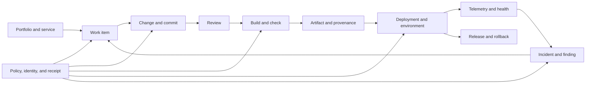
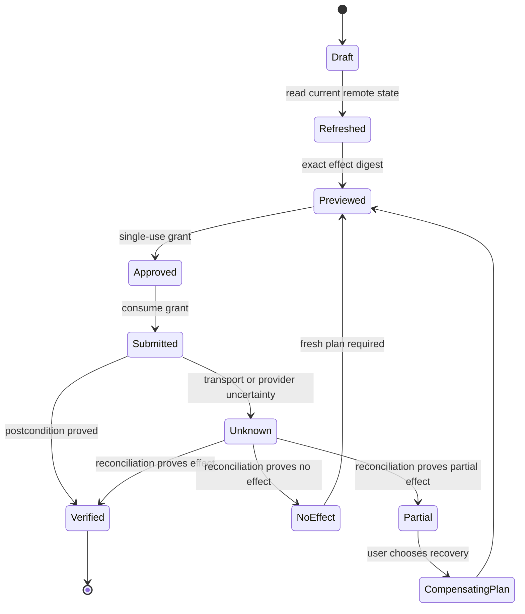
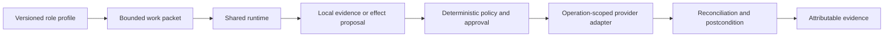

# AgentMage Delivery System Architecture

| Field | Value |
|---|---|
| Status | Normative first-GA architecture under Decisions 0008 and 0041 |
| Effective date | 2026-08-11 |
| Product authority | [`PRD.md`](./PRD.md) |
| Requirement authority | [`Agent-Scaffolding-Inventory.md`](./Agent-Scaffolding-Inventory.md) |
| Security authority | [`SECURITY-REVIEW.md`](./SECURITY-REVIEW.md) |
| Repository safety authority | [`docs/security/repository-safety.md`](./docs/security/repository-safety.md) |
| Execution authority | [`TASKS.md`](./TASKS.md) |

## 1. Purpose

This document defines how AgentMage becomes a local-first software-delivery control plane without turning provider credentials, model output, or a generic connector into ambient authority. It defines the common delivery graph, adapter contract, capability classes, supported integration tiers, operation lifecycle, failure semantics, and verification boundary.

The architecture is deliberately provider-neutral. A provider-specific API is normalized only where its meaning is genuinely equivalent. Provider-only behavior remains an explicit extension with its own schema, policy, test fixtures, and support-matrix entry.

## 2. First-GA Product Boundary

AgentMage v1.0 GA requires:

- Native Visual Studio Code Chat on Fedora, Ubuntu, and Windows 11.
- A removable strict-local core for repository understanding, controlled local changes, tests, evidence, and local model inference.
- Complete GitHub.com and GitHub Enterprise Server behavior within the published source, work, review, workflow, release, and remote-Git matrix.
- Reference work-management adapters for Jira Cloud, Jira Data Center, GitHub Issues, and Azure Boards.
- Reference source and CI adapters for Azure Repos and Pipelines, GitLab and GitLab CI, GitHub Actions, and Jenkins.
- Reference artifact support for OCI Distribution registries, GitHub Container Registry, Azure Container Registry, JFrog Artifactory, and Sonatype Nexus.
- Reference deployment and infrastructure support for Kubernetes, Helm, Kustomize, Argo CD, Flux, Terraform, and OpenTofu.
- OpenTelemetry correlation plus reference Datadog, Prometheus/Grafana/Loki, Elastic, Splunk, Sentry, and incident-management adapters.
- Security-result ingestion and policy gates for SARIF, CodeQL, Semgrep, SonarQube, Snyk, Trivy, Grype, SPDX, CycloneDX, Sigstore/Cosign, SLSA provenance, and OPA/Conftest.
- A Backstage reference catalog adapter and a versioned extension path for Port, Cortex, and Atlassian Compass.
- Release manifests, semantic-version and changelog support, environment promotion, health verification, rollback, feature-flag adapters, progressive delivery, and database-migration gates.
- Standardized planning, issue, bug, review, CI/CD, release, operations, and
  maintenance role profiles using the shared runtime and the same provider
  effect lifecycle.

Later adapters may include additional providers such as Bitbucket, Gerrit, Buildkite, CircleCI, Pulumi, New Relic, Dynatrace, ServiceNow, LaunchDarkly, Unleash, Flyway, and Liquibase. Their names in the roadmap do not make them supported until their individual conformance gates pass and the release matrix promotes them.

## 3. Delivery Graph

The kernel stores a provider-neutral graph of immutable observations and explicit relationships. Provider caches are derivatives of remote systems, never a second remote authority.

Every graph node records provider, host, tenant or organization, project, immutable object identity, mutable display identity, version or revision, observed time, freshness, sensitivity, source receipt, and tombstone state. Every edge records the evidence and confidence for the relationship. An inferred edge can assist navigation but cannot authorize an action.

## 4. Capability Classes

| Class | Examples | Required user boundary |
|---|---|---|
| `observe` | Read repository, issue, run, artifact metadata, logs, deployment, metric, or incident | Destination-scoped connected session and least-privilege credential |
| `draft` | Prepare issue, review, pipeline input, release notes, deployment plan, or rollback plan | Local operation; no external effect |
| `local-write` | Edit files, stage changes, create a local commit | Exact local preimage and single-use grant |
| `remote-write` | Push branch, comment, update issue, submit review, publish release metadata | Fresh remote state, exact payload preview, separate approval, reconciliation |
| `execute` | Dispatch or rerun CI, approve an environment, run an approved job | Exact ref, inputs, environment, permissions, budget, and execution approval |
| `deploy` | Promote or roll back an artifact, synchronize GitOps, apply an approved release | Immutable artifact, target environment, health and rollback contract, deployment approval |
| `secrets` | Reference, rotate, or change secret metadata | Secret-specific authority; values never enter model context or receipts |
| `admin` | Change rulesets, protected branches, memberships, credentials, policies, or provider configuration | Separately disabled by default; dedicated administrative profile and review |

No class inherits another. In particular, `remote-write` does not imply `execute`, `execute` does not imply `deploy`, and `deploy` does not imply `secrets` or `admin`.

## 5. Adapter Contract

Every provider adapter implements the same lifecycle:

1. `describe()` returns adapter identity, build, provider products, API versions, host constraints, capability matrix, required scopes, rate model, event modes, and limits.
2. `diagnose()` validates host identity, transport, account, tenant, credential source, granted scopes, API compatibility, clock, and safe read-only reachability without exposing credentials.
3. `discover()` returns bounded provider objects and stable identities under an `observe` grant.
4. `plan()` creates a canonical local draft and declares expected reads, writes, executions, disclosures, and rollback or compensation.
5. `preview()` re-reads affected remote state and produces the exact user-confirmable effect digest.
6. `execute()` consumes one grant and performs only the previewed operation.
7. `reconcile()` proves effect, non-effect, partial effect, duplicate effect, or unknown effect before any retry.
8. `rollback()` or `compensate()` creates a new preview and grant; it never silently reverses later user or provider changes.
9. `remove()` revokes local registration, credentials, caches, webhooks, schedules, processes, and network access without harming other adapters.

Provider extensions use namespaced typed fields. Unknown fields are preserved as bounded untrusted evidence when safe, never coerced into a misleading common meaning.

## 6. Adapter Conformance Levels

| Level | Meaning | Minimum proof |
|---|---|---|
| L0 Manifested | Identity and declared capability matrix only | Schema, signature, package, and removal tests |
| L1 Observable | Supported reads and event ingestion | Pagination, freshness, permissions, redaction, replay, cache, and zero-mutation tests |
| L2 Writable | Supported bounded mutations | Exact preview, stale-state denial, idempotency, uncertain-result reconciliation, postcondition, and audit tests |
| L3 Executable | Supported CI or job actions | Ref/input/environment binding, budgets, cancellation, log/artifact attribution, and duplicate-execution tests |
| L4 Deployable | Supported promotions and rollback | Artifact provenance, environment policy, health gates, drift, rollback, and production-approval tests |
| L5 Administrative | Narrow promoted administration | Separate threat model, independent review, break-glass controls, and complete before/after state proof |

Each adapter and provider version is promoted independently. Unsupported operations are absent from registration and have negative tests proving they cannot be reached.

## 7. Identity and Credential Isolation

Credential selection is explicit by provider, exact host, tenant or organization, account, project scope, and capability class. Credentials live in the platform secret store and are delivered only to the operation-scoped adapter worker. Models receive non-secret account labels and permission summaries only.

Redirects, aliases, cloned hostnames, changed TLS identity, cross-host API links, webhook callback targets, and provider-supplied download URLs are revalidated against the grant. One host's credential is never sent to another host. GitHub.com and each GitHub Enterprise Server instance are distinct security domains even when their repository names match.

### 7.1 Repository and GitHub Mutation Boundary

All Git and GitHub mutations are governed by the canonical
[`Repository and GitHub Safety Contract`](./docs/security/repository-safety.md).
The model cannot invoke Git, choose a transport, resolve credentials, or mint
authority. The kernel admits only exact clone, namespaced fetch, owned-worktree
create/remove, compare-and-swap local fast-forward, signed commit, and ordinary
fast-forward push operations. Each consumes a distinct grant and reconciles a
pre/post repository preservation manifest.

Generic pull, merge, rebase, reset, clean, discard, stash/tag/note mutation,
branch deletion, remote configuration, hook/filter execution, mirror, force,
force-with-lease, and arbitrary ref updates are absent. Fetch does not prune,
follow tags, write `FETCH_HEAD`, recurse into submodules, trigger Large File
Storage transfer, or update user remote-tracking refs. Commits use an
AgentMage-owned temporary index and pinned signer. Pushes name one canonical
host, repository, credential, old object, new object, and full task-branch ref,
require approval distinct from commit, and never retry an unknown effect before
fresh remote reconciliation.

GitHub App installation authentication is preferred for long-lived product
integration because it permits repository-scoped permissions and short-lived
tokens. Fine-grained expiring personal access tokens, approved Secure Shell
agent identities, or approved credential helpers are bounded fallbacks. The
adapter observes branch protection, rulesets, required signatures, reviews,
checks, and bypass capability, but never exercises a bypass merely because the
actor possesses it.

## 8. Operation State Machine

A timeout is never treated as failure without reconciliation. A retry is never issued merely because an HTTP client reports an error. Provider-native idempotency is used when available; otherwise AgentMage uses operation fingerprints, object queries, event correlation, and explicit unknown-state blocking.

## 9. CI, Artifact, and Deployment Boundaries

- A workflow definition is untrusted repository content. It cannot gain AgentMage authority by being present in a repository.
- CI dispatch binds workflow or pipeline identity, immutable source revision, exact inputs, environment, runner constraints, permissions, expected artifacts, budget, and cancellation behavior.
- Logs and artifacts are untrusted and subject to size, parser, archive, secret, and retention controls before model use.
- Artifacts are selected by immutable digest. Tags, build numbers, and release names are display identities only.
- Promotion verifies source revision, build receipt, test state, SBOM, provenance, signature, policy decision, target environment, deployment diff, health gates, and rollback target.
- Infrastructure plans and GitOps diffs are drafts. Apply, synchronization, prune, destroy, and production promotion are distinct operations.
- Database migrations require direction, compatibility window, backup or recovery condition, lock/timeout policy, and post-migration verification. Destructive migration is never hidden inside application deployment.

## 10. Observability and Incident Correlation

OpenTelemetry provides the canonical telemetry interchange and correlation vocabulary. Provider adapters may query or link metrics, logs, traces, errors, monitors, dashboards, and incidents, but they do not redefine the delivery graph.

Observations bind service, environment, release, artifact digest, commit, deployment, trace, monitor, incident, and time window. AgentMage distinguishes correlation from causation and never claims a deployment caused an incident solely because timestamps overlap.

Diagnostic exports are redacted, bounded, user-reviewed, and receipted. Telemetry ingestion cannot create authority, execute remediation, or become durable memory automatically. Incident actions, rollback, feature-flag change, and issue creation remain separate exact operations.

## 11. Security and Supply Chain

The delivery system treats provider content, CI logs, artifacts, manifests, findings, comments, issue text, generated patches, and telemetry as hostile input. Required controls include:

- SARIF normalization with original rule, tool, location, severity, confidence, suppression, and immutable source identity retained.
- SPDX and CycloneDX bills of materials tied to exact artifacts.
- Sigstore/Cosign verification and signed provenance tied to the release manifest.
- SLSA provenance validation without claiming a level that the recorded build does not meet.
- Policy evaluation through a versioned OPA/Conftest-style interface with policy identity and input digest recorded.
- Dependency and vulnerability findings from multiple tools preserved separately; deduplication never erases conflicting severity or reachability evidence.
- Secret values remain unreadable to the model and omitted from logs, previews, error strings, and receipts.

## 12. Extreme Verification Matrix

Every promoted adapter runs, where applicable:

- Contract and schema mutation for missing, extra, reordered, duplicated, malformed, oversized, stale, and future-version fields.
- Host, tenant, account, repository, project, environment, and credential-confusion attacks.
- Prompt injection in every provider-controlled text field and archive entry.
- Redirect, DNS, TLS, proxy, webhook, callback, and download-host confusion.
- Pagination loops, cursor reuse, event reordering, duplicate delivery, replay, forgery, clock skew, and eventual consistency.
- Rate limiting, quota exhaustion, permission reduction, credential expiry, single-sign-on changes, provider outage, network partition, and slow response.
- Crash and cancellation before submission, during transmission, after provider effect, during reconciliation, and during local commit.
- Concurrent user changes, branch movement, force updates, deleted or renamed objects, moved line positions, and changed policies.
- Duplicate prevention and proof that unknown results block unsafe retry.
- Resource exhaustion from logs, artifacts, archives, repository size, event floods, telemetry cardinality, and model context.
- Removal and reinstall tests proving no residual credential, process, webhook, schedule, cache, or network authority.
- Cross-adapter end-to-end traces from work item through code, CI, artifact, deployment, telemetry, incident, rollback, and closure.

No test summary can hide a failed, skipped, stale, flaky, quarantined, suppressed, unavailable, or unreconciled blocking result.

## 13. Support Matrix Contract

Every release ships a machine-readable matrix containing:

- Adapter and provider product identity.
- Minimum, maximum, and exactly tested versions.
- Cloud, self-hosted, and enterprise host types.
- Authentication methods and required scopes.
- Capability level by object and operation.
- Event mode: webhook, bounded polling, manual refresh, or unsupported.
- Rate and object-size limits.
- Known degradation and unsupported behavior.
- Test fixture version, test environment identity, and evidence digest.
- Support state, security-support end, and removal procedure.

A provider version outside the matrix starts in an unsupported or diagnostic-only state. It cannot silently inherit the nearest tested version's support claim.

## 14. Extension Priorities

The first-GA reference adapters establish the contract. Later adapters should be selected by user value and semantic fit, not by making the core aware of more brands. High-value extensions include Bitbucket and Gerrit for source, Buildkite and CircleCI for CI, Pulumi for infrastructure, New Relic and Dynatrace for observability, ServiceNow for incidents and change records, and Port/Cortex/Compass for service catalogs.

Each extension enters as L0, proves L1 read behavior, and advances one capability level at a time. A provider with strong read support and no safe mutation semantics remains honestly supported at L1.

## 15. Productivity-System Relationship

Decision 0009 adds the communications, personal-information, document, finance, and Cloud Observer
packs defined in [`PRODUCTIVITY-SYSTEM.md`](./PRODUCTIVITY-SYSTEM.md). They reuse this document's
adapter lifecycle, exact connected identity, operation-scoped workers, support-matrix truthfulness,
event integrity, effect reconciliation, and complete-removal contract.

The productivity work graph may link a message, meeting, task, document, financial alert, or cloud
observation to delivery objects, but it does not convert those records into delivery authority.
Likewise, a delivery event cannot authorize a communication, financial-record change, or cloud
operation. Cross-graph edges retain both native identities, source evidence, observation time,
classification, confidence class, and freshness.

Additional capability boundaries apply:

- Communication reads, drafts, sends, edits, deletions, reactions, attachments, calendar changes,
  contact changes, task changes, and document changes are independently manifested operations.
- The Autonomy Center narrows policy but does not mint, hold, transfer, aggregate, or consume grants.
- Financial institution reads and cloud observations cannot advance beyond read conformance in
  v1.0. Their adapters have no writable, executable, deployable, secret, or administrative level.
- Non-money-movement accounting records can advance to bounded write conformance only through the
  Finance pack's fixed-point, reconciliation, and recovery gates.
- Cross-pack workflows compile to explicit operation graphs. A generic workflow cannot collapse
  communication, delivery, finance, and cloud actions into one approval or credential scope.

The delivery system remains independently complete when all Decision 0009 packs are absent, and the
productivity packs remain removable without damaging delivery graph identity or evidence.

## 16. Trusted-Operations Relationship

Decision 0010 adds the command, public-research, credential-broker, continuity, and model-manager
capabilities defined in [`TRUSTED-OPERATIONS.md`](./TRUSTED-OPERATIONS.md). They reuse the kernel's
grant, identity, receipt, cancellation, reconciliation, and removal contracts but do not become
delivery adapters.

- A command may run Git, build, test, package, or delivery tooling only at the effective command
  level. Owner / Unrestricted Session does not silently confer provider credentials, hosted-write,
  deployment, secret, or administration capability.
- Public research can inform a delivery plan only as cited untrusted evidence. A webpage cannot
  approve a dependency, command, issue change, deployment, or release.
- The credential broker resolves one typed reference for one exact provider operation. Delivery and
  backup credentials are not interchangeable even when the same provider hosts both services.
- Continuity snapshots may preserve local delivery state and evidence under classification and
  retention policy, but cloud backup can write only encrypted objects to one exact backup namespace.
- Model installation and experimental evaluation cannot alter a delivery graph, publish an
  artifact, start CI, or promote a release.

Disabling trusted operations leaves the provider-neutral delivery system usable at the remaining
authorized levels. Removing delivery adapters leaves no connected credential or operation path for
trusted operations to inherit.

## 17. Whole-Codebase Audit Relationship

Decision 0011 adds the read-only repository capability in
[`CODEBASE-AUDIT.md`](./CODEBASE-AUDIT.md). A local audit can include delivery manifests,
workflows, build definitions, deployment configuration, and locally retained evidence within its
exact repository scope. Remote repositories, pull requests, issues, checks, logs, artifacts, and
delivery history are separate provider evidence sources and require their own read grants,
identities, freshness, pagination, rate, retention, and coverage records.

An audit finding cannot authorize a commit, push, issue change, pipeline, deployment, rollback,
secret operation, or administrative effect. Audit workers have no hosted-write or provider
credential authority. If the user later chooses remediation, AgentMage creates a new delivery plan
from current evidence under the ordinary preview, grant, execution, reconciliation, and receipt
contract.

## 18. Standardized Agent-Profile Relationship

Decision 0041 and the
[`planning, review, and delivery profile architecture`](./docs/architecture/planning-review-and-delivery-agent-profiles.md)
define 49 declarative roles over this delivery system. The roles do not become
provider adapters and do not own credentials, policy, approval, signing,
evidence truth, or effect execution.

Planning and review profiles normally use `observe` and `draft`. Coding roles
may request `local-write` or approved local `execute` operations inside owned
worktrees. PR, issue, CI, merge, release, deployment, rollback, communication,
and administrative actions retain separate capability classes and exact grants.
The profile that prepared an operation cannot approve it merely by changing
roles or invoking a coordinator.

The canonical delivery workflows are:

- idea to reviewed issue and dependency-ordered plan;
- bug intake to reproduction, diagnosis, fix, regression evidence, closure
  verification, and PR draft;
- immutable PR packet to independent correctness, architecture, test, security,
  compatibility, reliability, and accessibility findings;
- CI failure to investigation, bounded remediation, rerun proposal, and current
  check evidence;
- approved change to build, provenance, release, deployment verification,
  incident response, rollback proposal, and postmortem; and
- backlog and roadmap snapshot to duplicate detection, progress reconciliation,
  dependency analysis, sprint proposal, risk review, and field-level provider
  updates.

Review coordinators preserve each finding and disagreement. Merge, release, and
deployment eligibility is computed from current provider state and deterministic
gates rather than a review-role consensus or model confidence. Provider-backed
planning, issue, bug, and GitHub review execution remains deferred to Story
107.2 and its dependencies. The remaining source, CI, artifact, supply-chain,
release, deployment, observability, incident, and maintenance profile paths
remain deferred through Sprints 108-124, followed by all-profile lifecycle
conformance in Story 125.2. The catalog itself creates no current support claim.
## 19. Engineering Runtime, Capability, and Model Gateway Relationship

Delivery adapters expose provider objects and effects through the existing delivery graph. A Model
Gateway endpoint profile is an inference destination, not a Git, issue, CI, artifact, deployment,
observability, or incident adapter. Inference compatibility cannot grant provider credentials,
network destinations, write authority, deployment authority, or support status.

Engineering capabilities may compose delivery operations only through admitted manifests under
`ENGINEERING-CAPABILITY-REGISTRY.md`. The Rust Engineering Runtime owns workflow state, fresh
attempts, grants, approvals, observations, verification, recovery, and terminal results. Local and
remote model routes return untrusted proposals. CI and release evidence must bind the exact
capability, model/runtime/codec/endpoint/route tuple where inference was used, and every delivery
effect remains separately receipted and approved under this document.
