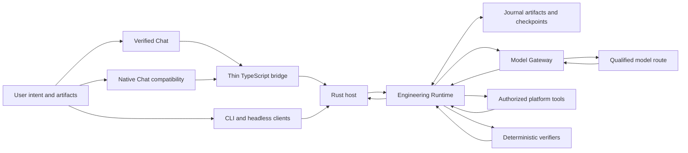

# AgentMage Engineering Runtime

| Field | Value |
|---|---|
| Status | Normative implementation specification; contract-tested scaffold, not integrated or supported |
| Decisions | 0042, 0043, and mandatory supersession 0045 |
| Product authority | `PRD.md` |
| Detailed requirements | `Agent-Scaffolding-Inventory.md` |
| Security authority | `SECURITY-REVIEW.md` and `RUNTIME-BOUNDARIES.md` |
| Model mediation | `MODEL-GATEWAY.md` |
| Capability manifests | `ENGINEERING-CAPABILITY-REGISTRY.md` |

Current product lifecycle: `scaffolded`.
Current integrated workflow: none.
Current enabled models: none.
Current supported platforms: none.
Stabilization scope freeze: inactive.

## 1. Purpose

The Engineering Runtime is AgentMage's Rust-owned engineering harness. It
turns admitted user intent and artifacts into bounded model proposals,
authorized tool execution, current verification evidence, and one explicit
terminal result. It is not a wrapper that gives a model a shell, workspace, or
credential.

This document composes the artifact and workflow foundations accepted by
Decision 0042 with Verified Chat, persistent task supervision, reliable tool
observations, observability, degradation, performance, reusable capabilities,
and later multi-agent execution accepted by Decision 0043.

## 2. Current Truth

The repository now contains a contract-tested Engineering Runtime scaffold:
closed Rust records and RPC, authenticated host composition, SQLCipher-backed
sessions, artifacts, journal events, approvals, plan handoff, controlled Agent
execution, conservative recovery, a secured own-tab Verified Chat client,
candidate-neutral local and remote gateway ports, a capability registry, and a
kernel-backed Team coordinator with bounded concurrent workers, independent
review, correction, serialized integration, checkpoints, and final
verification.

This is not an integrated or supported product workflow. No model profile is
currently qualified and selectable; no live private or managed remote endpoint
has passed qualification; the production host does not yet install a complete
Team worker/reviewer/integrator stack; in-flight Team effects fail closed as
recovery-uncertain; broad artifact parsing, installed VS Code acceptance,
cross-platform matrices, performance/soak campaigns, and independent review
remain open. Component tests and fake ports are implementation evidence, not
release evidence.

## 3. Non-Negotiable Invariants

1. Rust owns policy, grants, state, tools, persistence, routing admission,
   verification, and completion.
2. Models are untrusted planners. They receive no workspace handle, raw secret,
   grant-minting authority, direct tool channel, or completion authority.
3. TypeScript and webviews are thin clients. Closing or reloading a view cannot
   change task truth.
4. Every supplied artifact receives one visible terminal ingestion
   disposition. No input disappears silently.
5. Every admitted tool call receives exactly one terminal `ToolObservation`.
6. Every effect is bound to current identity, policy, authority, preconditions,
   and postcondition verification.
7. Uncertain effects reconcile before another attempt. Destructive, external,
   non-idempotent, or unknown effects are never retried automatically.
8. Only current verifier evidence can establish success or verified no-op.
9. Strict local remains a complete target configuration. Remote inference is
   optional and cannot activate through fallback.
10. Resource, time, token, turn, tool, retry, no-progress, effect, and cost
    ceilings apply to every task and child task.

## 4. Canonical Architecture



The arrows are data and request paths, not authority delegation. The model
gateway returns proposals and events. Platform workers return observations.
Neither can establish a workflow terminal state.

## 5. Canonical Records

The runtime uses closed, versioned records with unknown-field rejection and
explicit migration behavior. Existing schemas under `schemas/model/` and
`schemas/runtime/` remain authoritative where they already cover a record.
New Engineering Runtime schemas live under `schemas/engineering-runtime/`.

| Record | Required purpose |
|---|---|
| `ArtifactEnvelope` | Immutable source identity, media type, byte identity, classification, origin class, collection state, and authority binding |
| `ArtifactTransformation` | Parser and transformation identity, input/output hashes, exact ranges, warnings, and reproducibility |
| `ArtifactIngestionResult` | Captured, parsed, partial, unsupported, denied, unavailable, failed, or explicitly omitted terminal disposition |
| `ContextManifest` | Complete accounting for admitted, omitted, summarized, truncated, restricted, duplicate, stale, and unavailable material |
| `ContextDeliveryReceipt` | Exact model-visible ranges, hashes, token budget, route identity, and required-unseen blocker state |
| `WorkflowDefinition` | Versioned graph, steps, dependencies, budgets, side-effect classes, and verifier policy |
| `WorkflowState` | Closed lifecycle, active step, attempts, consumed budgets, approvals, receipts, and terminal state |
| `WorkflowCheckpoint` | Durable source, policy, environment, route, tool, receipt, and verifier bindings for safe resume |
| `ToolObservation` | Exactly one complete terminal result for one admitted call, with artifact-backed output and state-change truth |
| `VerificationResult` | Current postconditions, preserved invariants, prohibited effects, evidence, and pass or non-pass outcome |
| `TerminalResult` | Verified success, verified no-op, blocked, failed, cancelled, timed out, resource exhausted, or uncertain |

### 5.1 Existing-authority persistence map

Canonical Engineering Runtime records reuse the authorities already admitted by the runtime. They
do not introduce another database, artifact service, journal, or client-owned truth source.

| Persisted surface | Existing authority | Rule |
|---|---|---|
| Complete canonical JSON bytes | Private content-addressed runtime artifact store | Validate the closed Rust record before canonical serialization and publication. |
| Identity, digest, lifecycle, retention, and reference metadata | SQLCipher `OperationalStore` | Store only the metadata needed to locate, verify, retain, and reconcile the immutable payload. |
| Ordered correctness and lifecycle history | Append-only runtime event journal | Record canonical references and transitions; journal order remains authoritative for reconstruction. |
| Original source bytes named by `ArtifactEnvelope` | Request-bound source-artifact service | Reuse the captured source authority; no canonical record may copy source bytes into a second store. |
| Current `WorkflowState` row | Rebuildable operational projection | A materialized row is an optimization and must be reconstructible from admitted events and artifacts. |
| Client rendering | Runtime references and events | Chat, CLI, and future clients receive projections; they never acquire persistence authority. |

[`canonical_record_authority_route`](kernel/engine/src/engineering_records.rs) is the executable,
closed mapping for all nine record families. `CanonicalRuntimeRecordRef::artifact_payload` enforces
semantic validation before producing bytes for the existing artifact authority. Actual atomic
publication, restart reconstruction, and cross-authority transaction evidence remain assigned to
Stories 11.2, 21.3, and 22.4; this mapping does not claim those later gates complete.

## 6. Artifact Ingestion and Context Delivery

Decision 0042 remains the architectural authority for universal artifact
ingestion. The Engineering Runtime applies these additional closure rules:

- Capture AgentMage-owned pasted text before model invocation.
- Preserve original bytes as authority and keep parsed text as a derivative.
- Bind every derivative to source, parser, version, transformation, ranges, and
  warnings.
- Isolate parsers with no network, active content, macro, script, relationship,
  plugin, archive-escape, or credential authority by default.
- Separate acquisition from context admission. Having bytes does not make them
  safe or necessary to send to a model.
- Retain exact list, metadata, read, range, section, and search operations for
  admitted artifacts.
- Verify beginning, middle, and ending sentinels for large synthetic inputs.
- Block success when a required artifact or required range was not delivered.
- Never allow a summary, embedding, or retrieval ranking to replace source
  identity or source bytes.

Large inputs are processed in bounded partitions. The runtime persists or
streams authoritative content according to classification and retention,
creates deterministic structural and lexical indexes, and builds one context
manifest per turn. Model-visible excerpts disclose truncation and preserve
reconstructable ranges.

## 7. Workflow and Persistent Task Execution

The runtime owns the workflow lifecycle:

```text
created -> validating -> ready -> running -> verifying
        -> waiting_for_dependency | waiting_for_approval | paused
        -> reconciling | recovering
        -> succeeded | no_op | blocked | failed | cancelled
        -> timed_out | resource_exhausted | uncertain
```

Only declared transitions are legal. Each step has exact preconditions,
postconditions, side-effect class, tool contract, authority requirement,
idempotency policy, retry class, budget, and verifier.

The host supervisor owns continued execution after a view closes. It journals
accepted state before externally meaningful transitions, reconciles process and
effect truth after interruption, and resumes only when checkpoint bindings are
current. Consumed grants and completed effects are never replayed. A user can
inspect, pause, resume, cancel, or provide a required decision without sending
artificial "continue" prompts.

## 8. Reliable Tool I/O

One admitted call identity produces one and only one `ToolObservation`, even
for denial, cancellation, timeout, resource exhaustion, worker crash, or an
uncertain result. The observation contains at least:

- Tool and schema identity;
- Validated argument hash;
- Task, step, call, attempt, authority, and worker identity;
- Start and terminal times;
- Exit code, signal, or termination kind;
- Separate stdout and stderr artifact identities;
- Full byte counts, retained byte counts, digest, excerpt, and truncation state;
- Generated, modified, preserved, and uncertain paths where applicable;
- Process-tree cleanup and resource usage;
- Retry and reconciliation disposition;
- State-change truth and receipt identity.

Missing observation is a runtime failure and blocks workflow advancement.
Large output remains artifact-backed and is exposed through bounded exact reads
instead of silent truncation or wholesale prompt injection.

## 9. Deterministic Verification and Completion

The model may propose that work is complete. That proposal has no terminal
authority. The runtime resolves completion by evaluating current, versioned
verifiers against expected outputs, state transitions, preserved invariants,
prohibited side effects, receipts, artifact hashes, and environment identity.

A successful terminal result requires all required verifiers to pass and every
required artifact and observation to be current. A verified no-op additionally
requires proof that the desired state already held. Every non-success result
identifies the last verified state, blocker or failure, uncertainty, exhausted
budget, and safe next action.

## 10. Observability and Privacy

The append-only event lineage must make these stages inspectable:

- Input capture and reference resolution;
- Parsing and transformations;
- Context admission and omission;
- Route selection and model exchange;
- Proposal parsing and policy decisions;
- Approval and grant consumption;
- Tool execution and observations;
- File or external effects;
- Verification, recovery, and terminal state.

Events carry identities, hashes, states, timings, byte and token counts, policy
decisions, and artifact references. Raw secrets, private endpoint credentials,
unredacted sensitive content, hidden reasoning, and unrestricted command output
are not audit metadata. Sensitive trace payloads require classification,
minimization, encryption, retention, and access policy.

The user-facing inspector reconstructs current state from the Rust host and can
show what happened, what was omitted, which route ran, which tool executed,
what changed, what verified, and why a task stopped.

## 11. Degradation and Performance

Dependencies are classified as required, optional, or substitutable for an
exact workflow. Required dependency loss blocks the affected step. Optional
loss yields a visible reduced-capability state. Substitution requires an
explicit qualified policy and can never weaken data, authority, or verification
requirements.

Performance is measured at the workflow boundary. Recorded metrics include
capture, parse, retrieval, queue, first-event, first-token, generation,
tool-execution, verification, cancellation, and total completion latency;
throughput; memory; accelerator memory; disk; process count; artifact bytes;
and event backlog. Backpressure is bounded, cancellation is prompt and
observable, and performance limits never authorize silent omission.

Targets and support claims require benchmark fixtures and hardware, runtime,
model, endpoint, policy, and configuration identities. Planning prose alone
sets no performance claim.

## 12. Verified Chat

Verified Chat is AgentMage's canonical VS Code interface. It uses a supported
webview, a thin TypeScript bridge, authenticated versioned RPC, and the Rust
host. Its state is disposable and can be reconstructed after reload.

### 12.1 Modes

- **Ask** permits read-only analysis and cited answers under the selected
  profile.
- **Plan** permits planning artifacts and previews but no effect merely because
  a plan exists.
- **Agent** permits only effects admitted by current policy, exact grants, and
  approvals.

Mode changes narrow or select existing policy; they do not mint authority.

### 12.2 Security

The webview uses minimum capabilities, a restrictive Content Security Policy,
sanitized rendering, explicit `localResourceRoots`, nonce-bound resources,
bounded and hashed attachment frames, origin and session binding, sequence and
replay checks, flow control, cancellation, and acknowledgement. It receives no
secret and executes no tool.

### 12.3 Native surfaces

AgentMage reuses VS Code editors, diffs, terminals, tests, diagnostics, source
control, notebooks, progress, notifications, approvals, and accessibility
features. The webview is not a replacement implementation for those surfaces.

## 13. Native Chat Compatibility

The stable Chat Participant provides an `@agentmage` compatibility path for
request-bound references exposed by the public API. Unresolved or opaque
references remain explicit and may block a workflow requiring them.

The Language Model Chat Provider presents AgentMage models in native model
selection and preserves every supported normalized message part. Unknown or
unsupported parts fail visibly. Native compatibility cannot claim Verified
Chat's complete attachment, persistent lifecycle, or inspector guarantees
unless conformance proves parity.

Production uses stable public APIs. Proposed APIs are isolated from release.
External Agent Host registration remains future work until VS Code publishes a
stable extension API for that role.

## 14. Capability Registry and Multi-Agent Extension

The runtime loads only admitted capability manifests described by
`ENGINEERING-CAPABILITY-REGISTRY.md`. Each workflow uses the same policy,
observation, journal, artifact, verification, and terminal contracts.

Multi-agent enablement remains gated on the single-agent reliability spine. A
coordinator assigns bounded work packets to role profiles from Decision 0041.
Each pod has separate authority, budgets, leases, evidence, and an isolated
worktree where code changes are involved. Review remains independent,
integration is serialized, changed effective diffs invalidate stale evidence,
and final default-branch promotion is human-gated by default.

## 15. Versioning, Migration, and Removal

Schema, workflow, event, artifact, capability, endpoint, route, checkpoint, and
store migrations are explicit and reversible where declared. Unknown versions
fail closed. Old records remain readable only through an admitted migration or
an explicit unsupported disposition.

Every optional adapter or capability has a disable and removal path that stops
workers, expires grants, reconciles uncertain effects, removes registrations,
applies retention, and proves strict-local operation remains intact.

## 16. Verification Gates

The integrated Engineering Runtime cannot close until deterministic fixtures
cover positive, malformed, hostile, oversized, stale, cancelled, interrupted,
resource-exhausted, uncertain, and removal cases across Chat, CLI, headless, and
later workflow callers. Live model, endpoint, platform, package, security,
performance, accessibility, and independent-review gates remain separate and
open until actually executed.

The milestone and task authority is `TASKS.md`; the high-level dependency path
is `IMPLEMENTATION-PLAN.md`; current status remains
`architecture/status-model.json`.

## 17. Roadmap Placement

The implementation is additive work inside existing sprints under Decision 0045. The Engineering Runtime owns Stories
1.3, 2.4, 5.3, 11.3, 16.4, 21.4, 22.5, 23.7, 23.8, 50.4, 95.3, 95.4, 121.2,
125.3, and 126.2. Gateway-specific work is composed through Stories 13.5, 13.6, 49.2, 123.2,
and 124.2 under `MODEL-GATEWAY.md`. These placements add no sprint identity and leave every
checkbox open until its implementation, tests, acceptance criteria, and evidence pass.

## 18. Primary Technical References

The design was checked on 2026-08-22 against the official VS Code extension
guides for [Chat Participants](https://code.visualstudio.com/api/extension-guides/ai/chat),
[Language Model Chat Providers](https://code.visualstudio.com/api/extension-guides/ai/language-model-chat-provider),
the [Language Model API](https://code.visualstudio.com/api/extension-guides/ai/language-model),
and [webviews](https://code.visualstudio.com/api/extension-guides/webview).
The open VS Code [External Agent Host API request](https://github.com/microsoft/vscode/issues/325827)
is treated as future compatibility work, not a stable production dependency.
