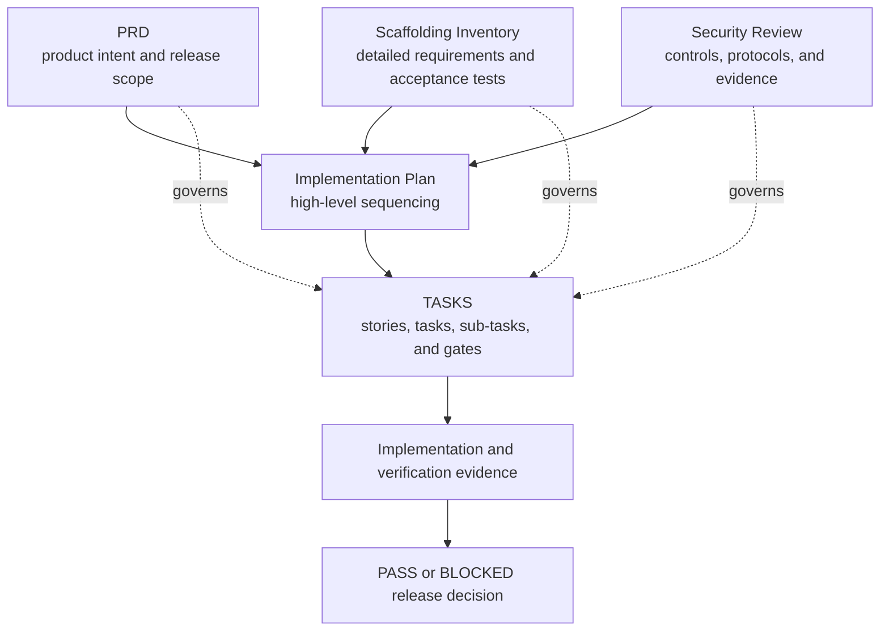
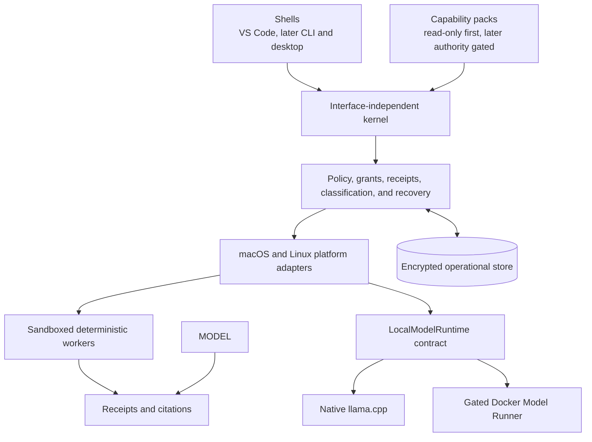
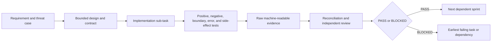

# AgentMage - High-Level Implementation Plan

| Field | Planning baseline |
|---|---|
| Status | Implementation in progress; blocked Mac platform lane retained |
| Version | 1.1 |
| Date | 2026-08-10 |
| Product | AgentMage - a brand-new, from-scratch local-first assistant |
| Product authority | [`PRD.md`](./PRD.md) |
| Detailed requirement authority | [`Agent-Scaffolding-Inventory.md`](./Agent-Scaffolding-Inventory.md) |
| Security-review authority | [`SECURITY-REVIEW.md`](./SECURITY-REVIEW.md) |
| Granular execution authority | [`TASKS.md`](./TASKS.md) |
| Supporting policies | [`MODEL-PROVENANCE-POLICY.md`](./MODEL-PROVENANCE-POLICY.md), [`SECURITY.md`](./SECURITY.md), and [`RUNTIME-BOUNDARIES.md`](./RUNTIME-BOUNDARIES.md) |
| Planning cadence | 103 sequential two-week sprints across 10 epics |

## 1. Purpose

This document is the high-level implementation plan for AgentMage, a brand-new, from-scratch project. It explains how the product architecture, platform boundaries, capability packs, interfaces, assurance work, and releases fit together from project foundation through final product verification.

AgentMage is an independent, privately developed product created by Aaron N. Horvitz on personal time, on personally controlled hardware, with independently obtained tools and services. It is not sponsored, commissioned, or developed on behalf of an employer. Public release is the product objective; any later managed-device evaluation is optional, separate from development, and does not change project ownership.

This document is derived from `PRD.md`, `Agent-Scaffolding-Inventory.md`, and `SECURITY-REVIEW.md`. It is intentionally less granular than `TASKS.md` and defines implementation phases, workstreams, dependencies, milestone outcomes, risks, and gates. `MODEL-PROVENANCE-POLICY.md`, `SECURITY.md`, and `RUNTIME-BOUNDARIES.md` provide subordinate admission, disclosure, and boundary procedures. This plan does **not** replace the numbered stories, tasks, sub-tasks, tests, acceptance criteria, artifacts, or evidence requirements in `TASKS.md`.

A developer or coding agent must use this document to understand the overall sequence and use `TASKS.md` to perform the next bite-sized unit of work. No implementation item may be considered complete from this plan alone.

## 2. Document Authority and Change Control

The governing rules are:

1. `PRD.md` owns product intent, architecture, release scope, and product-level acceptance.
2. `Agent-Scaffolding-Inventory.md` owns detailed requirements, stable `AM-*`, `AT-*`, and `CR-*` identifiers, capability gates, and the additions-only inventory.
3. `SECURITY-REVIEW.md` owns the public product-security baseline, `SR-*` controls, `RV-*` reviewer protocols, and reviewer evidence contract.
4. This document owns only the high-level implementation sequence and milestone narrative.
5. `TASKS.md` owns executable ordering, sprint dependencies, stories, tasks, sub-tasks, tests, artifacts, Given/When/Then acceptance criteria, and PASS/BLOCKED gates.
6. `README.md` summarizes the project and must remain consistent with all five planning and authority documents.

Supporting policy and decision files implement those authorities and cannot silently weaken them. Each document has an independent revision; cross-document compatibility is established by recorded source versions, decision records, and automated checks rather than matching version numbers.

If documents conflict, the narrower safety boundary or release scope wins until an approved decision record resolves the conflict. This plan must be corrected before implementation continues; it cannot override a requirement, test, security control, or sprint gate. Accepted identifiers are never silently removed, weakened, merged away, or renumbered.

## 3. Implementation Outcomes

The first implementation objective is v0.1, a read-only local evidence assistant in native Visual Studio Code Chat on Apple Silicon macOS, Fedora, and Ubuntu. Its initial candidate is manifest-pinned Gemma 4 E4B, which is enabled only after admission passes. Gemma 4 12B Unified is the named disabled fallback candidate. Gemma 4 26B A4B and other later candidates remain disabled until their separate admission gates pass.

The complete roadmap expands that foundation through separately gated knowledge, writes, coding, manual frontier consultation, administrative and document work, read-only connectors, desktop interfaces, extensions, web research, hosted actions, schedules, and bounded agents. A later capability remains absent until its own dependencies, threat model, authority path, recovery behavior, tests, and release gate pass.

The implementation must preserve these outcomes throughout the roadmap:

- Deterministic operations run before model inference when an answer is mechanically checkable.
- Models, prompts, shells, plugins, connectors, schedules, and child agents carry no ambient authority.
- `CapabilityGrant` is the only authority-bearing object and is validated and consumed by the kernel.
- Platform adapters enforce equivalent authority, path, privacy, evidence, and offline contracts on macOS, Fedora, and Ubuntu.
- Encrypted SQLite is canonical for operational state; beginning in v0.2, Markdown is canonical only for human-owned knowledge and approved portable memory; JSON Lines is derived export only.
- Every tool attempt produces one receipt, and every file-grounded claim has a resolvable, stale-aware citation.
- The strict-local profile has no cloud model, external API, telemetry, analytics, cloud storage, hosted account, or cloud fallback.
- Codex remains a separate user-controlled surface. AgentMage may prepare a local handoff preview with classification and unresolved-redaction warnings but cannot invoke, populate, copy to, call, or transmit to Codex.
- Every enabled model and related artifact passes `MODEL-PROVENANCE-POLICY.md`, including license, publisher, lineage, origin, provenance, integrity, resource, quality, security, platform, and non-Chinese/non-Chinese-derived model gates.
- Native `llama.cpp` and Docker Model Runner implement one `LocalModelRuntime` contract. Native inference is the Linux security reference; Docker is a supported compatibility adapter only after its additional privilege, endpoint, isolation, parity, and zero-egress gates pass.
- `agentmage doctor` is a deterministic diagnostics response rendered in native Visual Studio Code Chat for v0.1; it is not evidence that the deferred full CLI exists.
- Security and release claims remain bounded to reproducible evidence and never imply external certification or customer deployment approval.
- Windows 11 and Intel Mac support remain absent until separately promoted, implemented, and assessed; passing macOS or Linux evidence cannot satisfy a future Windows gate.

## 4. Architecture Implementation Strategy

AgentMage is implemented as three one-way product layers over explicit platform adapters.

### 4.1 Kernel First

The kernel contracts are frozen before feature code. They define tasks, work packets, tools, results, receipts, evidence states, configuration, capability grants, paths, storage, cancellation, and recovery. The kernel cannot import a capability pack or shell.

### 4.2 Platform Boundaries Before Capabilities

macOS and Linux adapters are implemented and tested before tools depend on them. The adapters own local inference, workspace authorization, secure path resolution, process confinement, operating-system secret storage, resource limits, installation, and updates. `RUNTIME-BOUNDARIES.md` defines their process, privilege, socket, lifecycle, and classified data-flow contract.

The MacBook Pro M5 is the primary launch and deployment reference. Fedora is the Linux performance reference. Ubuntu must pass the same supported workflow. Native `llama.cpp` is the Linux security reference, while Docker Model Runner supplies a separately gated compatibility path matching Docker-based development. Platform-specific mechanisms may differ, but no platform or runtime may weaken the common contract.

### 4.3 Deterministic Tools Before Model Synthesis

Synthetic fixtures, read-only tools, Git inspection, repository mapping, receipts, citation resolution, evidence-state assignment, and stale-evidence detection are implemented before model-generated explanations are trusted. Unsupported or unavailable evidence is shown as Unknown/Blocked rather than invented.

### 4.4 One Interface Before Additional Shells

Native Visual Studio Code Chat is the sole v0.1 interface. The deterministic `agentmage doctor` response is rendered there. A development diagnostic harness and read-only reviewer verifier may exercise contracts but are not supported end-user shells. The complete CLI is introduced in v0.4, and standalone macOS and Linux desktop applications are introduced in v1+ only after the shared kernel is stable.

### 4.5 Authority Added Incrementally

Read-only local work is implemented first. File writes, command execution, remote reads, frontier export/import, connectors, hosted writes, browser actions, schedules, plugins, Model Context Protocol servers, and child agents are introduced in separate increments. Each new authority path reuses the kernel's exact grant, classification, receipt, cancellation, retention, isolation, and recovery contracts.

## 5. Cross-Cutting Workstreams

These workstreams continue across multiple epics even though their first deliverables occur in a specific sprint range.

| Workstream | Initial focus | Continuing responsibility |
|---|---|---|
| Governance and traceability | Epic 0 | Requirement registry, decision records, additions-only checks, document consistency, public-authority provenance, and final closure |
| Kernel and contracts | Epics 0-1 | Typed boundaries, policy, work packets, tools, grants, receipts, cancellation, configuration, and compatibility |
| Platform engineering | Epic 1 | macOS signing/sandbox/XPC/Keychain/Metal and Linux Bubblewrap/seccomp/cgroups/Secret Service, native and Docker runtime boundaries, later packaging and updates |
| Model lifecycle | Epic 0 feasibility, Epic 1 implementation | Provenance policy, early E4B/fallback evidence, approved-artifact catalog, installer/importer, native/Docker parity, Chat diagnostics, explicit selection, later measured routing |
| Data and privacy | Epic 1 | Classification, encrypted operational state, retention, local data root, knowledge authority, export, backup, and deletion |
| Deterministic evidence | Epic 1 | Read-only tools, Git, repository map, evidence states, citations, reconciliation, and truthful completion |
| User interfaces | Epic 1 | Native Visual Studio Code Chat, later complete CLI and desktop applications using the same kernel |
| Capability expansion | Epics 2-8 | Knowledge, writes, coding, frontier consultation, documents, connectors, web, schedules, and agents |
| Security assurance | Epic 0 | Threat cases, `SR-*` mappings, assigned `RV-*` owners, continuous fuzzing, adversarial testing, independent review criteria, and incremental evidence bundles |
| Release engineering | Epic 0 | Apache-2.0 licensing, reproducible builds, manifests, signing, software/model/crypto bills of materials, clean installation, vulnerability response, signed manual patches, rollback, and support |

## 6. Delivery Sequence

```mermaid
flowchart LR
    E0["Epic 0<br/>Foundation<br/>Sprints 0-3"] --> E1["Epic 1<br/>v0.1 Read Only<br/>Sprints 4-25"]
    E1 --> E2["Epic 2<br/>v0.2 Knowledge<br/>Sprints 26-34"]
    E2 --> E3["Epic 3<br/>v0.3 Writes<br/>Sprints 35-40"]
    E3 --> E4["Epic 4<br/>v0.4 Coding and CLI<br/>Sprints 41-50"]
    E4 --> E5["Epic 5<br/>v0.5 Frontier<br/>Sprints 51-53"]
    E5 --> E6["Epic 6<br/>v0.6 Admin and Documents<br/>Sprints 54-69"]
    E6 --> E7["Epic 7<br/>v0.7 GitHub and Connectors<br/>Sprints 70-75"]
    E7 --> E8["Epic 8<br/>v1+ Extended Capabilities<br/>Sprints 76-100"]
    E8 --> E9["Epic 9<br/>Product Completion<br/>Sprints 101-102"]
```

The two-week sprint cadence is the current planning baseline, not a product delivery guarantee. Work proceeds in numbered dependency order. Under Decision 0003, unavailable Mac-specific work remains `BLOCKED-MACOS` while later shared or Linux work may proceed only when it does not consume or assume the missing Mac result. No affected story, sprint, epic, or release gate closes until its retained Mac work passes. If a story cannot fit its timebox for reasons other than the isolated platform lane, it is blocked and split into newly appended identifiers before implementation continues.

| Epic | High-level outcome | Sprint range | Exit gate |
|---|---|---|---|
| 0 | Governed, reproducible project foundation | 0-3 | `G-FOUNDATION` |
| 1 | v0.1 Read-Only Local Evidence Assistant | 4-25 | `G-V0.1` |
| 2 | v0.2 Knowledge, Obsidian, and Memory | 26-34 | `G-V0.2` |
| 3 | v0.3 Controlled Writes | 35-40 | `G-V0.3` |
| 4 | v0.4 Coding and Complete Local CLI | 41-50 | `G-V0.4` |
| 5 | v0.5 Manual Frontier Consultation | 51-53 | `G-V0.5` |
| 6 | v0.6 Administrative and Document Work | 54-69 | `G-V0.6` |
| 7 | v0.7 Read-Only GitHub and Connectors | 70-75 | `G-V0.7` |
| 8 | v1+ Desktop, Extensions, Actions, Scheduling, and Agents | 76-100 | `G-V1+` |
| 9 | Requirement closure and final product verification | 101-102 | `G-PRODUCT` |

## 7. Epic Implementation Milestones

### 7.1 Epic 0 - Foundation

**Objective:** Make the project governable, reproducible, testable, and structurally ready before feature implementation.

**Primary outcomes:**

- A machine-readable requirement registry and cross-document traceability model.
- Decision, risk, change, release-manifest, exclusion, and supersession records.
- Repository and package architecture with one-way dependency enforcement.
- Synthetic workspaces, repositories, attacks, model fixtures, and evidence tooling.
- Versioned configuration, pinned dependencies, reproducible builds, bills of materials, and no-install diagnostics.
- Public licensing, model-provenance, vulnerability-response, runtime-boundary, decision, and documentation-validation foundations.
- An early Gemma 4 E4B native/Docker feasibility record with Gemma 4 12B Unified retained as the disabled fallback candidate.

**Exit condition:** `G-FOUNDATION` passes only when the governing contracts, architecture checks, fixture system, build integrity, and security-review baseline are executable and reproducible.

### 7.2 Epic 1 - v0.1 Read-Only Local Evidence Assistant

**Objective:** Deliver the complete local, read-only, evidence-backed workflow in native Visual Studio Code Chat on the MacBook Pro M5, Fedora, and Ubuntu.

**Implementation sequence:**

1. Freeze kernel contracts, capability grants, policy evaluation, and canonical workspace paths.
2. Implement the platform-adapter contract, release manifests, macOS topology, Linux topology, and strict-local network boundary.
3. Implement sensitivity-labeled encrypted operational state, transactions, checkpoints, and crash-safe recovery.
4. Implement the agent runtime, bounded planning, context management, and session behavior.
5. Implement the manifest-pinned model runtime, native `llama.cpp` and gated Docker Model Runner adapters, separate installer/importer, adapter-parity suite, manual model selection, native-Chat diagnostics, and resource controls.
6. Implement sandboxed read-only file and Git tools with untrusted-instruction handling.
7. Implement the deterministic repository map, coverage reporting, source resolution, evidence states, stale citations, and tamper-evident receipts.
8. Implement native Visual Studio Code Chat, accessibility from its first increment, and the local-only manual Codex handoff boundary with classification and redaction warnings.
9. Complete vulnerability-response and patch procedures, continuous trust-boundary fuzzing, incident table-top exercises, and each `RV-*` protocol in its owning sprint.
10. Re-run proven clean cross-platform installation, offline, security, privacy, recovery, quality, performance, documentation, accessibility, and independent-review gates and assemble the signed release evidence.

**Exit condition:** `G-V0.1` passes only when every `AM-*` v0.1 backlog row, required `AT-*` threshold, applicable `SR-*` control, reviewer protocol, clean-platform workflow, signed artifact, and published operating guide agrees with the raw evidence.

### 7.3 Epic 2 - v0.2 Knowledge, Obsidian, and Memory

**Objective:** Add read-only human knowledge, memory, retrieval, and conversation continuity without creating competing data authorities.

**Primary outcomes:** canonical user-owned Markdown; direct Obsidian parsing without requiring the Obsidian application; regenerable indexes; deterministic retrieval; optional approved local semantic retrieval; rolling memory; conversation search and branching; private archives and evidence bundles; declarative skills.

**Boundary:** The release remains read-only against user files. Semantic retrieval is opt-in, local, source-preserving, inspectable, deletable, and unable to replace deterministic search or Markdown authority.

**Exit condition:** `G-V0.2` passes only when knowledge, retrieval, memory, migration, privacy, recovery, read-only invariance, and documentation tests pass on the supported platforms.

### 7.4 Epic 3 - v0.3 Controlled Writes

**Objective:** Introduce the first user-file mutations through an exact, reviewable, recoverable transaction.

**Primary outcomes:** shadow change sets; exact-preimage approval; stale rejection; atomic apply; per-operation receipts; file creation, patch, copy, move, and later delete controls; controlled Markdown writes; rollback and recovery.

**Boundary:** There is no generic shell. Every write uses an exact preview and separately confirmed single-use grant. A rollback is a new approval-gated operation and never overwrites later user work automatically.

**Exit condition:** `G-V0.3` passes only when write safety, collision, privacy, recovery, audit, and clean-platform thresholds pass without waiver.

### 7.5 Epic 4 - v0.4 Coding and Complete Local CLI

**Objective:** Add bounded coding workflows and a complete local command-line shell without creating an alternate authority path.

**Primary outcomes:** bounded direct command execution; visible remote Git reads; isolated worktrees; deep repository comprehension; change intent and reproduction; structured code changes; language-service reads; trusted validation commands; review packets; local source control; complete interactive and headless CLI; later model profiles and measured local routing.

**Boundary:** Worktrees provide change isolation, not the security sandbox. Commands, writes, commits, and remote operations remain separately bounded and granted. Headless use fails closed when authority is missing or ambiguous.

**Exit condition:** `G-V0.4` passes only when coding, command, worktree, validation, shell, model, security, recovery, and documentation suites pass.

### 7.6 Epic 5 - v0.5 Manual Frontier Consultation

**Objective:** Let the user obtain frontier assistance through a local, reviewable export/import workflow without autonomous delivery.

**Primary outcomes:** escalation recommendation; bounded disclosure packet; secret redaction; exact preview; user-controlled manual export; untrusted result import; return-manifest validation; local revalidation and receipts.

**Boundary:** AgentMage cannot invoke Codex, activate or populate its tab, write the packet to the clipboard, call an external endpoint, or transmit content. The user chooses whether, where, and what to submit.

**Exit condition:** `G-V0.5` passes only with current privacy, injection, disclosure, import, revalidation, recovery, and no-autonomous-network evidence.

### 7.7 Epic 6 - v0.6 Administrative and Document Work

**Objective:** Add local executive-assistant, secretary, document, rich-artifact, and structured-data workflows.

**Primary outcomes:** task portfolio and briefings; meeting continuity; correspondence and filing drafts; Markdown, Word, PDF, spreadsheet, CSV, JSON, presentation, image, safe parser, audio, and local database workflows; structural and visual verification; common artifact receipts.

**Boundary:** The release does not send correspondence, change a live calendar, file externally, execute document content, access a live database, or claim artifact completion without deterministic and visual evidence.

**Exit condition:** `G-V0.6` passes only when workflow, format, fidelity, privacy, user-authority, recovery, and documentation gates pass.

### 7.8 Epic 7 - v0.7 Read-Only GitHub and Connectors

**Objective:** Add user-initiated, read-only GitHub and connector foundations while preserving the strict-local baseline when networking is disabled.

**Primary outcomes:** visible temporary network capability; sensitivity-labeled local connector cache; credential isolation; GitHub authentication diagnostics; repository and source evidence; issues, pull requests, checks, reviews, and security findings; isolated pull-request worktrees and local review intelligence.

**Boundary:** Network use is temporary, destination-scoped, cancellable, and receipted. Credentials remain outside model context. Hosted writes are impossible in this release, and removing the connector pack restores the strict-local baseline.

**Exit condition:** `G-V0.7` passes only when network, credential, evidence, read-only, recovery, removal, and documentation gates pass.

### 7.9 Epic 8 - v1+ Extended Capabilities

**Objective:** Add broader interfaces and authority paths only after the local read, write, coding, and connector foundations are proven.

**Primary outcomes:** desktop applications; signed capability packages and hooks; safe mode; read-only Model Context Protocol support; public research and citations; sandboxed browser inspection; confirmed computer use; approval-gated GitHub and connector writes; leased queues and schedules; bounded agent definitions and coordination; signed updates; backup, migration, diagnostics, recovery, and cross-interface verification.

**Boundary:** Every capability has a declared identity, manifest, authority, isolation, data scope, network scope, cancellation path, retention rule, receipt, recovery behavior, and dedicated threat model. No package, connector, browser, schedule, coordinator, or child agent may bypass the kernel or aggregate narrow grants into broader authority.

**Exit condition:** `G-V1+` passes only after every promoted authority path and the complete cross-capability privacy, security, recovery, and release suite pass.

### 7.10 Epic 9 - Product Completion

**Objective:** Prove that the complete promoted roadmap is traceable, reproducible, supportable, and honest about every exclusion and residual risk.

**Primary outcomes:** rebuilt requirement graph; closure of promoted scope; explicit disposition of every deferred item; complete clean-platform, upgrade, offline, connected, safe-mode, backup, restore, migration, and uninstall workflows; final bills of materials, manifests, capability matrix, evidence bundle, and release decision.

**Exit condition:** `G-PRODUCT` passes only when every promoted requirement has current reproducible evidence, every exclusion has a passing denial/absence test, no blocking check is unresolved, and the user reviews the final release decision. Any customer-specific managed-device decision remains separate and optional.

## 8. Product Security and Independent Verification

Security assurance is built with each component rather than added after feature completion.

| Security gate | Implementation timing | Required outcome |
|---|---|---|
| `SEC-G0` Scope | Epic 0 | Threat model, use-case boundary, data inventory, shared responsibility, and product risk baseline exist before implementation. |
| `SEC-G1` Kernel | Epics 0-1 | Grants, paths, storage policy, audit schema, fail-closed configuration, and fake-platform tests pass. |
| `SEC-G2` macOS | Epic 1 and every Mac release | Signing, notarization, App Sandbox, XPC, bookmarks, Keychain/crypto provider, selected endpoint-baseline compatibility, and offline proof pass on the M5 reference. |
| `SEC-G3` Model | Epic 0 feasibility, Epic 1 implementation, and every added model or adapter | Provenance policy, immutable identities, installer separation, native/Docker parity, endpoint isolation, injection resistance, context minimization, quality, uncertainty, and resource gates pass. |
| `SEC-G4` Supply chain | Begins in Epic 0; repeated for release | SBOM, CBOM, Model BOM, due diligence, vulnerability disposition, reproducibility, provenance, signed manual patch, and support plans pass. |
| `SEC-G5` Privacy and accessibility | Before each supported release | Privacy, records, retention, sanitization, accessibility, and conformance evidence are complete where applicable. |
| `SEC-G6` Independent assessment | Critical boundary completion and every release candidate | A reviewer who did not author the exact boundary records identity, commit, findings, disposition, and re-review; a separate release reviewer re-runs applicable `RV-*` protocols and reproduces the signed evidence bundle. |
| `SEC-G7` Optional environment review | Separate customer decision | A device owner or deploying organization records environment controls, exceptions, allowed data, residual risk, and deployment approval outside AgentMage's authority. |

AgentMage targets a bounded, single-user desktop application and produces reproducible product-security evidence. It does not claim external certification or managed-environment approval that has not been independently granted, and no evaluation or deployment transfers ownership, sponsorship, or authorship.

## 9. Verification and Evidence Strategy

Every implementation sub-task inherits five issue-local cases where applicable:

- Positive intended behavior.
- Invalid or prohibited input.
- Minimum, maximum, empty, and other relevant boundaries.
- Dependency failure, cancellation, timeout, or uncertain result.
- Exact intended side effects and proof that prohibited side effects did not occur.

Every sprint must produce its declared code or documentation, artifacts, tests, raw evidence, environment identity, hashes, summaries, limitations, security mappings, assigned reviewer-protocol results, and reviewer dispositions. Each `RV-*` protocol has one first-execution owner; the release sprint re-runs current suites instead of discovering the control for the first time. Evidence is stored under `artifacts/sprints/sprint-N/<story-or-test-id>/`.

Raw evidence is authoritative over a summary. Failed, skipped, stale, unavailable, flaky, quarantined, suppressed, unreconciled, or unreviewed blocking checks cannot be represented as passing. Linux evidence never substitutes for a Mac deployment gate, and Mac evidence never replaces the supported Linux workflow.

## 10. Release Engineering Strategy

Each release is produced from pinned source, dependencies, toolchains, model/runtime manifests, configuration, and platform identities. Release engineering includes:

- Reproducible clean builds and source-to-package provenance.
- Signed and verified packages, with Developer ID signing, notarization, stapling, Gatekeeper validation, Hardened Runtime, and App Sandbox on macOS.
- Platform manifests for macOS, Fedora, and Ubuntu.
- Software Bill of Materials, Cryptographic Bill of Materials, Model Bill of Materials, licenses, hashes, dependency graph, and vulnerability dispositions.
- Clean standard-user installation, upgrade, offline operation, diagnostics, recovery, rollback, and uninstall.
- Complete capability and limitation matrices.
- The public `SECURITY.md` support state, vulnerability process, signed manual patch route, emergency-disable procedure, and end-of-support date bound to the release manifest.
- Raw and summarized acceptance evidence tied to the exact release identity.
- Independent reproduction before a release is represented as review-ready.

Critical or high vulnerabilities, undeclared components or data flows, unavailable required cryptography, successful attacker outcomes, unreproducible evidence, or false compliance claims block release.

## 11. Principal Implementation Risks

| Risk | Consequence | Planned control |
|---|---|---|
| Scope expansion before foundation closure | Inconsistent contracts and untestable authority | Enforce numeric work order and all non-platform dependencies; Decision 0003 permits only explicitly independent work past retained `BLOCKED-MACOS` items and never closes an affected gate. |
| Local-model quality or malformed tool calls | Unsupported answers or unsafe execution requests | Deterministic-first behavior, schema validation, evidence states, bounded retries, quality thresholds, and visible failure. |
| Platform divergence | A passing Linux path masks an invalid Mac deployment or vice versa | Shared adapter contracts, identical fixtures, platform-specific evidence, and independent Mac testing. |
| Docker Model Runner privilege or endpoint exposure | A local compatibility path contradicts standard-user or exclusive-client claims | Native Linux security reference, immutable Docker identities, explicit prerequisite reporting, loopback and local-client probes, namespace/container isolation, profile-specific evidence, and fail-closed admission. |
| macOS packaging and identity complexity | IPC impersonation, invalid entitlements, or unreleasable package | Freeze the release manifest, use an isolated Apple Silicon runner, and test signatures, notarization, XPC identities, bookmarks, and Keychain. |
| Dependency, model, or supplier provenance gaps | License, security, or review rejection | Approved-artifact catalog, bills of materials, hashes, lineage, origin policy, due diligence, and fail-closed admission. |
| Prompt injection or untrusted repository content | Policy manipulation, secret leakage, or false completion | Treat all content as untrusted; keep policy and grants outside the model; run adversarial fixtures. |
| Data-authority drift | Conflicting operational or knowledge records | One canonical authority per domain, no transactional dual-write, rebuildable indexes, and validated imports. |
| Secret or private-data persistence | Disclosure through logs, memory, exports, or diagnostics | Classify and minimize before persistence, use operating-system key storage, detect secrets, redact output, and fail closed without encryption. |
| Network or connector expansion | Hidden egress or remote mutation | Strict-local baseline, explicit temporary network grants, destination scopes, sensitivity-labeled cache, read-only connector phase, and receipts. |
| Granular-plan drift | Future developers or LLMs implement stale or orphaned work | Stable IDs, additions-only checks, document hashes, requirement registry, cross-document validation, and Sprint 0 traceability. |
| Long roadmap and resource pressure | Excessive concurrent scope, thermal load, disk growth, or abandoned partial capabilities | Sequential gates, bounded stories, split decisions, resource budgets, cancellation, cleanup, and capability removal tests. |
| Optional environment-review uncertainty | Product evidence is mistaken for customer approval or a transfer of ownership | Shared-responsibility model, explicit ownership boundary, reserved customer decisions, and reproducible review package. |

## 12. Planning and Change Management

Changes to the implementation sequence follow these rules:

1. A new product requirement begins in the PRD or an approved decision record under `docs/decisions/`.
2. A detailed requirement receives a stable inventory identifier, release, dependencies, tests, and disposition.
3. Applicable security controls, threat cases, reviewer protocols, privacy, records, accessibility, supply-chain, and operational effects are mapped.
4. The high-level milestone and dependency impact are recorded in this plan.
5. New executable work is appended to `TASKS.md` with a story, numbered tasks and sub-tasks, Given/When/Then criteria, sprint criteria, artifacts, tests, evidence, and gate.
6. Accepted identifiers are not renumbered. A supersession preserves the original text and records the approved replacement and rationale.
7. A changed source, dependency, configuration, schema, model, runtime, platform, threat model, authority path, storage path, network path, installer, or package makes affected evidence stale and triggers impact-based reruns.
8. A sprint may contain multiple bounded stories only when their combined gate remains achievable; otherwise the work is split without renumbering accepted identifiers.
9. Decision 0003 permits a blocked platform lane: a missing Mac result does not prevent independent shared/Linux development, but every affected Mac, cross-platform, sprint, epic, and release status remains blocked and no evidence is substituted.

Release dates, staffing assumptions, and parallelization are intentionally not promised here. The two-week sprint cadence is a planning baseline. Safety boundaries, dependency gates, and evidence requirements take precedence over schedule pressure.

## 13. Starting the Build

Implementation begins with Epic 0, Sprint 0 in `TASKS.md`.

The first high-level sequence is:

1. Establish the canonical requirement registry, decision and risk records, document traceability, public-authority provenance, conflict handling, and additions-only checks.
2. Validate the Apache-2.0, model-provenance, vulnerability-response, runtime-boundary, and documentation-CI baseline.
3. Run the early Gemma 4 E4B artifact, native/Docker runtime, tool-call, resource, and quality feasibility spike; retain Gemma 4 12B Unified as a disabled fallback.
4. Create the repository and package architecture with enforced one-way dependencies and reproducible development commands.
5. Build the synthetic fixture, attack, fuzzing, test-result, and evidence framework before real user data is touched.
6. Freeze configuration, dependencies, build integrity, bills of materials, diagnostics, support, and signed manual patch procedures.
7. Close `G-FOUNDATION` before beginning the v0.1 kernel and capability implementation.

For exact work, use the first unchecked sprint, story, task, and sub-task in `TASKS.md`. Confirm its dependencies and source requirements, perform only that bounded work, run its inherited and named tests, and retain the required evidence. When the item is `BLOCKED-MACOS`, keep it unchecked and move only to the next numbered item that is technically independent under Decision 0003. Record affected gates as `BLOCKED-MACOS`; never infer a pass from downstream development progress.

## 14. Completion Definition

The implementation plan is complete only when:

- Every promoted requirement maps to current code, tests, documentation, evidence, owner, and release identity.
- Every epic gate from `G-FOUNDATION` through `G-V1+` is closed with reproducible evidence.
- Every deferred item is either a tested exclusion or has been formally promoted into the stable inventory and appended execution plan.
- Every supported platform, model, interface, capability pack, data domain, authority path, recovery path, and package agrees across the governing documents and release artifacts.
- Every prohibited path has a test proving that it is absent or denied.
- Every release-blocking security, privacy, authority, evidence, recovery, supply-chain, accessibility, and clean-install threshold passes without being overridden by feature completeness.
- The final `G-PRODUCT` decision is reviewed by the user; any later customer-specific managed-device decision remains separate and optional.
