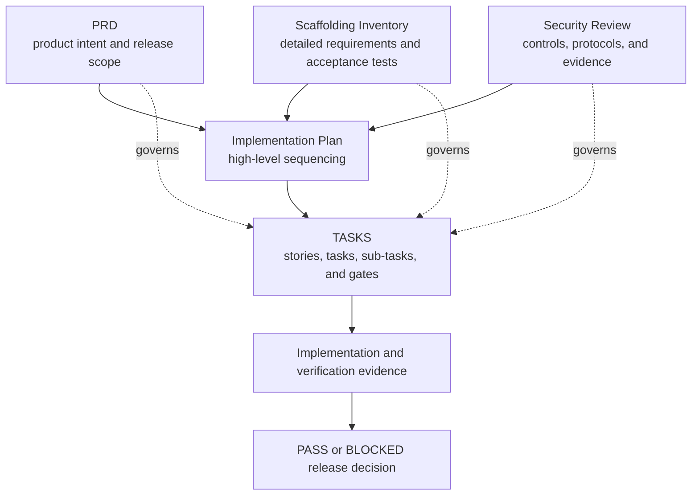
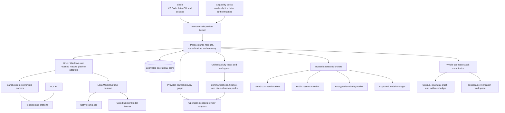
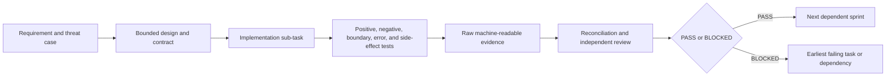

# AgentMage - High-Level Implementation Plan

| Field | Planning baseline |
|---|---|
| Status | Pre-alpha scaffold; stabilization sequence closed and numbered roadmap resumed under Decision 0021 |
| Version | 1.5 |
| Date | 2026-08-11 |
| Product | AgentMage - a brand-new, from-scratch local-first assistant |
| Product authority | [`PRD.md`](./PRD.md) |
| Detailed requirement authority | [`Agent-Scaffolding-Inventory.md`](./Agent-Scaffolding-Inventory.md) |
| Security-review authority | [`SECURITY-REVIEW.md`](./SECURITY-REVIEW.md) |
| Granular execution authority | [`TASKS.md`](./TASKS.md) |
| Supporting policies | [`MODEL-PROVENANCE-POLICY.md`](./MODEL-PROVENANCE-POLICY.md), [`SECURITY.md`](./SECURITY.md), [`RUNTIME-BOUNDARIES.md`](./RUNTIME-BOUNDARIES.md), [`DELIVERY-SYSTEM.md`](./DELIVERY-SYSTEM.md), [`PRODUCTIVITY-SYSTEM.md`](./PRODUCTIVITY-SYSTEM.md), [`TRUSTED-OPERATIONS.md`](./TRUSTED-OPERATIONS.md), [`CODEBASE-AUDIT.md`](./CODEBASE-AUDIT.md), [`WINDOWS-BOUNDARIES.md`](./WINDOWS-BOUNDARIES.md), and [`architecture/status-model.json`](./architecture/status-model.json) |
| Planning sequence | 169 sequential dependency gates across 17 epics; no calendar estimate implied |

## 1. Purpose

This document is the high-level implementation plan for AgentMage, a brand-new, from-scratch project. It explains how the product architecture, platform boundaries, capability packs, interfaces, assurance work, and releases fit together from project foundation through final product verification.

AgentMage is an independent, privately developed product created by Aaron N. Horvitz on personal time, on personally controlled hardware, with independently obtained tools and services. It is not sponsored, commissioned, or developed on behalf of an employer. Public release is the product objective; any later managed-device evaluation is optional, separate from development, and does not change project ownership.

This document is derived from `PRD.md`, `Agent-Scaffolding-Inventory.md`, and `SECURITY-REVIEW.md`. It is intentionally less granular than `TASKS.md` and defines implementation phases, workstreams, dependencies, milestone outcomes, risks, and gates. `MODEL-PROVENANCE-POLICY.md`, `SECURITY.md`, and `RUNTIME-BOUNDARIES.md` provide subordinate admission, disclosure, and boundary procedures. This plan does **not** replace the numbered stories, tasks, sub-tasks, tests, acceptance criteria, artifacts, or evidence requirements in `TASKS.md`.

A developer or coding agent must use this document to understand the overall sequence and use `TASKS.md` to perform the next bite-sized unit of work. No implementation item may be considered complete from this plan alone.

### 1.1 Current Implementation Truth

Current product lifecycle: `scaffolded`.

Current integrated workflow: none.

Current enabled models: none.

Current supported platforms: none.

Stabilization scope freeze: inactive.

[`Decision 0012`](./docs/decisions/0012-stabilization-truth-and-status-model.md)
and [`architecture/status-model.json`](./architecture/status-model.json) govern
these current-state claims. This plan preserves the complete 17-epic,
169-sprint, 227-requirement target sequence. Under
[`Decision 0021`](./docs/decisions/0021-stabilization-resumption.md), that
sequence resumes at its first incomplete dependency gate. New capability
families remain subject to explicit decisions and complete impact analysis.

Stabilization Phase 9 now has a source candidate under accepted
[`Decision 0018`](./docs/decisions/0018-linux-vscode-read-and-receipt.md): one
exact approved Linux file read through the Visual Studio Code provider,
authenticated framing, durable kernel transaction, offline worker, citation,
and receipt. This is a vertical integration proof, not a model-enabled or
supported workflow. Decisions 0022 and 0023 add detached package signing and a
package-verified authentication-only Linux bootstrap. Supervised extension
launch, signed platform activation, clean installation, and release authority
remain later dependencies.

## 2. Document Authority and Change Control

The governing rules are:

1. `PRD.md` owns product intent, architecture, release scope, and product-level acceptance.
2. `Agent-Scaffolding-Inventory.md` owns detailed requirements, stable `AM-*`, `AT-*`, and `CR-*` identifiers, capability gates, and the additions-only inventory.
3. `SECURITY-REVIEW.md` owns the public product-security baseline, `SR-*` controls, `RV-*` reviewer protocols, and reviewer evidence contract.
4. This document owns only the high-level implementation sequence and milestone narrative.
5. `TASKS.md` owns executable ordering, sprint dependencies, stories, tasks, sub-tasks, tests, artifacts, Given/When/Then acceptance criteria, and PASS/BLOCKED gates.
6. `README.md` summarizes the project and must remain consistent with all five planning and authority documents.

Supporting policy and decision files implement those authorities and cannot silently weaken them. Each document has an independent revision; cross-document compatibility is established by recorded source versions, decision records, and automated checks rather than matching version numbers.

If documents conflict, the narrower safety boundary or release scope wins until an approved decision record resolves the conflict. This plan must be corrected before implementation continues; it cannot override a requirement, test, security control, or sprint gate. Accepted identifiers are never silently removed, weakened, merged away, or renumbered.

## 3. Implementation Outcomes

The first implementation objective remains the internal v0.1 read-only local evidence foundation in native Visual Studio Code Chat. Gemma 4 E4B remains its first named candidate, but its current disposition is rejected and disabled. Gemma 4 12B Unified is the named fallback candidate and is also rejected and disabled. Either candidate requires a new revision-bound admission and evaluation decision before activation; no fallback is automatic. Gemma 4 26B A4B and other later candidates remain disabled until their separate admission gates pass.

The complete roadmap expands that foundation through separately gated knowledge, writes, coding, manual frontier consultation, administrative and document work, read-only connectors, desktop interfaces, extensions, web research, hosted actions, schedules, bounded agents, a provider-neutral delivery system, Windows 11, communications, a unified work graph, personal information and documents, finance and budgeting, read-only cloud observation, tiered command authority, credential brokering, encrypted continuity, approved-model management, and comprehensive whole-codebase audit. The first supported public release is v1.0 GA after Sprint 166. The Experimental Model Lab remains post-GA in Sprints 167-168. A later capability remains absent until its own dependencies, threat model, authority path, recovery behavior, tests, and release gate pass.

The implementation must preserve these outcomes throughout the roadmap:

- Deterministic operations run before model inference when an answer is mechanically checkable.
- Models, prompts, shells, plugins, connectors, schedules, and child agents carry no ambient authority.
- `CapabilityGrant` is the only authority-bearing object and is validated and consumed by the kernel.
- Platform adapters enforce equivalent authority, path, privacy, evidence, and offline contracts on Fedora, Ubuntu, and Windows 11 for v1.0 GA; Apple Silicon macOS remains an independently evidenced post-GA lane.
- Encrypted SQLite is canonical for operational state; beginning in v0.2, Markdown is canonical only for human-owned knowledge and approved portable memory; JSON Lines is derived export only.
- Every tool attempt produces one receipt, and every file-grounded claim has a resolvable, stale-aware citation.
- The strict-local profile has no cloud model, external API, telemetry, analytics, cloud storage, hosted account, or cloud fallback.
- Codex remains a separate user-controlled surface. AgentMage may prepare a local handoff preview with classification and unresolved-redaction warnings but cannot invoke, populate, copy to, call, or transmit to Codex.
- Every enabled model and related artifact passes `MODEL-PROVENANCE-POLICY.md`, including license, publisher, lineage, origin, provenance, integrity, resource, quality, security, platform, and non-Chinese/non-Chinese-derived model gates.
- Native `llama.cpp` and Docker Model Runner implement one `LocalModelRuntime` contract. Native inference is the Linux security reference; Docker is a supported compatibility adapter only after its additional privilege, endpoint, isolation, parity, and zero-egress gates pass.
- `agentmage doctor` is a deterministic diagnostics response rendered in native Visual Studio Code Chat for v0.1; it is not evidence that the deferred full CLI exists.
- Security and release claims remain bounded to reproducible evidence and never imply external certification or customer deployment approval.
- Provider adapters implement one delivery contract and never add provider conditionals or ambient credentials to the kernel.
- `observe`, `draft`, `local-write`, `remote-write`, `execute`, `deploy`, `secrets`, and `admin` remain independent authority classes.
- Windows 11 x64 is required for v1.0 GA; passing Linux or Apple Silicon evidence cannot satisfy a Windows gate. Intel Mac and Windows on Arm remain deferred.
- Markdown authoring preserves and safely renders inline and display LaTeX mathematics through pinned offline components.
- Communications reads and writes are governed by a visible Autonomy Center whose effective level is the intersection of global and narrower policy ceilings.
- Financial calculations use fixed-point decimal arithmetic and source-preserving reconciliation; first-GA bank access cannot move money.
- AWS, Azure, and Google Cloud observation is read-only and cannot become a hidden infrastructure, command, secret, identity, or administration path.
- Public research uses a separate hostile-content boundary, preserves claim-level citations and freshness, and cannot disclose private context without an exact user-reviewed grant.
- Command execution supports complete shell semantics while authority remains tiered; only a direct authenticated user can activate an expiring, visibly risky Owner / Unrestricted Session.
- Connected secrets remain operating-system-backed references resolved inside one exact worker operation and never enter model context, ordinary logs, diagnostics, exports, or continuity snapshots.
- Local continuity is canonical and cloud backup is client-side encrypted, versioned, namespace bounded, restorable, and separate from read-only Cloud Observer.
- The approved-model manager is deterministic and user confirmed; Meta Muse Glimmer remains a candidate until complete admission evidence exists.
- Whole-codebase audit treats the encrypted structural index and evidence ledger as project memory, model contexts as bounded working memory, canonical source as read-only, and complete path disposition plus cross-module reconciliation as prerequisites for a comprehensive claim.
- Unapproved models remain in a post-GA isolated lab without network, credentials, commands, connectors, or canonical workspace writes and cannot promote themselves.

## 4. Architecture Implementation Strategy

AgentMage is implemented as three one-way product layers over explicit platform adapters.

### 4.1 Kernel First

The kernel contracts are frozen before feature code. They define tasks, work packets, tools, results, receipts, evidence states, configuration, capability grants, paths, storage, cancellation, and recovery. The kernel cannot import a capability pack or shell.

### 4.2 Platform Boundaries Before Capabilities

Platform adapters are implemented and tested before tools depend on them. The adapters own local inference, workspace authorization, secure path resolution, process confinement, operating-system secret storage, resource limits, installation, and updates. `RUNTIME-BOUNDARIES.md` defines their shared process, privilege, socket, lifecycle, and classified data-flow contract; `WINDOWS-BOUNDARIES.md` defines the Windows specialization.

Fedora is the Linux development and performance reference. Ubuntu must pass the same supported workflow. Windows 11 x64 is the first-GA Windows reference. Native `llama.cpp` is the Linux and Windows security reference, while Docker Model Runner supplies a separately gated Linux compatibility path matching Docker-based development. The Apple Silicon MacBook Pro M5 requirements remain retained post-GA. Platform-specific mechanisms may differ, but no platform or runtime may weaken the common contract.

### 4.3 Deterministic Tools Before Model Synthesis

Synthetic fixtures, read-only tools, Git inspection, repository mapping, receipts, citation resolution, evidence-state assignment, and stale-evidence detection are implemented before model-generated explanations are trusted. Unsupported or unavailable evidence is shown as Unknown/Blocked rather than invented.

### 4.4 One Interface Before Additional Shells

Native Visual Studio Code Chat is the sole v0.1 interface. The deterministic `agentmage doctor` response is rendered there. A development diagnostic harness and read-only reviewer verifier may exercise contracts but are not supported end-user shells. The complete CLI is introduced in v0.4, and standalone macOS and Linux desktop applications are introduced in v1+ only after the shared kernel is stable.

### 4.5 Authority Added Incrementally

Read-only local work is implemented first. File writes, command execution, remote reads, frontier export/import, connectors, hosted writes, CI execution, deployment, infrastructure application, secret operations, administration, browser actions, schedules, plugins, Model Context Protocol servers, and child agents are introduced in separate increments. Each new authority path reuses the kernel's exact grant, classification, receipt, cancellation, retention, isolation, and recovery contracts.

### 4.6 Provider-Neutral Delivery

The delivery graph and adapter SDK arrive only after local authority, writes, execution, and connected-read foundations are proven. Adapters advance from manifested to observable, writable, executable, deployable, and administrative conformance one level at a time. The kernel understands typed delivery objects and capability classes, not provider-specific API calls. [`DELIVERY-SYSTEM.md`](./DELIVERY-SYSTEM.md) owns this contract.

### 4.7 Productivity Packs Through the Same Kernel

Communications, personal-information, document, finance, and cloud-observer adapters reuse the
provider lifecycle but do not flatten their domain semantics into delivery objects. The Autonomy
Center narrows kernel policy and never becomes an authority-bearing shell feature. The unified inbox
and work graph retain native object identity, source, freshness, classification, and uncertainty.
Financial arithmetic and reconciliation remain deterministic, bank and cloud adapters remain
read-only, and every pack is independently removable. [`PRODUCTIVITY-SYSTEM.md`](./PRODUCTIVITY-SYSTEM.md)
owns this contract.

### 4.8 Trusted Operations as Separate Authorities

Command execution, public research, credential resolution, continuity, and model acquisition use
separate workers and capability registrations. The command language can be complete without making
host-user authority ambient. Owner / Unrestricted Session is a direct, authenticated, expiring user
decision with a visible warning and panic stop. Public research cannot reuse authenticated browser
state. Cloud continuity writes only encrypted snapshots to one exact destination namespace.
Approved-model installation is deterministic and separate from inference. The post-GA Experimental
Model Lab has no connected or workspace-write authority. [`TRUSTED-OPERATIONS.md`](./TRUSTED-OPERATIONS.md)
owns this contract.

### 4.9 Whole-Codebase Audit as Persistent Evidence

Comprehensive repository analysis does not depend on fitting a repository into one model context.
An exact census and deterministic structural graph define coverage; coherent bounded model packets
produce provisional evidence cards; mandatory reconciliation connects conclusions across modules;
encrypted checkpoints preserve progress and invalidate stale dependencies. The canonical repository
has no audit write grant, and potentially writing commands run only in disposable copy-on-write
workspaces. [`CODEBASE-AUDIT.md`](./CODEBASE-AUDIT.md) owns this contract.

## 5. Cross-Cutting Workstreams

These workstreams continue across multiple epics even though their first deliverables occur in a specific sprint range.

| Workstream | Initial focus | Continuing responsibility |
|---|---|---|
| Governance and traceability | Epic 0 | Requirement registry, decision records, additions-only checks, document consistency, public-authority provenance, and final closure |
| Kernel and contracts | Epics 0-1 | Typed boundaries, policy, work packets, tools, grants, receipts, cancellation, configuration, and compatibility |
| Platform engineering | Epics 1 and 10 | Linux Bubblewrap/seccomp/cgroups/Secret Service, Windows MSIX/AppContainer/named-pipe/DPAPI/NTFS boundaries, retained macOS signing/sandbox/XPC/Keychain/Metal, native and Docker runtime boundaries, packaging and updates |
| Model lifecycle | Epic 0 feasibility, Epic 1 implementation | Provenance policy, early E4B/fallback evidence, approved-artifact catalog, installer/importer, native/Docker parity, Chat diagnostics, explicit selection, later measured routing |
| Data and privacy | Epic 1 | Classification, encrypted operational state, retention, local data root, knowledge authority, export, backup, and deletion |
| Deterministic evidence | Epic 1 | Read-only tools, Git, repository map, evidence states, citations, reconciliation, and truthful completion |
| User interfaces | Epic 1 | Native Visual Studio Code Chat, later complete CLI and desktop applications using the same kernel |
| Capability expansion | Epics 2-8 | Knowledge, writes, coding, frontier consultation, documents, connectors, web, schedules, and agents |
| Delivery graph and adapters | Epics 7-10 | Provider SDK, identity correlation, GitHub/GHES, Jira, Azure DevOps, GitLab, Jenkins, artifacts, deployment, infrastructure, observability, incidents, security, catalogs, and releases |
| Delivery operations | Epic 10 | Idempotency, uncertain-result reconciliation, CI execution, promotion, health, drift, rollback, feature flags, migrations, and ChatOps notifications |
| Productivity and communications | Epic 12 | Autonomy, confirmed identities, synchronization, unified inbox, mail, chat, calendar, contacts, tasks, documents, attachments, workflows, and communication recovery |
| Finance and budgeting | Epic 13 | Fixed-point arithmetic, imports, reconciliation, Actual Budget, read-only bank data, budgets, bills, receipts, accounting, anomaly indicators, and financial privacy |
| Cloud observation | Epic 13 | Read-only AWS, Azure, and Google Cloud inventory, configuration, health, logs, security, cost, correlation, and removal |
| Trusted command authority | Epic 15 | Tiered shell policy, full command semantics, owner-session authentication, expiry, panic stop, descendants, receipts, and removal |
| Public research | Epic 15 | Current search, primary-source preference, citations, freshness, hostile-content handling, download quarantine, and disclosure control |
| Credentials and continuity | Epic 15 | OS secret references, operation-scoped resolution, encrypted local snapshots, bounded cloud backup, clean-device restore, and disaster recovery |
| Model management | Epic 15 and post-GA Epic 16 | Approved catalog, guided installation, Muse candidate admission, and isolated experimental evaluation |
| Whole-codebase audit | Epic 15 | Exact scope and census, deterministic structure, semantic partitioning, evidence cards, checkpoint resume, invalidation, cross-module reconciliation, read-only verification, findings, coverage, and removal |
| Security assurance | Epic 0 | Threat cases, `SR-*` mappings, assigned `RV-*` owners, continuous fuzzing, adversarial testing, independent review criteria, and incremental evidence bundles |
| Release engineering | Epic 0 | Apache-2.0 licensing, reproducible builds, manifests, signing, software/model/crypto bills of materials, clean installation, vulnerability response, signed manual patches, rollback, and support |

## 6. Delivery Sequence

```mermaid
flowchart LR
    E0["Epic 0<br/>Foundation<br/>Sprints 0-3"] --> E1["Epic 1<br/>v0.1 Read Only<br/>Sprints 4-25"]
    E1 --> E2["Epic 2<br/>v0.2 Knowledge<br/>Sprints 26-34"]
    E2 --> E3["Epic 3<br/>v0.3 Writes<br/>Sprints 35-40"]
    E3 --> E4["Epic 4<br/>v0.4 Coding and CLI<br/>Sprints 41-50"]
    E4 --> E5["Epic 5<br/>v0.5 Frontier<br/>Sprints 51-53"]
    E5 --> E6["Epic 6<br/>v0.6 Admin and Documents<br/>Sprints 54-69"]
    E6 --> E7["Epic 7<br/>v0.7 GitHub and Connectors<br/>Sprints 70-75"]
    E7 --> E8["Epic 8<br/>Extended Capabilities<br/>Sprints 76-100"]
    E8 --> E9["Epic 9<br/>Inherited Closure<br/>Sprints 101-102"]
    E9 --> E10["Epic 10<br/>Delivery and Windows<br/>Sprints 103-125"]
    E10 --> E11["Epic 11<br/>Delivery Checkpoint<br/>Sprint 126"]
    E11 --> E12["Epic 12<br/>Productivity and Communications<br/>Sprints 127-141"]
    E12 --> E13["Epic 13<br/>Finance and Cloud Observer<br/>Sprints 142-155"]
    E13 --> E14["Epic 14<br/>Expanded Checkpoint<br/>Sprint 156"]
    E14 --> E15["Epic 15<br/>Trusted Operations and Codebase Audit<br/>Sprints 157-166"]
    E15 --> E16["Epic 16<br/>Experimental Model Lab<br/>Sprints 167-168"]
```

Sprints are numbered dependency and evidence gates, not calendar estimates. Work proceeds in numbered dependency order. Under Decision 0008, unavailable Mac-specific work remains `BLOCKED-MACOS` for the retained post-GA lane while shared, Linux, and Windows work may proceed when it does not consume or assume a missing Mac result. No Mac claim closes until its retained work passes, but Mac is not a `G-GA` dependency. If a story becomes too broad for independent review, it is blocked and split into newly appended identifiers before implementation continues.

| Epic | High-level outcome | Sprint range | Exit gate |
|---|---|---|---|
| 0 | Governed, reproducible project foundation | 0-3 | `G-FOUNDATION` |
| 1 | v0.1 Read-Only Local Evidence Assistant | 4-25 | `G-V0.1` |
| 2 | v0.2 Knowledge, Obsidian, and Memory | 26-34 | `G-V0.2` |
| 3 | v0.3 Controlled Writes | 35-40 | `G-V0.3` |
| 4 | v0.4 Coding and Complete Local CLI | 41-50 | `G-V0.4` |
| 5 | v0.5 Manual Frontier Consultation | 51-53 | `G-V0.5` |
| 6 | v0.6 Administrative and Document Work | 54-69 | `G-V0.6` |
| 7 | v0.7 Read-Only GitHub and Connectors | 70-75 | `G-V0.7` |
| 8 | Extended interfaces, packages, actions, scheduling, and agents | 76-100 | `G-V1+` |
| 9 | Inherited-roadmap closure checkpoint | 101-102 | `G-LEGACY-CLOSURE` |
| 10 | Provider-neutral delivery system and Windows 11 | 103-125 | `G-DELIVERY` and `G-WINDOWS` |
| 11 | Delivery-and-Windows GA checkpoint | 126 | `G-GA-DELIVERY-CHECKPOINT` |
| 12 | Productivity, communications, personal information, documents, and autonomy | 127-141 | `G-PRODUCTIVITY` |
| 13 | Finance, budgeting, accounting, and read-only cloud observation | 142-155 | `G-FINANCE` and `G-CLOUD-OBSERVER` |
| 14 | Expanded v1.0 GA verification and release decision | 156 | `G-GA` |
| 15 | Trusted operations, whole-codebase audit, and superseding v1.0 GA | 157-166 | `G-TRUSTED-OPERATIONS`, `G-CODEBASE-AUDIT`, and `G-GA` |
| 16 | Post-GA Experimental Model Lab | 167-168 | `G-EXPERIMENTAL-MODELS` |

## 7. Epic Implementation Milestones

### 7.1 Epic 0 - Foundation

**Objective:** Make the project governable, reproducible, testable, and structurally ready before feature implementation.

**Primary outcomes:**

- A machine-readable requirement registry and cross-document traceability model.
- Decision, risk, change, release-manifest, exclusion, and supersession records.
- Repository and package architecture with one-way dependency enforcement.
- Synthetic workspaces, repositories, attacks, model fixtures, and evidence tooling.
- Versioned configuration, pinned dependencies, reproducible builds, bills of materials, and no-install diagnostics.
- Public licensing, model-provenance, vulnerability-response, runtime-boundary, decision, and documentation-validation foundations.
- An early Gemma 4 E4B native/Docker feasibility record with Gemma 4 12B Unified retained as the disabled fallback candidate.

**Exit condition:** `G-FOUNDATION` passes only when the governing contracts, architecture checks, fixture system, build integrity, and security-review baseline are executable and reproducible.

### 7.2 Epic 1 - v0.1 Read-Only Local Evidence Assistant

**Objective:** Deliver the complete local, read-only, evidence-backed workflow in native Visual Studio Code Chat on the MacBook Pro M5, Fedora, and Ubuntu.

**Implementation sequence:**

1. Freeze kernel contracts, capability grants, policy evaluation, and canonical workspace paths.
2. Implement the platform-adapter contract, release manifests, macOS topology, Linux topology, and strict-local network boundary.
3. Implement sensitivity-labeled encrypted operational state, transactions, checkpoints, and crash-safe recovery.
4. Implement the agent runtime, bounded planning, context management, and session behavior.
5. Implement the manifest-pinned model runtime, native `llama.cpp` and gated Docker Model Runner adapters, separate installer/importer, adapter-parity suite, manual model selection, native-Chat diagnostics, and resource controls.
6. Implement sandboxed read-only file and Git tools with untrusted-instruction handling.
7. Implement the deterministic repository map, coverage reporting, source resolution, evidence states, stale citations, and tamper-evident receipts.
8. Implement native Visual Studio Code Chat, accessibility from its first increment, and the local-only manual Codex handoff boundary with classification and redaction warnings.
9. Complete vulnerability-response and patch procedures, continuous trust-boundary fuzzing, incident table-top exercises, and each `RV-*` protocol in its owning sprint.
10. Re-run proven clean cross-platform installation, offline, security, privacy, recovery, quality, performance, documentation, accessibility, and independent-review gates and assemble the signed release evidence.

**Exit condition:** `G-V0.1` passes only when every `AM-*` v0.1 backlog row, required `AT-*` threshold, applicable `SR-*` control, reviewer protocol, clean-platform workflow, signed artifact, and published operating guide agrees with the raw evidence.

### 7.3 Epic 2 - v0.2 Knowledge, Obsidian, and Memory

**Objective:** Add read-only human knowledge, memory, retrieval, and conversation continuity without creating competing data authorities.

**Primary outcomes:** canonical user-owned Markdown; direct Obsidian parsing without requiring the Obsidian application; regenerable indexes; deterministic retrieval; optional approved local semantic retrieval; rolling memory; conversation search and branching; private archives and evidence bundles; declarative skills.

**Boundary:** The release remains read-only against user files. Semantic retrieval is opt-in, local, source-preserving, inspectable, deletable, and unable to replace deterministic search or Markdown authority.

**Exit condition:** `G-V0.2` passes only when knowledge, retrieval, memory, migration, privacy, recovery, read-only invariance, and documentation tests pass on the supported platforms.

### 7.4 Epic 3 - v0.3 Controlled Writes

**Objective:** Introduce the first user-file mutations through an exact, reviewable, recoverable transaction.

**Primary outcomes:** shadow change sets; exact-preimage approval; stale rejection; atomic apply; per-operation receipts; file creation, patch, copy, move, and later delete controls; controlled Markdown writes; rollback and recovery.

**Boundary:** There is no generic shell. Every write uses an exact preview and separately confirmed single-use grant. A rollback is a new approval-gated operation and never overwrites later user work automatically.

**Exit condition:** `G-V0.3` passes only when write safety, collision, privacy, recovery, audit, and clean-platform thresholds pass without waiver.

### 7.5 Epic 4 - v0.4 Coding and Complete Local CLI

**Objective:** Add bounded coding workflows and a complete local command-line shell without creating an alternate authority path.

**Primary outcomes:** bounded direct command execution; visible exact remote Git reads; repository preservation manifests; namespaced fetches; isolated AgentMage-owned worktrees and temporary commit indexes; deep repository comprehension; change intent and reproduction; structured code changes; language-service reads; trusted validation commands; review packets; signed local source control; complete interactive and headless CLI; later model profiles and measured local routing.

**Boundary:** Worktrees provide change isolation, not the security sandbox. Clone, fetch, worktree lifecycle, branch fast-forward, commit, and push are distinct kernel operations governed by [`docs/security/repository-safety.md`](./docs/security/repository-safety.md). Generic pull, force, reset, clean, discard, implicit ref updates, repository hooks/filters, and model access to raw Git are absent. Commands, writes, commits, and remote operations remain separately bounded and granted. Headless use fails closed when authority is missing or ambiguous.

**Exit condition:** `G-V0.4` passes only when coding, command, worktree, validation, shell, model, security, recovery, and documentation suites pass.

### 7.6 Epic 5 - v0.5 Manual Frontier Consultation

**Objective:** Let the user obtain frontier assistance through a local, reviewable export/import workflow without autonomous delivery.

**Primary outcomes:** escalation recommendation; bounded disclosure packet; secret redaction; exact preview; user-controlled manual export; untrusted result import; return-manifest validation; local revalidation and receipts.

**Boundary:** AgentMage cannot invoke Codex, activate or populate its tab, write the packet to the clipboard, call an external endpoint, or transmit content. The user chooses whether, where, and what to submit.

**Exit condition:** `G-V0.5` passes only with current privacy, injection, disclosure, import, revalidation, recovery, and no-autonomous-network evidence.

### 7.7 Epic 6 - v0.6 Administrative and Document Work

**Objective:** Add local executive-assistant, secretary, document, rich-artifact, and structured-data workflows.

**Primary outcomes:** task portfolio and briefings; meeting continuity; correspondence and filing drafts; Markdown, Word, PDF, spreadsheet, CSV, JSON, presentation, image, safe parser, audio, and local database workflows; structural and visual verification; common artifact receipts.

**Boundary:** The release does not send correspondence, change a live calendar, file externally, execute document content, access a live database, or claim artifact completion without deterministic and visual evidence.

**Exit condition:** `G-V0.6` passes only when workflow, format, fidelity, privacy, user-authority, recovery, and documentation gates pass.

### 7.8 Epic 7 - v0.7 Read-Only GitHub and Connectors

**Objective:** Add user-initiated, read-only GitHub and connector foundations while preserving the strict-local baseline when networking is disabled.

**Primary outcomes:** visible temporary network capability; sensitivity-labeled local connector cache; credential isolation; short-lived host/account/repository-bound GitHub authentication diagnostics; repository and source evidence; ruleset and branch-protection evidence; issues, pull requests, checks, reviews, and security findings; isolated pull-request worktrees and local review intelligence.

**Boundary:** Network use is temporary, destination-scoped, cancellable, and receipted. Credentials remain outside model context. Hosted writes are impossible in this release, and removing the connector pack restores the strict-local baseline.

**Exit condition:** `G-V0.7` passes only when network, credential, evidence, read-only, recovery, removal, and documentation gates pass.

### 7.9 Epic 8 - v1+ Extended Capabilities

**Objective:** Add broader interfaces and authority paths only after the local read, write, coding, and connector foundations are proven.

**Primary outcomes:** desktop applications; signed capability packages and hooks; safe mode; read-only Model Context Protocol support; public research and citations; sandboxed browser inspection; confirmed computer use; approval-gated GitHub and connector writes; leased queues and schedules; bounded agent definitions and coordination; signed updates; backup, migration, diagnostics, recovery, and cross-interface verification.

**Boundary:** Every capability has a declared identity, manifest, authority, isolation, data scope, network scope, cancellation path, retention rule, receipt, recovery behavior, and dedicated threat model. No package, connector, browser, schedule, coordinator, or child agent may bypass the kernel or aggregate narrow grants into broader authority.

**Exit condition:** `G-V1+` passes only after every promoted authority path and the complete cross-capability privacy, security, recovery, and release suite pass.

### 7.10 Epic 9 - Inherited-Roadmap Closure

**Objective:** Prove that the inherited Sprints 0-100 scope is traceable, reproducible, supportable, and honest about every exclusion and residual risk before adding the Decision 0008 delivery scope.

**Primary outcomes:** rebuilt requirement graph; closure of promoted scope; explicit disposition of every deferred item; complete clean-platform, upgrade, offline, connected, safe-mode, backup, restore, migration, and uninstall workflows; final bills of materials, manifests, capability matrix, evidence bundle, and release decision.

**Exit condition:** `G-LEGACY-CLOSURE` passes only when every inherited promoted requirement has current reproducible evidence and every inherited exclusion has a tested disposition. This is a checkpoint, not the final product or public-release decision.

### 7.11 Epic 10 - Provider-Neutral Delivery System and Windows 11

**Objective:** Turn the proven local assistant foundation into a complete, bounded software-delivery system on Linux and Windows.

**Implementation sequence:**

1. Freeze the delivery graph, adapter SDK, capability-level model, support-matrix schema, identity correlation, event contract, and conformance harness.
2. Complete GitHub.com and GitHub Enterprise Server conformance for repositories, work, reviews, workflows, releases, preservation-manifest-bound local commits, signed ordinary fast-forward pushes, and separately approved mutations under the canonical repository-safety contract.
3. Add Jira Cloud/Data Center, Azure Repos/Boards/Pipelines/Artifacts, GitLab/GitLab CI, and Jenkins reference adapters.
4. Add OCI and repository artifact adapters, SBOM/provenance/signature policy, Kubernetes/Helm/Kustomize, Argo CD/Flux, and Terraform/OpenTofu.
5. Add release, feature-flag, progressive-delivery, database-migration, health, drift, rollback, and promotion contracts.
6. Add OpenTelemetry correlation and reference observability, incident, security-result, and Backstage catalog adapters.
7. Implement the Windows package, process, path, IPC, key, model, tool-worker, network-worker, Visual Studio Code, accessibility, clean-install, update, rollback, and uninstall boundaries.
8. Run provider version-skew, cross-tenant, hostile-content, event-replay, rate-limit, partition, partial-effect, crash, cancellation, resource, removal, and cross-provider lifecycle suites.

**Boundary:** Provider adapters never carry kernel authority. Each operation belongs to exactly one of `observe`, `draft`, `local-write`, `remote-write`, `execute`, `deploy`, `secrets`, or `admin`. Support claims are bounded to a versioned matrix. Connected packs are independently removable.

**Exit condition:** `G-DELIVERY` and `G-WINDOWS` pass only when every promoted provider tuple and Windows platform requirement has current conformance, security, recovery, documentation, and independent-review evidence.

### 7.12 Epic 11 - Delivery-and-Windows GA Checkpoint

**Objective:** Close the exact Decision 0008 delivery-and-Windows scope before productivity packs build on its provider lifecycle and cross-system identity contracts.

**Primary outcomes:** complete requirement graph; Fedora, Ubuntu, and Windows clean-package evidence; provider/version/capability matrix; cross-provider work-to-release and incident-to-rollback evidence; strict-local removal proof; source and binary bills of materials; model bill of materials; signatures and provenance; support and end-of-support state; limitations; rollback plan; signed release decision.

**Exit condition:** `G-GA-DELIVERY-CHECKPOINT` passes only when every Decision 0008 blocking result is current and reproducible and no unsupported or failed path is hidden. Decision 0009 supersedes this checkpoint's former final-release meaning.

### 7.13 Epic 12 - Productivity and Communications

**Objective:** Add human communications and surrounding work through the same exact identity,
authority, synchronization, receipt, and removal boundaries used by delivery adapters.

**Implementation sequence:**

1. Freeze the productivity adapter matrix, Autonomy policy, user-interface control, identity graph,
   event and cursor contract, unified inbox, and cross-pack data-flow schema.
2. Implement and independently gate Outlook and Exchange Online, Teams, Gmail, Proton Mail Bridge,
   generic IMAP, SMTP, JMAP, Slack, and Linux mail-client interoperability.
3. Add separately registered read, draft, send, reply, forward, edit, delete, reaction, attachment,
   move, label, flag, archive, and synchronization operations.
4. Add Microsoft, Google, CalDAV, and CardDAV calendar, contact, and task behavior.
5. Add OneDrive, SharePoint, Google Drive, Confluence, and separately promoted document repositories
   with visibility, attachment, classification, and version controls.
6. Compile user workflows into deterministic graphs with dry runs, approvals, budgets, stop
   conditions, cancellation, reconciliation, and receipts.
7. Run cross-recipient, cross-account, injection, attachment, cursor, duplicate-send, partial-effect,
   accessibility, disablement, removal, and strict-local restoration suites.

**Boundary:** The Autonomy Center narrows policy but carries no grant. External content is untrusted
and cannot select a recipient, authorize a send, widen autonomy, or trigger an operation.

**Exit condition:** `G-PRODUCTIVITY` passes only when every promoted provider tuple and autonomy
level has current positive, negative, recovery, removal, privacy, and accessibility evidence.

### 7.14 Epic 13 - Finance and Cloud Observer

**Objective:** Add useful local financial management and cloud visibility without creating money
movement, financial-account administration, or a second cloud execution path.

**Implementation sequence:**

1. Freeze the fixed-point financial domain, currency and rounding rules, immutable import model,
   statement and transaction states, corrections, and reconciliation contracts.
2. Implement CSV, OFX, and QFX import plus Actual Budget as the first local reference adapter.
3. Add independently gated read-only bank, liability, investment, recurring-stream, and statement
   synchronization.
4. Add budgeting, cash-flow, savings, debt, net-worth, bill, subscription, receipt, invoice,
   reimbursement, tax-document, and explainable anomaly workflows.
5. Add approval-gated non-money-movement QuickBooks and Xero accounting records only after their
   read, draft, precision, reconciliation, and recovery gates pass.
6. Implement read-only AWS, Azure, and Google Cloud inventory, configuration, health, metrics,
   bounded logs, audit references, security observations, deployment identity, and cost summaries.
7. Run precision, reconciliation, duplicate, pending/posting, correction, money-movement absence,
   cloud-mutation absence, cross-pack, resource, recovery, removal, and strict-local suites.

**Boundary:** Financial institution and cloud adapters are read-only. No autonomy level can create a
payment, transfer, trade, credit, tax-filing, remote-command, deploy, secret-read, identity, policy,
or administrative operation.

**Exit condition:** `G-FINANCE` and `G-CLOUD-OBSERVER` pass only when deterministic financial
correctness and zero prohibited financial or cloud authority are demonstrated across every shell,
schema, policy, adapter, workflow, and platform.

### 7.15 Epic 14 - Expanded v1.0 GA Verification Checkpoint

**Objective:** Close the complete promoted scope under Decisions 0008 and 0009 before trusted
operations are integrated under Decision 0010.

**Primary outcomes:** complete traceability; Linux and Windows clean-package evidence; delivery,
productivity, communications, finance, accounting, and cloud support matrices; cross-pack workflow
evidence; autonomy and emergency-stop evidence; zero money movement and cloud mutation; strict-local
restoration; bills of materials; signatures; limitations; support state; rollback; and signed release
decision.

**Exit condition:** `G-GA-PRODUCTIVITY-CHECKPOINT` passes only at Sprint 156 when every Decision 0009
blocking result is current and reproducible, unsupported paths have passing negative tests, and no
failed, skipped, stale, unavailable, flaky, quarantined, suppressed, unreconciled, or unreviewed
result is hidden. Decision 0010 supersedes this checkpoint's former final-release meaning.

### 7.16 Epic 15 - Trusted Operations, Whole-Codebase Audit, and Superseding v1.0 GA

**Objective:** Promote command execution, public research, credential handling, continuity, and
approved-model management into a coherent, reviewable first-GA capability set and make
comprehensive repository audit deterministic, read-only, resumable, reconciled, and evidence based.

**Implementation sequence:**

1. Freeze trusted-operations process, capability, data-flow, network, storage, receipt, removal, and
   platform contracts.
2. Implement operating-system-backed credential references, OAuth and token lifecycles,
   operation-scoped resolution, redaction, revocation, and restore reauthentication.
3. Implement Disabled, Inspect, Workspace Autonomous, Connected Operations, and authenticated
   Owner / Unrestricted Session command levels with full command semantics and exact lifecycle.
4. Implement current public search and retrieval with claim-level citations, freshness, primary
   source preference, hostile-content isolation, bounded downloads, and disclosure previews.
5. Implement immutable encrypted local snapshots, staging restore, migrations, rollback, retention,
   deletion, clean-device recovery, and one reference client-side-encrypted cloud backup adapter.
6. Implement the signed approved-model catalog and chat-guided acquisition, import, quarantine,
   verification, activation, comparison, rollback, removal, and storage-cleanup workflow.
7. Produce a truthful Meta Muse Glimmer candidate disposition through normal admission without
   making first GA depend on a pass.
8. Run integrated command, injection, disclosure, secret, backup, restore, model-substitution,
   resource, accessibility, removal, and strict-local-restoration campaigns.
9. Freeze whole-codebase audit scope, coverage, process, record, checkpoint, finding, report,
   lifecycle, and platform contracts.
10. Implement complete repository census, canonical-root immutability, disposable command
    verification, secret-safe parsing, deterministic structural graphs, coherent semantic packets,
    and persistent evidence cards.
11. Implement checkpoint resume, transitive invalidation, contradiction retention, cross-module
    reconciliation, risk-directed review, calibrated findings, professional reports, and complete
    audit removal.
12. Rebuild and independently reproduce the complete release evidence at Sprint 166, including
    comprehensive audits of release-reference repositories and known-answer corpora.

**Boundary:** Owner mode is intentionally broad host-user authority but never ambient, scheduled,
inherited, model activated, automatically renewed, or equivalent to administrator elevation. Public
research, credential resolution, cloud backup, model acquisition, and command execution cannot
share one worker or union their grants. Cloud backup cannot mutate Cloud Observer resources. A
candidate model cannot activate itself.

The audit coordinator cannot write to canonical source or treat model context as repository state.
Potentially writing commands run in disposable copy-on-write workspaces. Every whole-codebase claim
requires complete path disposition, deterministic structure, current evidence, cross-module
reconciliation, read-only attestation, and visible gap accounting.

**Exit condition:** `G-TRUSTED-OPERATIONS`, `G-CODEBASE-AUDIT`, and final `G-GA` pass only when
Sprints 157-166 and every prior promoted gate have current reproducible evidence, all `RV-01`
through `RV-49` protocols pass, and no blocker is hidden.

### 7.17 Epic 16 - Post-GA Experimental Model Lab

**Objective:** Let users evaluate unapproved model artifacts without weakening approved-model or
connected-operation boundaries.

**Primary outcomes:** separate package and process identity; user-selected quarantine import;
visible license and provenance gaps; synthetic evaluation; strict processor, memory, graphics, disk,
context, output, duration, and cancellation limits; complete removal; and normal-admission-only
promotion.

**Boundary:** The lab retains the model-origin policy and has no network, credential, command,
connector, messaging, finance, delivery, cloud, backup, operational-memory, or canonical-workspace-
write authority. Results remain visibly experimental.

**Exit condition:** `G-EXPERIMENTAL-MODELS` passes only when Sprints 167-168 prove structural
authority absence, robust artifact handling, truthful gaps, resource control, complete removal, and
no direct promotion route. This gate does not block v1.0 GA.

## 8. Product Security and Independent Verification

Security assurance is built with each component rather than added after feature completion.

| Security gate | Implementation timing | Required outcome |
|---|---|---|
| `SEC-G0` Scope | Epic 0 | Threat model, use-case boundary, data inventory, shared responsibility, and product risk baseline exist before implementation. |
| `SEC-G1` Kernel | Epics 0-1 | Grants, paths, storage policy, audit schema, fail-closed configuration, and fake-platform tests pass. |
| `SEC-G2` Platforms | Epic 1 shared/Linux work, Epic 10 Windows work, and the retained Mac lane | Linux sandbox/path/key/offline proof and Windows MSIX/AppContainer/IPC/NTFS/DPAPI proof pass independently; retained Apple Silicon signing, notarization, App Sandbox, XPC, bookmarks, Keychain, and Metal proof remains separate. |
| `SEC-G3` Model | Epic 0 feasibility, Epic 1 implementation, and every added model or adapter | Provenance policy, immutable identities, installer separation, native/Docker parity, endpoint isolation, injection resistance, context minimization, quality, uncertainty, and resource gates pass. |
| `SEC-G4` Supply chain | Begins in Epic 0; repeated for release | SBOM, CBOM, Model BOM, due diligence, vulnerability disposition, reproducibility, provenance, signed manual patch, and support plans pass. |
| `SEC-G5` Privacy and accessibility | Before each supported release | Privacy, records, retention, sanitization, accessibility, and conformance evidence are complete where applicable. |
| `SEC-G6` Independent assessment | Critical boundary completion and every release candidate | A reviewer who did not author the exact boundary records identity, commit, findings, disposition, and re-review; a separate release reviewer re-runs applicable `RV-*` protocols and reproduces the signed evidence bundle. |
| `SEC-G7` Optional environment review | Separate customer decision | A device owner or deploying organization records environment controls, exceptions, allowed data, residual risk, and deployment approval outside AgentMage's authority. |
| `SEC-G8` Delivery adapters | Epics 7-10 and every adapter promotion | Provider identity, credential isolation, capability level, exact effects, idempotency/reconciliation, event integrity, version support, removal, and cross-tenant tests pass. |
| `SEC-G9` Productivity and communications | Epic 12 | Autonomy, identity, synchronization, unified inbox, provider operations, recipients, attachments, workflows, recovery, and removal pass. |
| `SEC-G10` Finance | Epic 13 | Precision, reconciliation, privacy, explainability, accounting boundaries, and money-movement absence pass. |
| `SEC-G11` Cloud Observer | Epic 13 | AWS, Azure, and Google Cloud scope, read-only enforcement, content isolation, correlation, and removal pass. |
| `SEC-G12` Trusted operations | Epic 15 | Command-level intersections, Owner-mode lifecycle, public-research disclosure, credential isolation, encrypted continuity, model management, removal, and `RV-36` through `RV-43` pass. |
| `SEC-G13` First GA | Epics 14-15 | Fedora, Ubuntu, Windows, strict-local removal, connected-capability lifecycles, financial and cloud prohibitions, trusted operations, whole-codebase audit, extreme verification, and signed evidence reconciliation pass at Sprint 166. |
| `SEC-G14` Experimental models | Post-GA Epic 16 | The lab has no connected or canonical-write authority, all artifacts remain quarantined until normal admission, and removal leaves no residue. |
| `SEC-G15` Whole-codebase audit | Epic 15 | Complete census, deterministic structure, bounded semantic review, cross-module reconciliation, canonical immutability, secret protection, checkpoint invalidation, evidence-backed reporting, platform parity, resource controls, removal, and `RV-44` through `RV-48` pass. |
| `SEC-G16` Repository safety | Epics 4, 7-10, and every source-adapter promotion | Exact preservation manifests, hardened Git process isolation, namespaced fetches, owned worktrees and indexes, signed commits, host/account/repository/ref-bound authentication, separately approved ordinary fast-forward pushes, uncertain-effect reconciliation, prohibited-operation absence, and `RV-49` pass. |

AgentMage targets a bounded, single-user desktop application and produces reproducible product-security evidence. It does not claim external certification or managed-environment approval that has not been independently granted, and no evaluation or deployment transfers ownership, sponsorship, or authorship.

## 9. Verification and Evidence Strategy

Every implementation sub-task inherits five issue-local cases where applicable:

- Positive intended behavior.
- Invalid or prohibited input.
- Minimum, maximum, empty, and other relevant boundaries.
- Dependency failure, cancellation, timeout, or uncertain result.
- Exact intended side effects and proof that prohibited side effects did not occur.

Every sprint must produce its declared code or documentation, artifacts, tests, raw evidence, environment identity, hashes, summaries, limitations, security mappings, assigned reviewer-protocol results, and reviewer dispositions. Each `RV-*` protocol has one first-execution owner; the release sprint re-runs current suites instead of discovering the control for the first time. Evidence is stored under `artifacts/sprints/sprint-N/<story-or-test-id>/`.

Raw evidence is authoritative over a summary. Failed, skipped, stale, unavailable, flaky, quarantined, suppressed, unreconciled, or unreviewed blocking checks cannot be represented as passing. Linux, Windows, and Apple Silicon evidence are independent and never substitute for one another.

## 10. Release Engineering Strategy

Each release is produced from pinned source, dependencies, toolchains, model/runtime manifests, configuration, and platform identities. Release engineering includes:

- Reproducible clean builds and source-to-package provenance.
- Signed and verified packages, with Developer ID signing, notarization, stapling, Gatekeeper validation, Hardened Runtime, and App Sandbox on macOS.
- First-GA platform manifests for Fedora, Ubuntu, and Windows 11, plus separately retained Apple Silicon manifests when that lane is released.
- Software Bill of Materials, Cryptographic Bill of Materials, Model Bill of Materials, licenses, hashes, dependency graph, and vulnerability dispositions.
- Clean standard-user installation, upgrade, offline operation, diagnostics, recovery, rollback, and uninstall.
- Complete capability and limitation matrices.
- The public `SECURITY.md` support state, vulnerability process, signed manual patch route, emergency-disable procedure, and end-of-support date bound to the release manifest.
- Raw and summarized acceptance evidence tied to the exact release identity.
- Independent reproduction before a release is represented as review-ready.

Critical or high vulnerabilities, undeclared components or data flows, unavailable required cryptography, successful attacker outcomes, unreproducible evidence, or false compliance claims block release.

## 11. Principal Implementation Risks

| Risk | Consequence | Planned control |
|---|---|---|
| Scope expansion before foundation closure | Inconsistent contracts and untestable authority | Enforce numeric work order and all non-platform dependencies; Decision 0003 permits only explicitly independent work past retained `BLOCKED-MACOS` items and never closes an affected gate. |
| Local-model quality or malformed tool calls | Unsupported answers or unsafe execution requests | Deterministic-first behavior, schema validation, evidence states, bounded retries, quality thresholds, and visible failure. |
| Platform divergence | A passing Linux path masks an invalid Mac deployment or vice versa | Shared adapter contracts, identical fixtures, platform-specific evidence, and independent Mac testing. |
| Docker Model Runner privilege or endpoint exposure | A local compatibility path contradicts standard-user or exclusive-client claims | Native Linux security reference, immutable Docker identities, explicit prerequisite reporting, loopback and local-client probes, namespace/container isolation, profile-specific evidence, and fail-closed admission. |
| macOS packaging and identity complexity | IPC impersonation, invalid entitlements, or unreleasable package | Freeze the release manifest, use an isolated Apple Silicon runner, and test signatures, notarization, XPC identities, bookmarks, and Keychain. |
| Dependency, model, or supplier provenance gaps | License, security, or review rejection | Approved-artifact catalog, bills of materials, hashes, lineage, origin policy, due diligence, and fail-closed admission. |
| Prompt injection or untrusted repository content | Policy manipulation, secret leakage, or false completion | Treat all content as untrusted; keep policy and grants outside the model; run adversarial fixtures. |
| Data-authority drift | Conflicting operational or knowledge records | One canonical authority per domain, no transactional dual-write, rebuildable indexes, and validated imports. |
| Secret or private-data persistence | Disclosure through logs, memory, exports, or diagnostics | Classify and minimize before persistence, use operating-system key storage, detect secrets, redact output, and fail closed without encryption. |
| Network or connector expansion | Hidden egress or remote mutation | Strict-local baseline, explicit temporary network grants, destination scopes, sensitivity-labeled cache, read-only connector phase, and receipts. |
| Provider semantic mismatch | A normalized operation hides provider-only behavior or changes the wrong object | Namespaced extensions, published capability matrices, conformance by object/operation/version, exact previews, and provider-specific negative fixtures. |
| Cross-tenant or credential confusion | One account, host, project, or environment receives another's credential or operation | Exact host/tenant/account binding, operation-scoped workers, secret-store references, redirect revalidation, canaries, and cross-domain attack suites. |
| Partial remote effects | Retry duplicates a comment, build, release, deployment, or destructive change | Provider idempotency where available, deterministic operation fingerprints, reconciliation-before-retry, unknown-state blocking, and verified postconditions. |
| Windows boundary complexity | Path aliasing, IPC impersonation, ambient access, or package lifecycle defects | Dedicated Windows architecture, AppContainer/restricted-token workers, named-pipe identity, handle-relative NTFS tests, DPAPI, clean x64 fixtures, and separate release evidence. |
| Delivery-system scope | Too many adapters create shallow or misleading support | Capability-level promotion, reference adapters, support matrix, provider version bounds, removal tests, and `G-GA` blocked until every promoted tuple passes. |
| Granular-plan drift | Future developers or LLMs implement stale or orphaned work | Stable IDs, additions-only checks, document hashes, requirement registry, cross-document validation, and Sprint 0 traceability. |
| Long roadmap and resource pressure | Excessive concurrent scope, thermal load, disk growth, or abandoned partial capabilities | Sequential gates, bounded stories, split decisions, resource budgets, cancellation, cleanup, and capability removal tests. |
| Optional environment-review uncertainty | Product evidence is mistaken for customer approval or a transfer of ownership | Shared-responsibility model, explicit ownership boundary, reserved customer decisions, and reproducible review package. |
| Owner-mode misuse or content-triggered command execution | Host-user files, processes, network, or local secrets are affected outside the user's intent | Direct authenticated activation, explicit risk preview, persistent warning, finite duration, panic stop, no scheduling/inheritance/auto-renewal, minimized environment, command ledger, and descendant revocation. |
| Web prompt injection or private-context disclosure | Untrusted pages create authority or cause local data to leave the device | Separate research worker, untrusted-content channel, claim citations, exact egress and download limits, authenticated-session separation, and disclosure preview. |
| Backup corruption or cloud namespace confusion | Work cannot be restored or encrypted objects are written or read under the wrong account or location | Local canonical store, client-side authenticated encryption, immutable manifests, exact destination binding, integrity trees, staged restore, cross-account tests, and disaster-recovery drills. |
| Model-catalog or download substitution | A different, unlicensed, unsupported, or hostile artifact becomes active | Exact first-party identity, immutable hashes, quarantine, admission states, deterministic preview, separate installer, atomic activation, rollback, and no model self-approval. |
| Large-repository context and summary drift | Files are omitted, contradictions disappear, or partial model summaries are presented as whole-codebase understanding | Complete census, deterministic structural graph, coherent packets, source-pinned evidence cards, persistent encrypted project memory, mandatory cross-module reconciliation, transitive invalidation, and explicit coverage gaps. |
| Read-only audit mutates source or exposes secrets | Builds, parsers, hooks, tools, or hostile repository content alter canonical state or place protected values in model context | Read-only source handles, disposable copy-on-write verification, no hosted or credential authority, before-and-after attestation, parser isolation, pre-model classification and redaction, canaries, and `RV-45`. |

## 12. Planning and Change Management

Changes to the implementation sequence follow these rules:

1. A new product requirement begins in the PRD or an approved decision record under `docs/decisions/`.
2. A detailed requirement receives a stable inventory identifier, release, dependencies, tests, and disposition.
3. Applicable security controls, threat cases, reviewer protocols, privacy, records, accessibility, supply-chain, and operational effects are mapped.
4. The high-level milestone and dependency impact are recorded in this plan.
5. New executable work is appended to `TASKS.md` with a story, numbered tasks and sub-tasks, Given/When/Then criteria, sprint criteria, artifacts, tests, evidence, and gate.
6. Accepted identifiers are not renumbered. A supersession preserves the original text and records the approved replacement and rationale.
7. A changed source, dependency, configuration, schema, model, runtime, platform, threat model, authority path, storage path, network path, installer, or package makes affected evidence stale and triggers impact-based reruns.
8. A sprint may contain multiple bounded stories only when their combined gate remains achievable; otherwise the work is split without renumbering accepted identifiers.
9. Decision 0008 supersedes the first-GA effect of Decision 0003: a missing Mac result does not prevent shared, Linux, Windows, delivery, or v1.0 GA work, but every affected Mac status remains blocked and no evidence is substituted.
10. Decisions 0009 and 0010 preserve earlier sprint identities as checkpoints, append new requirements and work, and assign final v1.0 closure to Sprint 166 without rewriting completed history.
11. Decision 0011 adds whole-codebase audit stories inside Sprints 157, 159, 161, 163, 165, and 166 without renumbering them or changing the Sprint 166 final gate.
12. Decision 0012 freezes new capability families and pauses the original numbered roadmap during stabilization; an exception requires explicit approval and a complete impact statement.

Release dates, sprint durations, staffing assumptions, and parallelization are intentionally not promised here. Safety boundaries, dependency gates, and evidence requirements take precedence over schedule pressure.

## 13. Starting the Build

After the stabilization resumption gate passes, numbered roadmap execution resumes
from the first authoritative incomplete dependency in `TASKS.md`. The sequence
below remains the preserved foundation order; it is not the active stabilization
work queue.

The first high-level sequence is:

1. Establish the canonical requirement registry, decision and risk records, document traceability, public-authority provenance, conflict handling, and additions-only checks.
2. Validate the Apache-2.0, model-provenance, vulnerability-response, runtime-boundary, and documentation-CI baseline.
3. Preserve the completed Gemma 4 E4B and Gemma 4 12B Unified rejected feasibility records; admit a usable model only through a new revision-bound artifact, runtime, quality, and activation decision.
4. Create the repository and package architecture with enforced one-way dependencies and reproducible development commands.
5. Build the synthetic fixture, attack, fuzzing, test-result, and evidence framework before real user data is touched.
6. Freeze configuration, dependencies, build integrity, bills of materials, diagnostics, support, and signed manual patch procedures.
7. Close `G-FOUNDATION` before beginning the v0.1 kernel and capability implementation.

Stabilization resumption is recorded by Decision 0021. Use the first
authoritative incomplete sprint, story, task, and sub-task in `TASKS.md`.
Confirm its dependencies and source
requirements, perform only that bounded work, run its inherited and named tests,
and retain the required evidence. When an item is `BLOCKED-MACOS`, keep it
unchecked and move only to the next numbered item that is technically independent
under Decisions 0003, 0008, 0009, 0010, 0011, and 0012. Record affected Mac gates
as `BLOCKED-MACOS`; never infer a Mac pass from downstream development progress.

## 14. Completion Definition

The implementation plan is complete only when:

- Every promoted requirement maps to current code, tests, documentation, evidence, owner, and release identity.
- Every internal milestone gate, `G-LEGACY-CLOSURE`, `G-DELIVERY`, `G-WINDOWS`, `G-PRODUCTIVITY`, `G-FINANCE`, `G-CLOUD-OBSERVER`, `G-TRUSTED-OPERATIONS`, `G-CODEBASE-AUDIT`, and `G-GA` is closed with reproducible evidence; the post-GA `G-EXPERIMENTAL-MODELS` gate remains independently tracked.
- Every deferred item is either a tested exclusion or has been formally promoted into the stable inventory and appended execution plan.
- Every supported platform, provider/version/capability tuple, model, interface, capability pack, delivery object, productivity object, financial object, cloud observation, command level, research source, credential reference, continuity destination, audit profile, repository class, parser, structural graph, evidence-card state, finding, data domain, authority path, recovery path, and package agrees across the governing documents and release artifacts.
- Every prohibited path has a test proving that it is absent or denied.
- Every release-blocking security, privacy, authority, evidence, recovery, supply-chain, accessibility, and clean-install threshold passes without being overridden by feature completeness.
- The final `G-GA` decision is reviewed by the user; any later customer-specific managed-device decision remains separate and optional.
