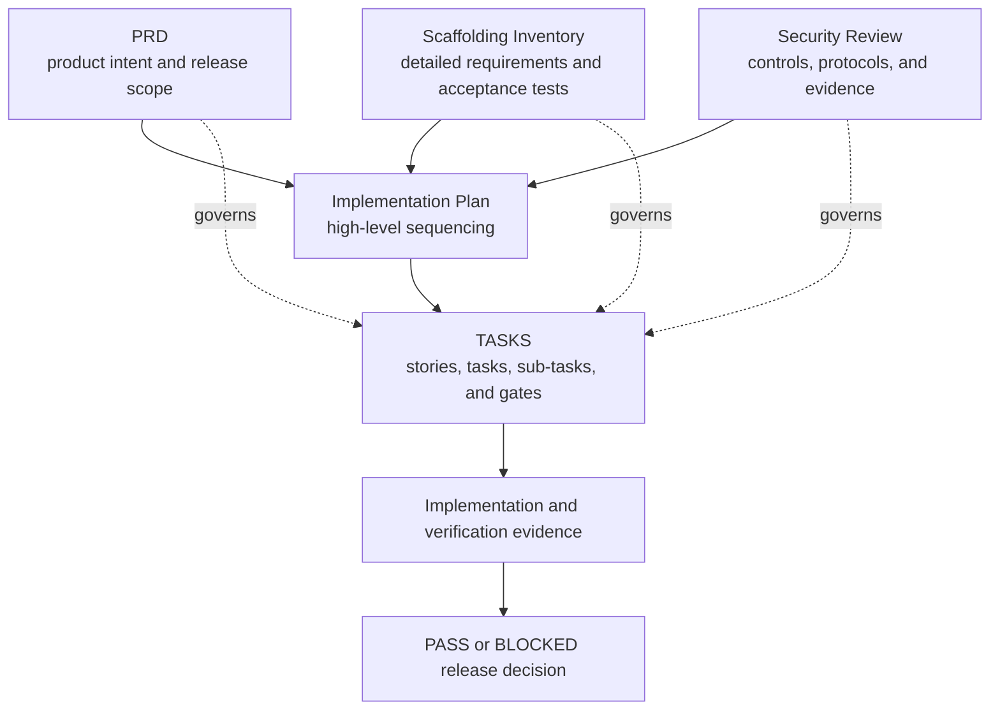
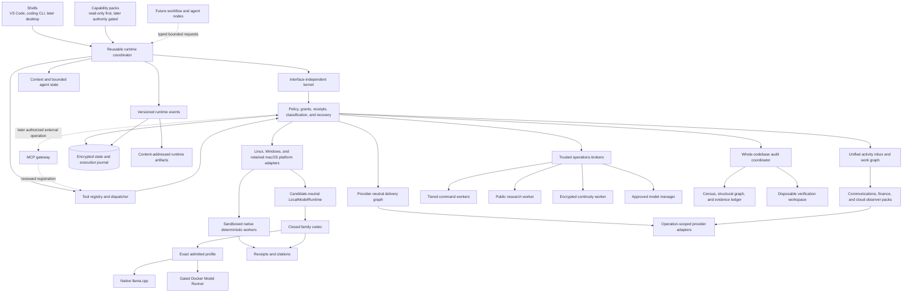
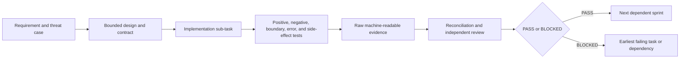

# AgentMage - High-Level Implementation Plan

| Field | Planning baseline |
|---|---|
| Status | Pre-alpha scaffold with one source-level deterministic fake-model repository-analysis workflow integrated under Story 22.5; broader integration and every release gate remain open |
| Version | 1.9 |
| Date | 2026-08-22 |
| Product | AgentMage - a brand-new, from-scratch local-first assistant |
| Product authority | [`PRD.md`](./PRD.md) |
| Detailed requirement authority | [`Agent-Scaffolding-Inventory.md`](./Agent-Scaffolding-Inventory.md) |
| Security-review authority | [`SECURITY-REVIEW.md`](./SECURITY-REVIEW.md) |
| Granular execution authority | [`TASKS.md`](./TASKS.md) |
| Supporting policies | [`ENGINEERING-RUNTIME.md`](./ENGINEERING-RUNTIME.md), [`MODEL-GATEWAY.md`](./MODEL-GATEWAY.md), [`ENGINEERING-CAPABILITY-REGISTRY.md`](./ENGINEERING-CAPABILITY-REGISTRY.md), [`MODEL-PROVENANCE-POLICY.md`](./MODEL-PROVENANCE-POLICY.md), [`SECURITY.md`](./SECURITY.md), [`RUNTIME-BOUNDARIES.md`](./RUNTIME-BOUNDARIES.md), [`DELIVERY-SYSTEM.md`](./DELIVERY-SYSTEM.md), [`PRODUCTIVITY-SYSTEM.md`](./PRODUCTIVITY-SYSTEM.md), [`TRUSTED-OPERATIONS.md`](./TRUSTED-OPERATIONS.md), [`CODEBASE-AUDIT.md`](./CODEBASE-AUDIT.md), [`WINDOWS-BOUNDARIES.md`](./WINDOWS-BOUNDARIES.md), and [`architecture/status-model.json`](./architecture/status-model.json) |
| Planning sequence | 169 sequential dependency gates across 17 release epics and four cross-cutting foundational runtime epics; no calendar estimate implied |

## 1. Purpose

This document is the high-level implementation plan for AgentMage, a brand-new, from-scratch project. It explains how the product architecture, platform boundaries, capability packs, interfaces, assurance work, and releases fit together from project foundation through final product verification.

AgentMage is an independent, privately developed product created by Aaron N. Horvitz on personal time, on personally controlled hardware, with independently obtained tools and services. It is not sponsored, commissioned, or developed on behalf of an employer. Public release is the product objective; any later managed-device evaluation is optional, separate from development, and does not change project ownership.

This document is derived from `PRD.md`, `Agent-Scaffolding-Inventory.md`, and `SECURITY-REVIEW.md`. It is intentionally less granular than `TASKS.md` and defines implementation phases, workstreams, dependencies, milestone outcomes, risks, and gates. `MODEL-PROVENANCE-POLICY.md`, `SECURITY.md`, and `RUNTIME-BOUNDARIES.md` provide subordinate admission, disclosure, and boundary procedures. This plan does **not** replace the numbered stories, tasks, sub-tasks, tests, acceptance criteria, artifacts, or evidence requirements in `TASKS.md`.

A developer or coding agent must use this document to understand the overall sequence and use `TASKS.md` to perform the next bite-sized unit of work. No implementation item may be considered complete from this plan alone.

### 1.1 Current Implementation Truth

Current product lifecycle: `scaffolded`.

Current integrated workflow: deterministic fake-model repository-analysis vertical slice (Story 22.5).

The proving artifact is [`vertical-slice-report.json`](artifacts/sprints/sprint-22/story-22.5/vertical-slice-report.json). Its scope is one deterministic fake-model source-to-terminal repository-analysis run; it does not qualify a production model, installed package, platform, or release.

Current enabled models: none.

Current supported platforms: none.

Stabilization scope freeze: inactive (Decision 0047) — the complete preserved plan is open under the Decision 0021 execution rule; blocked rows retain exact blockers and empty substitution sets.

First-release surface: standalone hardened desktop application (Decision 0048).

[`Decision 0012`](./docs/decisions/0012-stabilization-truth-and-status-model.md)
and [`architecture/status-model.json`](./architecture/status-model.json) govern
these current-state claims. This plan preserves the complete 17-release-epic,
four-foundational-runtime-epic, 169-sprint, 294-requirement target sequence. Under
[`Decision 0021`](./docs/decisions/0021-stabilization-resumption.md), that
sequence resumes at its first incomplete dependency gate. New capability
families remain subject to explicit decisions and complete impact analysis.

Stabilization Phase 9 now has a source candidate under accepted
[`Decision 0018`](./docs/decisions/0018-linux-vscode-read-and-receipt.md): one
exact approved Linux file read through the Visual Studio Code provider,
authenticated framing, durable kernel transaction, offline worker, citation,
and receipt. This is a vertical integration proof, not a model-enabled or
supported workflow. Decisions 0022 and 0023 add detached package signing and a
package-verified authentication-only Linux bootstrap. Supervised extension
launch now consumes that fixed bootstrap, but signed platform activation, clean
installation, and release authority remain later dependencies.

Decision 0024 adds the first native Windows process-identity observer and a
commit-bound `windows-2022` evidence lane. It proves only the current-process
token, session, elevation, and executable-identity source boundary. Named-pipe
peer authentication, package identity, MSIX, NTFS enforcement, restricted
workers, DPAPI, native model execution, and clean Windows 11 lifecycle evidence
remain open. Decision 0025 schedules real `RM-024` fuzz-engine execution for the
final pre-release campaign without waiving any affected sprint or release gate.
Decision 0040 preserves the hosted Windows result as historical evidence while
moving future Fedora, Ubuntu, and genuine Windows 11 acceptance to fresh local
KVM guests. Routine product and documentation checks are local; ordinary pushes
allocate no hosted runner. A separate manual, budget-confirmed Apple Silicon
macOS source check is the only enabled GitHub-hosted lane and cannot close M5 or
release gates.
Decision 0026 appends a Proton Calendar confirmed-UI adapter and concrete
direct-invitation and email-first confirmation workflows to the existing
productivity family without changing the 169-gate sequence. Decision 0027
reconciles future model work around a candidate-neutral runtime, closed family
codecs, Muse-first evaluation, complete role-aware first-party Gemma inventory,
deterministic classifier limits, and verifier-only agent completion. It changes
no completed work, enables no model, and adds no sprint.

## 2. Document Authority and Change Control

The governing rules are:

1. `PRD.md` owns product intent, architecture, release scope, and product-level acceptance.
2. `Agent-Scaffolding-Inventory.md` owns detailed requirements, stable `AM-*`, `AT-*`, and `CR-*` identifiers, capability gates, and the additions-only inventory.
3. `SECURITY-REVIEW.md` owns the public product-security baseline, `SR-*` controls, `RV-*` reviewer protocols, and reviewer evidence contract.
4. This document owns only the high-level implementation sequence and milestone narrative.
5. `TASKS.md` owns executable ordering, sprint dependencies, stories, tasks, sub-tasks, tests, artifacts, Given/When/Then acceptance criteria, and PASS/BLOCKED gates.
6. `README.md` summarizes the project and must remain consistent with all five planning and authority documents.

Supporting policy and decision files implement those authorities and cannot silently weaken them. Each document has an independent revision; cross-document compatibility is established by recorded source versions, decision records, and automated checks rather than matching version numbers.

If documents conflict, the narrower safety boundary or release scope wins until an approved decision record resolves the conflict. This plan must be corrected before implementation continues; it cannot override a requirement, test, security control, or sprint gate. Accepted identifiers are never silently removed, weakened, merged away, or renumbered.

## 3. Implementation Outcomes

The first implementation objective remains the internal v0.1 read-only local evidence foundation in native Visual Studio Code Chat. Model construction is candidate neutral, with Muse Glimmer as the primary implementation and deep-evaluation candidate, every eligible official first-party Gemma profile at a pinned catalog freeze inventoried and evaluated by role, and other eligible candidates admitted through the same exact contract. No candidate is pre-approved. Existing Gemma 4 E4B and Gemma 4 12B Unified rejected profiles remain immutable historical evidence and are neither prerequisites nor automatic fallbacks. The product currently has zero enabled models.

The complete roadmap expands that foundation through separately gated knowledge, writes, coding, manual frontier consultation, administrative and document work, read-only connectors, desktop interfaces, extensions, web research, hosted actions, schedules, bounded agents, a provider-neutral delivery system, Windows 11, communications, a unified work graph, personal information and documents, finance and budgeting, read-only cloud observation, tiered command authority, credential brokering, encrypted continuity, approved-model management, and comprehensive whole-codebase audit. The first supported public release is v1.0 GA after Sprint 166. The Experimental Model Lab remains post-GA in Sprints 167-168. A later capability remains absent until its own dependencies, threat model, authority path, recovery behavior, tests, and release gate pass.

The implementation must preserve these outcomes throughout the roadmap:

- Deterministic operations run before model inference when an answer is mechanically checkable.
- Models, prompts, shells, plugins, connectors, schedules, and child agents carry no ambient authority.
- `CapabilityGrant` is the only authority-bearing object and is validated and consumed by the kernel.
- Platform adapters enforce equivalent authority, path, privacy, evidence, and offline contracts on Fedora, Ubuntu, and Windows 11 for v1.0 GA; Apple Silicon macOS remains an independently evidenced post-GA lane.
- Encrypted SQLite is canonical for operational state; beginning in v0.2, Markdown is canonical only for human-owned knowledge and approved portable memory; JSON Lines is derived export only.
- Every tool attempt produces one receipt, and every file-grounded claim has a resolvable, stale-aware citation.
- The strict-local profile has no cloud model, external API, telemetry, analytics, cloud storage, hosted account, or cloud fallback.
- Codex remains a separate user-controlled surface. AgentMage may prepare a local handoff preview with classification and unresolved-redaction warnings but cannot invoke, populate, copy to, call, or transmit to Codex.
- Every enabled model and related artifact passes `MODEL-PROVENANCE-POLICY.md`, including license, publisher, lineage, origin, provenance, integrity, codec, context, decoding, resource, quality, security, platform, and non-Chinese/non-Chinese-derived model gates.
- Native `llama.cpp` and Docker Model Runner implement one candidate-neutral `LocalModelRuntime` contract. Closed model-family codecs translate exact tokenizer, template, reasoning, message, end-token, and tool-protocol behavior into one typed untrusted proposal. Native inference is the Linux security reference; Docker is a supported compatibility adapter only after its additional privilege, endpoint, isolation, parity, and zero-egress gates pass.
- Muse Glimmer is the primary deep-evaluation candidate; every eligible official first-party Gemma profile receives an explicit role, preflight, applicable test set, and visible disposition; other eligible first-party candidates enter through the same evidence boundary.
- Quality and diagnostic-repeatability profiles are measured and reported separately. Token repetition under one pinned tuple is never represented as universal model, runtime, driver, device, or cross-release determinism.
- Data sensitivity, action risk, and model capability are classified separately. Deterministic deny-first policy owns authority; probabilistic classifiers may only deny, narrow, redact, isolate, or escalate.
- The persisted agent state machine has named terminal states, bounded no-progress handling, restart reconciliation, and verifier-only completion. Model prose, confidence, classifiers, and model judges cannot grant authority or establish success.
- `agentmage doctor` is a deterministic diagnostics response rendered in native Visual Studio Code Chat for v0.1; it is not evidence that the deferred full CLI exists.
- Security and release claims remain bounded to reproducible evidence and never imply external certification or customer deployment approval.
- Provider adapters implement one delivery contract and never add provider conditionals or ambient credentials to the kernel.
- `observe`, `draft`, `local-write`, `remote-write`, `execute`, `deploy`, `secrets`, and `admin` remain independent authority classes.
- Windows 11 x64 is required for v1.0 GA; passing Linux or Apple Silicon evidence cannot satisfy a Windows gate. Intel Mac and Windows on Arm remain deferred.
- Markdown authoring preserves and safely renders inline and display LaTeX mathematics through pinned offline components.
- Communications reads and writes are governed by a visible Autonomy Center whose effective level is the intersection of global and narrower policy ceilings.
- Financial calculations use fixed-point decimal arithmetic and source-preserving reconciliation; first-GA bank access cannot move money.
- AWS, Azure, and Google Cloud observation is read-only and cannot become a hidden infrastructure, command, secret, identity, or administration path.
- Public research uses a separate hostile-content boundary, preserves claim-level citations and freshness, and cannot disclose private context without an exact user-reviewed grant.
- Command execution supports complete shell semantics while authority remains tiered; only a direct authenticated user can activate an expiring, visibly risky Owner / Unrestricted Session.
- Connected secrets remain operating-system-backed references resolved inside one exact worker operation and never enter model context, ordinary logs, diagnostics, exports, or continuity snapshots.
- Local continuity is canonical and cloud backup is client-side encrypted, versioned, namespace bounded, restorable, and separate from read-only Cloud Observer.
- The approved-model manager is deterministic and user confirmed; Muse Glimmer and every other candidate remain non-runnable until complete exact-profile admission evidence exists.
- Whole-codebase audit treats the encrypted structural index and evidence ledger as project memory, model contexts as bounded working memory, canonical source as read-only, and complete path disposition plus cross-module reconciliation as prerequisites for a comprehensive claim.
- Unapproved models remain in a post-GA isolated lab without network, credentials, commands, connectors, or canonical workspace writes and cannot promote themselves.

## 4. Architecture Implementation Strategy

AgentMage is implemented as three one-way product layers over explicit platform adapters.

### 4.1 Kernel First

The kernel contracts are frozen before feature code. They define tasks, work packets, tools, results, receipts, evidence states, configuration, capability grants, paths, storage, cancellation, and recovery. The kernel cannot import a capability pack or shell.

### 4.2 Platform Boundaries Before Capabilities

Platform adapters are implemented and tested before tools depend on them. The adapters own local inference, workspace authorization, secure path resolution, process confinement, operating-system secret storage, resource limits, installation, and updates. `RUNTIME-BOUNDARIES.md` defines their shared process, privilege, socket, lifecycle, and classified data-flow contract; `WINDOWS-BOUNDARIES.md` defines the Windows specialization.

Fedora is the Linux development and performance reference. Ubuntu must pass the same supported workflow. Windows 11 x64 is the first-GA Windows reference. Native `llama.cpp` is the Linux and Windows security reference, while Docker Model Runner supplies a separately gated Linux compatibility path matching Docker-based development. The Apple Silicon MacBook Pro M5 requirements remain retained post-GA. Platform-specific mechanisms may differ, but no platform or runtime may weaken the common contract.

Platform validation is local-first under Decision 0040. Fresh disposable KVM
guests own Fedora, Ubuntu, and Windows 11 acceptance once their image,
orchestration, standard-user, network-phase, evidence, and cleanup tasks are
implemented. GitHub source hosting is not the test authority. Its only enabled
hosted execution is an explicit manual Apple Silicon macOS source compatibility
check after a maintainer confirms budget availability. The hosted result does
not substitute for the retained MacBook Pro M5 lane.

### 4.3 Candidate-Neutral Models and Deterministic Agent State

The kernel depends on one runtime contract and one closed proposal schema, never
on a model family. Runtime adapters own process supervision, load/unload,
streaming, cancellation, resource reporting, and isolation. Family codecs own
tokenizer, template, reasoning, message-boundary, end-token, and tool-protocol
translation. Exact profiles bind those parts to artifacts, hashes, context,
decoding, platform, hardware, policy, and evidence.

Muse Glimmer is the first deep implementation candidate. Every eligible
official first-party Gemma profile is inventoried at a pinned source freeze and
tested only in applicable roles; other eligible candidates use the same intake.
All remain non-authoritative and disabled until exact-profile admission passes.

Later Ollama, vLLM, or OpenAI-compatible local adapters use that same runtime
contract only as exact admitted endpoint/process/network profiles with explicit
capabilities, codec, provenance, zero-egress, parity, lifecycle, and removal
evidence. The interactive coding-harness MVP has no arbitrary endpoint registry.

The agent loop persists typed states and named terminal outcomes. Deterministic
policy, a consumed grant, a restricted worker, and a deterministic postcondition
verifier surround every model proposal. Learned classification can restrict or
escalate but cannot grant authority, override denial, switch models, or establish
completion. Quality and diagnostic-repeatability profiles remain separate.

### 4.4 Deterministic Tools Before Model Synthesis

Synthetic fixtures, read-only tools, Git inspection, repository mapping, receipts, citation resolution, evidence-state assignment, and stale-evidence detection are implemented before model-generated explanations are trusted. Unsupported or unavailable evidence is shown as Unknown/Blocked rather than invented.

### 4.5 One Interface Before Additional Shells

Native Visual Studio Code Chat is the sole internal v0.1 harness; the first public release surface is defined by Decision 0048 as a signed standalone hardened desktop application. The deterministic `agentmage doctor` response is rendered there. A development diagnostic harness and read-only reviewer verifier may exercise contracts but are not supported end-user shells. The v0.4 interactive coding CLI is the first complete coding client of the same reusable runtime coordinator used by native Chat; it is not a second agent loop or storage authority. Standalone macOS and Linux desktop applications are introduced in v1+ only after the shared runtime and kernel are stable.

### 4.6 Authority Added Incrementally

Read-only local work is implemented first. File writes, command execution, remote reads, frontier export/import, connectors, hosted writes, CI execution, deployment, infrastructure application, secret operations, administration, browser actions, schedules, plugins, Model Context Protocol servers, and child agents are introduced in separate increments. Each new authority path reuses the kernel's exact grant, classification, receipt, cancellation, retention, isolation, and recovery contracts.

### 4.7 Provider-Neutral Delivery

The delivery graph and adapter SDK arrive only after local authority, writes, execution, and connected-read foundations are proven. Adapters advance from manifested to observable, writable, executable, deployable, and administrative conformance one level at a time. The kernel understands typed delivery objects and capability classes, not provider-specific API calls. [`DELIVERY-SYSTEM.md`](./DELIVERY-SYSTEM.md) owns this contract.

### 4.8 Productivity Packs Through the Same Kernel

Communications, personal-information, document, finance, and cloud-observer adapters reuse the
provider lifecycle but do not flatten their domain semantics into delivery objects. The Autonomy
Center narrows kernel policy and never becomes an authority-bearing shell feature. The unified inbox
and work graph retain native object identity, source, freshness, classification, and uncertainty.
Financial arithmetic and reconciliation remain deterministic, bank and cloud adapters remain
read-only, and every pack is independently removable. [`PRODUCTIVITY-SYSTEM.md`](./PRODUCTIVITY-SYSTEM.md)
owns this contract.

### 4.9 Trusted Operations as Separate Authorities

Command execution, public research, credential resolution, continuity, and model acquisition use
separate workers and capability registrations. The command language can be complete without making
host-user authority ambient. Owner / Unrestricted Session is a direct, authenticated, expiring user
decision with a visible warning and panic stop. Public research cannot reuse authenticated browser
state. Cloud continuity writes only encrypted snapshots to one exact destination namespace.
Approved-model installation is deterministic and separate from inference. The post-GA Experimental
Model Lab has no connected or workspace-write authority. [`TRUSTED-OPERATIONS.md`](./TRUSTED-OPERATIONS.md)
owns this contract.

### 4.10 Whole-Codebase Audit as Persistent Evidence

Comprehensive repository analysis does not depend on fitting a repository into one model context.
An exact census and deterministic structural graph define coverage; coherent bounded model packets
produce provisional evidence cards; mandatory reconciliation connects conclusions across modules;
encrypted checkpoints preserve progress and invalidate stale dependencies. The canonical repository
has no audit write grant, and potentially writing commands run only in disposable copy-on-write
workspaces. [`CODEBASE-AUDIT.md`](./CODEBASE-AUDIT.md) owns this contract.

### 4.11 Reusable Runtime, Journal, and Artifact Layer

The runtime coordinator composes existing kernel contracts for one run: persisted agent state,
candidate-neutral model control, bounded context, tool discovery and dispatch, policy and grants,
receipts, checkpoints, ordered events, and terminal outcomes. Native Chat, the interactive coding
CLI, JSON/SDK/ACP clients, and later workflow nodes submit versioned runtime requests and receive the
same runtime events. Client presentation never becomes a policy, tool, model, storage, or effect
boundary.

The visible `ALLOW`, `ASK`, and `DENY` dispositions are projections of existing kernel authority.
`ALLOW` reaches dispatch only with a current exact grant; `ASK` pauses and emits a protected approval
request without starting an effect; `DENY` records a no-effect refusal. Future workflow nodes use the
same mechanism with the intersection of workflow, node, parent, task, and user authority, which can
be narrower than an interactive session.

The event path is deliberately small. Correctness-bearing grant, effect, receipt, and checkpoint
records share the canonical SQLite transaction. Progress and content-free metrics use bounded
asynchronous queues, batching, and explicit saturation behavior. The durable execution journal,
persisted transcript, and optional local diagnostics/metrics are separate projections. Streamed
tokens are not synchronously persisted as individual events.

Large patches, command streams, test logs, generated files, reports, and model outputs use verified
content-addressed runtime artifacts under the approved local data root. SQLite owns their metadata,
classification, references, retention, and checkpoint linkage. These runtime objects are distinct
from checked-in release and sprint evidence under `artifacts/`.

### 4.12 Standardized Planning, Review, and Delivery Roles

Decision 0041 defines `AG-01` through `AG-49` as declarative profiles over the
shared runtime. The profiles cover planning, issue and bug lifecycles,
engineering, independent review, CI/CD, release, operations, maintenance, and
evidence. They do not add another model loop, provider client, permission
engine, journal, artifact store, or completion mechanism.

Deterministic workflow graphs sequence profile calls and own dependencies,
leases, idempotency, cancellation, and gates. Kernel and platform services keep
policy, approval, credentials, signing, evidence, artifact verification, merge,
deployment, and postcondition reconciliation outside model judgment. The
complete catalog and canonical workflows are defined in
[`planning-review-and-delivery-agent-profiles.md`](./docs/architecture/planning-review-and-delivery-agent-profiles.md).

### 4.13 Universal Artifact Ingestion and Context Preparation

Decision 0042 defines universal artifact ingestion as a cross-cutting foundational runtime epic,
not a shell feature or a second context manager. The stable Visual Studio Code Chat Participant is
the guaranteed request-ingress path. TypeScript may enumerate references explicitly supplied to
that participant, stream bounded bytes for those references, render progress, and report
unavailable content. It may not parse documents, choose context, grant ambient workspace access,
or silently discard an unsupported message part.

Rust owns source-artifact identity, provenance, classification, type detection, bounded extraction,
canonical sections, lexical retrieval, cache invalidation, retention, and model-profile-aware token
allocation. Source artifacts use a distinct logical manifest while sharing the existing encrypted
content-addressed payload backend. Extracted candidates enter the existing Story 22.1 context
manager; no parallel prompt assembler or physical artifact store is introduced. Existing DOCX,
PDF, and spreadsheet parsers become adapters to this service through their owning sprints.

The current extension contract still prohibits workspace reads. Story 1.2 must amend that contract,
its validator, and its evidence together before the participant may resolve request-bound local
references. Ambient workspace enumeration remains prohibited. Provider compatibility is best
effort because current provider APIs receive normalized text rather than the participant's complete
reference set. Stable, Preview, proposed, and private Visual Studio Code surfaces remain explicitly
separated.

### 4.14 Verified Workflow Execution and Recovery

Decision 0042 also defines an additive deterministic supervisor around the existing reusable runtime
coordinator. It does not create another agent loop, plan schema, policy engine, tool dispatcher,
journal, artifact store, or completion authority. The supervisor binds each existing plan step to
preflight, side-effect, approval, idempotency, verification, retry, budget, and diagnostic policies.

The existing zero-hidden-retry runtime behavior remains valid. A permitted retry is a new attempt
with a new tool-call identity, operation-attempt identity, grant, and approval when required; no
effect call, consumed grant, or receipt is replayed. Read-only and proven-idempotent operations may
be eligible only after deterministic reconciliation. Conditional, non-idempotent, destructive,
external, and unknown effects fail closed unless their exact policy and current authority permit a
new attempt. Models propose; kernel policy, platform preflight, tool execution, deterministic
verification, and recovery state establish runtime truth.

The supervisor persists attempt state, preflights, verification observations, budget consumption,
recovery decisions, and terminal diagnostics through the current journal, artifact, checkpoint,
and operational-store boundaries. Premature stopping, malformed calls, repeated state fingerprints,
uncertain effects, interruption, and exhausted budgets end in a resumable diagnosis rather than a
false completion or unbounded loop.

### 4.15 Engineering Runtime, Verified Chat, Gateway, and Capability Registry

Decisions 0043 and 0044 compose, and Decision 0045 mandates, the Decision 0042 foundations as one professional engineering
harness. `ENGINEERING-RUNTIME.md` owns the complete client-to-verifier lifecycle,
`MODEL-GATEWAY.md` owns candidate-neutral local and remote inference, and
`ENGINEERING-CAPABILITY-REGISTRY.md` owns versioned executable capability manifests.

The Rust host remains the sole authority for policy, grants, persistence, tools, route admission,
verification, and completion. AgentMage Verified Chat is the canonical reliable VS Code interface;
its webview is disposable and its TypeScript bridge is transport and presentation only. Stable
Chat Participant and Language Model Chat Provider adapters remain separately labeled compatibility
surfaces. No private VS Code API or present-day External Agent Host extension mechanism is assumed.

The Model Gateway separates model, runtime, codec, endpoint, operator, route, policy, and
qualification identities. Strict local remains complete. Private-network, private-remote, and
managed-remote routes are optional, separately disclosed, and disabled until live qualification.
Fallback is disabled by default and can never silently cross a disclosure boundary.

The Capability Registry and Decision 0041 role profiles run over the same workflow, journal,
artifact, observation, authority, and verifier contracts. Multi-agent scheduling follows, rather
than precedes, complete single-agent reliability. Decision 0045 keeps Team implementation inside
the first supported Engineering Runtime boundary while retaining this dependency gate. Each pod receives isolated authority, leases,
budgets, worktree state where applicable, and evidence; independent review and serialized
integration remain deterministic and final promotion is human-gated by default.

## 5. Cross-Cutting Workstreams

These workstreams continue across multiple epics even though their first deliverables occur in a specific sprint range.

| Workstream | Initial focus | Continuing responsibility |
|---|---|---|
| Governance and traceability | Epic 0 | Requirement registry, decision records, additions-only checks, document consistency, public-authority provenance, and final closure |
| Kernel and contracts | Epics 0-1 | Typed boundaries, policy, work packets, tools, grants, receipts, cancellation, configuration, and compatibility |
| Platform engineering | Epics 1 and 10 | Linux Bubblewrap/seccomp/cgroups/Secret Service, Windows MSIX/AppContainer/named-pipe/DPAPI/NTFS boundaries, retained macOS signing/sandbox/XPC/Keychain/Metal, native and Docker runtime boundaries, packaging and updates |
| Model lifecycle | Epic 0 feasibility, Epic 1 implementation | Provenance policy, early E4B/fallback evidence, approved-artifact catalog, installer/importer, native/Docker parity, Chat diagnostics, explicit selection, later measured routing |
| Data and privacy | Epic 1 | Classification, encrypted operational state, retention, local data root, knowledge authority, export, backup, and deletion |
| Deterministic evidence | Epic 1 | Read-only tools, Git, repository map, evidence states, citations, runtime journal, large-output artifact references, reconciliation, and truthful completion |
| Runtime composition | Epics 1 and 4 | Shared run request/event/outcome contracts, bounded agent loop, context, model, tool dispatch, policy dispositions, session state, cancellation, journal, artifacts, and recovery |
| Universal artifact ingestion | Cross-cutting foundational runtime epic | Participant reference ingress, source-artifact manifests, bounded Rust extraction, structural sections, lexical retrieval, explicit token allocation, context-manifest accounting, parser adaptation, cache invalidation, and native artifact tools |
| Verified workflow execution | Cross-cutting foundational runtime epic | Step execution policy, preflight, attempt identity, side-effect and retry eligibility, deterministic verification, premature-stop handling, durable recovery, terminal diagnosis, and fault campaigns |
| User interfaces | Epic 1 | Native Visual Studio Code Chat, then the v0.4 interactive coding CLI and later desktop applications using the same runtime coordinator and kernel |
| Capability expansion | Epics 2-8 | Knowledge, writes, coding, frontier consultation, documents, connectors, web, schedules, and agents |
| Delivery graph and adapters | Epics 7-10 | Provider SDK, identity correlation, GitHub/GHES, Jira, Azure DevOps, GitLab, Jenkins, artifacts, deployment, infrastructure, observability, incidents, security, catalogs, and releases |
| Delivery operations | Epic 10 | Idempotency, uncertain-result reconciliation, CI execution, promotion, health, drift, rollback, feature flags, migrations, and ChatOps notifications |
| Productivity and communications | Epic 12 | Autonomy, confirmed identities, synchronization, unified inbox, mail, chat, calendar, contacts, tasks, documents, attachments, workflows, and communication recovery |
| Finance and budgeting | Epic 13 | Fixed-point arithmetic, imports, reconciliation, Actual Budget, read-only bank data, budgets, bills, receipts, accounting, anomaly indicators, and financial privacy |
| Cloud observation | Epic 13 | Read-only AWS, Azure, and Google Cloud inventory, configuration, health, logs, security, cost, correlation, and removal |
| Trusted command authority | Epic 15 | Tiered shell policy, full command semantics, owner-session authentication, expiry, panic stop, descendants, receipts, and removal |
| Public research | Epic 15 | Current search, primary-source preference, citations, freshness, hostile-content handling, download quarantine, and disclosure control |
| Credentials and continuity | Epic 15 | OS secret references, operation-scoped resolution, encrypted local snapshots, bounded cloud backup, clean-device restore, and disaster recovery |
| Model management | Epic 15 and post-GA Epic 16 | Approved catalog, guided installation, Muse candidate admission, and isolated experimental evaluation |
| Whole-codebase audit | Epic 15 | Exact scope and census, deterministic structure, semantic partitioning, evidence cards, checkpoint resume, invalidation, cross-module reconciliation, read-only verification, findings, coverage, and removal |
| Security assurance | Epic 0 | Threat cases, `SR-*` mappings, assigned `RV-*` owners, continuous fuzzing, adversarial testing, independent review criteria, and incremental evidence bundles |
| Release engineering | Epic 0 | Apache-2.0 licensing, reproducible builds, manifests, signing, software/model/crypto bills of materials, clean installation, vulnerability response, signed manual patches, rollback, and support |

## 6. Delivery Sequence

```mermaid
flowchart LR
    E0["Epic 0<br/>Foundation<br/>Sprints 0-3"] --> E1["Epic 1<br/>v0.1 Read Only<br/>Sprints 4-25"]
    E1 --> E2["Epic 2<br/>v0.2 Knowledge<br/>Sprints 26-34"]
    E2 --> E3["Epic 3<br/>v0.3 Writes<br/>Sprints 35-40"]
    E3 --> E4["Epic 4<br/>v0.4 Coding and CLI<br/>Sprints 41-50"]
    E4 --> E5["Epic 5<br/>v0.5 Frontier<br/>Sprints 51-53"]
    E5 --> E6["Epic 6<br/>v0.6 Admin and Documents<br/>Sprints 54-69"]
    E6 --> E7["Epic 7<br/>v0.7 GitHub and Connectors<br/>Sprints 70-75"]
    E7 --> E8["Epic 8<br/>Extended Capabilities<br/>Sprints 76-100"]
    E8 --> E9["Epic 9<br/>Inherited Closure<br/>Sprints 101-102"]
    E9 --> E10["Epic 10<br/>Delivery and Windows<br/>Sprints 103-125"]
    E10 --> E11["Epic 11<br/>Delivery Checkpoint<br/>Sprint 126"]
    E11 --> E12["Epic 12<br/>Productivity and Communications<br/>Sprints 127-141"]
    E12 --> E13["Epic 13<br/>Finance and Cloud Observer<br/>Sprints 142-155"]
    E13 --> E14["Epic 14<br/>Expanded Checkpoint<br/>Sprint 156"]
    E14 --> E15["Epic 15<br/>Trusted Operations and Codebase Audit<br/>Sprints 157-166"]
    E15 --> E16["Epic 16<br/>Experimental Model Lab<br/>Sprints 167-168"]
```

Sprints are numbered dependency and evidence gates, not calendar estimates. Work proceeds in numbered dependency order. Under Decision 0008, unavailable Mac-specific work remains `BLOCKED-MACOS` for the retained post-GA lane while shared, Linux, and Windows work may proceed when it does not consume or assume a missing Mac result. No Mac claim closes until its retained work passes, but Mac is not a `G-GA` dependency. If a story becomes too broad for independent review, it is blocked and split into newly appended identifiers before implementation continues.

| Epic | High-level outcome | Sprint range | Exit gate |
|---|---|---|---|
| 0 | Governed, reproducible project foundation | 0-3 | `G-FOUNDATION` |
| 1 | v0.1 Read-Only Local Evidence Assistant | 4-25 | `G-V0.1` |
| 2 | v0.2 Knowledge, Obsidian, and Memory | 26-34 | `G-V0.2` |
| 3 | v0.3 Controlled Writes | 35-40 | `G-V0.3` |
| 4 | v0.4 Coding and Complete Local CLI | 41-50 | `G-V0.4` |
| 5 | v0.5 Manual Frontier Consultation | 51-53 | `G-V0.5` |
| 6 | v0.6 Administrative and Document Work | 54-69 | `G-V0.6` |
| 7 | v0.7 Read-Only GitHub and Connectors | 70-75 | `G-V0.7` |
| 8 | Extended interfaces, packages, actions, scheduling, and agents | 76-100 | `G-V1+` |
| 9 | Inherited-roadmap closure checkpoint | 101-102 | `G-LEGACY-CLOSURE` |
| 10 | Provider-neutral delivery system and Windows 11 | 103-125 | `G-DELIVERY` and `G-WINDOWS` |
| 11 | Delivery-and-Windows GA checkpoint | 126 | `G-GA-DELIVERY-CHECKPOINT` |
| 12 | Productivity, communications, personal information, documents, and autonomy | 127-141 | `G-PRODUCTIVITY` |
| 13 | Finance, budgeting, accounting, and read-only cloud observation | 142-155 | `G-FINANCE` and `G-CLOUD-OBSERVER` |
| 14 | Expanded v1.0 GA verification and release decision | 156 | `G-GA` |
| 15 | Trusted operations, whole-codebase audit, and superseding v1.0 GA | 157-166 | `G-TRUSTED-OPERATIONS`, `G-CODEBASE-AUDIT`, and `G-GA` |
| 16 | Post-GA Experimental Model Lab | 167-168 | `G-EXPERIMENTAL-MODELS` |

The four cross-cutting foundational runtime epics do not add release numbers or sprint identities.
Their dependency-ordered stories are distributed through existing owners in Sprints 1, 2, 5, 11,
13, 16, 21-23, 49-50, 58, 60, 62, 81, 95, and 121-126. Decision 0042 retains
`M-FOUNDATIONAL-RUNTIME-CORE` at Sprint 50, followed by `M-FOUNDATIONAL-RUNTIME` after the required
DOCX, PDF/OCR, and spreadsheet adapters in Sprint 62. Decisions 0043 and 0044 add `ER-M0` through
`ER-M9` for the Engineering Runtime and Model Gateway. All are internal evidence gates and none
supersedes a release gate.

### 6.1 Active Roadmap Execution Spine

The canonical task order remains `TASKS.md`. The following execution spine is a
high-level dependency view for resuming implementation after stabilization; it
does not mark a sprint complete and does not permit later work to consume a
missing earlier contract.

| Stage | Bounded outcome | Current evidence | Next blocking evidence |
|---|---|---|---|
| A. Release trust mechanics | Deterministic detached signing and verification for package manifests | Decision 0022; local release-signing tests pass | Production signer approval, externally provisioned trust roots, RPM/DEB repository signatures, revocation, and reproducible clean-package evidence |
| B. Linux package bootstrap | Verify an installed package before opening an owner-local authentication endpoint | Decisions 0023 and 0028; package mutation, peer, replay, endpoint, and inactive inference-adapter package tests pass locally with zero enabled models | Signed platform activation, clean Fedora and Ubuntu package lifecycles, rollback, uninstall, independent native evidence, and the Sprint 13 model-runtime contract |
| C. Native Chat supervision | Launch only the fixed packaged host, authenticate the exact child, bound the frame, erase the launch secret, and fail inert | Decision 0023 implementation; extension and product suites pass locally | Model-enabled kernel activation, usable end-to-end Chat workflow, clean VSIX/package installation, accessibility, cancellation, and recovery evidence |
| D. Windows native identity | Observe and redact current token user, session, elevation, and executable identity through a narrow Windows FFI boundary | Decision 0024; historical commit-bound `windows-2022` result plus current cross-target check and lint | Reproduce the identity boundary in a clean local Windows 11 x64 KVM guest, then add connecting-peer integrity/package identity and authenticated named-pipe work |
| E. Windows first-GA boundary | Complete Sprints 121-122 package, IPC, path, worker, key, model, network, Chat, accessibility, and lifecycle controls | Contract and one partial identity source only | MSIX/Authenticode, hostile native tests, three clean standard-user lifecycles, removal, and independent Windows 11 evidence |
| F. Capability roadmap | Execute Sprints 0-165 in dependency order across local evidence, knowledge, writes, coding, delivery, productivity, finance, cloud observation, trusted operations, and whole-codebase audit | Only individually recorded completed sub-tasks and decisions count | Each first authoritative unchecked task, its inherited tests, and its evidence gate |
| G. Final security campaign | Freeze release surfaces and execute real fuzzing plus complete reviewer protocols | Harness, corpora, schemas, and synthetic/property evidence only | Decision 0025 `RM-024` campaign, sanitizer/coverage/crash disposition, impact reruns, and independent review |
| H. Release closure | Rebuild and independently reproduce exact Fedora, Ubuntu, and Windows candidates | Not started | Sprint 166, `RV-01` through `RV-49`, signed evidence reconciliation, explicit user approval, and zero hidden blocker |

Evidence states in this table are deliberately narrow. `Implemented` source is
not native execution; native execution is not a clean lifecycle; a clean
lifecycle is not platform support; and platform support is not final release.

### 6.2 Immediate Dependency Order

1. Retain the detached-signing, package-bootstrap, and extension-supervision
   increments as partial mechanics; do not close Sprint 25 or Sprint 96 from
   those mechanics alone.
2. Obtain genuine Windows-runner evidence for Decision 0024 against the exact
   source commit and retain its run and artifact identities.
3. Complete the Windows bridge in reviewable increments: connecting-peer token
   and integrity identity, exact current-user pipe ACL, challenge/response and
   replay refusal, package/executable identity, then cancellation and resource
   limits.
4. Complete MSIX and Authenticode lifecycle work independently from IPC so
   package and transport failures remain attributable.
5. Continue the first authoritative dependency-ready task in `TASKS.md`; never
   use this execution spine to skip a required contract or mark an epic pass.
6. Freeze all promoted first-GA parser, IPC, path, model-output, and FFI targets
   before the Decision 0025 manual fuzz campaign.
7. Fix and rerun every affected boundary after the campaign, then enter Sprint
   166 independent release reproduction.
8. Implement the four Decisions 0042-0044 foundational runtime epics in their mapped dependency order:
   contracts and fixtures first; policy, persistence, model budgets, and tool protocols next;
   journal, context, coordinator, and Chat ingress after those foundations; parser adapters and MCP
   exposure only after the native runtime path; integrated hardening last.

### 6.3 Interactive Coding Harness Dependency Slice

This slice clarifies the dependency path already distributed across Sprints 12, 21-23, 35-50,
80-81, and 92-95. It adds no parallel product and moves no completed task. Story-level
implementation retains the completed Sprint 12 bounded agent-state, planning, classifier,
verifier, budget, and terminal-outcome contracts as prerequisites and follows this approved order:

1. Define the Story 21.2 runtime event envelope, ordered client stream, and correctness-event
   linkage required by the coordinator.
2. Implement the ephemeral Story 23.4 interface-independent runtime coordinator and prove one
   fake-model read-only vertical slice with existing native read tools.
3. Compose the existing Sprints 35-40 controlled-write contracts and Sprints 41-46 command,
   owned-worktree, planning, patch, and trusted-validation contracts through the shared runtime and
   common native tool dispatcher.
4. Implement the named Story 48.2 `M-HARNESS-MVP` tasks and exact `S-048-MVP-E2E`,
   `S-048-MVP-STALE`, `S-048-MVP-ADVERSARIAL`, and `S-048-MVP-ABSENCE` fixture groups.
5. Complete durable journal persistence, asynchronous progress batching, transcript/metrics
   separation, content-addressed artifact storage, checkpoint linkage, and session-resume
   integration from Stories 21.2, 22.1, and 22.2.
6. Finish the complete Sprint 48 interactive/headless CLI integration and artifact-backed output.
7. Complete the Sprint 49 exact alternate-local-runtime adapter evaluation without admitting a
   generic arbitrary endpoint.
8. Execute Story 50.2 cross-interface parity, recovery, performance, retention, removal, and
   workflow-port hardening.
9. Add read-only MCP interoperability in Sprints 80-81 behind the common dispatcher, then attach
   Sprint 95 workflow and child-agent callers through the same runtime request/event/outcome port
   with narrower authority intersections.

The first usable internal milestone is `M-HARNESS-MVP` inside Sprint 48. Numeric sprint order and all
existing release gates remain intact. Persistent session resume, complete durable-journal and
content-addressed-artifact lifecycle, advanced Sprint 43 deep comprehension, Sprint 47 local commit,
Sprint 49 measured routing, full conversation-library features, remote Git, MCP, hosted operations,
desktop UI, workflow orchestration, and multiple agents add value later but do not define that
milestone's functional boundary. Their own sprint and release gates remain unchanged.

## 7. Epic Implementation Milestones

### 7.1 Epic 0 - Foundation

**Objective:** Make the project governable, reproducible, testable, and structurally ready before feature implementation.

**Primary outcomes:**

- A machine-readable requirement registry and cross-document traceability model.
- Decision, risk, change, release-manifest, exclusion, and supersession records.
- Repository and package architecture with one-way dependency enforcement.
- Synthetic workspaces, repositories, attacks, model fixtures, and evidence tooling.
- Versioned configuration, pinned dependencies, reproducible builds, bills of materials, and no-install diagnostics.
- Public licensing, model-provenance, vulnerability-response, runtime-boundary, decision, and documentation-validation foundations.
- Preserved rejected Gemma 4 E4B and Gemma 4 12B Unified feasibility records plus an accepted candidate-neutral, Muse-first model construction decision that does not convert either historical result into a prerequisite or approval.

**Exit condition:** `G-FOUNDATION` passes only when the governing contracts, architecture checks, fixture system, build integrity, and security-review baseline are executable and reproducible.

### 7.2 Epic 1 - v0.1 Read-Only Local Evidence Assistant

**Objective:** Deliver the complete local, read-only, evidence-backed workflow in native Visual Studio Code Chat on the MacBook Pro M5, Fedora, and Ubuntu.

**Implementation sequence:**

1. Freeze kernel contracts, capability grants, policy evaluation, and canonical workspace paths.
2. Implement the platform-adapter contract, release manifests, macOS topology, Linux topology, and strict-local network boundary.
3. Implement sensitivity-labeled encrypted operational state, transactions, checkpoints, and crash-safe recovery.
4. Implement the persisted agent state machine, bounded planning, exact proposal identity, classifier restriction, deterministic verifier registry, context management, restart reconciliation, and named terminal behavior.
5. Implement the candidate-neutral runtime, deterministic fake adapter, closed family codecs, exact model profiles, native `llama.cpp` and gated Docker Model Runner adapters, separate installer/importer, quality and repeatability suites, Muse-first isolated text spike, complete role-aware eligible first-party Gemma inventory, other-candidate intake, manual model selection, native-Chat diagnostics, and resource controls.
6. Implement sandboxed read-only file and Git tools with untrusted-instruction handling.
7. Implement the deterministic repository map, coverage reporting, source resolution, evidence states, stale citations, and tamper-evident receipts.
8. Implement native Visual Studio Code Chat, accessibility from its first increment, and the local-only manual Codex handoff boundary with classification and redaction warnings.
9. Complete vulnerability-response and patch procedures, continuous trust-boundary fuzzing, incident table-top exercises, and each `RV-*` protocol in its owning sprint.
10. Re-run proven clean cross-platform installation, offline, security, privacy, recovery, quality, performance, documentation, accessibility, and independent-review gates and assemble the signed release evidence.

**Exit condition:** `G-V0.1` passes only when every `AM-*` v0.1 backlog row, required `AT-*` threshold, applicable `SR-*` control, reviewer protocol, clean-platform workflow, signed artifact, and published operating guide agrees with the raw evidence.

### 7.3 Epic 2 - v0.2 Knowledge, Obsidian, and Memory

**Objective:** Add read-only human knowledge, memory, retrieval, and conversation continuity without creating competing data authorities.

**Primary outcomes:** canonical user-owned Markdown; direct Obsidian parsing without requiring the Obsidian application; regenerable indexes; deterministic retrieval; optional approved local semantic retrieval; rolling memory; conversation search and branching; private archives and evidence bundles; declarative skills.

**Boundary:** The release remains read-only against user files. Semantic retrieval is opt-in, local, source-preserving, inspectable, deletable, and unable to replace deterministic search or Markdown authority.

**Exit condition:** `G-V0.2` passes only when knowledge, retrieval, memory, migration, privacy, recovery, read-only invariance, and documentation tests pass on the supported platforms.

### 7.4 Epic 3 - v0.3 Controlled Writes

**Objective:** Introduce the first user-file mutations through an exact, reviewable, recoverable transaction.

**Primary outcomes:** shadow change sets; exact-preimage approval; stale rejection; atomic apply; per-operation receipts; file creation, patch, copy, move, and later delete controls; controlled Markdown writes; rollback and recovery.

**Boundary:** There is no generic shell. Every write uses an exact preview and separately confirmed single-use grant. A rollback is a new approval-gated operation and never overwrites later user work automatically.

**Exit condition:** `G-V0.3` passes only when write safety, collision, privacy, recovery, audit, and clean-platform thresholds pass without waiver.

### 7.5 Epic 4 - v0.4 Coding and Complete Local CLI

**Objective:** Add bounded coding workflows and a complete local command-line shell without creating an alternate authority path.

**Primary outcomes:** reusable coding runtime composition; bounded direct command execution; visible exact remote Git reads; repository preservation manifests; namespaced fetches; isolated AgentMage-owned worktrees and temporary commit indexes; deep repository comprehension; change intent and reproduction; structured code changes; language-service reads; trusted validation commands; review packets; signed local source control; complete interactive and headless CLI; later model profiles and measured local routing.

**Earliest usable coding-harness milestone (`M-HARNESS-MVP`):** one admitted local model; one approved
local repository and owned worktree; native exploration, read, search, patch, controlled create,
bounded command, targeted test, and Git status/diff/log/show tools; `ALLOW`/`ASK`/`DENY` approval
rendering over exact grants; streaming and cancellation; bounded output with explicit truncation;
current receipts; and a final evidence-backed change summary. The milestone uses a single ephemeral
interactive CLI session and does not include persistent resume, the complete durable-journal or
content-addressed-artifact lifecycle, remote Git, commit, push, advanced deep indexing, automatic
model routing, MCP, the complete conversation library, desktop UI, workflow design, or multiple
agents.

**Runtime-hardening outcome:** native Chat and CLI submit equivalent runtime requests and obtain
equivalent policy, receipt, event, artifact, and terminal-state results. Load, queue saturation,
output pressure, cancellation, crash recovery, cleanup, retention, and redaction evidence closes
before `G-V0.4`. A future workflow executor can submit a bounded work packet through the same
runtime port, but the workflow engine itself remains later scope.

**Boundary:** Worktrees provide change isolation, not the security sandbox. Clone, fetch, worktree lifecycle, branch fast-forward, commit, and push are distinct kernel operations governed by [`docs/security/repository-safety.md`](./docs/security/repository-safety.md). Generic pull, force, reset, clean, discard, implicit ref updates, repository hooks/filters, and model access to raw Git are absent. Commands, writes, commits, and remote operations remain separately bounded and granted. Headless use fails closed when authority is missing or ambiguous.

**Exit condition:** `G-V0.4` passes only when coding, command, worktree, validation, runtime, journal, artifact, shell, model, security, recovery, and documentation suites pass. Passing `M-HARNESS-MVP` alone does not close `G-V0.4`.

### 7.6 Epic 5 - v0.5 Manual Frontier Consultation

**Objective:** Let the user obtain frontier assistance through a local, reviewable export/import workflow without autonomous delivery.

**Primary outcomes:** escalation recommendation; bounded disclosure packet; secret redaction; exact preview; user-controlled manual export; untrusted result import; return-manifest validation; local revalidation and receipts.

**Boundary:** AgentMage cannot invoke Codex, activate or populate its tab, write the packet to the clipboard, call an external endpoint, or transmit content. The user chooses whether, where, and what to submit.

**Exit condition:** `G-V0.5` passes only with current privacy, injection, disclosure, import, revalidation, recovery, and no-autonomous-network evidence.

### 7.7 Epic 6 - v0.6 Administrative and Document Work

**Objective:** Add local executive-assistant, secretary, document, rich-artifact, and structured-data workflows.

**Primary outcomes:** task portfolio and briefings; meeting continuity; correspondence and filing drafts; Markdown, Word, PDF, spreadsheet, CSV, JSON, presentation, image, safe parser, audio, and local database workflows; structural and visual verification; common artifact receipts.

**Boundary:** The release does not send correspondence, change a live calendar, file externally, execute document content, access a live database, or claim artifact completion without deterministic and visual evidence.

**Exit condition:** `G-V0.6` passes only when workflow, format, fidelity, privacy, user-authority, recovery, and documentation gates pass.

### 7.8 Epic 7 - v0.7 Read-Only GitHub and Connectors

**Objective:** Add user-initiated, read-only GitHub and connector foundations while preserving the strict-local baseline when networking is disabled.

**Primary outcomes:** visible temporary network capability; sensitivity-labeled local connector cache; credential isolation; short-lived host/account/repository-bound GitHub authentication diagnostics; repository and source evidence; ruleset and branch-protection evidence; issues, pull requests, checks, reviews, and security findings; isolated pull-request worktrees and local review intelligence.

**Boundary:** Network use is temporary, destination-scoped, cancellable, and receipted. Credentials remain outside model context. Hosted writes are impossible in this release, and removing the connector pack restores the strict-local baseline.

**Exit condition:** `G-V0.7` passes only when network, credential, evidence, read-only, recovery, removal, and documentation gates pass.

### 7.9 Epic 8 - v1+ Extended Capabilities

**Objective:** Add broader interfaces and authority paths only after the local read, write, coding, and connector foundations are proven.

**Primary outcomes:** desktop applications; signed capability packages and hooks; safe mode; read-only Model Context Protocol support; public research and citations; sandboxed browser inspection; confirmed computer use; approval-gated GitHub and connector writes; leased queues and schedules; bounded agent definitions and coordination; signed updates; backup, migration, diagnostics, recovery, and cross-interface verification.

**Boundary:** Every capability has a declared identity, manifest, authority, isolation, data scope, network scope, cancellation path, retention rule, receipt, recovery behavior, and dedicated threat model. No package, connector, browser, schedule, coordinator, or child agent may bypass the kernel or aggregate narrow grants into broader authority.

**Exit condition:** `G-V1+` passes only after every promoted authority path and the complete cross-capability privacy, security, recovery, and release suite pass.

### 7.10 Epic 9 - Inherited-Roadmap Closure

**Objective:** Prove that the inherited Sprints 0-100 scope is traceable, reproducible, supportable, and honest about every exclusion and residual risk before adding the Decision 0008 delivery scope.

**Primary outcomes:** rebuilt requirement graph; closure of promoted scope; explicit disposition of every deferred item; complete clean-platform, upgrade, offline, connected, safe-mode, backup, restore, migration, and uninstall workflows; final bills of materials, manifests, capability matrix, evidence bundle, and release decision.

**Exit condition:** `G-LEGACY-CLOSURE` passes only when every inherited promoted requirement has current reproducible evidence and every inherited exclusion has a tested disposition. This is a checkpoint, not the final product or public-release decision.

### 7.11 Epic 10 - Provider-Neutral Delivery System and Windows 11

**Objective:** Turn the proven local assistant foundation into a complete, bounded software-delivery system on Linux and Windows.

**Implementation sequence:**

1. Freeze the delivery graph, adapter SDK, capability-level model, support-matrix schema, identity correlation, event contract, and conformance harness.
2. Complete GitHub.com and GitHub Enterprise Server conformance for repositories, work, reviews, workflows, releases, preservation-manifest-bound local commits, signed ordinary fast-forward pushes, and separately approved mutations under the canonical repository-safety contract.
3. Add Jira Cloud/Data Center, Azure Repos/Boards/Pipelines/Artifacts, GitLab/GitLab CI, and Jenkins reference adapters.
4. Add OCI and repository artifact adapters, SBOM/provenance/signature policy, Kubernetes/Helm/Kustomize, Argo CD/Flux, and Terraform/OpenTofu.
5. Add release, feature-flag, progressive-delivery, database-migration, health, drift, rollback, and promotion contracts.
6. Add OpenTelemetry correlation and reference observability, incident, security-result, and Backstage catalog adapters.
7. Compose the standardized planning, issue, bug, pull-request review, CI/CD,
   release, operations, and maintenance profiles over the shared runtime and
   provider adapters, retaining deterministic effect gates and independent
   review evidence.
8. Implement the Windows package, process, path, IPC, key, model, tool-worker, network-worker, Visual Studio Code, accessibility, clean-install, update, rollback, and uninstall boundaries.
9. Run provider version-skew, cross-tenant, hostile-content, event-replay, rate-limit, partition, partial-effect, crash, cancellation, resource, removal, and cross-provider lifecycle suites.

**Boundary:** Provider adapters never carry kernel authority. Each operation belongs to exactly one of `observe`, `draft`, `local-write`, `remote-write`, `execute`, `deploy`, `secrets`, or `admin`. Support claims are bounded to a versioned matrix. Connected packs are independently removable.

**Exit condition:** `G-DELIVERY` and `G-WINDOWS` pass only when every promoted provider tuple and Windows platform requirement has current conformance, security, recovery, documentation, and independent-review evidence.

### 7.12 Epic 11 - Delivery-and-Windows GA Checkpoint

**Objective:** Close the exact Decision 0008 delivery-and-Windows scope before productivity packs build on its provider lifecycle and cross-system identity contracts.

**Primary outcomes:** complete requirement graph; Fedora, Ubuntu, and Windows clean-package evidence; provider/version/capability matrix; cross-provider work-to-release and incident-to-rollback evidence; strict-local removal proof; source and binary bills of materials; model bill of materials; signatures and provenance; support and end-of-support state; limitations; rollback plan; signed release decision.

**Exit condition:** `G-GA-DELIVERY-CHECKPOINT` passes only when every Decision 0008 blocking result is current and reproducible and no unsupported or failed path is hidden. Decision 0009 supersedes this checkpoint's former final-release meaning.

### 7.13 Epic 12 - Productivity and Communications

**Objective:** Add human communications and surrounding work through the same exact identity,
authority, synchronization, receipt, and removal boundaries used by delivery adapters.

**Implementation sequence:**

1. Freeze the productivity adapter matrix, Autonomy policy, user-interface control, identity graph,
   event and cursor contract, unified inbox, and cross-pack data-flow schema.
2. Implement and independently gate Outlook and Exchange Online, Teams, Gmail, Proton Mail Bridge,
   generic IMAP, SMTP, JMAP, Slack, and Linux mail-client interoperability.
3. Add separately registered read, draft, send, reply, forward, edit, delete, reaction, attachment,
   move, label, flag, archive, and synchronization operations.
4. Add Microsoft, Google, CalDAV, and CardDAV calendar, contact, and task behavior.
5. Add the separately gated Proton Calendar confirmed-UI exception after confirmed computer use,
   Proton Mail Bridge, communication-write safety, and shared calendar contracts pass. Require an
   allowlisted visible user-authenticated session, structured controls before bounded visual
   fallback, exact event and attendee grants, no credential extraction, no blind retry, and
   postcondition re-reading.
6. Add OneDrive, SharePoint, Google Drive, Confluence, and separately promoted document repositories
   with visibility, attachment, classification, and version controls.
7. Compile user workflows into deterministic graphs with dry runs, approvals, budgets, stop
   conditions, cancellation, reconciliation, and receipts, including direct event invitations and
   email-first confirmation-to-calendar paths that return ambiguous responses to the user.
8. Run cross-recipient, cross-account, injection, attachment, cursor, duplicate-send, partial-effect,
   UI-drift, inferred-consent, accessibility, disablement, removal, and strict-local restoration
   suites.

**Boundary:** The Autonomy Center narrows policy but carries no grant. External content is untrusted
and cannot select a recipient, authorize a send, widen autonomy, or trigger an operation. A generic
computer-use confirmation cannot authorize a Proton Calendar effect, and model interpretation alone
cannot establish attendee consent.

**Exit condition:** `G-PRODUCTIVITY` passes only when every promoted provider tuple and autonomy
level has current positive, negative, recovery, removal, privacy, and accessibility evidence.

### 7.14 Epic 13 - Finance and Cloud Observer

**Objective:** Add useful local financial management and cloud visibility without creating money
movement, financial-account administration, or a second cloud execution path.

**Implementation sequence:**

1. Freeze the fixed-point financial domain, currency and rounding rules, immutable import model,
   statement and transaction states, corrections, and reconciliation contracts.
2. Implement CSV, OFX, and QFX import plus Actual Budget as the first local reference adapter.
3. Add independently gated read-only bank, liability, investment, recurring-stream, and statement
   synchronization.
4. Add budgeting, cash-flow, savings, debt, net-worth, bill, subscription, receipt, invoice,
   reimbursement, tax-document, and explainable anomaly workflows.
5. Add approval-gated non-money-movement QuickBooks and Xero accounting records only after their
   read, draft, precision, reconciliation, and recovery gates pass.
6. Implement read-only AWS, Azure, and Google Cloud inventory, configuration, health, metrics,
   bounded logs, audit references, security observations, deployment identity, and cost summaries.
7. Run precision, reconciliation, duplicate, pending/posting, correction, money-movement absence,
   cloud-mutation absence, cross-pack, resource, recovery, removal, and strict-local suites.

**Boundary:** Financial institution and cloud adapters are read-only. No autonomy level can create a
payment, transfer, trade, credit, tax-filing, remote-command, deploy, secret-read, identity, policy,
or administrative operation.

**Exit condition:** `G-FINANCE` and `G-CLOUD-OBSERVER` pass only when deterministic financial
correctness and zero prohibited financial or cloud authority are demonstrated across every shell,
schema, policy, adapter, workflow, and platform.

### 7.15 Epic 14 - Expanded v1.0 GA Verification Checkpoint

**Objective:** Close the complete promoted scope under Decisions 0008 and 0009 before trusted
operations are integrated under Decision 0010.

**Primary outcomes:** complete traceability; Linux and Windows clean-package evidence; delivery,
productivity, communications, finance, accounting, and cloud support matrices; cross-pack workflow
evidence; autonomy and emergency-stop evidence; zero money movement and cloud mutation; strict-local
restoration; bills of materials; signatures; limitations; support state; rollback; and signed release
decision.

**Exit condition:** `G-GA-PRODUCTIVITY-CHECKPOINT` passes only at Sprint 156 when every Decision 0009
blocking result is current and reproducible, unsupported paths have passing negative tests, and no
failed, skipped, stale, unavailable, flaky, quarantined, suppressed, unreconciled, or unreviewed
result is hidden. Decision 0010 supersedes this checkpoint's former final-release meaning.

### 7.16 Epic 15 - Trusted Operations, Whole-Codebase Audit, and Superseding v1.0 GA

**Objective:** Promote command execution, public research, credential handling, continuity, and
approved-model management into a coherent, reviewable first-GA capability set and make
comprehensive repository audit deterministic, read-only, resumable, reconciled, and evidence based.

**Implementation sequence:**

1. Freeze trusted-operations process, capability, data-flow, network, storage, receipt, removal, and
   platform contracts.
2. Implement operating-system-backed credential references, OAuth and token lifecycles,
   operation-scoped resolution, redaction, revocation, and restore reauthentication.
3. Implement Disabled, Inspect, Workspace Autonomous, Connected Operations, and authenticated
   Owner / Unrestricted Session command levels with full command semantics and exact lifecycle.
4. Implement current public search and retrieval with claim-level citations, freshness, primary
   source preference, hostile-content isolation, bounded downloads, and disclosure previews.
5. Implement immutable encrypted local snapshots, staging restore, migrations, rollback, retention,
   deletion, clean-device recovery, and one reference client-side-encrypted cloud backup adapter.
6. Implement the signed approved-model catalog and chat-guided acquisition, import, quarantine,
   verification, activation, comparison, rollback, removal, and storage-cleanup workflow.
7. Reconcile the early Muse-first evidence and complete eligible first-party Gemma role inventory
   into the signed catalog, then produce truthful exact-profile dispositions without making first
   GA depend on Muse, Gemma, or any other named family passing when another eligible profile
   independently satisfies the release contract.
8. Run integrated command, injection, disclosure, secret, backup, restore, model-substitution,
   resource, accessibility, removal, and strict-local-restoration campaigns.
9. Freeze whole-codebase audit scope, coverage, process, record, checkpoint, finding, report,
   lifecycle, and platform contracts.
10. Implement complete repository census, canonical-root immutability, disposable command
    verification, secret-safe parsing, deterministic structural graphs, coherent semantic packets,
    and persistent evidence cards.
11. Implement checkpoint resume, transitive invalidation, contradiction retention, cross-module
    reconciliation, risk-directed review, calibrated findings, professional reports, and complete
    audit removal.
12. Rebuild and independently reproduce the complete release evidence at Sprint 166, including
    comprehensive audits of release-reference repositories and known-answer corpora.

**Boundary:** Owner mode is intentionally broad host-user authority but never ambient, scheduled,
inherited, model activated, automatically renewed, or equivalent to administrator elevation. Public
research, credential resolution, cloud backup, model acquisition, and command execution cannot
share one worker or union their grants. Cloud backup cannot mutate Cloud Observer resources. A
candidate model cannot activate itself.

The audit coordinator cannot write to canonical source or treat model context as repository state.
Potentially writing commands run in disposable copy-on-write workspaces. Every whole-codebase claim
requires complete path disposition, deterministic structure, current evidence, cross-module
reconciliation, read-only attestation, and visible gap accounting.

**Exit condition:** `G-TRUSTED-OPERATIONS`, `G-CODEBASE-AUDIT`, and final `G-GA` pass only when
Sprints 157-166 and every prior promoted gate have current reproducible evidence, all `RV-01`
through `RV-49` protocols pass, and no blocker is hidden.

### 7.17 Epic 16 - Post-GA Experimental Model Lab

**Objective:** Let users evaluate unapproved model artifacts without weakening approved-model or
connected-operation boundaries.

**Primary outcomes:** separate package and process identity; user-selected quarantine import;
visible license and provenance gaps; synthetic evaluation; strict processor, memory, graphics, disk,
context, output, duration, and cancellation limits; complete removal; and normal-admission-only
promotion.

**Boundary:** The lab retains the model-origin policy and has no network, credential, command,
connector, messaging, finance, delivery, cloud, backup, operational-memory, or canonical-workspace-
write authority. Results remain visibly experimental.

**Exit condition:** `G-EXPERIMENTAL-MODELS` passes only when Sprints 167-168 prove structural
authority absence, robust artifact handling, truthful gaps, resource control, complete removal, and
no direct promotion route. This gate does not block v1.0 GA.

### 7.18 Cross-Cutting Foundational Runtime Epics

**Universal Artifact Ingestion and Context Preparation objective:** Accept user-supplied text,
files, and stable Chat references without silent loss; prepare bounded, provenance-preserving,
model-ready context through one reusable Rust service; and expose truthful unsupported, partial,
truncated, stale, and omitted states.

**Verified Workflow Execution and Recovery objective:** Carry a bounded plan through deterministic
preflight, exact tool admission, evidence-bearing execution, verifier-only completion, safe new
attempts, crash recovery, and actionable terminal diagnosis without hidden replay or model-created
authority.

**Core milestone:** `M-FOUNDATIONAL-RUNTIME-CORE` passes at Sprint 50 only when the text/log artifact
and verified-workflow vertical slices run through the shared runtime, every supplied source is
accounted for, every non-cancelled failure has one terminal diagnosis, no guarded effect is
duplicated, no unsupported input is silently dropped, and declared budgets hold.

**Complete milestone:** `M-FOUNDATIONAL-RUNTIME` passes no earlier than Sprint 62, after the DOCX,
PDF/native-text, separately admitted OCR, and spreadsheet source adapters pass their own fidelity,
security, packaging, lifecycle, context, and parity gates. Neither milestone is a supported-release
claim, and optional MCP exposure remains later and non-blocking.

### 7.19 Engineering Runtime Integration Milestones

Foundational Runtime Epics F3 and F4 add no release epic or sprint. Their work is distributed into
existing incomplete sprints and closes through the milestones below.

| Milestone | Bounded outcome | Owning stories | Gate evidence |
|---|---|---|---|
| `ER-M0` Governance Freeze | Decisions, authorities, stable requirements, controls, schemas, task graph, registries, and audit agree without status promotion. | Planning assignment; Stories 1.3 and 2.4 implement later contract and corpus work | Documentation, additions-only, schema, traceability, task-graph, secret, identifier, and audit checks |
| `ER-M1` Exact Context Vertical Slice | Paste and text/log artifacts are captured, retrievable, manifest-accounted, and delivery-verified through the shared runtime. | 1.3, 2.4, 13.5, 16.4, 21.4, 22.5 | `AT-CTX-001` through `AT-CTX-004`, `RV-51` |
| `ER-M2` Reliable Single-Agent Spine | One fake-model workflow persists, observes every tool call, reconciles restart, and reaches verifier-owned terminal state. | 5.3, 11.3, 16.4, 21.4, 22.5 | `AT-WKF-001`, `AT-WKF-002`, `AT-WKF-003`, `AT-RESUME-002`, `AT-TIO-001`, `AT-TIO-002`, `AT-VER-001`, `RV-50`, `RV-52` |
| `ER-M3` Local Model Gateway | Canonical protocol and qualified local adapter tuples run the same workflow without model-specific policy. | 13.5, 13.6, 49.2, 50.4 | `AT-GWY-001`, `AT-GWY-002`, local portions of `RV-53` |
| `ER-M4` Verified Chat | Ask, Plan, and Agent modes run through reconstructable host-owned state; native compatibility is separately truthful. | 23.7, 23.8, 50.4 | `AT-VSC-004` through `AT-VSC-006`, `RV-55`, accessibility and version evidence |
| `ER-M5` Capability Registry | Initial closed capabilities run through the shared runtime and remove cleanly. | 95.3 | `AT-CAP-001`, `AT-CAP-002`, `RV-56` |
| `ER-M6` Private Remote Inference | A private route passes endpoint, disclosure, credential, network, cancellation, and workflow qualification. | 123.2, 124.2 | `AT-REM-001`, `AT-REM-002`, `AT-REM-003`, `RV-53`, `RV-54`, strict-local restoration |
| `ER-M7` Managed Remote Inference | A managed route passes exact operator, account, region, retention, training-use, quota, cost, incident, and removal gates. | 123.2, 124.2 | Managed tuple qualification, `RV-53`, `RV-54`; no provider is preselected by planning |
| `ER-M8` Multi-Agent Team | Bounded pods coordinate, review, recover, and serialize integration after all single-agent gates pass. | 95.4, 125.3 | `AT-MAG-001`, `AT-MAG-002`, `RV-57` |
| `ER-M9` Release Qualification | Engineering Runtime, gateway, Chat, capability, route, platform, security, performance, removal, and independent evidence reconcile. | 121.2, 123.2, 124.2, 125.3, 126.2 | All applicable `RV-50` through `RV-57`; live and platform blockers remain open until executed |

## 8. Product Security and Independent Verification

Security assurance is built with each component rather than added after feature completion.

| Security gate | Implementation timing | Required outcome |
|---|---|---|
| `SEC-G0` Scope | Epic 0 | Threat model, use-case boundary, data inventory, shared responsibility, and product risk baseline exist before implementation. |
| `SEC-G1` Kernel | Epics 0-1 | Grants, paths, storage policy, audit schema, fail-closed configuration, and fake-platform tests pass. |
| `SEC-G2` Platforms | Epic 1 shared/Linux work, Epic 10 Windows work, and the retained Mac lane | Linux sandbox/path/key/offline proof and Windows MSIX/AppContainer/IPC/NTFS/DPAPI proof pass independently; retained Apple Silicon signing, notarization, App Sandbox, XPC, bookmarks, Keychain, and Metal proof remains separate. |
| `SEC-G3` Model | Epic 0 feasibility, Epic 1 implementation, and every added model or adapter | Provenance policy, immutable identities, installer separation, native/Docker parity, endpoint isolation, injection resistance, context minimization, quality, uncertainty, and resource gates pass. |
| `SEC-G4` Supply chain | Begins in Epic 0; repeated for release | SBOM, CBOM, Model BOM, due diligence, vulnerability disposition, reproducibility, provenance, signed manual patch, and support plans pass. |
| `SEC-G5` Privacy and accessibility | Before each supported release | Privacy, records, retention, sanitization, accessibility, and conformance evidence are complete where applicable. |
| `SEC-G6` Independent assessment | Critical boundary completion and every release candidate | A reviewer who did not author the exact boundary records identity, commit, findings, disposition, and re-review; a separate release reviewer re-runs applicable `RV-*` protocols and reproduces the signed evidence bundle. |
| `SEC-G7` Optional environment review | Separate customer decision | A device owner or deploying organization records environment controls, exceptions, allowed data, residual risk, and deployment approval outside AgentMage's authority. |
| `SEC-G8` Delivery adapters | Epics 7-10 and every adapter promotion | Provider identity, credential isolation, capability level, exact effects, idempotency/reconciliation, event integrity, version support, removal, and cross-tenant tests pass. |
| `SEC-G9` Productivity and communications | Epic 12 | Autonomy, identity, synchronization, unified inbox, provider operations, recipients, attachments, workflows, recovery, and removal pass. |
| `SEC-G10` Finance | Epic 13 | Precision, reconciliation, privacy, explainability, accounting boundaries, and money-movement absence pass. |
| `SEC-G11` Cloud Observer | Epic 13 | AWS, Azure, and Google Cloud scope, read-only enforcement, content isolation, correlation, and removal pass. |
| `SEC-G12` Trusted operations | Epic 15 | Command-level intersections, Owner-mode lifecycle, public-research disclosure, credential isolation, encrypted continuity, model management, removal, and `RV-36` through `RV-43` pass. |
| `SEC-G13` First GA | Epics 14-15 | Fedora, Ubuntu, Windows, strict-local removal, connected-capability lifecycles, financial and cloud prohibitions, trusted operations, whole-codebase audit, extreme verification, and signed evidence reconciliation pass at Sprint 166. |
| `SEC-G14` Experimental models | Post-GA Epic 16 | The lab has no connected or canonical-write authority, all artifacts remain quarantined until normal admission, and removal leaves no residue. |
| `SEC-G15` Whole-codebase audit | Epic 15 | Complete census, deterministic structure, bounded semantic review, cross-module reconciliation, canonical immutability, secret protection, checkpoint invalidation, evidence-backed reporting, platform parity, resource controls, removal, and `RV-44` through `RV-48` pass. |
| `SEC-G16` Repository safety | Epics 4, 7-10, and every source-adapter promotion | Exact preservation manifests, hardened Git process isolation, namespaced fetches, owned worktrees and indexes, signed commits, host/account/repository/ref-bound authentication, separately approved ordinary fast-forward pushes, uncertain-effect reconciliation, prohibited-operation absence, and `RV-49` pass. |

AgentMage targets a bounded, single-user desktop application and produces reproducible product-security evidence. It does not claim external certification or managed-environment approval that has not been independently granted, and no evaluation or deployment transfers ownership, sponsorship, or authorship.

## 9. Verification and Evidence Strategy

Every implementation sub-task inherits five issue-local cases where applicable:

- Positive intended behavior.
- Invalid or prohibited input.
- Minimum, maximum, empty, and other relevant boundaries.
- Dependency failure, cancellation, timeout, or uncertain result.
- Exact intended side effects and proof that prohibited side effects did not occur.

Every sprint must produce its declared code or documentation, artifacts, tests, raw evidence, environment identity, hashes, summaries, limitations, security mappings, assigned reviewer-protocol results, and reviewer dispositions. Each `RV-*` protocol has one first-execution owner; the release sprint re-runs current suites instead of discovering the control for the first time. Evidence is stored under `artifacts/sprints/sprint-N/<story-or-test-id>/`.

Raw evidence is authoritative over a summary. Failed, skipped, stale, unavailable, flaky, quarantined, suppressed, unreconciled, or unreviewed blocking checks cannot be represented as passing. Linux, Windows, and Apple Silicon evidence are independent and never substitute for one another.

Routine product and documentation gates execute locally. Native platform
evidence records the exact source revision, immutable guest image, overlay,
virtualization controls, standard-user identity class, dependency-acquisition
and offline phases, commands, results, cleanup, and evidence digest. Fedora,
Ubuntu, and Windows 11 use separate disposable local guests. The GitHub-hosted
macOS lane is manual, budget-confirmed, source-only, and preliminary; it never
contains signing credentials and never satisfies M5 or release qualification.

## 10. Release Engineering Strategy

Each release is produced from pinned source, dependencies, toolchains, model/runtime manifests, configuration, and platform identities. Release engineering includes:

- Reproducible clean builds and source-to-package provenance.
- Signed and verified packages, with Developer ID signing, notarization, stapling, Gatekeeper validation, Hardened Runtime, and App Sandbox on macOS.
- First-GA platform manifests for Fedora, Ubuntu, and Windows 11, plus separately retained Apple Silicon manifests when that lane is released.
- Software Bill of Materials, Cryptographic Bill of Materials, Model Bill of Materials, licenses, hashes, dependency graph, and vulnerability dispositions.
- Clean standard-user installation, upgrade, offline operation, diagnostics, recovery, rollback, and uninstall.
- Complete capability and limitation matrices.
- The public `SECURITY.md` support state, vulnerability process, signed manual patch route, emergency-disable procedure, and end-of-support date bound to the release manifest.
- Raw and summarized acceptance evidence tied to the exact release identity.
- Independent reproduction before a release is represented as review-ready.

Critical or high vulnerabilities, undeclared components or data flows, unavailable required cryptography, successful attacker outcomes, unreproducible evidence, or false compliance claims block release.

## 11. Principal Implementation Risks

| Risk | Consequence | Planned control |
|---|---|---|
| Scope expansion before foundation closure | Inconsistent contracts and untestable authority | Enforce numeric work order and all non-platform dependencies; Decision 0003 permits only explicitly independent work past retained `BLOCKED-MACOS` items and never closes an affected gate. |
| Local-model quality or malformed tool calls | Unsupported answers or unsafe execution requests | Deterministic-first behavior, schema validation, evidence states, bounded retries, quality thresholds, and visible failure. |
| Platform divergence | A passing platform path masks an invalid Linux, Windows, or retained Mac implementation | Shared adapter contracts, identical fixtures, platform-specific evidence, genuine native runs, and no evidence substitution. |
| Docker Model Runner privilege or endpoint exposure | A local compatibility path contradicts standard-user or exclusive-client claims | Native Linux security reference, immutable Docker identities, explicit prerequisite reporting, loopback and local-client probes, namespace/container isolation, profile-specific evidence, and fail-closed admission. |
| macOS packaging and identity complexity | IPC impersonation, invalid entitlements, or unreleasable package | Freeze the release manifest, use an isolated Apple Silicon runner, and test signatures, notarization, XPC identities, bookmarks, and Keychain. |
| Dependency, model, or supplier provenance gaps | License, security, or review rejection | Approved-artifact catalog, bills of materials, hashes, lineage, origin policy, due diligence, and fail-closed admission. |
| Prompt injection or untrusted repository content | Policy manipulation, secret leakage, or false completion | Treat all content as untrusted; keep policy and grants outside the model; run adversarial fixtures. |
| Data-authority drift | Conflicting operational or knowledge records | One canonical authority per domain, no transactional dual-write, rebuildable indexes, and validated imports. |
| Secret or private-data persistence | Disclosure through logs, memory, exports, or diagnostics | Classify and minimize before persistence, use operating-system key storage, detect secrets, redact output, and fail closed without encryption. |
| Network or connector expansion | Hidden egress or remote mutation | Strict-local baseline, explicit temporary network grants, destination scopes, sensitivity-labeled cache, read-only connector phase, and receipts. |
| Provider semantic mismatch | A normalized operation hides provider-only behavior or changes the wrong object | Namespaced extensions, published capability matrices, conformance by object/operation/version, exact previews, and provider-specific negative fixtures. |
| Proton Calendar UI drift or reply ambiguity | A changed control, stale capture, or misread response creates the wrong event, attendee, or duplicate invitation | Structured-provider preference, allowlisted visible authenticated session, versioned surface manifest, structured controls before bounded visual fallback, exact reply correlation, user review for ambiguity, persisted intent, no blind retry, postcondition re-reading, and explicit unknown state. |
| Cross-tenant or credential confusion | One account, host, project, or environment receives another's credential or operation | Exact host/tenant/account binding, operation-scoped workers, secret-store references, redirect revalidation, canaries, and cross-domain attack suites. |
| Partial remote effects | Retry duplicates a comment, build, release, deployment, or destructive change | Provider idempotency where available, deterministic operation fingerprints, reconciliation-before-retry, unknown-state blocking, and verified postconditions. |
| Windows boundary complexity | Path aliasing, IPC impersonation, ambient access, or package lifecycle defects | Dedicated Windows architecture, AppContainer/restricted-token workers, named-pipe identity, handle-relative NTFS tests, DPAPI, clean x64 fixtures, and separate release evidence. |
| Delivery-system scope | Too many adapters create shallow or misleading support | Capability-level promotion, reference adapters, support matrix, provider version bounds, removal tests, and `G-GA` blocked until every promoted tuple passes. |
| Granular-plan drift | Future developers or LLMs implement stale or orphaned work | Stable IDs, additions-only checks, document hashes, requirement registry, cross-document validation, and Sprint 0 traceability. |
| Long roadmap and resource pressure | Excessive concurrent scope, thermal load, disk growth, or abandoned partial capabilities | Sequential gates, bounded stories, split decisions, resource budgets, cancellation, cleanup, and capability removal tests. |
| Optional environment-review uncertainty | Product evidence is mistaken for customer approval or a transfer of ownership | Shared-responsibility model, explicit ownership boundary, reserved customer decisions, and reproducible review package. |
| Owner-mode misuse or content-triggered command execution | Host-user files, processes, network, or local secrets are affected outside the user's intent | Direct authenticated activation, explicit risk preview, persistent warning, finite duration, panic stop, no scheduling/inheritance/auto-renewal, minimized environment, command ledger, and descendant revocation. |
| Web prompt injection or private-context disclosure | Untrusted pages create authority or cause local data to leave the device | Separate research worker, untrusted-content channel, claim citations, exact egress and download limits, authenticated-session separation, and disclosure preview. |
| Backup corruption or cloud namespace confusion | Work cannot be restored or encrypted objects are written or read under the wrong account or location | Local canonical store, client-side authenticated encryption, immutable manifests, exact destination binding, integrity trees, staged restore, cross-account tests, and disaster-recovery drills. |
| Model-catalog or download substitution | A different, unlicensed, unsupported, or hostile artifact becomes active | Exact first-party identity, immutable hashes, quarantine, admission states, deterministic preview, separate installer, atomic activation, rollback, and no model self-approval. |
| Large-repository context and summary drift | Files are omitted, contradictions disappear, or partial model summaries are presented as whole-codebase understanding | Complete census, deterministic structural graph, coherent packets, source-pinned evidence cards, persistent encrypted project memory, mandatory cross-module reconciliation, transitive invalidation, and explicit coverage gaps. |
| Read-only audit mutates source or exposes secrets | Builds, parsers, hooks, tools, or hostile repository content alter canonical state or place protected values in model context | Read-only source handles, disposable copy-on-write verification, no hosted or credential authority, before-and-after attestation, parser isolation, pre-model classification and redaction, canaries, and `RV-45`. |
| Unsupported or oversized artifacts are silently omitted | The user believes the model saw evidence that never entered context | Participant-first reference accounting, fail-visible provider behavior, source-artifact manifests, exact extraction states, context manifests, token-ledger reconciliation, and zero-silent-drop fixtures. |
| Hostile document parsing escapes its budget or authority | Malformed files consume resources, traverse paths, execute active content, or disclose data | Rust-owned admission, isolated bounded parsers, no active content, archive and relationship traversal defenses, cancellation, resource ceilings, secret classification, and parser-specific hostile corpora. |
| Workflow retries duplicate effects or loop indefinitely | External or local state changes twice, approval is bypassed, or execution never terminates | Closed side-effect classes, preflight and reconciliation, fresh attempt identities and grants, no replay, separate budgets, repeated-state detection, verifier-only completion, and deterministic terminal diagnostics. |

## 12. Planning and Change Management

Changes to the implementation sequence follow these rules:

1. A new product requirement begins in the PRD or an approved decision record under `docs/decisions/`.
2. A detailed requirement receives a stable inventory identifier, release, dependencies, tests, and disposition.
3. Applicable security controls, threat cases, reviewer protocols, privacy, records, accessibility, supply-chain, and operational effects are mapped.
4. The high-level milestone and dependency impact are recorded in this plan.
5. New executable work is appended to `TASKS.md` with a story, numbered tasks and sub-tasks, Given/When/Then criteria, sprint criteria, artifacts, tests, evidence, and gate.
6. Accepted identifiers are not renumbered. A supersession preserves the original text and records the approved replacement and rationale.
7. A changed source, dependency, configuration, schema, model, runtime, platform, threat model, authority path, storage path, network path, installer, or package makes affected evidence stale and triggers impact-based reruns.
8. A sprint may contain multiple bounded stories only when their combined gate remains achievable; otherwise the work is split without renumbering accepted identifiers.
9. Decision 0008 supersedes the first-GA effect of Decision 0003: a missing Mac result does not prevent shared, Linux, Windows, delivery, or v1.0 GA work, but every affected Mac status remains blocked and no evidence is substituted.
10. Decisions 0009 and 0010 preserve earlier sprint identities as checkpoints, append new requirements and work, and assign final v1.0 closure to Sprint 166 without rewriting completed history.
11. Decision 0011 adds whole-codebase audit stories inside Sprints 157, 159, 161, 163, 165, and 166 without renumbering them or changing the Sprint 166 final gate.
12. Decision 0012 froze new capability families and paused the original numbered roadmap during stabilization. Decision 0021 closes that pause and resumes the preserved roadmap; later capability-family additions still require explicit approval and a complete impact statement.
13. Decision 0025 defers only real `RM-024` fuzz-engine execution to the final pre-release campaign. Every affected task and gate remains open, and all other verification continues with each bounded change.
14. Decision 0026 appends `AM-PCAL-001`, `AT-PCAL-001`, and Story 139.2 inside the existing productivity family; it preserves dependency order, requires structured provider paths where available, and admits no Proton Calendar implementation or support claim before its confirmed-UI gate passes.
15. Decision 0027 appends `AM-MDL-004` through `AM-MDL-007`, `AM-AGT-001`, `AM-VSC-003`, and their acceptance tests; preserves every completed item and stable identifier; supersedes only unimplemented E4B prerequisite and hard-coded picker assumptions; and reconciles future work within Sprints 12-15, 23, 49, 163-165, and 166 without adding or renumbering a sprint.
16. The interactive coding harness is an additive client and composition path for existing requirements. Its appended stories preserve completed work and sprint identities, use one shared runtime coordinator, keep native tools outside MCP, and define `M-HARNESS-MVP` as an internal story-level milestone that does not supersede any sprint or release gate.
17. Decision 0041 adds the `AG-01` through `AG-49` declarative role catalog and
    Stories 92.2, 95.2, 107.2, and 125.2 as a decomposition of existing agent,
    delivery, GitHub, work-management, CI, release, incident, and security
    requirements. It adds no requirement or sprint identity, grants no current
    authority, and leaves `M-HARNESS-MVP` earlier in dependency order.
18. Decision 0042 establishes universal artifact ingestion and verified workflow execution as two
    cross-cutting foundational runtime epics. It adds no stable requirement, release, or sprint
    identity; preserves existing completed work; reuses the existing context manager, runtime
    coordinator, journal, artifact backend, tool dispatcher, policy engine, and verifier; and adds
    dependency-ordered stories and the internal `M-FOUNDATIONAL-RUNTIME-CORE` and
    `M-FOUNDATIONAL-RUNTIME` gates.

### 12.1 Interactive Coding Runtime Execution Order

The dependency-preserving implementation order for the interactive coding runtime is:

1. Complete the Story 21.2 runtime-event envelope and ordered client stream.
2. Complete the ephemeral Story 23.4 coordinator and deterministic fake-model vertical slice.
3. Compose the existing controlled-write, bounded-command, owned-worktree, planning, structured-patch, and trusted-validation contracts behind that coordinator.
4. Implement the named Story 48.2 MVP tasks and the exact `S-048-MVP-E2E`, `S-048-MVP-STALE`, `S-048-MVP-ADVERSARIAL`, and `S-048-MVP-ABSENCE` fixture groups. A real admitted-local-model result remains owned by Sprint 49 and cannot be replaced by deterministic-fake evidence.
5. Integrate the durable journal, runtime-artifact lifecycle, checkpoint cursor, and session-resume path without changing the ephemeral runtime authority boundary.
6. Finish the interactive CLI and headless clients as thin runtime callers with artifact-backed bounded output.
7. Execute the Sprint 49 exact alternate-runtime adapter evaluation and admit only measured, provenance-complete profiles.
8. Execute Story 50.2 interface parity, interruption recovery, pressure, performance, and workflow-port hardening.
9. Add MCP only through Sprints 80-81 and attach workflow callers only through their owning Sprint 95 contracts.
10. Re-run the complete documentation, schema, requirement, evidence, and traceability gates after each normative reconciliation and before any release claim.

This sequence is an execution dependency, not permission to close a sprint early. Every deferred
manual fuzz, native-platform, external-service, independent-review, signing, notarization, and
paid-infrastructure result remains visibly open until its own evidence exists.

### 12.2 Planning and Delivery Profile Execution Order

The standardized profile family is implemented in this dependency order:

1. Complete `M-HARNESS-MVP` and Story 50.2 shared-runtime hardening.
2. Define all 49 closed declarative profiles and their compatibility manifests
   in Story 92.2 without enabling execution.
3. Apply Sprint 93 definition lint, hostile-profile tests, synthetic dry runs,
   capability reports, and user-reviewed enablement to every profile.
4. Complete Sprint 94 child authority, isolation, ownership, and limits.
5. Implement Story 95.2 deterministic local issue, bug, PR-review, and roadmap
   workflow graphs using synthetic providers and authority-free proposals.
6. Complete Sprints 103-106 identity, credential, external-effect, event,
   repository-safety, and GitHub conformance dependencies.
7. Complete Story 107.1 work-management provider semantics.
8. Implement Story 107.2 provider-backed issue authoring, bug lifecycle, PR
   review, Agile planning, backlog curation, task-list reconciliation, and
   field-level approved updates.
9. Complete Sprints 108-124 for the remaining source, CI, artifact,
   supply-chain, deployment, observability, incident, catalog, release, and
   platform dependencies used by the standardized profiles.
10. Execute Story 125.2 across all 49 profiles and every promoted lifecycle,
    including role substitution, authority narrowing, review independence,
    disagreement preservation, stale evidence, provider confusion, cancellation,
    uncertain effects, deterministic gates, replacement, and complete removal.

Role templates may be documented before these dependencies pass. No role may
execute out of order, and no external provider workflow may use a synthetic or
local-only result as conformance evidence.

### 12.3 Foundational Artifact and Workflow Execution Order

1. Freeze source-artifact, extraction, context-manifest, step-policy, attempt, preflight,
   verification, recovery, diagnostic, and event contracts in Story 1.2.
2. Add deterministic format, budget, malformed-call, transient-failure, uncertain-effect,
   interruption, and premature-stop corpora in Story 2.3.
3. Define side-effect, approval, idempotency, retry, no-replay, and effect-reconciliation policy in
   Story 5.2.
4. Add transactional source-artifact and workflow materializations plus migrations and rollback in
   Story 11.2.
5. Define model-profile token partitions and orchestration adaptation in Story 13.4 without moving
   safety or completion policy into a model profile.
6. Freeze artifact tool schemas/registry ports against a fake backend and implement tool-call
   preflight/evidence composition in Stories 16.2 and 16.3.
7. Extend ordered runtime events, then implement the source-artifact core, production native
   artifact tools, and durable recovery through Stories 21.3, 22.3, and 22.4.
8. Implement stable participant ingress and one fake-model verified workflow through Stories 23.5
   and 23.6. Provider mode must report non-text loss rather than silently omitting it.
9. Run integrated text/log plus verified-workflow parity, security, recovery, pressure, and
    evaluation campaigns in Story 50.3 and close only `M-FOUNDATIONAL-RUNTIME-CORE`.
10. Adapt DOCX, PDF/OCR, and spreadsheet extractors in Stories 58.2, 60.2, and 62.2, then evaluate
    the complete `M-FOUNDATIONAL-RUNTIME` milestone; admit OCR separately with page/image
    provenance and confidence.
11. Expose the already verified native artifact tool family through optional MCP in Story 81.2;
    MCP does not own ingestion, policy, storage, or execution.
12. Close `M-FOUNDATIONAL-RUNTIME-CORE` at Sprint 50 only from current core implementation and raw
    evidence; close `M-FOUNDATIONAL-RUNTIME` no earlier than Sprint 62 from current parser-adapter,
    packaging, security, context, and parity evidence. Preserve truthful unsupported-platform and
    unavailable-API records at both gates.

### 12.4 Engineering Runtime and Gateway Execution Order

1. Freeze the canonical records, stable requirements, controls, schema-reuse map, capability
   registry contract, and dependency graph through Stories 1.3 and 2.4.
2. Extend deterministic authority, side-effect, verification, persistence, migration, budget,
   cancellation, and recovery contracts through Stories 5.3 and 11.3.
3. Define the canonical Model Gateway protocol and exact local profile taxonomy in Story 13.5,
   then implement fake and separately qualified local adapter tuples in Story 13.6.
4. Implement `ToolObservation`, context-delivery, retrieval, verification, terminal-result, and
   event-lineage composition through Stories 16.4, 21.4, and 22.5.
5. Implement Verified Chat in Story 23.7 and stable native Chat compatibility in Story 23.8; keep
   the webview disposable, TypeScript thin, and native limitations visible.
6. Evaluate alternate local runtime and protocol codecs in Story 49.2 without treating API-shape
   compatibility as support, then close only the measured local slice in Story 50.4.
7. Admit initial executable capabilities in Story 95.3 after the shared runtime passes. Implement
   multi-agent scheduling in Story 95.4 only after every single-agent reliability prerequisite is
   current.
8. Add Windows host and Verified Chat parity work in Story 121.2 without substituting Linux
   evidence or claiming Windows support before native execution.
9. Implement and qualify private and managed remote routes in Story 123.2, including isolated
   credential resolution, exact destination controls, disclosure, quota, cost, cancellation, and
   emergency disablement. No service is selected or enabled by planning.
10. Remove every optional route and restore strict local in Story 124.2. Run integrated gateway,
    capability, multi-agent, platform, pressure, recovery, and workflow evidence in Story 125.3.
11. Reconcile `ER-M0` through `ER-M9` in Story 126.2. Keep live model, endpoint, platform, package,
    security, performance, accessibility, removal, manual fuzz, and independent-review blockers
    open until their exact evidence exists.

Contract, fixture, Rust runtime, VS Code, gateway, and later capability work may proceed in parallel
only after shared schemas freeze and only with non-overlapping owned paths or an explicit
integration owner. Schema and authority changes invalidate dependent work and require
reconciliation before merge.

Release dates, sprint durations, staffing assumptions, and parallelization are intentionally not promised here. Safety boundaries, dependency gates, and evidence requirements take precedence over schedule pressure.

## 13. Starting the Build

After the stabilization resumption gate passes, numbered roadmap execution resumes
from the first authoritative incomplete dependency in `TASKS.md`. The sequence
below remains the preserved foundation order; it is not the active stabilization
work queue.

The first high-level sequence is:

1. Establish the canonical requirement registry, decision and risk records, document traceability, public-authority provenance, conflict handling, and additions-only checks.
2. Validate the Apache-2.0, model-provenance, vulnerability-response, runtime-boundary, and documentation-CI baseline.
3. Preserve the completed Gemma 4 E4B and Gemma 4 12B Unified rejected feasibility records; implement the candidate-neutral profile/codec/proposal boundary; evaluate Muse first and eligible official first-party Gemma models by role; and admit a usable exact profile only through a new revision-bound artifact, runtime, policy, hardware, quality, repeatability, security, and activation decision.
4. Create the repository and package architecture with enforced one-way dependencies and reproducible development commands.
5. Build the synthetic fixture, attack, fuzz-harness, test-result, and evidence framework before real user data is touched; execute the real fuzz engine in the final campaign required by Decision 0025.
6. Freeze configuration, dependencies, build integrity, bills of materials, diagnostics, support, and signed manual patch procedures.
7. Close `G-FOUNDATION` before beginning the v0.1 kernel and capability implementation.

Stabilization resumption is recorded by Decision 0021. Use the first
authoritative incomplete sprint, story, task, and sub-task in `TASKS.md`.
Confirm its dependencies and source
requirements, perform only that bounded work, run its inherited and named tests,
and retain the required evidence. When an item is `BLOCKED-MACOS`, keep it
unchecked and move only to the next numbered item that is technically independent
under Decisions 0003, 0008, 0009, 0010, 0011, and 0012. Record affected Mac gates
as `BLOCKED-MACOS`; never infer a Mac pass from downstream development progress.
Real fuzz-engine work remains visibly open until the final campaign; that
sequencing does not allow any affected sprint or release gate to pass early.

## 14. Completion Definition

The implementation plan is complete only when:

- Every promoted requirement maps to current code, tests, documentation, evidence, owner, and release identity.
- Every internal milestone gate, `ER-M0` through `ER-M9`, `G-LEGACY-CLOSURE`, `G-DELIVERY`, `G-WINDOWS`, `G-PRODUCTIVITY`, `G-FINANCE`, `G-CLOUD-OBSERVER`, `G-TRUSTED-OPERATIONS`, `G-CODEBASE-AUDIT`, and `G-GA` is closed with reproducible evidence; the post-GA `G-EXPERIMENTAL-MODELS` gate remains independently tracked.
- Every deferred item is either a tested exclusion or has been formally promoted into the stable inventory and appended execution plan.
- Every supported platform, provider/version/capability tuple, model, interface, capability pack, delivery object, productivity object, financial object, cloud observation, command level, research source, credential reference, continuity destination, audit profile, repository class, parser, structural graph, evidence-card state, finding, data domain, authority path, recovery path, and package agrees across the governing documents and release artifacts.
- Every prohibited path has a test proving that it is absent or denied.
- Every release-blocking security, privacy, authority, evidence, recovery, supply-chain, accessibility, and clean-install threshold passes without being overridden by feature completeness.
- The final `G-GA` decision is reviewed by the user; any later customer-specific managed-device decision remains separate and optional.
