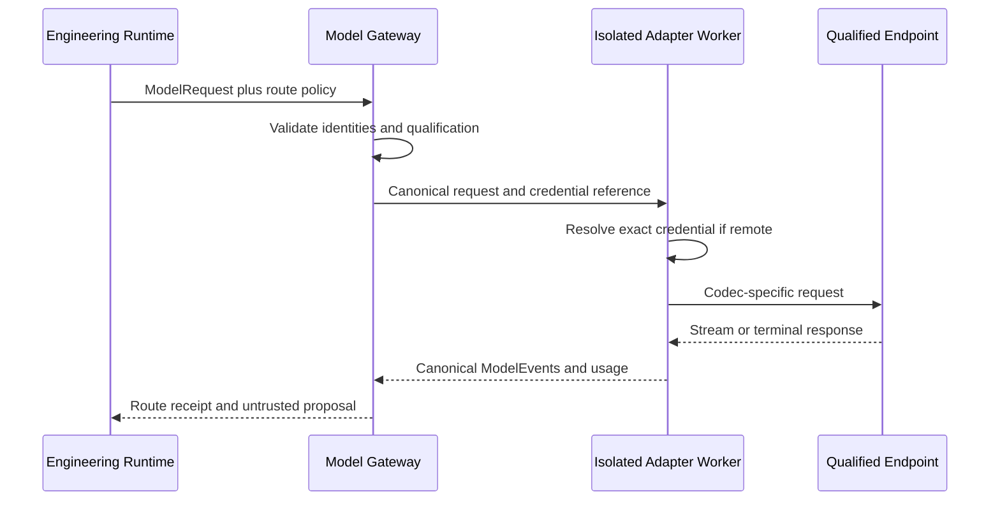

# AgentMage Model Gateway

| Field | Value |
|---|---|
| Status | Normative implementation specification; contract-tested codecs and host ports, no enabled model or endpoint |
| Decision | 0044 as mandatorily superseded by 0045 |
| Model admission authority | `MODEL-PROVENANCE-POLICY.md` |
| Runtime authority | `ENGINEERING-RUNTIME.md` |
| Security authority | `SECURITY-REVIEW.md` and `TRUSTED-OPERATIONS.md` |

Current product lifecycle: `scaffolded`.
Current integrated workflow: none.
Current enabled models: none.
Current supported platforms: none.
Stabilization scope freeze: inactive.

## 1. Purpose

The Model Gateway provides one candidate-neutral boundary between AgentMage
workflows and qualified inference routes. It normalizes requests, events,
structured output, tool proposals, usage, failures, cancellation, and health
without reducing the internal contract to any vendor wire protocol.

The gateway does not execute tools, mint grants, resolve task completion, or
choose its own authority. It returns untrusted model proposals to the Rust
Engineering Runtime.

## 2. Current Truth

The repository has model profile, request, stream, proposal, result, route,
endpoint, and candidate-admission contracts; deterministic codecs for Ollama,
OpenAI Chat, OpenAI Responses, Anthropic Messages, TGI, SGLang, Ray Serve, and
KServe; a separately guarded native local controller; and host composition
ports that keep credential values inside an injected transport boundary. Route
verification rejects endpoint, protocol, host, model, request, redirect, proxy,
and TLS substitution. Automatic fallback remains disabled.

No model is enabled, no live endpoint is supported, no concrete remote HTTP
transport is installed, and no local or remote route is product-qualified.
Historical Gemma candidates remain rejected and Muse-first evaluation remains
planned. Codec and hostile-fixture success is not live qualification.

## 3. Identity Separation

The following identities are independent and hash-bound:

| Identity | Meaning |
|---|---|
| Model profile | Artifact, publisher, lineage, license, tokenizer, template, codec, quantization, context, decoding, capabilities, and evaluation |
| Runtime adapter | Executable or service implementation, build, platform, transport, and resource behavior |
| Protocol codec | Translation between the canonical contract and one external protocol and version |
| Endpoint profile | Operator, deployment, URI reference, TLS and network policy, authentication reference, region, retention, logging, and quotas |
| Route profile | Exact model, runtime, codec, endpoint, policy, role, disclosure, limits, and qualification tuple |

The endpoint operator may differ from the model publisher. Open weights do not
establish an open-source license. A protocol-compatible server does not become
qualified merely because it accepts a familiar request shape.

## 4. Profile Taxonomy

### 4.1 `strict_local`

- Inference runs on the same device through an admitted local runtime.
- No network is required for operation after separately governed acquisition.
- No remote credential, account, disclosure, region, or cost policy is needed.
- This remains a complete target configuration and the default fallback state
  is none.

### 4.2 `local_network_private`

- Inference runs on an explicitly identified private-network endpoint.
- Exact host, address, transport, TLS or mutually authenticated TLS policy,
  network zone, operator, and route disclosure are required.
- The route is remote from the process even when operated by the same user.

### 4.3 `remote_private`

- Inference runs on a private deployment outside the local network, including a
  private cloud or dedicated hosted environment.
- Endpoint, region, residency, retention, logging, training-use, credential,
  quota, cost, TLS, proxy, redirect, allowlist, and emergency-disable controls
  are mandatory.

### 4.4 `remote_managed`

- Inference runs through an explicitly admitted managed service.
- Service operator terms, data controls, account and tenant identity, region,
  retention, logging, training use, quota, cost, availability, and incident
  behavior are part of route qualification.
- Managed compatibility does not weaken AgentMage's tool, authority, evidence,
  or completion boundaries.

## 5. Canonical Protocol

The internal protocol includes:

- Request, correlation, session, task, turn, and route identity;
- Content-addressed context and artifact references;
- Message parts and modality declarations;
- Tool schemas as proposal constraints, never direct tool channels;
- Structured-output and reasoning-control requests;
- Stream sequence, usage, warnings, and terminal event;
- Cancellation and deadline identity;
- Typed transport, protocol, policy, quota, resource, and model failures;
- Route decision, qualification, disclosure, and fallback receipt.

OpenAI-compatible, Anthropic-compatible, Ollama-native, llama.cpp-native, or
other APIs are codecs at the boundary. They do not define the internal model.

## 6. Adapter Families

Planned adapter evaluation may include:

- llama.cpp native server;
- Ollama;
- LM Studio;
- vLLM;
- SGLang;
- Hugging Face Text Generation Inference;
- Ray Serve LLM;
- KServe generative inference;
- OpenAI Responses-compatible services;
- Anthropic Messages-compatible services.

This list is an evaluation inventory, not a support matrix. Each adapter must
declare supported operations, message parts, streaming semantics, structured
output, tool proposal format, token accounting, cancellation, usage, errors,
health, concurrency, and version behavior. Unsupported operations fail
explicitly.

## 7. Routing

Route selection is deterministic over:

- User-selected profile and allowed profile classes;
- Data classification and disclosure policy;
- Required role and qualified capabilities;
- Context, modality, structured-output, and tool-proposal needs;
- Endpoint and route health;
- Latency, throughput, queue, memory, and accelerator ceilings;
- Token, request, quota, and cost ceilings;
- Platform and runtime availability;
- Current qualification and emergency disablement.

The route decision records considered routes, exclusions, selected route,
reason, disclosure class, limits, policy identity, and qualification digest.
Models and endpoints cannot select or alter the route.

## 8. Fallback

Fallback is disabled by default. A permitted fallback requires:

1. A predeclared ordered fallback policy;
2. Current qualification for the same workflow role;
3. Data authorization that independently permits the destination;
4. Equivalent or stricter tool, authority, and verification policy;
5. A fresh route decision and route receipt;
6. User-visible destination and disclosure;
7. Separate cost and resource ceilings.

Local-to-remote fallback and remote-to-different-remote fallback never occur
silently. Failure to find an admitted route produces a terminal blocked or
unavailable result, not an improvised destination.

## 9. Remote Inference Security

The remote-inference worker is isolated from workspace and tool authority. It
receives only the minimized classified context, exact endpoint profile,
credential reference, route identity, and transport limits required for one
request.

Required controls include:

- HTTPS for every non-loopback route;
- TLS identity verification and mutually authenticated TLS where policy
  requires it;
- Exact host and address policy with DNS rebinding and address-class checks;
- Deny-first redirects, explicit proxy policy, and SSRF resistance;
- Credential references resolved only inside the exact worker;
- No credential, private endpoint value, or raw secret in model context, logs,
  traces, receipts, source control, or error excerpts;
- Bounded request and response bytes, tokens, time, retries, concurrency,
  redirects, connections, quota, and cost;
- Region, residency, retention, logging, and training-use disclosure;
- Cancellation, process cleanup, circuit breaker, and emergency disablement;
- No remote failure that weakens classification, authority, verification, or
  strict-local policy.

## 10. Qualification

### 10.1 Model qualification

Model qualification binds exact artifact, publisher, lineage, observed license,
tokenizer, template, codec, quantization, context, decoding, runtime, hardware,
role corpus, quality, safety, malformed-output, prompt-injection, tool-proposal,
latency, resource, cancellation, and repeatability results. Capabilities are
measured rather than trusted from labels.

### 10.2 Endpoint qualification

Endpoint qualification verifies operator, deployment identity, protocol and
version, TLS, authentication, host policy, redirect and proxy behavior, health,
streaming, cancellation, token and usage accounting, error mapping, concurrency,
queue behavior, limits, region, retention, logging, training use, and incident
disablement.

### 10.3 Route qualification

Route qualification runs the same workflow and model contract through the exact
model, runtime, codec, endpoint, and policy tuple. It tests context fidelity,
message parts, structured output, tool proposals, event ordering, usage,
cancellation, failures, disclosure, cost, verifier behavior, and removal.

Any material identity change invalidates only the safely identified dependent
evidence; uncertain dependency reach triggers broader requalification.

## 11. Streaming, Cancellation, Health, and Performance

Adapters emit ordered canonical events with bounded buffering and backpressure.
Unknown external event types are retained as explicit unsupported or diagnostic
events and cannot be interpreted as completion. Cancellation carries exact
request identity, has a bounded acknowledgement deadline, terminates owned
work, and returns a terminal event.

Health is observational. It can remove a route from consideration but cannot
grant authority, change data policy, or choose fallback. Circuit breakers are
route-scoped, visible, bounded, and manually or deterministically recoverable.

Remote inference does not automatically reduce latency. Qualification records
connection, queue, upload, first-event, first-token, generation, download,
cancellation, and complete workflow time plus throughput and resource use.

## 12. External Compatibility API

An optional local compatibility listener may translate an admitted subset of an
OpenAI-compatible client API into the canonical gateway protocol. It must be
explicitly enabled, authenticated or safely loopback-bound, versioned, bounded,
and unable to expose AgentMage tools or authority. Unsupported fields and
semantic gaps fail visibly. Compatibility is not a claim of full vendor API
parity.

## 13. Degradation and Removal

Adapter, endpoint, or route loss produces an explicit unavailable, degraded, or
blocked state according to workflow criticality. Optional loss cannot be hidden
as success. Removing a remote profile revokes its routes, stops workers,
expires credentials and grants, reconciles in-flight requests, applies
retention, clears caches and registrations, and proves strict-local operation
still works.

## 14. Roadmap Placement

Gateway construction is assigned to Stories 13.5, 13.6, 49.2, 123.2, and 124.2. Integrated
qualification and release reconciliation are assigned to Stories 125.3 and 126.2. The local
gateway foundation also participates in Stories 22.5 and 50.4. No planning placement enables an
endpoint, route, fallback, model, platform, or support claim.

## 15. Primary Technical References

The compatibility inventory was checked on 2026-08-22 against official primary
documentation for [llama.cpp](https://github.com/ggml-org/llama.cpp),
[Ollama's API](https://docs.ollama.com/api/introduction),
[Ollama OpenAI compatibility](https://docs.ollama.com/api/openai-compatibility),
[LM Studio REST APIs](https://lmstudio.ai/docs/developer/rest),
[LM Studio OpenAI compatibility](https://lmstudio.ai/docs/developer/openai-compat),
[SGLang OpenAI APIs](https://docs.sglang.io/docs/basic_usage/openai_api_completions),
[Hugging Face TGI APIs](https://huggingface.co/docs/text-generation-inference/reference/api_reference),
[Ray Serve LLM APIs](https://docs.ray.io/en/latest/serve/llm/api.html),
[KServe generative inference](https://kserve.github.io/website/docs/model-serving/generative-inference/overview),
[OpenAI streaming Responses](https://platform.openai.com/docs/guides/streaming-responses),
and [Anthropic Messages streaming](https://platform.claude.com/docs/en/build-with-claude/streaming).
Compatibility details remain version-sensitive and require pinned live
qualification before support.
