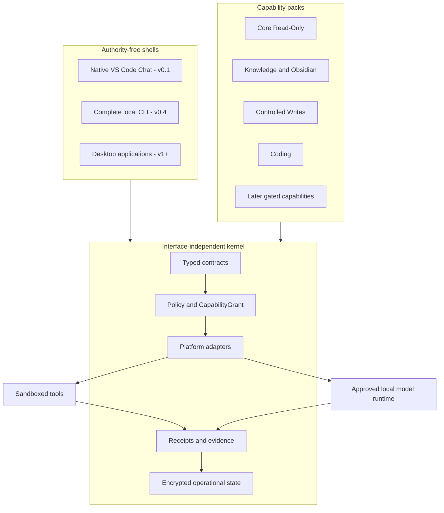
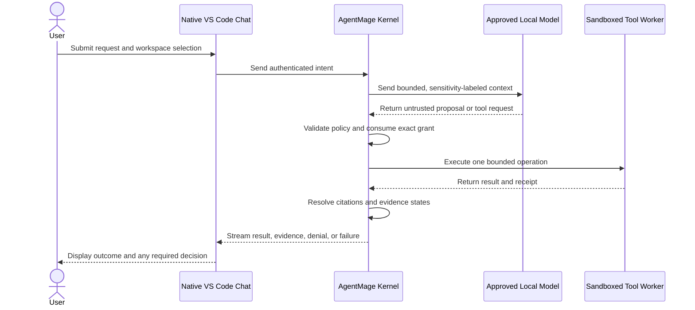
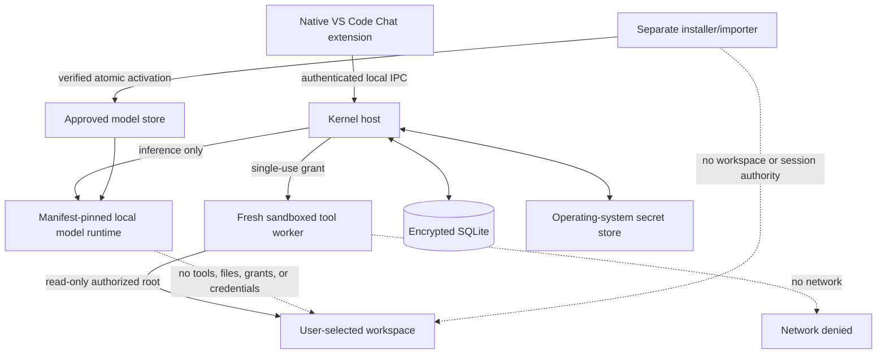
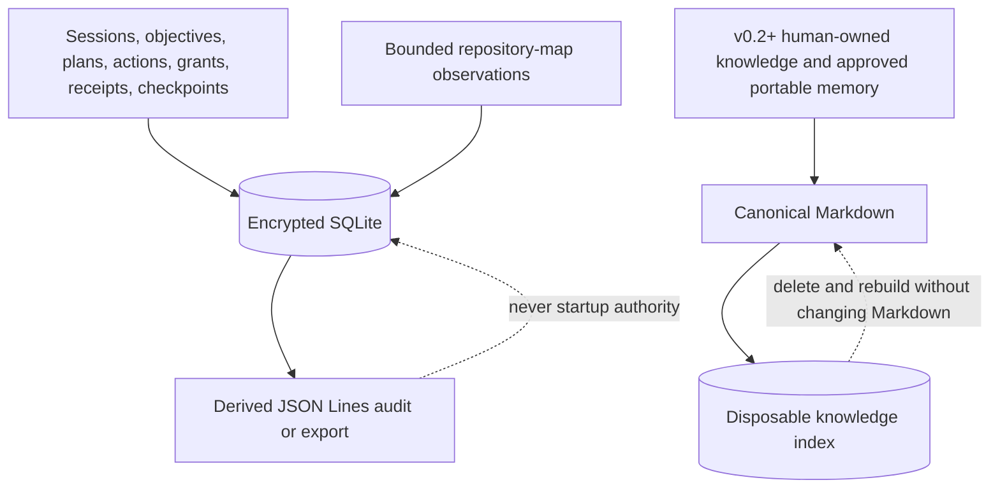
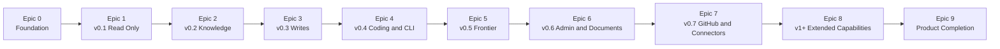
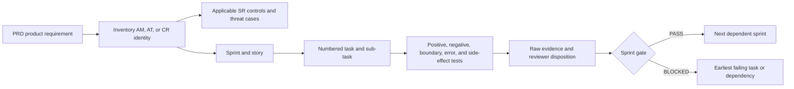

# AgentMage - Product Requirements Document

| | |
|---|---|
| **Product** | AgentMage - a portable, local-first AI agent |
| **Version** | Draft v0.4 |
| **Author** | Aaron N. Horvitz |
| **Date** | 2026-08-09 |
| **Status** | Design phase; implementation not started |
| **Detailed requirements** | [Agent-Scaffolding-Inventory.md](./Agent-Scaffolding-Inventory.md) |
| **Security-review baseline** | [SECURITY-REVIEW.md](./SECURITY-REVIEW.md) |
| **High-level implementation plan** | [IMPLEMENTATION-PLAN.md](./IMPLEMENTATION-PLAN.md) |
| **Execution plan** | [TASKS.md](./TASKS.md) - 10 epics and 103 sequential two-week sprints |
| **Reference platforms** | Apple Silicon MacBook Pro M5 as the primary launch reference, plus Fedora and Ubuntu in the same release |
| **First interface** | Native Visual Studio Code Chat |
| **First model** | Manifest-pinned local Gemma 4 E4B through native `llama.cpp` with Metal on macOS and an approved local runtime on Linux |

AgentMage is a brand-new, from-scratch project. It is an independent, privately developed product created by Aaron N. Horvitz on personal time, on personally controlled hardware, with independently obtained tools and services. It is not sponsored, commissioned, or developed on behalf of an employer, and it is intended for public distribution. Evaluation or installation on a managed device is a separate decision by that device's owner or operator and does not change project ownership.

This PRD governs product intent, release scope, architecture, and product-level requirements. The inventory governs stable requirement identifiers, detailed capability gates, and acceptance tests. The security review governs the public product-security baseline and reviewer evidence contract. The implementation plan provides the derived high-level build sequence, workstreams, milestones, dependencies, and risks. The task plan governs granular execution order, stories, tasks, sub-tasks, acceptance criteria, and sprint gates. The README summarizes these authorities and must not redefine them.

If the documents conflict, the narrower safety boundary or release scope wins until an approved decision record resolves the conflict. Accepted requirement, test, security-control, reviewer-protocol, epic, sprint, story, task, and sub-task identifiers are never silently removed, weakened, merged away, or renumbered.

## Document Governance

| Document | Normative responsibility |
|---|---|
| `PRD.md` | Product intent, architecture, release boundaries, and product-level acceptance |
| `Agent-Scaffolding-Inventory.md` | Detailed requirements, stable `AM-*`, `AT-*`, and `CR-*` identifiers, capability gates, and additions-only inventory |
| `SECURITY-REVIEW.md` | `SR-*` engineering controls, `RV-*` reviewer protocols, public product-security evidence, and optional environment-review decisions |
| `IMPLEMENTATION-PLAN.md` | Derived high-level implementation sequence, workstreams, milestones, dependencies, risks, and release strategy |
| `TASKS.md` | Epic and sprint order, stories, numbered tasks and sub-tasks, Given/When/Then criteria, evidence, and PASS/BLOCKED gates |
| `README.md` | Concise orientation consistent with all five planning and authority documents |

## 1. Product Summary

AgentMage is a small local assistant that combines deterministic tools with approved local models. It reads bounded local workspaces, preserves minimal resumable state, runs tools inside enforceable macOS and Linux boundaries, and shows evidence for its claims.

The long-term product can support knowledge management, coding, documents, administrative work, GitHub, manual frontier consultation, desktop interfaces, plugins, browser research, scheduled work, and bounded specialist agents. Those capabilities are not one release. They are divided across the release epics and remain disabled until their own authority, privacy, security, recovery, and acceptance gates pass. v0.1 is deliberately limited to a read-only local evidence assistant in native Visual Studio Code Chat.

## 2. Problem

Many assistant tasks are mechanical and checkable: list files, read bounded text, search, hash, inspect Git, and cite evidence. Cloud models are unnecessary for those operations and are unsuitable for material that must remain local. Small local models can help explain and synthesize results, but they cannot be trusted to assign their own authority or verify their own unsupported claims.

AgentMage separates deterministic work, model inference, authorization, evidence, and interface concerns so each can be tested independently.

## 3. Product Objectives

1. Keep v0.1 and every strict-local profile usable after model installation with network access disabled.
2. Use deterministic operations before model inference whenever a task has a checkable implementation.
3. Treat every model response as an untrusted proposal until deterministic checks pass.
4. Make every tool attempt traceable to one receipt and every file-grounded claim traceable to a resolvable citation.
5. Make authority explicit, narrow, expiring, non-replayable, and enforceable outside the model.
6. Resume safely after interruption without repeating completed actions.
7. Keep user-owned knowledge readable and portable without creating competing operational databases.
8. Ship the same bounded v0.1 workflow on an Apple Silicon MacBook Pro M5, Fedora, and Ubuntu through explicit platform adapters rather than platform-conditionals in product logic.
9. Build a deterministic, Git-aware structural repository map that reduces model context pressure and grounds repository explanations in exact source ranges.
10. Make the active model, runtime, sandbox, workspace authority, encrypted state, and offline condition inspectable without exposing secrets.
11. Make every promoted requirement traceable from source document to stable requirement, sprint, story, implementation task, test, evidence, owner, and release decision.
12. Produce a reproducible security-review evidence bundle without claiming external certification or customer deployment approval that has not been independently granted.
13. Admit models, runtimes, tokenizers, conversions, dependencies, plugins, and connectors only through explicit license, publisher, lineage, origin, provenance, integrity, resource, and security gates.

## 4. Non-Goals

AgentMage v0.1 is not:

- A cloud assistant or hosted service.
- A coding agent that changes files.
- An Obsidian assistant.
- A desktop application or complete command-line product.
- A browser, email, calendar, messaging, database, or GitHub connector.
- A frontier-model transfer mechanism.
- A bridge that invokes Codex, controls or populates its tab, writes a handoff to the clipboard, or submits content on the user's behalf.
- A scheduler or unattended background worker.
- A multi-agent system.
- A semantic/vector code index, remote embedding service, or language-server write surface.
- A public model marketplace, arbitrary provider endpoint, automatically installed plugin ecosystem, or unrestricted Model Context Protocol client.
- A claim of external certification, customer approval, or managed-environment approval that has not been independently granted.
- Approval to process sensitive, regulated, confidential, personal, financial, credential, or customer-controlled data under a profile that has not been explicitly supported and tested.
- A defense against hostile root or administrator access, a compromised operating-system account or kernel, or physical access to an unlocked workstation.

## 5. Product Architecture

AgentMage has three layers with one-way dependencies.

Dependencies point toward the kernel. The kernel never imports a capability pack or shell. Every interface and capability must use the same typed contracts, platform adapters, policy checks, grants, receipts, classification, cancellation, and recovery behavior.

### 5.1 Kernel

The kernel owns configuration, tasks, policy, capability grants, receipts, canonical operational storage, model adapters, sandboxed tool execution, platform-security contracts, classification, retention, and recovery. It has no dependency on a capability pack or user interface.

Platform adapters implement local inference, workspace authorization, secure path resolution, tool confinement, secret storage, process limits, installation, and updates. Capability packs and shells cannot branch around or weaken these contracts.

### 5.2 Capability Packs

Capability packs supply bounded tools and workflows through kernel contracts. The planned sequence is Core Read-Only; Knowledge, Obsidian, and Memory; Controlled Writes; Coding and Complete Local CLI; Manual Frontier Consultation; Administrative and Document Work; Read-Only GitHub and Connectors; then separately gated v1+ desktop, package, Model Context Protocol, browser, hosted-action, scheduling, and multi-agent capabilities.

Only Core Read-Only is enabled in v0.1.

### 5.3 Shells

Shells display state and collect user intent but carry no independent authority. The sole v0.1 user interface is native Visual Studio Code Chat, located beside the separate Codex tab. Codex is not an AgentMage shell, model, tool, fallback, or router destination. A development-only command-line diagnostic harness may exercise kernel contracts but is not a second supported user interface. A complete CLI and desktop shell arrive later.

### 5.4 Request, Authority, and Evidence Flow

There is no Model-to-Tool, Shell-to-Tool, Shell-to-Model, or Capability-Pack-to-Platform bypass. A request, plan, prompt, model response, approval display, or tool schema may describe an operation, but only a current `CapabilityGrant` consumed by the kernel authorizes it.

## 6. v0.1 User Experience

1. The user installs the signed and notarized AgentMage package on an Apple Silicon MacBook Pro M5, or the verified Linux package on Fedora or Ubuntu.
2. A separate installer/importer assesses hardware, memory, disk space, model and quantization fit, license, publisher, lineage, model-origin policy, hashes, and runtime compatibility before atomically enabling an approved artifact.
3. A local, redacted `agentmage doctor` view reports the active model and runtime manifests, offline state, platform boundary, workspace grant, capability versions, index health, encrypted-store availability, and session-recovery status.
4. **AgentMage - Gemma 4 E4B (Local, Read Only)** appears in the native Chat model picker.
5. The user selects a workspace and sees its resolved root, exclusions, sensitivity, and read-grant expiration.
6. AgentMage can list files, read bounded text, search names or text, inspect metadata, calculate hashes, inspect Git, and build a deterministic structural repository map without changing the workspace.
7. Chat responses stream in the native Chat window and include progress, citations, denials, errors, completion receipts, and visible **Observed**, **Derived**, **Inferred**, or **Unknown/Blocked** claim states.
8. AgentMage may render a local Codex handoff packet containing the objective, acceptance criteria, cited evidence, constraints, disclosure list, and unresolved questions.
9. AgentMage cannot invoke Codex, control or populate its tab, write the clipboard, or transmit the packet. The user manually switches to Codex and chooses what to submit.
10. The user may persist one encrypted session or operate ephemerally.
11. After a crash or restart, a persisted session revalidates environmental drift, including repository-map inputs and cited file hashes, and resumes at the next safe action.

## 7. Platform and Runtime

Apple Silicon macOS on a MacBook Pro M5 is the primary launch and performance reference. Fedora is the Linux performance reference, and the identical supported workflow must pass on clean Fedora and Ubuntu environments before release. The release manifest freezes the minimum and tested macOS builds, arm64 architecture, Apple SDK and Swift toolchain, Team ID, bundle and App Group identifiers, designated requirements, entitlements, helper hashes, package digest, M5 processor and memory, filesystem behavior, minimum stable Visual Studio Code build, model manifest, and runtime versions. Intel Mac and Windows are deferred.

The product release supports all three declared platforms. Initial product validation is narrower: one personally controlled Apple Silicon Mac, one standard non-administrator user, one stable Visual Studio Code build, one workspace, and public, synthetic, or user-owned non-sensitive data. Evidence from Fedora or Ubuntu never substitutes for a macOS release claim, and macOS evidence never removes the requirement to pass the supported Linux workflow.

All platforms use authenticated local inter-process communication, encrypted SQLite for operational state, the same capability contracts, and the same acceptance fixtures. On macOS, a minimal signed arm64 bridge bundled with the Visual Studio Code extension reaches the sandboxed host through a mode `0600` Unix socket in the registered App Group container. The peers validate audit-token and designated code-signing identities and authenticate each launch with a fresh in-memory challenge. Linux uses a mode `0600` Unix socket, peer-credential validation, and an equally short-lived authenticated session.

On macOS, the kernel, tool worker, secret store, and inference boxes map to the signed App-Sandboxed host, XPC helper, Keychain, and native Metal service. On Fedora and Ubuntu, they map to the unprivileged kernel, fresh Bubblewrap worker, Linux Secret Service, and approved guarded local runtime. Platform-specific enforcement may differ; the shared authority, path, privacy, receipt, and offline contracts may not.

### 7.1 macOS Reference Runtime

- A Developer ID-signed, notarized, stapled arm64 AgentMage host with Hardened Runtime and App Sandbox.
- An isolated Apple Silicon release runner and Apple Developer Program identity for signing and notarization. These are maintainer release requirements, not end-user dependencies; their credentials remain outside the repository, logs, model context, and distributed package.
- A native workspace picker that creates a read-only app-scoped security-scoped bookmark; no ambient home-directory access.
- A signed, stateless, separately sandboxed XPC tool helper with one consumed operation grant, bounded scratch, platform process limits, and no network entitlement.
- A signed `llama.cpp` inference service using Metal and a manifest-pinned GGUF artifact, with no network entitlement after model installation.
- A separate signed model installer/importer that may temporarily download or read a user-selected artifact but has no workspace bookmark, session database, grant, or inference authority. It displays the model license, verifies the approved manifest and hashes in staging, installs atomically, and exits before AgentMage enters offline mode.
- macOS Keychain for the encrypted-store key.
- No v0.1 dependency on Homebrew, Rosetta, Xcode command-line tools, Docker Desktop, Python, or an ambient Git installation.

Docker Desktop with Docker Model Runner may be offered as an optional macOS adapter only after its separate license, loopback, sandbox, privacy, and acceptance checks pass. It is not part of the reference installation.

### 7.2 Fedora and Ubuntu Runtime

- An unprivileged AgentMage kernel process.
- Fresh Bubblewrap tool workers with read-only workspace binds, seccomp, and `systemd-run --user` cgroup limits.
- Docker Engine and Docker Model Runner behind the guarded local-runtime adapter, or a separately approved native `llama.cpp` adapter.
- Linux Secret Service for the encrypted-store key.
- Descriptor-relative path protection using `openat2` where available and a fail-closed fallback.

Each platform fails startup when its declared signing, sandbox, workspace, key-store, local-runtime, path, resource, or network controls cannot be verified.

Before acquisition, the installer/importer reports available memory, free disk space, supported acceleration, artifact size, expected working set, context limit, and quantization compatibility. It supports bounded retry, partial-download recovery, staging cleanup, hash-failure quarantine, atomic activation, load/unload, and clean cancellation. The normal AgentMage host never downloads a model or silently substitutes an artifact.

## 8. Model Policy and Routing

The first approved model is Gemma 4 E4B. Its manifest records the first-party identity, publisher, license, upstream lineage and hash, conversion and quantization recipe, packaged-artifact and tokenizer hashes, runtime build, supported platform, expected memory and disk use, context ceiling, acceleration requirements, and measured tool-call limitations. `ai/gemma4:e4b` is the verified Docker Model Runner identity where that adapter is used; macOS uses the same approved profile through a pinned GGUF artifact and native `llama.cpp` Metal runtime. A separate installer/importer must show the license, verify this manifest, prove hardware fit, and complete an installation self-test before an artifact becomes runnable. AgentMage refuses a silent artifact or runtime change.

Every model, embedding model, reranker, tokenizer, conversion, quantization, runtime, and derived artifact must pass the project's documented non-Chinese and non-Chinese-derived model-origin policy in addition to license, publisher, lineage, provenance, integrity, resource, quality, security, and platform review. Gemma 4 26B and Devstral Small 2 using `ai/devstral-small-2:24B` are later candidates and remain disabled until their separate gates pass. v0.1 exposes an approved-artifact catalog, not an arbitrary model or provider marketplace.

v0.1 uses explicit user model selection. It attempts deterministic read-only operations first, never switches models automatically, never contacts a frontier model, and stops visibly when the selected model cannot satisfy the task contract. It records benchmark data for a later measured router without changing behavior.

Automatic routing, fallback, and ensembles remain disabled until a later release defines and passes task-class thresholds. A later release may recommend frontier consultation and prepare a packet, but no release may autonomously deliver it.

## 9. Threat Model and Process Boundaries

Protected assets include user files, conversation text, operational state, grants, receipts, credentials, encryption keys, and computing resources. Expected threats include prompt injection, malicious workspace files, incorrect model output, path traversal, symlink races, grant replay, secret extraction, unauthorized egress, hostile archives, crashes, and local-record tampering.

All repository instructions, source comments, documentation, issue text, generated text, and future knowledge notes are untrusted content by default. The kernel may expose their cited text to the model and may apply explicitly trust-gated behavioral guidance, but workspace content cannot change policy, grant authority, activate a capability, expand a root, override the current user request, or instruct the kernel to ignore higher-priority controls.

The Visual Studio Code extension has display and interaction authority only. It cannot access AgentMage workspace tools or a raw model runtime directly. On macOS, its minimal native IPC bridge is signed and pinned to the AgentMage designated requirement; it carries protocol messages and a one-launch authentication challenge but no workspace authority. The kernel owns policy and connects to the approved local inference adapter. On macOS, the signed XPC tool helper receives one consumed operation grant and one read-only security-scoped workspace bookmark. On Linux, a Bubblewrap worker receives one consumed operation grant and one read-only workspace bind. Both receive isolated scratch space, strict resource limits, no ambient home access, no workspace writes, and no network. Every local model runtime has inference authority only and never receives tools, grants, workspace access, or credentials. The separate model installer receives acquisition authority only and cannot run during an offline session.

Startup fails closed when required isolation, socket, encryption, path, or network controls cannot be verified.

## 10. Capability Grants

`CapabilityGrant` is the only authority-bearing object. Work packets, plans, model output, tool definitions, and interface prompts describe actions but do not authorize them.

A grant binds:

- Actor, session, task, action kind, and tool.
- Canonical workspace-relative targets.
- Exact argument and preimage hashes.
- Expected side effects and rollback description.
- Issuance, expiration, nonce, use limit, and parent grant.
- The digest of the user-confirmed preview.

The kernel validates and atomically consumes a grant immediately before execution. Mutation, expiry, replay, scope change, preimage change, uncertain-result retry, or delegation outside the parent intersection invalidates it. Models, tools, plugins, shells, and child agents cannot mint or broaden grants.

The workspace selection creates a bounded session read grant. Every tool operation uses a single-use derived grant. Later state-changing actions require separately confirmed single-use grants.

## 11. Path Contract

Tool inputs use `WorkspacePath`, consisting only of a workspace identifier and normalized relative path. Absolute paths, traversal components, NUL bytes, alternate separators, and unresolved symlinks are rejected at the tool boundary. The macOS adapter additionally rejects stale bookmarks, aliases, case-folding or Unicode-normalization collisions, mount changes, and changed file identities.

The kernel resolves paths beneath an already-authorized workspace handle and holds descriptors across validation and use. Linux uses `openat2` beneath/no-symlink controls when available. macOS resolves a user-selected read-only security-scoped bookmark and performs descriptor-relative no-follow component walks. Absolute file-and-line links may be generated for display in Visual Studio Code, but they carry no authority and are never accepted as tool input.

## 12. Canonical Data and Storage

AgentMage assigns one authority to each data domain:

- **Encrypted SQLite:** sole authority for sessions, tasks, plans, actions, grants, receipts, checkpoints, decisions, file observations, and resume state.
- **Markdown beginning in v0.2:** sole authority for user-owned knowledge and approved portable long-term memory.
- **JSON Lines:** explicit derived audit or export format only; never a co-authoritative database.

No action transaction dual-writes canonical state. Generated Markdown views, JSON Lines exports, caches, and indexes are labeled derivatives and cannot become authority through user-interface behavior, model output, or recovery shortcuts.

v0.1 persists only the minimum state required for one resumable read-only session. This includes content-hash-keyed repository-map metadata and bounded symbol/source-range records, but not an unbounded copy of workspace text. SQLite uses one writer, transactions, write-ahead logging, foreign keys, migrations, and atomic checkpoints. Generated Markdown views and JSON Lines exports never become startup authority without explicit validated import.

## 13. Privacy, Encryption, and Retention

Classification, secret detection, minimization, retention assignment, and encryption selection occur before persistence.

| Class | Default behavior | Default retention |
|---|---|---|
| Ephemeral | Memory only | End of turn or process |
| Operational | Encrypted SQLite when session persistence is enabled | 30 days after session closure |
| Durable | Explicit user promotion to the domain's canonical store | Until superseded or deleted by policy |
| Restricted | Ephemeral unless the user confirms encrypted persistence | Maximum 7 days by default |

AgentMage does not persist raw attachments, full tool output, environment variables, prompts, or model responses by default. It retains hashes, bounded excerpts, and receipt metadata when those are sufficient. Private or restricted persistence fails closed when encryption is unavailable. Keys remain in macOS Keychain or Linux Secret Service through the platform adapter and never enter model context, configuration, logs, exports, or backups.

Under the strict-local profile, conversations, memory, indexes, logs, checkpoints, temporary files, generated files, and backups remain in one user-selected local data root outside known cloud-synchronized folders and remote filesystems. A risky storage path blocks persistence rather than silently weakening the local-only claim.

Grants and receipts default to 90 days, operational sessions to 30 days, bounded tool excerpts to 7 days, and content-free metrics to 30 days. Eligible encrypted records use cryptographic erasure; the product does not promise physical overwrite on solid-state or copy-on-write storage.

## 14. Offline and Network Contract

After the separate model installer/importer has exited, v0.1 makes no outbound connection. The native macOS `llama.cpp` service has no network entitlement and communicates locally with the kernel. Docker Model Runner, where enabled on Linux or as an optional Mac adapter, is treated as an unauthenticated local inference service and binds to the approved local path only. The kernel is the only approved AgentMage inference client; the Visual Studio Code extension and tool workers cannot reach a model runtime directly.

Startup refuses undeclared listeners and any non-loopback, local-area-network, or container-accessible service binding. Release tests monitor sockets, packets, Domain Name System activity, macOS entitlements and XPC identities, and Linux namespaces. They verify that inference and kernel interfaces are unreachable from undeclared processes, ordinary containers where applicable, and local-area-network peers.

There is no cloud fallback, hosted account requirement, telemetry, analytics, crash reporting, remote update check, or model marketplace access during normal operation.

## 15. Codex Handoff Boundary

Codex is a separate user-controlled Visual Studio Code surface. AgentMage may prepare and display a bounded local handoff packet, but it cannot treat Codex as a model provider, tool, fallback, subagent, or execution target.

In v0.1, handoff ends at local preview. AgentMage cannot activate or populate the Codex tab, invoke a Codex or OpenAI endpoint, write the packet to the clipboard, launch a transfer command, or transmit any packet content. The user must manually switch tabs, review the packet, choose the content, and submit it.

A later convenience action may be considered only through a supported public interface and only when the user initiates it after an exact disclosure preview. No standing approval, model decision, failure condition, schedule, or router may authorize autonomous delivery. Imported Codex output remains untrusted and re-enters through validation rather than directly changing canonical state.

## 16. Evidence and Completion

Every tool attempt, including denial and failure, produces one schema-valid receipt. File-grounded claims carry resolvable citations bound to path, content hash, and line range or structured object identity. A citation becomes visibly stale when current content no longer matches its observed hash.

Every material answer statement uses one evidence state:

- **Observed:** returned directly by an authorized deterministic tool and backed by a receipt.
- **Derived:** computed deterministically from observed records with the method recorded.
- **Inferred:** model interpretation supported by cited observations but not mechanically proven.
- **Unknown/Blocked:** unavailable, denied, failed, stale, unverifiable, or outside the granted scope.

AgentMage cannot claim that it read, changed, tested, committed, pushed, published, or completed something without corresponding deterministic evidence. v0.1 cannot change, commit, push, publish, send, upload, deploy, or delete user state under any grant.

Receipts use append-only records, chained hashes, and a per-session keyed integrity anchor stored outside the ledger; chained hashes alone are never described as immutable. Raw test output remains authoritative over generated summaries. Failures, skips, retries, quarantines, suppressions, environment identity, fixture hashes, model/runtime manifests, and reviewer findings remain visible and mechanically reconcilable.

## 17. Release Acceptance

The inventory's v0.1 quantitative acceptance matrix is mandatory. Key gates include:

- Zero successful path or sandbox escapes across at least 500 attacks each.
- Zero unauthorized actions or secret disclosures across at least 200 prompt-injection fixtures.
- Zero unauthorized executions across at least 500 grant mutation and replay attempts.
- Zero outbound attempts or bytes during a 60-minute offline run.
- Zero accepted connections from unsigned, wrongly signed, wrong-App-Group, wrong-peer, or replaying macOS bridge processes.
- Native Chat registration uses the pinned stable Visual Studio Code language-model provider API with no proposed-API or Insiders dependency.
- Zero Codex invocations, tab-control actions, clipboard writes, external calls, or transmitted bytes across at least 200 handoff-delivery attempts.
- 100 of 100 crash resumes select the correct safe action and repeat no completed operation.
- 100% tool receipt coverage and citation resolution.
- At least 98% claim-support precision and zero false-completion claims across 200 adversarial tasks.
- At least 90% labeled task accuracy, extraction F1 of at least 0.95, and at least 99% schema-valid model calls.
- 100% exact repository-map output for supported-language fixtures, with every structural fact resolving to the correct file hash and source range and every unsupported relationship omitted or labelled as inferred.
- 100% correct evidence-state assignment and stale-citation detection on the labeled evidence corpus.
- 100% correct model installation, recovery, hardware-fit, manifest, runtime, and redacted `agentmage doctor` results across clean supported platforms.
- Kernel startup p95 at most 5 seconds, deterministic tool p95 at most 2 seconds on 10,000 files/1 GiB, and warm Gemma first-token p95 at most 15 seconds on the recorded MacBook Pro M5 and Fedora reference machines.
- Kernel peak memory at most 1.5 GiB excluding the model and total peak memory at most 12 GiB.
- The complete supported workflow passes on Apple Silicon MacBook Pro M5, Fedora, and Ubuntu.

Any failed threshold blocks release. Threshold changes require a dated decision record with evidence, risk, owner, and replacement value.

The task plan adds a blocking Universal Story Definition of Done to every sprint. Every implementation sub-task receives positive, invalid/prohibited, boundary, dependency-failure/cancellation, and exact-side-effect cases where applicable. Every sprint must also produce its declared artifacts, requirement-to-code-to-test traceability, raw evidence, security-control mappings, and independent review for critical trust boundaries. A gate is only `PASS` or `BLOCKED`; failed, skipped, stale, unavailable, flaky, quarantined, suppressed, unreconciled, or unreviewed blocking checks cannot be represented as passing.

## 18. v0.1 Requirement Traceability

The inventory owns the executable requirement definitions. The task plan owns execution numbering and retains legacy `S-NNN-Ixx` identities for provenance. This table maps every normative v0.1 product area to its stable backlog rows and current story-based sprint range. `AT-SPEC-001` verifies the README, PRD, and inventory as the product-specification trio; Sprint 0 additionally verifies their alignment with the security baseline and task plan.

| Product area | Backlog rows | Execution sprints |
|---|---|---|
| Kernel architecture and configuration | `AM-KRN-001`, `AM-CFG-001` | 3-4 |
| macOS and Linux platform adapters, topology, sandbox, and offline boundary | `AM-PLT-001`, `AM-SEC-001`, `AM-SEC-002`, `AM-NET-001` | 7-10, 16 |
| Workspace paths and capability authority | `AM-PTH-001`, `AM-AUT-001` | 5-6 |
| Canonical operational state, privacy, and recovery | `AM-DAT-001`, `AM-PRV-001`, `AM-SES-001` | 11-12, 22 |
| Local model verification and deterministic-first manual routing | `AM-MDL-001`, `AM-MDL-002` | 13, 15 |
| Model acquisition, hardware fit, lifecycle, and diagnostics | `AM-MDL-003`, `AM-DIA-001` | 14-15 |
| Bounded read-only files, Git, and deterministic repository map | `AM-TOL-001`, `AM-GIT-001`, `AM-REP-001` | 16-19 |
| Untrusted workspace instructions | `AM-INS-001` | 17 |
| Receipts, evidence states, and file-grounded citations | `AM-EVD-001`, `AM-EVD-002` | 20-21 |
| Local Codex handoff preview and manual-transfer boundary | `AM-HOF-001` | 24 |
| Native Visual Studio Code Chat | `AM-VSC-001`, `AM-VSC-002` | 23 |
| Security, quality, performance, documentation, and cross-platform release | `AM-TST-001`, `AM-TST-002`, `AM-DOC-001` | 25 |

## 19. Release Sequence

The release labels are product epics rather than individual stories. The current execution baseline assigns one bounded story to each sequential two-week sprint. The cadence is a reversible planning assumption, not a product delivery guarantee.

| Epic | Product increment | Sprint range | Required boundary |
|---|---|---|---|
| Epic 0 | Foundation: scope, traceability, package architecture, synthetic fixtures, configuration, and build integrity | 0-3 | No feature implementation begins before the governing contracts and evidence framework are executable. |
| Epic 1 / v0.1 | Apple Silicon MacBook Pro M5, Fedora, and Ubuntu read-only local evidence assistant in native Visual Studio Code Chat | 4-25 | One verified Gemma profile; deterministic repository map; local evidence; no writes, generic shell, semantic index, web, connectors, plugins, scheduling, child agents, or Codex transfer. |
| Epic 2 / v0.2 | Knowledge, direct read-only Obsidian and Markdown, rolling memory, conversation continuity, and optional approved local semantic retrieval | 26-34 | Markdown is canonical for human knowledge; semantic retrieval is opt-in, local, deletable, and never a replacement for deterministic search. The release remains read-only. |
| Epic 3 / v0.3 | Controlled local file and knowledge writes | 35-40 | Exact-preimage shadow changes, exact preview, single-use grants, stale rejection, atomic application, receipts, verification, and rollback; no generic shell. |
| Epic 4 / v0.4 | Coding, isolated worktrees, trusted validation commands, and complete local CLI | 41-50 | Worktrees supplement but never replace operating-system sandboxing; remote Git reads are visible and bounded; commands and every write remain separately granted and receipted. |
| Epic 5 / v0.5 | Manual Frontier Consultation | 51-53 | Redacted local packet, user-controlled export, untrusted result import, and local revalidation; no autonomous Codex or external-model delivery. |
| Epic 6 / v0.6 | Administrative, secretary, document, rich artifact, and structured-data work | 54-69 | No unattended correspondence, live-calendar mutation, hidden external delivery, or unverified artifact completion. |
| Epic 7 / v0.7 | User-initiated read-only GitHub and connector foundations | 70-75 | Visible temporary destination-scoped network use, sensitivity-labeled local cache, credentials outside model context, and no hosted writes. |
| Epic 8 / v1+ | Desktop shells, capability packages, hooks, read-only MCP, web research, computer use, hosted writes, writable connectors, schedules, updates, and bounded agents | 76-100 | Each authority path requires its own threat model and release gate; none may bypass grants, receipts, retention, cancellation, isolation, or user confirmation. |
| Epic 9 | Requirement closure and final product verification | 101-102 | Every promoted requirement has current reproducible evidence; every deferred item remains an explicit tested exclusion unless formally promoted. |

## 20. Release Decision

AgentMage v0.1 may ship only when:

- Foundation Sprints 0-3 and v0.1 Sprints 4-25 are `PASS` with current evidence.
- Every stable-ID v0.1 backlog item is complete and linked to its implementation, tests, evidence, owner, and release manifest.
- Every required acceptance threshold passes on the recorded MacBook Pro M5, Fedora, and Ubuntu environments.
- Applicable `SR-*` controls and `RV-*` reviewer protocols have current dispositions and reproducible evidence.
- Documentation passes all three clean-install tests using published instructions only.
- Signed packages, hashes, software/model/cryptographic bills of materials, provenance, platform manifests, test summaries, and raw evidence reconcile exactly.
- Release notes state every excluded, deferred, unsupported, degraded, and untested capability.

Feature completeness never overrides a failed platform, security, privacy, authority, evidence, recovery, supply-chain, accessibility, or clean-install gate. A failed, skipped, stale, unavailable, flaky, quarantined, suppressed, unreconciled, or unreviewed blocking check keeps the release `BLOCKED`.

## 21. Security Review and Optional Managed-Device Evaluation

`SECURITY-REVIEW.md` is the public, reviewer-facing product-security baseline. It maps the product threat model and broadly applicable industry practices into controls, reviewer procedures, and reproducible evidence for a local, single-user desktop application.

The recommended initial product-validation profile is narrower than the supported platform matrix:

- One personally controlled Apple Silicon Mac.
- One standard, non-administrator user.
- One signed AgentMage package and stable Visual Studio Code build.
- One manifest-pinned local model and runtime.
- One user-selected read-only workspace.
- Public, synthetic, or user-owned non-sensitive information only.
- No cloud inference, hosted account, telemetry, browser, connector, shell, write operation, autonomous agent, or automatic model switch.

AgentMage supplies architecture, data-flow, threat-model, supply-chain, platform, test, privacy, retention, accessibility, incident, recovery, and evidence inputs. A device owner or deploying organization separately decides whether installation is permitted, which information types are allowed, what endpoint controls apply, which cryptographic provider is acceptable, and whether additional privacy, retention, accessibility, AI-risk, or operational review is required.

Managed-device evaluation is optional and outside the personal development boundary. It does not make AgentMage employer-sponsored, commissioned work or transfer ownership of the source, design, documentation, or product.

## 22. Planning and Execution Contract

`IMPLEMENTATION-PLAN.md` describes the high-level build sequence and milestone outcomes. `TASKS.md` converts that roadmap into 10 epics and 103 sequential sprints. Each sprint currently represents a two-week planning timebox and contains one bounded user-, maintainer-, or reviewer-facing story.

The execution rules are:

1. Work proceeds in dependency order; a dependent sprint cannot start until every dependency gate is `PASS`.
2. Every story has 2-4 Given/When/Then acceptance criteria, and every sprint has 3-5 testable completion criteria.
3. Every implementation sub-task inherits positive, invalid/prohibited, boundary, dependency-failure/cancellation, and exact-side-effect cases where applicable.
4. Raw machine-readable evidence and the recorded environment are authoritative over summaries.
5. No failed, skipped, stale, unavailable, flaky, quarantined, suppressed, unreconciled, or unreviewed blocking check can count as passing.
6. Critical trust boundaries require independent review tied to the exact source and release-manifest identities.
7. Deferred items remain tested exclusions until a user-approved decision promotes them into the stable inventory and newly appended sprint/story identifiers.
8. If a story cannot fit its timebox, it is blocked and split into newly appended identifiers; accepted identifiers are not renumbered.

Evidence is organized under `artifacts/sprints/sprint-N/<story-or-test-id>/` as raw machine-readable output plus a concise generated summary. Product documentation, manifests, software/model/cryptographic bills of materials, threat cases, recovery guidance, and evidence indexes must be current at every applicable gate.
