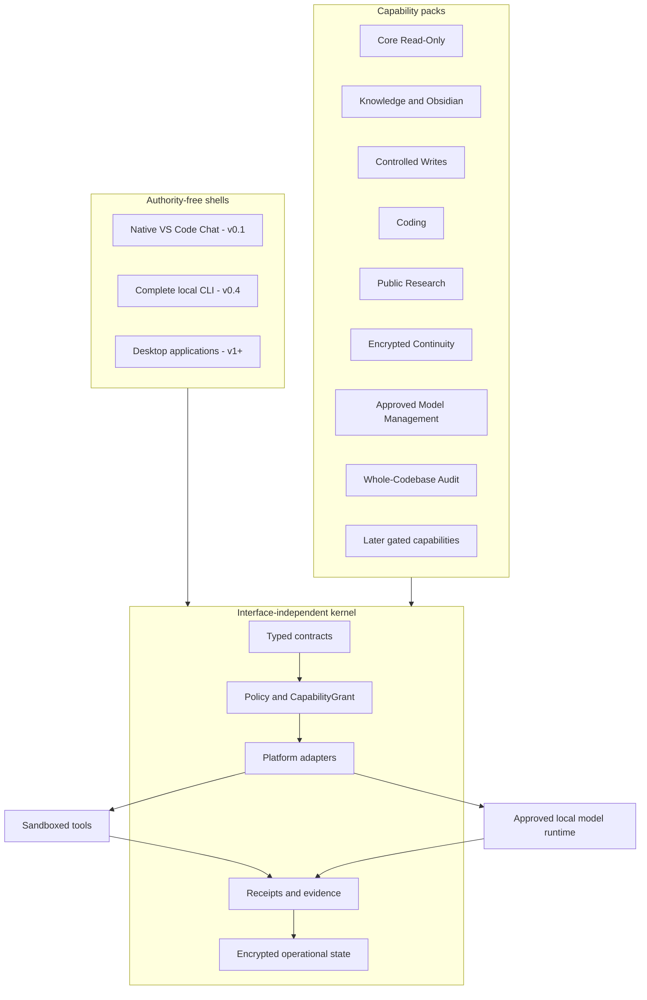
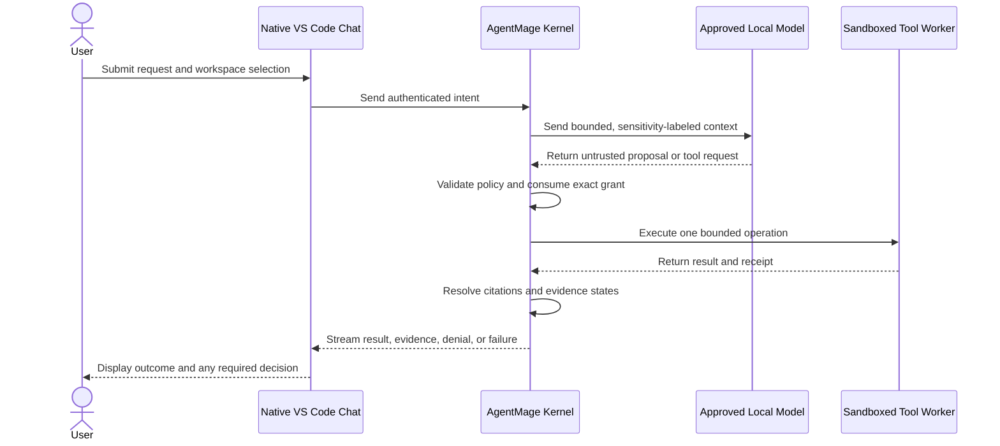
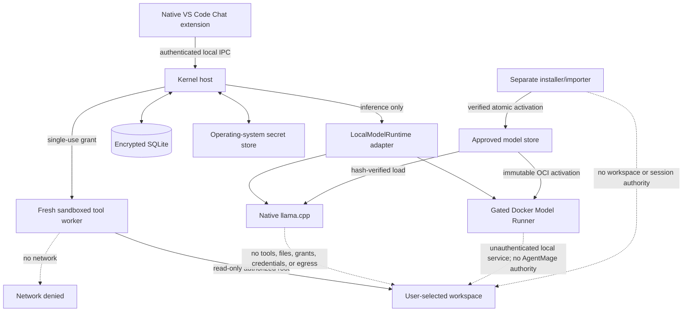
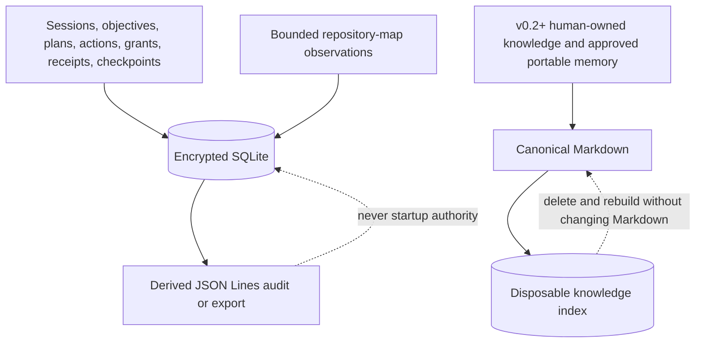
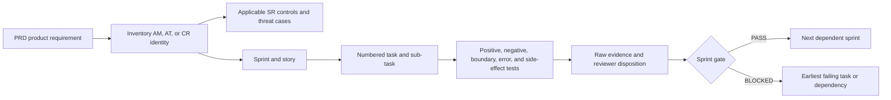

# AgentMage - Product Requirements Document

| | |
|---|---|
| **Product** | AgentMage - a portable, local-first AI agent |
| **Version** | Draft v0.7 |
| **Author** | Aaron N. Horvitz |
| **Date** | 2026-08-11 |
| **Status** | Pre-alpha scaffold; stabilization closed and numbered roadmap resumed under Decision 0021; no integrated end-user workflow or supported binary |
| **Detailed requirements** | [Agent-Scaffolding-Inventory.md](./Agent-Scaffolding-Inventory.md) |
| **Security-review baseline** | [SECURITY-REVIEW.md](./SECURITY-REVIEW.md) |
| **High-level implementation plan** | [IMPLEMENTATION-PLAN.md](./IMPLEMENTATION-PLAN.md) |
| **Execution plan** | [TASKS.md](./TASKS.md) - 17 epics and 169 sequential dependency gates |
| **First-GA reference platforms** | Fedora, Ubuntu, and Windows 11 x64; Apple Silicon MacBook Pro M5 retained post-GA |
| **First interface target** | Native Visual Studio Code Chat |
| **Current enabled model** | None; evaluated Gemma 4 E4B and Gemma 4 12B Unified candidates are rejected and disabled |
| **License** | Apache License 2.0 |

AgentMage is a brand-new, from-scratch project. It is an independent, privately developed product created by Aaron N. Horvitz on personal time, on personally controlled hardware, with independently obtained tools and services. It is not sponsored, commissioned, or developed on behalf of an employer, and it is intended for public distribution. Evaluation or installation on a managed device is a separate decision by that device's owner or operator and does not change project ownership.

This PRD governs product intent, release scope, architecture, and product-level requirements. The inventory governs stable requirement identifiers, detailed capability gates, and acceptance tests. The security review governs the public product-security baseline and reviewer evidence contract. The implementation plan provides the derived high-level build sequence, workstreams, milestones, dependencies, and risks. The task plan governs granular execution order, stories, tasks, sub-tasks, acceptance criteria, and sprint gates. The README summarizes these authorities and must not redefine them. Supporting model, disclosure, runtime, delivery, productivity, trusted-operations, whole-codebase audit, Windows, and decision documents implement these authorities and cannot weaken them.

If the documents conflict, the narrower safety boundary or release scope wins until an approved decision record resolves the conflict. Accepted requirement, test, security-control, reviewer-protocol, epic, sprint, story, task, and sub-task identifiers are never silently removed, weakened, merged away, or renumbered.

## Current Implementation Truth

Current product lifecycle: `scaffolded`.

Current integrated workflow: none.

Current enabled models: none.

Current supported platforms: none.

Stabilization scope freeze: inactive.

This PRD specifies the accepted target product; it does not claim that the
target is currently available. The current state is governed by
[`Decision 0012`](./docs/decisions/0012-stabilization-truth-and-status-model.md)
and [`architecture/status-model.json`](./architecture/status-model.json). The
17 epics, 169 sprints, and 227 stable requirements remain accepted and
unchanged. [`Decision 0021`](./docs/decisions/0021-stabilization-resumption.md)
records the user's acceptance of the stabilization residuals and authorizes
execution to resume at the first incomplete dependency gate. It does not close
the remaining release, platform, security, or evidence blockers.

The accepted Phase 9 candidate under
[`Decision 0018`](./docs/decisions/0018-linux-vscode-read-and-receipt.md)
implements one source-level approved Linux file read through a registered
Visual Studio Code provider, authenticated local protocol, exact-object worker,
citation, and durable receipt. It does not change the current integrated-workflow
or support fields: normal activation remains unavailable until Phase 11 provides
an independently signed package and trusted host bootstrap, and no model is
enabled.

Under [`Decision 0020`](./docs/decisions/0020-package-candidates-and-windows-increment.md),
the repository can now construct deterministic unsigned RPM, DEB, and VSIX
candidates and test their candidate lifecycles. This does not change the current
integrated-workflow or support fields: candidates fail signed-release mode, the
trusted packaged host bootstrap is not implemented, and Windows has only a
versioned fail-closed contract scaffold without native enforcement or evidence.
[`Decision 0022`](./docs/decisions/0022-detached-package-signing-boundary.md)
adds deterministic signable Linux bundles plus exact detached Ed25519 signing
and verification against an external trust root. The production signing
identity, independent trust-root distribution, OS-package signatures, and
trusted bootstrap remain blocked, so current workflow and support status do not
change.

## Document Governance

| Document | Normative responsibility |
|---|---|
| `PRD.md` | Product intent, architecture, release boundaries, and product-level acceptance |
| `Agent-Scaffolding-Inventory.md` | Detailed requirements, stable `AM-*`, `AT-*`, and `CR-*` identifiers, capability gates, and additions-only inventory |
| `SECURITY-REVIEW.md` | `SR-*` engineering controls, `RV-*` reviewer protocols, public product-security evidence, and optional environment-review decisions |
| `IMPLEMENTATION-PLAN.md` | Derived high-level implementation sequence, workstreams, milestones, dependencies, risks, and release strategy |
| `TASKS.md` | Epic and sprint order, stories, numbered tasks and sub-tasks, Given/When/Then criteria, evidence, and PASS/BLOCKED gates |
| `README.md` | Concise orientation consistent with all five planning and authority documents |
| `MODEL-PROVENANCE-POLICY.md` | Model-origin, lineage, license, artifact, runtime, quality, and fallback admission procedure under the inventory and security baseline |
| `SECURITY.md` | Public vulnerability reporting, supported-version, patch-delivery, emergency-disablement, and end-of-support policy |
| `RUNTIME-BOUNDARIES.md` | Derived trust-boundary, privilege, process, socket, lifecycle, and data-flow specification |
| `DELIVERY-SYSTEM.md` | Normative provider-neutral delivery graph, adapter, authority-class, operation, conformance, and support-matrix contract |
| `docs/security/repository-safety.md` | Normative Git and GitHub operation, preservation, process-hardening, authentication, and verification contract |
| `PRODUCTIVITY-SYSTEM.md` | Normative communications, personal-information, document, workflow, finance, and read-only cloud-observer architecture |
| `TRUSTED-OPERATIONS.md` | Normative command-authority, public-research, credential-broker, continuity, model-manager, and experimental-model architecture |
| `CODEBASE-AUDIT.md` | Normative whole-codebase census, structural, semantic, reconciliation, read-only, checkpoint, finding, and coverage architecture |
| `WINDOWS-BOUNDARIES.md` | Normative first-GA Windows package, process, path, IPC, key, sandbox, runtime, and verification contract |
| `architecture/status-model.json` | Machine-readable current lifecycle, verification, disposition, support, platform, model, and stabilization state under Decision 0012 |
| `docs/decisions/*.md` | Accepted clarifications and supersessions with rationale and verification; never authority to weaken a higher-ranked requirement silently |

Each document has an independent revision. A derived document's version number does not claim that the governing PRD has the same maturity; compatibility is established by recorded source versions and automated cross-document checks.

## 1. Product Summary

The target AgentMage product is a local-first software-development, delivery, productivity, research, continuity, and whole-codebase audit assistant that combines deterministic tools with approved local models. When implemented and enabled through its gates, it will read bounded local workspaces, preserve resumable state, run tools inside enforceable Linux and Windows boundaries, research current public information with citations, protect connected credentials, create encrypted continuity snapshots, audit repositories larger than model context with exact evidence and coverage, and show evidence for its claims. Apple Silicon macOS remains a retained post-GA platform lane.

The complete product adds knowledge management, coding, documents, administrative work, GitHub and GitHub Enterprise, work planning, CI/CD, artifacts, deployment, infrastructure, observability, incidents, security findings, service catalogs, releases, manual frontier consultation, plugins, browser research, scheduled work, and bounded specialist agents. These capabilities are divided across internal milestones and remain disabled until their own authority, privacy, security, recovery, and acceptance gates pass. v0.1 is deliberately limited to a read-only local evidence assistant in native Visual Studio Code Chat; under Decision 0008 it is an internal milestone, not the first supported public release.

## 2. Problem

Many assistant tasks are mechanical and checkable: list files, read bounded text, search, hash, inspect Git, and cite evidence. Cloud models are unnecessary for those operations and are unsuitable for material that must remain local. Small local models can help explain and synthesize results, but they cannot be trusted to assign their own authority or verify their own unsupported claims.

AgentMage separates deterministic work, model inference, authorization, evidence, and interface concerns so each can be tested independently.

## 3. Product Objectives

1. Keep v0.1 and every strict-local profile usable after model installation with network access disabled.
2. Use deterministic operations before model inference whenever a task has a checkable implementation.
3. Treat every model response as an untrusted proposal until deterministic checks pass.
4. Make every tool attempt traceable to one receipt and every file-grounded claim traceable to a resolvable citation.
5. Make authority explicit, narrow, expiring, non-replayable, and enforceable outside the model.
6. Resume safely after interruption without repeating completed actions.
7. Keep user-owned knowledge readable and portable without creating competing operational databases.
8. Ship the same bounded v1.0 GA workflow on Fedora, Ubuntu, and Windows 11 through explicit platform adapters rather than platform-conditionals in product logic, while retaining Apple Silicon macOS as separately evidenced post-GA work.
9. Build a deterministic, Git-aware structural repository map that reduces model context pressure and grounds repository explanations in exact source ranges.
10. Make the active model, runtime, sandbox, workspace authority, encrypted state, and offline condition inspectable without exposing secrets.
11. Make every promoted requirement traceable from source document to stable requirement, sprint, story, implementation task, test, evidence, owner, and release decision.
12. Produce a reproducible security-review evidence bundle without claiming external certification or customer deployment approval that has not been independently granted.
13. Admit models, runtimes, tokenizers, conversions, dependencies, plugins, and connectors only through explicit license, publisher, lineage, origin, provenance, integrity, resource, and security gates.
14. Represent software delivery through a provider-neutral graph and versioned adapter contract spanning source, work, CI, artifacts, deployment, infrastructure, observability, incidents, security, catalogs, and releases.
15. Keep read, draft, local write, remote write, execute, deploy, secrets, and administration as independent authority classes with exact previews, current preconditions, idempotency or reconciliation, verified postconditions, and receipts.
16. Publish an exact provider, host, version, object, operation, scope, limit, and degradation matrix so every completeness claim is bounded and reproducible.
17. Support inline and display LaTeX mathematics in Markdown authoring and rendering without allowing document content to execute code or broaden authority.
18. Support a fully capable command surface while making Disabled, Inspect, Workspace Autonomous, Connected Operations, and direct-user-activated Owner / Unrestricted Session authority explicit, intersected, expiring, visible, and auditable.
19. Research current public information with claim-level citations, retrieval and publication dates, source provenance, hostile-content isolation, and explicit controls over any private-data disclosure.
20. Store connected credentials through operating-system facilities and resolve one typed reference only inside the exact approved worker operation without exposing raw secrets to models, logs, diagnostics, exports, or backups.
21. Preserve work through immutable encrypted local snapshots and optional client-side-encrypted cloud backup without running canonical live state from cloud-synchronized storage or broadening Cloud Observer.
22. Let a nontechnical user ask Chat to compare, acquire, import, verify, activate, roll back, or remove approved local models through a deterministic, separately isolated model manager.
23. Keep user-selected unapproved model experimentation in a post-GA disposable lab with no connected, credential, command, or canonical-workspace-write authority and no automatic promotion.
24. Audit an entire declared codebase through complete path disposition, deterministic structure, coherent bounded semantic review, cross-module reconciliation, encrypted checkpoint resume, transitive invalidation, canonical read-only enforcement, calibrated findings, and explicit coverage and uncertainty.
25. Make repository mutation inaccessible to models and available only through exact adapter operations that preserve user and Git state, use isolated owned worktrees, bind authenticated host/repository/ref identities, create signed commits from temporary indexes, require a separate approval for one ordinary fast-forward push, and omit generic pull and destructive or implicit Git behavior.

## 4. Non-Goals

AgentMage v0.1 is not:

- A cloud assistant or hosted service.
- A coding agent that changes files.
- An Obsidian assistant.
- A desktop application or complete command-line product.
- A browser, email, calendar, messaging, database, or GitHub connector.
- A frontier-model transfer mechanism.
- A bridge that invokes Codex, controls or populates its tab, writes a handoff to the clipboard, or submits content on the user's behalf.
- A scheduler or unattended background worker.
- A multi-agent system.
- A semantic/vector code index, remote embedding service, or language-server write surface.
- A public model marketplace, arbitrary provider endpoint, automatically installed plugin ecosystem, or unrestricted Model Context Protocol client.
- A claim of external certification, customer approval, or managed-environment approval that has not been independently granted.
- Approval to process sensitive, regulated, confidential, personal, financial, credential, or customer-controlled data under a profile that has not been explicitly supported and tested.
- A defense against hostile root or administrator access, a compromised operating-system account or kernel, or physical access to an unlocked workstation.

## 5. Product Architecture

AgentMage has three layers with one-way dependencies.

Dependencies point toward the kernel. The kernel never imports a capability pack or shell. Every interface and capability must use the same typed contracts, platform adapters, policy checks, grants, receipts, classification, cancellation, and recovery behavior.

### 5.1 Kernel

The kernel owns configuration, tasks, policy, capability grants, receipts, canonical operational storage, model adapters, sandboxed tool execution, platform-security contracts, classification, retention, and recovery. It has no dependency on a capability pack or user interface.

Platform adapters implement local inference, workspace authorization, secure path resolution, tool confinement, secret storage, process limits, installation, and updates. Capability packs and shells cannot branch around or weaken these contracts.

### 5.2 Capability Packs

Capability packs supply bounded tools and workflows through kernel contracts. The planned sequence is Core Read-Only; Knowledge, Obsidian, and Memory; Controlled Writes; Coding and Complete Local CLI; Manual Frontier Consultation; Administrative and Document Work; Read-Only GitHub and Connectors; delivery, productivity, finance, and Cloud Observer; then the first-GA Public Research, Continuity, Credential Broker, Approved Model Management, and Whole-Codebase Audit capabilities. Desktop, package, Model Context Protocol, richer browser, hosted-action, scheduling, multi-agent, and experimental-model capabilities remain separately gated according to their recorded release.

Only Core Read-Only is enabled in v0.1.

### 5.3 Shells

Shells display state and collect user intent but carry no independent authority. The sole v0.1 user interface is native Visual Studio Code Chat, located beside the separate Codex tab. Codex is not an AgentMage shell, model, tool, fallback, or router destination. A development-only command-line diagnostic harness may exercise kernel contracts but is not a second supported user interface. A complete CLI and desktop shell arrive later.

### 5.4 Request, Authority, and Evidence Flow

There is no Model-to-Tool, Shell-to-Tool, Shell-to-Model, or Capability-Pack-to-Platform bypass. A request, plan, prompt, model response, approval display, or tool schema may describe an operation, but only a current `CapabilityGrant` consumed by the kernel authorizes it.

## 6. Target v0.1 User Experience

1. The user installs a verified Linux package on Fedora or Ubuntu. Windows 11 x64 belongs to the first-GA target set; Apple Silicon macOS remains a separately evidenced post-GA lane.
2. A separate installer/importer assesses hardware, memory, disk space, model and quantization fit, license, publisher, lineage, `MODEL-PROVENANCE-POLICY.md`, native artifact or immutable OCI hashes, and runtime compatibility before atomically enabling an approved artifact.
3. A local, redacted `agentmage doctor` response renders inside native Visual Studio Code Chat and reports the active model and runtime manifests, offline state, platform boundary, workspace grant, capability versions, index health, encrypted-store availability, and session-recovery status without requiring the deferred end-user CLI.
4. An admitted local read-only model profile appears in the native Chat model picker. No profile is currently enabled, and the rejected Gemma candidates are not offered.
5. The user selects a workspace and sees its resolved root, exclusions, sensitivity, and read-grant expiration.
6. AgentMage can list files, read bounded text, search names or text, inspect metadata, calculate hashes, inspect Git, and build a deterministic structural repository map without changing the workspace.
7. Chat responses stream in the native Chat window and include progress, citations, denials, errors, completion receipts, and visible **Observed**, **Derived**, **Inferred**, or **Unknown/Blocked** claim states.
8. AgentMage may render a local Codex handoff packet containing the objective, acceptance criteria, cited evidence, constraints, disclosure list, unresolved questions, classification status, and unresolved redaction warnings.
9. AgentMage cannot invoke Codex, control or populate its tab, write the clipboard, or transmit the packet. The preview explains that manual submission discloses selected content to a separate product under that product's policies; the user manually switches to Codex, resolves or accepts each warning, and chooses what to submit.
10. The user may persist one encrypted session or operate ephemerally.
11. After a crash or restart, a persisted session revalidates environmental drift, including repository-map inputs and cited file hashes, and resumes at the next safe action.

## 7. Platform and Runtime

For the retained internal-v0.1 Mac-inclusive lane, Apple Silicon macOS on a MacBook Pro M5 is the Mac performance reference and Fedora is the Linux performance reference. The lane's manifest freezes the minimum and tested macOS builds, arm64 architecture, Apple SDK and Swift toolchain, Team ID, bundle and App Group identifiers, designated requirements, entitlements, helper hashes, package digest, M5 processor and memory, filesystem behavior, minimum stable Visual Studio Code build, model manifest, and runtime versions. Intel Mac must remain deferred. Decision 0008 separately promotes Windows 11 x64 into first-GA scope.

The retained internal-v0.1 validation lane is narrower: one personally controlled Apple Silicon Mac, one standard non-administrator user, one stable Visual Studio Code build, one workspace, and public, synthetic, or user-owned non-sensitive data, plus an independently evidenced Fedora workflow. Evidence from Fedora or Ubuntu never substitutes for a macOS claim, and macOS evidence never removes the requirement to pass the supported Linux workflow. Sections 23 through 26 define the separate v1.0 GA delivery-system, Fedora, Ubuntu, and Windows release boundary.

Across supported and retained platform lanes, AgentMage uses authenticated local inter-process communication, encrypted SQLite for operational state, the same capability contracts, and the same acceptance fixtures. On macOS, a minimal signed arm64 bridge bundled with the Visual Studio Code extension reaches the sandboxed host through a mode `0600` Unix socket in the registered App Group container. The peers validate audit-token and designated code-signing identities and authenticate each launch with a fresh in-memory challenge. Linux uses a mode `0600` Unix socket, peer-credential validation, and an equally short-lived authenticated session. Windows uses a per-user named pipe, explicit access control, process-token and package-identity validation, and a fresh authenticated session under `WINDOWS-BOUNDARIES.md`.

On macOS, the kernel, tool worker, secret store, and inference boxes map to the signed App-Sandboxed host, XPC helper, Keychain, and native Metal service. On Fedora and Ubuntu, they map to the unprivileged AgentMage kernel, fresh Bubblewrap worker, Linux Secret Service, and either the native security-reference runtime or separately gated Docker compatibility runtime. On Windows, they map to the per-user kernel host, restricted worker process, DPAPI-protected key material, named-pipe bridge, and native security-reference runtime. Platform-specific enforcement may differ; the shared authority, path, privacy, receipt, and offline contracts may not. `RUNTIME-BOUNDARIES.md` gives the complete process, privilege, socket, lifecycle, and classified data-flow inventory.

### 7.1 macOS Reference Runtime

- A Developer ID-signed, notarized, stapled arm64 AgentMage host with Hardened Runtime and App Sandbox.
- An isolated Apple Silicon release runner and Apple Developer Program identity for signing and notarization. These are maintainer release requirements, not end-user dependencies; their credentials remain outside the repository, logs, model context, and distributed package.
- A native workspace picker that creates a read-only app-scoped security-scoped bookmark; no ambient home-directory access.
- A signed, stateless, separately sandboxed XPC tool helper with one consumed operation grant, bounded scratch, platform process limits, and no network entitlement.
- A signed `llama.cpp` inference service using Metal and a manifest-pinned GGUF artifact, with no network entitlement after model installation.
- A separate signed model installer/importer that may temporarily download or read a user-selected artifact but has no workspace bookmark, session database, grant, or inference authority. It displays the model license, verifies the approved manifest and hashes in staging, installs atomically, and exits before AgentMage enters offline mode.
- macOS Keychain for the encrypted-store key.
- No v0.1 dependency on Homebrew, Rosetta, Xcode command-line tools, Docker Desktop, Python, or an ambient Git installation.

Docker Desktop with Docker Model Runner may be offered as an optional macOS adapter only after its separate license, loopback, sandbox, privacy, and acceptance checks pass. It is not part of the reference installation.

### 7.2 Fedora and Ubuntu Runtime

- An unprivileged AgentMage kernel process.
- Fresh Bubblewrap tool workers with read-only workspace binds, seccomp, and `systemd-run --user` cgroup limits.
- Native `llama.cpp` as the security-reference adapter, installed and run in user-owned scope.
- Docker Engine with Docker Model Runner as a supported compatibility adapter behind the same `LocalModelRuntime` contract only after its immutable OCI, privilege, unauthenticated-endpoint, namespace, container, local-client, parity, and zero-egress gates pass.
- Linux Secret Service for the encrypted-store key.
- Descriptor-relative path protection using `openat2` where available and a fail-closed fallback.

Each platform and runtime profile fails startup when its declared signing, sandbox, workspace, key-store, local-runtime, path, privilege, socket, resource, or network controls cannot be verified. Installing Docker or operating-system dependencies remains a visible platform prerequisite and is never hidden inside AgentMage's installer.

Before acquisition, the installer/importer reports available memory, free disk space, supported acceleration, artifact size, expected working set, context limit, and quantization compatibility. It supports bounded retry, partial-download recovery, staging cleanup, hash-failure quarantine, atomic activation, load/unload, and clean cancellation. The normal AgentMage host never downloads a model or silently substitutes an artifact.

## 8. Model Policy and Routing

The first named candidate model is Gemma 4 E4B. Its current feasibility disposition is rejected and disabled, so it is not an enabled product model. Gemma 4 12B Unified is also rejected and disabled. Either candidate requires a new revision-bound admission and evaluation decision before activation. The target manifest records the first-party identity, publisher, Apache-2.0 license disposition, upstream lineage and hash, conversion and quantization recipe, packaged-artifact and tokenizer hashes, runtime build, supported platform, expected memory and disk use, context ceiling, acceleration requirements, and measured tool-call limitations. Docker's `ai/gemma4:e4b` name must resolve to an approved immutable OCI digest; native adapters use the same approved profile through a hash-pinned GGUF and supporting artifacts. A separate installer/importer must show the license, verify the manifest, prove hardware fit, and complete an installation self-test before an artifact becomes runnable. AgentMage refuses a silent artifact or runtime change.

Every model, embedding model, reranker, tokenizer, conversion, quantization, runtime, and derived artifact must pass `MODEL-PROVENANCE-POLICY.md`, including the documented non-Chinese and non-Chinese-derived model rule, in addition to license, publisher, lineage, provenance, integrity, resource, quality, security, and platform review. Gemma 4 12B Unified remains the named disabled fallback candidate, but its current rejected disposition prohibits activation or automatic substitution. Gemma 4 26B A4B and other later candidates remain disabled until their separate gates pass. v0.1 exposes an approved-artifact catalog, not an arbitrary model or provider marketplace.

Meta Muse Glimmer is a candidate only. AgentMage does not claim its open-source or open-weight
classification, exact license, supported artifact, lineage, runtime compatibility, hardware fit,
coding quality, tool behavior, or security state until verified first-party evidence and the normal
admission pipeline produce a complete disposition. A Muse non-pass does not block the Gemma-based
first-GA lane.

v0.1 uses explicit user model selection. It attempts deterministic read-only operations first, never switches models automatically, never contacts a frontier model, and stops visibly when the selected model cannot satisfy the task contract. It records benchmark data for a later measured router without changing behavior.

Automatic routing, fallback, and ensembles remain disabled until a later release defines and passes task-class thresholds. A later release may recommend frontier consultation and prepare a packet, but no release may autonomously deliver it.

## 9. Threat Model and Process Boundaries

Protected assets include user files, conversation text, operational state, grants, receipts, credentials, encryption keys, and computing resources. Expected threats include prompt injection, malicious workspace files, incorrect model output, path traversal, symlink races, grant replay, secret extraction, unauthorized egress, hostile archives, crashes, and local-record tampering.

All repository instructions, source comments, documentation, issue text, generated text, and future knowledge notes are untrusted content by default. The kernel may expose their cited text to the model and may apply explicitly trust-gated behavioral guidance, but workspace content cannot change policy, grant authority, activate a capability, expand a root, override the current user request, or instruct the kernel to ignore higher-priority controls.

The Visual Studio Code extension has display and interaction authority only. It cannot access AgentMage workspace tools or a raw model runtime directly. On macOS, its minimal native IPC bridge is signed and pinned to the AgentMage designated requirement; it carries protocol messages and a one-launch authentication challenge but no workspace authority. The kernel owns policy and connects through `LocalModelRuntime`. On macOS, the signed XPC tool helper receives one consumed operation grant and one read-only security-scoped workspace bookmark. On Linux, a Bubblewrap worker receives one consumed operation grant and one read-only workspace bind. Both receive isolated scratch space, strict resource limits, no ambient home access, no workspace writes, and no network. Every local model runtime has inference authority only and never receives tools, grants, workspace access, credentials, or AgentMage authority. Docker Model Runner's raw API is untrusted and cannot be exposed to the extension or tool workers. The separate model installer receives acquisition authority only and cannot run during an offline session.

Startup fails closed when required isolation, socket, encryption, path, or network controls cannot be verified.

## 10. Capability Grants

`CapabilityGrant` is the only authority-bearing object. Work packets, plans, model output, tool definitions, and interface prompts describe actions but do not authorize them.

A grant binds:

- Actor, session, task, action kind, and tool.
- Canonical workspace-relative targets.
- Exact argument and preimage hashes.
- Expected side effects and rollback description.
- Issuance, expiration, nonce, use limit, and parent grant.
- The digest of the user-confirmed preview.

The kernel validates and atomically consumes a grant immediately before execution. Mutation, expiry, replay, scope change, preimage change, uncertain-result retry, or delegation outside the parent intersection invalidates it. Models, tools, plugins, shells, and child agents cannot mint or broaden grants.

The workspace selection creates a bounded session read grant. Every tool operation uses a single-use derived grant. Later state-changing actions require separately confirmed single-use grants.

## 11. Path Contract

Tool inputs use `WorkspacePath`, consisting only of a workspace identifier and normalized relative path. Absolute paths, traversal components, NUL bytes, alternate separators, and unresolved symlinks are rejected at the tool boundary. The macOS adapter additionally rejects stale bookmarks, aliases, case-folding or Unicode-normalization collisions, mount changes, and changed file identities.

The kernel resolves paths beneath an already-authorized workspace handle and holds descriptors across validation and use. Linux uses `openat2` beneath/no-symlink controls when available. macOS resolves a user-selected read-only security-scoped bookmark and performs descriptor-relative no-follow component walks. Absolute file-and-line links may be generated for display in Visual Studio Code, but they carry no authority and are never accepted as tool input.

## 12. Canonical Data and Storage

AgentMage assigns one authority to each data domain:

- **Encrypted SQLite:** sole authority for sessions, tasks, plans, actions, grants, receipts, checkpoints, decisions, file observations, and resume state.
- **Markdown beginning in v0.2:** sole authority for user-owned knowledge and approved portable long-term memory.
- **JSON Lines:** explicit derived audit or export format only; never a co-authoritative database.

No action transaction dual-writes canonical state. Generated Markdown views, JSON Lines exports, caches, and indexes are labeled derivatives and cannot become authority through user-interface behavior, model output, or recovery shortcuts.

v0.1 persists only the minimum state required for one resumable read-only session. This includes content-hash-keyed repository-map metadata and bounded symbol/source-range records, but not an unbounded copy of workspace text. SQLite uses one writer, transactions, write-ahead logging, foreign keys, migrations, and atomic checkpoints. Generated Markdown views and JSON Lines exports never become startup authority without explicit validated import.

## 13. Privacy, Encryption, and Retention

Classification, secret detection, minimization, retention assignment, and encryption selection occur before persistence.

| Class | Default behavior | Default retention |
|---|---|---|
| Ephemeral | Memory only | End of turn or process |
| Operational | Encrypted SQLite when session persistence is enabled | 30 days after session closure |
| Durable | Explicit user promotion to the domain's canonical store | Until superseded or deleted by policy |
| Restricted | Ephemeral unless the user confirms encrypted persistence | Maximum 7 days by default |

AgentMage does not persist raw attachments, full tool output, environment variables, prompts, or model responses by default. It retains hashes, bounded excerpts, and receipt metadata when those are sufficient. Private or restricted persistence fails closed when encryption is unavailable. Keys remain in macOS Keychain or Linux Secret Service through the platform adapter and never enter model context, configuration, logs, exports, or backups.

Under the strict-local profile, conversations, memory, indexes, logs, checkpoints, temporary files, generated files, and backups remain in one user-selected local data root outside known cloud-synchronized folders and remote filesystems. A risky storage path blocks persistence rather than silently weakening the local-only claim.

Grants and receipts default to 90 days, operational sessions to 30 days, bounded tool excerpts to 7 days, and content-free metrics to 30 days. Eligible encrypted records use cryptographic erasure; the product does not promise physical overwrite on solid-state or copy-on-write storage.

## 14. Offline and Network Contract

After the separate model installer/importer has exited, v0.1 makes no outbound connection. Native `llama.cpp` communicates over private local IPC and has no network authority. Docker Model Runner, where enabled on Linux or as an optional Mac adapter, is treated as an unauthenticated local inference service and binds to the exact approved loopback endpoint only. Loopback is necessary but not sufficient: the Docker profile must prove its declared namespace, local-client, container, socket, and egress boundary. The kernel adapter is the only approved AgentMage inference client; the Visual Studio Code extension and tool workers cannot reach a model runtime directly.

Startup refuses undeclared listeners and any non-loopback, local-area-network, or container-accessible service binding. Release tests monitor sockets, packets, Domain Name System activity, macOS entitlements and XPC identities, and Linux namespaces. They verify that inference and kernel interfaces are unreachable from undeclared processes, ordinary containers where applicable, and local-area-network peers.

There is no cloud fallback, hosted account requirement, telemetry, analytics, crash reporting, remote update check, or model marketplace access during normal operation.

## 15. Codex Handoff Boundary

Codex is a separate user-controlled Visual Studio Code surface. AgentMage may prepare and display a bounded local handoff packet, but it cannot treat Codex as a model provider, tool, fallback, subagent, or execution target.

In v0.1, handoff ends at local preview. AgentMage cannot activate or populate the Codex tab, invoke a Codex or OpenAI endpoint, write the packet to the clipboard, launch a transfer command, or transmit any packet content. The preview labels classification, possible restricted content, unresolved redactions, included sources, and the separate destination boundary. The user must manually switch tabs, resolve or explicitly accept the warnings, choose the content, and submit it.

A later convenience action may be considered only through a supported public interface and only when the user initiates it after an exact disclosure preview. No standing approval, model decision, failure condition, schedule, or router may authorize autonomous delivery. Imported Codex output remains untrusted and re-enters through validation rather than directly changing canonical state.

## 16. Evidence and Completion

Every tool attempt, including denial and failure, produces one schema-valid receipt. File-grounded claims carry resolvable citations bound to path, content hash, and line range or structured object identity. A citation becomes visibly stale when current content no longer matches its observed hash.

Every material answer statement uses one evidence state:

- **Observed:** returned directly by an authorized deterministic tool and backed by a receipt.
- **Derived:** computed deterministically from observed records with the method recorded.
- **Inferred:** model interpretation supported by cited observations but not mechanically proven.
- **Unknown/Blocked:** unavailable, denied, failed, stale, unverifiable, or outside the granted scope.

AgentMage cannot claim that it read, changed, tested, committed, pushed, published, or completed something without corresponding deterministic evidence. v0.1 cannot change, commit, push, publish, send, upload, deploy, or delete user state under any grant.

Receipts use append-only records, chained hashes, and a per-session keyed integrity anchor stored outside the ledger; chained hashes alone are never described as immutable. Raw test output remains authoritative over generated summaries. Failures, skips, retries, quarantines, suppressions, environment identity, fixture hashes, model/runtime manifests, and reviewer findings remain visible and mechanically reconcilable.

## 17. Release Acceptance

The inventory's v0.1 quantitative acceptance matrix is mandatory. Key gates include:

- Zero successful path or sandbox escapes across at least 500 attacks each.
- Zero unauthorized actions or secret disclosures across at least 200 prompt-injection fixtures.
- Zero unauthorized executions across at least 500 grant mutation and replay attempts.
- Zero outbound attempts or bytes during a 60-minute offline run.
- Zero accepted connections from unsigned, wrongly signed, wrong-App-Group, wrong-peer, or replaying macOS bridge processes.
- Native Chat registration uses the pinned stable Visual Studio Code language-model provider API with no proposed-API or Insiders dependency.
- Zero Codex invocations, tab-control actions, clipboard writes, external calls, or transmitted bytes across at least 200 handoff-delivery attempts.
- 100 of 100 crash resumes select the correct safe action and repeat no completed operation.
- 100% tool receipt coverage and citation resolution.
- At least 98% claim-support precision and zero false-completion claims across 200 adversarial tasks.
- At least 90% labeled task accuracy, extraction F1 of at least 0.95, and at least 99% schema-valid model calls.
- 100% exact repository-map output for supported-language fixtures, with every structural fact resolving to the correct file hash and source range and every unsupported relationship omitted or labelled as inferred.
- 100% correct evidence-state assignment and stale-citation detection on the labeled evidence corpus.
- 100% correct model installation, recovery, hardware-fit, manifest, runtime, and redacted `agentmage doctor` results across clean supported platforms.
- 100% immutable model, tokenizer, template, GGUF, OCI, and runtime identity resolution plus behavioral parity across every enabled native or Docker adapter; one adapter's result never substitutes for another.
- Zero non-loopback Docker Model Runner exposure, zero access from prohibited clients or ordinary containers under the approved profile, and zero runtime acquisition or egress after installation.
- Kernel startup p95 at most 5 seconds, deterministic tool p95 at most 2 seconds on 10,000 files/1 GiB, and warm Gemma first-token p95 at most 15 seconds on the recorded MacBook Pro M5 and Fedora reference machines.
- Kernel peak memory at most 1.5 GiB excluding the model and total peak memory at most 12 GiB.
- The complete supported workflow passes on Apple Silicon MacBook Pro M5, Fedora, and Ubuntu.

Any failed threshold blocks release. Threshold changes require a dated decision record with evidence, risk, owner, and replacement value.

The task plan adds a blocking Universal Story Definition of Done to every sprint. Every implementation sub-task receives positive, invalid/prohibited, boundary, dependency-failure/cancellation, and exact-side-effect cases where applicable. Every sprint must also produce its declared artifacts, requirement-to-code-to-test traceability, raw evidence, security-control mappings, and independent review for critical trust boundaries. A gate is only `PASS` or `BLOCKED`; failed, skipped, stale, unavailable, flaky, quarantined, suppressed, unreconciled, or unreviewed blocking checks cannot be represented as passing.

## 18. v0.1 Requirement Traceability

The inventory owns the executable requirement definitions. The task plan owns execution numbering and retains legacy `S-NNN-Ixx` identities for provenance. This table maps every normative v0.1 product area to its stable backlog rows and current story-based sprint range. `AT-SPEC-001` verifies the README, PRD, and inventory as the product-specification trio; Sprint 0 additionally verifies their alignment with the security baseline and task plan.

| Product area | Backlog rows | Execution sprints |
|---|---|---|
| Kernel architecture and configuration | `AM-KRN-001`, `AM-CFG-001` | 3-4 |
| macOS and Linux platform adapters, topology, sandbox, and offline boundary | `AM-PLT-001`, `AM-SEC-001`, `AM-SEC-002`, `AM-NET-001` | 7-10, 16 |
| Workspace paths and capability authority | `AM-PTH-001`, `AM-AUT-001` | 5-6 |
| Canonical operational state, privacy, and recovery | `AM-DAT-001`, `AM-PRV-001`, `AM-SES-001` | 11-12, 22 |
| Local model verification and deterministic-first manual routing | `AM-MDL-001`, `AM-MDL-002` | 13, 15 |
| Model acquisition, hardware fit, lifecycle, and diagnostics | `AM-MDL-003`, `AM-DIA-001` | 14-15 |
| Bounded read-only files, Git, and deterministic repository map | `AM-TOL-001`, `AM-GIT-001`, `AM-REP-001` | 16-19 |
| Untrusted workspace instructions | `AM-INS-001` | 17 |
| Receipts, evidence states, and file-grounded citations | `AM-EVD-001`, `AM-EVD-002` | 20-21 |
| Local Codex handoff preview and manual-transfer boundary | `AM-HOF-001` | 24 |
| Native Visual Studio Code Chat | `AM-VSC-001`, `AM-VSC-002` | 23 |
| Security, quality, performance, documentation, and cross-platform release | `AM-TST-001`, `AM-TST-002`, `AM-DOC-001` | 25 |

## 19. Implementation Sequence

The v0.x labels are internal capability milestones rather than supported public releases. The execution baseline assigns one or more bounded stories to each sequential dependency gate only when their combined evidence remains reviewable. No calendar duration is implied; oversized work is split through an appended decision without renumbering accepted identifiers.

```mermaid
flowchart LR
    F["Epic 0<br/>Foundation"] --> R1["Epic 1<br/>v0.1 Read Only"]
    R1 --> R2["Epic 2<br/>v0.2 Knowledge"]
    R2 --> R3["Epic 3<br/>v0.3 Writes"]
    R3 --> R4["Epic 4<br/>v0.4 Coding and CLI"]
    R4 --> R5["Epic 5<br/>v0.5 Frontier"]
    R5 --> R6["Epic 6<br/>v0.6 Admin and Documents"]
    R6 --> R7["Epic 7<br/>v0.7 GitHub and Connectors"]
    R7 --> R8["Epic 8<br/>Extended Capabilities"]
    R8 --> C["Epic 9<br/>Inherited Scope Closure"]
    C --> D["Epic 10<br/>Delivery System and Windows"]
    D --> G["Epic 11<br/>v1.0 GA"]
```

| Epic | Product increment | Sprint range | Required boundary |
|---|---|---|---|
| Epic 0 | Foundation: scope, traceability, package architecture, synthetic fixtures, configuration, and build integrity | 0-3 | No feature implementation begins before the governing contracts and evidence framework are executable. |
| Epic 1 / v0.1 internal | Read-only local evidence-assistant foundation in native Visual Studio Code Chat | 4-25 | One verified Gemma profile; deterministic repository map; local evidence; no writes, generic shell, semantic index, web, connectors, plugins, scheduling, child agents, or Codex transfer. |
| Epic 2 / v0.2 | Knowledge, direct read-only Obsidian and Markdown, rolling memory, conversation continuity, and optional approved local semantic retrieval | 26-34 | Markdown is canonical for human knowledge; semantic retrieval is opt-in, local, deletable, and never a replacement for deterministic search. The release remains read-only. |
| Epic 3 / v0.3 | Controlled local file and knowledge writes | 35-40 | Exact-preimage shadow changes, exact preview, single-use grants, stale rejection, atomic application, receipts, verification, and rollback; no generic shell. |
| Epic 4 / v0.4 | Coding, isolated worktrees, trusted validation commands, and complete local CLI | 41-50 | Worktrees supplement but never replace operating-system sandboxing; remote Git reads are visible and bounded; commands and every write remain separately granted and receipted. |
| Epic 5 / v0.5 | Manual Frontier Consultation | 51-53 | Redacted local packet, user-controlled export, untrusted result import, and local revalidation; no autonomous Codex or external-model delivery. |
| Epic 6 / v0.6 | Administrative, secretary, document, rich artifact, and structured-data work | 54-69 | No unattended correspondence, live-calendar mutation, hidden external delivery, or unverified artifact completion. |
| Epic 7 / v0.7 internal | User-initiated read-only GitHub and connector foundations | 70-75 | Visible temporary destination-scoped network use, sensitivity-labeled local cache, credentials outside model context, and no hosted writes. |
| Epic 8 / inherited v1+ | Desktop shells, capability packages, hooks, read-only MCP, web research, computer use, hosted writes, writable connectors, schedules, updates, and bounded agents | 76-100 | Each authority path requires its own threat model and release gate; none may bypass grants, receipts, retention, cancellation, isolation, or user confirmation. |
| Epic 9 | Inherited-roadmap closure checkpoint | 101-102 | Preserves and reconciles all prior promoted requirements; Decision 0008 supersedes this as the final product gate. |
| Epic 10 | Provider-neutral delivery system and Windows 11 | 103-125 | Delivery graph, adapter conformance, full published GitHub/GHES matrix, planning/CI/artifact/deploy/observability/incident/security/catalog/release adapters, and complete Windows evidence. |
| Epic 11 | v1.0 GA verification | 126 | Every promoted first-GA requirement has current reproducible evidence on Fedora, Ubuntu, and Windows 11; every unsupported path has a passing denial or absence test. |

## 20. Internal Milestone Decision

The internal v0.1 milestone may close only when:

- Foundation Sprints 0-3 and v0.1 Sprints 4-25 are `PASS` with current evidence.
- Every stable-ID v0.1 backlog item is complete and linked to its implementation, tests, evidence, owner, and release manifest.
- Every required milestone threshold passes in its recorded platform lane. A missing MacBook Pro M5 result leaves the retained Mac lane `BLOCKED-MACOS` but does not block v1.0 GA under Decision 0008.
- Applicable `SR-*` controls and `RV-*` reviewer protocols have current dispositions and reproducible evidence.
- Documentation passes all three clean-install tests using published instructions only.
- Signed packages, hashes, software/model/cryptographic bills of materials, provenance, platform manifests, test summaries, and raw evidence reconcile exactly.
- Release notes state every excluded, deferred, unsupported, degraded, and untested capability.

Feature completeness never overrides a failed platform, security, privacy, authority, evidence, recovery, supply-chain, accessibility, or clean-install gate. A failed, skipped, stale, unavailable, flaky, quarantined, suppressed, unreconciled, or unreviewed blocking check keeps the applicable milestone or release `BLOCKED`.

## 21. Product Security Review and Optional Managed-Device Evaluation

`SECURITY-REVIEW.md` is the public, reviewer-facing product-security baseline. It maps the product threat model and broadly applicable industry practices into controls, reviewer procedures, and reproducible evidence for a local, single-user desktop application.

The recommended first-GA product-validation profile is narrower than the complete capability roadmap:

- One clean Fedora or Ubuntu standard-user environment and one clean Windows 11 x64 standard-user environment.
- One standard, non-administrator user.
- One signed platform package and stable Visual Studio Code build per tested environment.
- One manifest-pinned local model and runtime.
- One user-selected read-only workspace.
- Public, synthetic, or user-owned non-sensitive information only.
- Strict-local validation before any connected pack, followed by synthetic provider accounts and repositories for each promoted adapter.
- No cloud inference, product telemetry, hidden browser, ambient connector, autonomous external effect, or automatic model switch.

AgentMage supplies architecture, data-flow, threat-model, supply-chain, platform, test, privacy, retention, accessibility, incident, recovery, and evidence inputs. A device owner or deploying organization separately decides whether installation is permitted, which information types are allowed, what endpoint controls apply, which cryptographic provider is acceptable, and whether additional privacy, retention, accessibility, AI-risk, or operational review is required.

Managed-device evaluation is optional and outside the personal development boundary. It does not make AgentMage employer-sponsored, commissioned work or transfer ownership of the source, design, documentation, or product. Apple Silicon MacBook Pro M5 assessment remains a separate retained post-GA platform lane.

## 22. Planning and Execution Contract

`IMPLEMENTATION-PLAN.md` describes the high-level build sequence and milestone outcomes. `TASKS.md` converts that roadmap into 15 epics and 157 sequential dependency gates. A sprint is a dependency and evidence boundary rather than a calendar estimate. It contains one or more bounded user-, maintainer-, or reviewer-facing stories only when their combined gate remains reviewable. Decisions 0001, 0008, and 0009 record the additions-only evolution.

The execution rules are:

1. Work proceeds in dependency order; a dependent sprint cannot start until every dependency gate is `PASS`.
2. Every story has 2-4 Given/When/Then acceptance criteria, and every sprint has 3-5 testable completion criteria.
3. Every implementation sub-task inherits positive, invalid/prohibited, boundary, dependency-failure/cancellation, and exact-side-effect cases where applicable.
4. Raw machine-readable evidence and the recorded environment are authoritative over summaries.
5. No failed, skipped, stale, unavailable, flaky, quarantined, suppressed, unreconciled, or unreviewed blocking check can count as passing.
6. Critical trust boundaries require independent review tied to the exact source and release-manifest identities.
7. Deferred items remain tested exclusions until a user-approved decision promotes them into the stable inventory and newly appended sprint/story identifiers.
8. If a story cannot remain independently reviewable, it is blocked and split into newly appended identifiers; accepted identifiers are not renumbered.

Evidence is organized under `artifacts/sprints/sprint-N/<story-or-test-id>/` as raw machine-readable output plus a concise generated summary. Product documentation, manifests, software/model/cryptographic bills of materials, threat cases, recovery guidance, and evidence indexes must be current at every applicable gate.

## 23. v1.0 GA Delivery-System Scope

Decision 0008 establishes v1.0 GA as the first supported public release. The earlier v0.x scope and exclusions remain valid for their internal milestones but do not limit the GA product.

The first-GA delivery contract is defined in [`DELIVERY-SYSTEM.md`](./DELIVERY-SYSTEM.md). It includes:

- A provider-neutral delivery graph linking services, work items, changes, commits, reviews, builds, checks, artifacts, provenance, deployments, environments, telemetry, incidents, findings, releases, and rollback.
- A versioned adapter SDK and conformance suite with manifested provider, host, version, capability, scope, event, limit, degradation, and removal behavior.
- Full GitHub.com and user-approved GitHub Enterprise Server behavior within the shipped matrix, including local signed commits and separately approved pushes, issues, pull requests, reviews, workflows, checks, releases, and hosted mutations.
- The canonical repository-safety boundary: pre/post preservation manifests; exact namespaced fetch; owned worktrees and temporary indexes; pinned signer; one separately approved ordinary fast-forward task-branch push; short-lived host/account/repository-bound authentication; uncertain-effect reconciliation; and structural absence of generic pull, destructive or implicit Git, force, bypass, hook/filter execution, and arbitrary ref updates.
- Reference adapters for Jira, Azure DevOps, GitLab, Jenkins, artifact registries, Kubernetes and GitOps, infrastructure as code, OpenTelemetry and vendor observability, incidents, security findings, service catalogs, feature flags, migrations, and releases.
- Separate `observe`, `draft`, `local-write`, `remote-write`, `execute`, `deploy`, `secrets`, and `admin` authority classes, with no capability class inheriting another.
- Exact previews, fresh remote preconditions, single-use grants, idempotency or deterministic reconciliation, verified postconditions, receipts, rollback or compensation, cancellation, and crash recovery.
- A strict-local core that remains complete and testable after all connected packs, credentials, caches, event registrations, schedules, and network scopes are removed.

Provider-specific capabilities that cannot be normalized without losing meaning remain namespaced extensions. “Full” always means complete support for the published provider/version/capability matrix, not every present or future provider API.

## 24. Windows 11 First-GA Scope

Windows 11 x64 is a required v1.0 GA platform under [`WINDOWS-BOUNDARIES.md`](./WINDOWS-BOUNDARIES.md). It uses a signed per-user package, authenticated named-pipe IPC, restricted tool workers, Job Objects, handle-relative NTFS path enforcement, DPAPI-protected keys, native `llama.cpp`, native Visual Studio Code Chat, and separately isolated network provider workers.

Windows evidence is independent from Fedora, Ubuntu, and Apple Silicon evidence. Windows on Arm, Windows Subsystem for Linux as a security boundary, Docker-based Windows inference, network-share workspaces, and cloud-synchronized strict-local data roots remain disabled until separately promoted.

## 25. Markdown Mathematics

AgentMage v1.0 GA supports authoring, reviewing, preserving, and rendering inline and display LaTeX-style mathematics in Markdown. The implementation preserves source text, equation delimiters, labels, references, code fences, escaping, Unicode, and surrounding Markdown. Preview and export use pinned offline renderers and local assets only.

Mathematics content is untrusted document data. Commands outside the approved mathematical subset, shell escapes, file reads, network resources, package loading, macro recursion, and executable extensions are rejected. Round-trip, malformed-input, denial-of-service, accessibility, and cross-platform rendering fixtures are release-blocking.

## 26. First-GA Acceptance

v1.0 GA may ship only when:

- Every first-GA `AM-*` requirement and `AT-*` acceptance test has current requirement-to-code-to-test-to-evidence traceability.
- Fedora, Ubuntu, and Windows 11 pass three independent clean standard-user package lifecycles using published instructions only.
- Each promoted provider/version/capability tuple passes its declared adapter conformance level, including negative tests for every unsupported operation.
- Complete work-item-to-release and incident-to-rollback workflows pass across the reference adapter matrix without hidden authority or duplicate side effects.
- Complete communication-to-work, meeting-to-commitment, bill-to-budget, receipt-to-transaction, and cloud-observation-to-delivery workflows pass across their promoted reference matrices without hidden authority, duplicate effects, or lost source identity.
- Cross-host, cross-tenant, cross-account, cross-repository, cross-project, cross-environment, credential-confusion, prompt-injection, webhook-replay, network-partition, rate-limit, version-skew, partial-effect, crash, cancellation, rollback, and resource-exhaustion suites pass with current raw evidence.
- Every promoted autonomy mode, communication operation, financial calculation, synchronization path, and cloud-observer read passes its dedicated positive, negative, mutation, recovery, removal, and accessibility gates.
- Money movement and cloud mutation remain structurally absent from every first-GA manifest, schema, policy, shell, adapter, workflow, and autonomy level.
- Comprehensive audit fixtures prove complete repository census, deterministic structure, bounded semantic partitioning, cross-module reconciliation, canonical immutability, secret protection, checkpoint invalidation, evidence-backed findings, truthful coverage, and removal on every first-GA platform.
- Connected capabilities can be fully removed and the strict-local acceptance suite still passes.
- Every external effect has one actor, exact current preconditions, exact preview, consumed grant, provider request identity, reconciliation state, verified postcondition, receipt, retention rule, and recovery outcome.
- The provider support matrix, platform manifests, source and binary bills of materials, model bill of materials, provenance, signatures, limitations, support state, upgrade, rollback, and removal instructions reconcile with the exact release artifacts.

Any failed, skipped, stale, unavailable, flaky, quarantined, suppressed, unreconciled, or unreviewed blocking check keeps `G-GA` blocked.

## 27. Decision Supersession

Sprints 101 and 102 retain their identifiers and historical scope, but their earlier final-product meaning is superseded. They are inherited-scope closure checkpoints. Sprint 126 retains its delivery-and-Windows closure scope, but Decision 0009 supersedes its final-product meaning. Sprint 156 retains its expanded productivity, communications, finance, and cloud-observer closure scope, but Decision 0010 supersedes its final-product meaning. Decision 0011 adds whole-codebase audit stories inside Sprints 157, 159, 161, 163, and 165 without renumbering them. Final v1.0 product closure remains Sprint 166 and now requires both trusted-operations and whole-codebase audit evidence. Post-GA Experimental Model Lab Sprints 167-168 do not block v1.0 GA.

The Apple Silicon MacBook Pro M5 lane remains intact and testable after v1.0 GA. Its unavailable evidence cannot be fabricated or borrowed from Linux or Windows, but it is no longer a first-GA dependency.

## 28. First-GA Productivity and Communications Scope

Decision 0009 adds the removable capability packs defined in
[`PRODUCTIVITY-SYSTEM.md`](./PRODUCTIVITY-SYSTEM.md). The first-GA productivity boundary includes:

- A kernel-enforced Autonomy Center with Disabled, Read only, Draft only, Confirm each write,
  Scoped autonomy, and Autonomous within policy levels.
- A global autonomy ceiling plus narrower pack, connector, account, workspace, operation,
  destination, recipient, channel, payload, schedule, count, byte, rate, and expiry limits.
- A confirmed cross-provider identity graph and unified activity inbox spanning communications,
  meetings, tasks, documents, delivery work, finance alerts, and cloud observations.
- Reference communications adapters for Outlook and Exchange Online, Teams, Gmail, Slack, Proton
  Mail Bridge, and capability-detected IMAP, SMTP, and JMAP.
- Thunderbird, Evolution, and KMail interoperability through provider or standard protocols, with
  no direct mutation of private client-profile databases.
- Read, search, synchronize, draft, send, reply, forward, edit, delete, react, attach, move, label,
  flag, and archive operations only where the exact provider matrix supports them.
- Microsoft and Google calendars, contacts, and tasks plus CalDAV and CardDAV interoperability.
- OneDrive, SharePoint, Google Drive, Confluence, and separately promoted document-repository
  adapters with attachment classification and visibility controls.
- Event-driven and scheduled workflows compiled into inspectable deterministic graphs with dry
  runs, approvals, budgets, stop conditions, reconciliation, and receipts.

External communication content is untrusted evidence. It cannot alter instructions, select a
recipient, authorize a send, widen autonomy, create a schedule, or trigger a tool. Every outward
effect preserves exact sender, recipient, destination, visibility, content, attachment,
classification, provider transformation, and postcondition evidence.

## 29. First-GA Finance and Budgeting Scope

The Finance and Budgeting pack is a local financial-analysis and record-management capability, not
a bank, broker, payment processor, lender, tax filer, or financial adviser. It includes:

- Fixed-point decimal arithmetic with explicit currency, scale, sign, and rounding.
- Immutable CSV, OFX, and QFX imports; pending and posted states; duplicate protection; transfers;
  split transactions; corrections; statement balances; and deterministic reconciliation.
- Actual Budget as the first local budgeting reference adapter.
- Optional read-only transaction, balance, liability, investment, recurring-stream, and statement
  data through independently admitted financial-data providers.
- Budgets, categories, cash-flow forecasts, savings goals, debt scenarios, net-worth views, bills,
  subscriptions, receipts, invoices, reimbursements, and tax-document organization.
- Explainable statistical outlier and potential-fraud indicators that retain features, baseline,
  confidence, limitations, and source evidence without making a definitive fraud claim.
- Approval-gated non-money-movement accounting records for separately promoted business-accounting
  adapters after their read, draft, precision, reconciliation, and recovery gates pass.

The first-GA Finance pack has no transfer, payment, trade, order, withdrawal, deposit, credit
application, loan change, tax filing, beneficiary change, financial-account administration, or
credential-recovery operation. No autonomy level or workflow can override that absence.

## 30. First-GA Cloud Observer Scope

The Cloud Observer pack provides bounded read-only inventory, configuration, tags, labels, health,
metrics, logs, audit references, security observations, deployment identity, and cost summaries for
AWS, Azure, and Google Cloud.

Cloud observation is independently scoped by provider, organization or tenant, account,
subscription or project, region, service, resource, query, time window, field, row, byte, and rate.
The pack cannot mutate resources, invoke remote commands, open shells, deploy, read secret values,
rotate credentials, change identity or policy, alter logging, change budgets, upload, or delete.
Cloud observations may inform a delivery plan but cannot authorize delivery, infrastructure, or
administrative effects.

## 31. Expanded First-GA Acceptance

Sprint 156 is the expanded productivity checkpoint. In addition to Sections 17 and 26, its
evidence requires:

- Current provider/version/object/operation matrices for every promoted communications,
  personal-information, document, finance, accounting, and cloud-observer adapter.
- Complete autonomy intersection, level-change, approval, scoped-operation, expiry, emergency-stop,
  cancellation, and accessibility evidence.
- Exact cross-provider identity, unified-inbox freshness, cursor, tombstone, duplicate, gap,
  backfill, stale-cache, and incomplete-coverage evidence.
- Zero unauthorized sends, recipients, mentions, attachments, document disclosures, calendar
  changes, contact changes, task changes, or cross-account effects.
- Exact financial precision, import, pending/posting, duplicate, transfer, statement,
  reconciliation, correction, budget, and anomaly-analysis evidence.
- Zero money-movement and zero cloud-mutation capability at every tested interface and authority
  level.
- Complete pack disablement, credential revocation, cache and cursor removal, schedule and worker
  termination, residue scans, and strict-local restoration on Fedora, Ubuntu, and Windows 11.

Any missing, stale, incomplete, unreconciled, unreviewed, or unsupported result blocks the expanded
Sprint 156 checkpoint rather than silently reducing the claimed provider matrix.

## 32. First-GA Trusted Operations Scope

Decision 0010 adds the removable capabilities defined in
[`TRUSTED-OPERATIONS.md`](./TRUSTED-OPERATIONS.md):

- A fully capable command broker supporting direct executables, shell syntax, pipelines,
  redirection, scripting, and explicit PTY sessions.
- Disabled, Inspect, Workspace Autonomous, Connected Operations, and Owner / Unrestricted Session
  command levels intersected with the global Autonomy Center and every narrower ceiling.
- Direct authenticated user activation, a persistent high-risk indicator, expiry, panic stop, and
  automatic revocation for Owner mode. Models, content, schedules, workflows, and child agents
  cannot activate, inherit, or renew it.
- Current public Internet search and retrieval with recency, source-quality, publication/event-date,
  claim-level citation, hostile-content, download-quarantine, and private-disclosure controls.
- An operating-system-backed credential broker using non-secret references and operation-scoped
  resolution. Restored installations reauthenticate rather than recovering raw credentials.
- Immutable encrypted local snapshots and optional client-side-encrypted cloud continuity through
  one exact destination namespace. Live canonical state never operates from cloud-synchronized or
  network storage.
- A signed approved-model catalog and chat-guided model manager for compatible-profile discovery,
  confirmed acquisition/import, quarantine, verification, admission testing, activation,
  comparison, rollback, removal, and storage cleanup.
- Meta Muse Glimmer as a candidate whose exact status is determined by normal admission without
  making first GA depend on a pass.

Owner / Unrestricted Session intentionally permits host-user filesystem, process, and network
authority for its short lifetime. It does not grant administrator or root authority automatically,
does not silently inject credential-broker values, and cannot guarantee confinement against
commands the owner authorizes in that mode. This risk is part of the activation preview and release
documentation, not hidden behind an autonomy label.

Cloud backup is not a Cloud Observer mutation. It is a separate Continuity capability whose worker
can access only the exact encrypted backup namespace. The Cloud Observer schemas and adapters remain
strictly read-only.

## 33. Superseding First-GA Acceptance

The final `G-GA` decision occurs at Sprint 166. In addition to every earlier first-GA gate, release
requires:

- Complete process, IPC, network, credential, storage, capability, lifecycle, disablement, and
  removal manifests for trusted operations on Fedora, Ubuntu, and Windows 11.
- Zero model-, content-, schedule-, workflow-, replay-, or child-created command authority and
  deterministic activation, expiry, panic stop, revocation, and descendant termination for Owner
  mode.
- Complete claim-level citations and freshness evidence for public research, with zero undeclared
  private-data disclosure or content-created authority.
- Zero raw credentials in model context, prompts, chat, process arguments, ordinary environment,
  logs, receipts, diagnostics, exports, crash data, and continuity snapshots.
- Deterministic encrypted local and reference-cloud backup, interruption, corruption, retention,
  deletion, migration, rollback, clean-device restore, cross-account denial, and disaster-recovery
  evidence.
- Zero model download or activation before exact confirmation and admission; zero source, artifact,
  hash, license, runtime, or profile substitution; and deterministic cancellation and rollback.
- A truthful Muse Glimmer `PASS`, `BLOCKED`, or `REJECTED` disposition with no unsupported product
  claim and no requirement that the candidate pass for Gemma-based first GA.
- Complete trusted-operations accessibility, resource, crash, update, rollback, disablement,
  removal, and strict-local-restoration results.
- Complete whole-codebase audit census, deterministic graph, bounded semantic packet, evidence-card,
  cross-module reconciliation, canonical read-only, secret-protection, checkpoint, invalidation,
  finding, report, coverage, resource, accessibility, and removal evidence.
- Independent reproduction of `RV-01` through `RV-49` and exact reconciliation from raw evidence to
  the release decision.

Any failed, skipped, stale, unavailable, flaky, quarantined, suppressed, unreconciled, or unreviewed
blocking result keeps `G-GA` blocked.

## 34. Post-GA Experimental Model Lab

After v1.0 GA, AgentMage may ship an Experimental Model Lab for user-selected artifacts that are not
in the approved catalog. The lab is separately packaged and visibly experimental. It retains the
non-Chinese and non-Chinese-derived model rule unless a later accepted decision explicitly changes
that policy.

An experimental model has no network, credentials, command execution, connector, messaging,
finance, delivery, cloud, backup, operational-memory, or canonical-workspace-write authority. It
uses disposable synthetic data and bounded scratch storage under explicit processor, memory,
graphics, disk, context, output, duration, and cancellation limits. Import records the observed
artifact source, license, provenance gaps, hashes, quarantine state, and warnings.

No experimental result creates an approved profile. Promotion requires complete normal model
admission, independent evidence, and an approved catalog entry. Sprints 167-168 implement and verify
this capability independently from first-GA closure.

## 35. First-GA Whole-Codebase Audit Scope

Decision 0011 adds the comprehensive read-only capability defined in
[`CODEBASE-AUDIT.md`](./CODEBASE-AUDIT.md). It extends the earlier repository map and codebase
understanding work without treating a model context as repository memory.

The first-GA capability includes:

- An exact audit identity covering repository root, revision, worktree and index state, scope,
  parsers, model/runtime, policy, commands, network, resources, retention, and outputs.
- A deterministic census in which every tracked, untracked, ignored, sparse, generated, vendored,
  binary, Large File Storage, submodule, worktree, archive, linked, inaccessible, malformed,
  special, external, or changing path receives one explicit disposition.
- Structural indexing through admitted compilers, abstract syntax trees, language services, package
  and build metadata, schema parsers, test discovery, workflow parsers, source-control records, and
  exact search. Embeddings and model summaries are never canonical identity or coverage.
- Semantic review in coherent bounded architectural units with source-pinned evidence cards,
  explicit model and parser identity, assumptions, uncertainty, confidence, conflicts, and reverse
  dependencies.
- Mandatory cross-module reconciliation across dependency, call, state, data, event, error,
  configuration, authorization, lifecycle, requirement, decision, test, deployment, and support
  relationships before repository-wide conclusions.
- Structural read-only enforcement: the canonical repository receives no write grant, commands that
  may write run only in disposable copy-on-write workspaces, and before-and-after attestation checks
  source, Git, process, socket, hosted, credential, and neighboring state.
- Encrypted checkpoints that resume unchanged work deterministically and invalidate every
  transitively dependent fact, card, finding, coverage value, and report when an input changes.
- Calibrated findings and professional reports with severity, confidence, impact, immutable file
  and line or symbol evidence, graph paths, counterevidence, uncertainty, recommendation, strengths,
  limitations, and complete coverage and gap totals.

Quick and targeted profiles may report useful partial results but cannot claim whole-codebase
completion. A comprehensive report remains blocked by any required missing, excluded, unavailable,
unsupported, failed, stale, changed, unreconciled, unreviewed, or read-only-attestation state.

Implementation is distributed across existing Sprints 157, 159, 161, 163, and 165 so stable sprint
identities remain intact. Sprint 166 independently reruns `RV-44` through `RV-49` and closes `G-GA`
only when `AM-GAD-004`, `AT-GA-004`, and every earlier release requirement pass from current raw
evidence.
