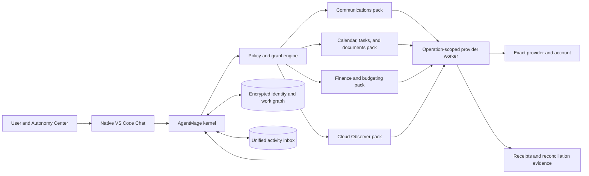

# AgentMage Productivity, Communications, Finance, and Cloud Observer Architecture

## 1. Purpose

This document defines the optional-at-runtime capability packs that extend AgentMage from a
software-delivery control plane into a local-first productivity assistant without granting a
model, connector, message, financial record, or cloud resource ambient authority. It governs:

- Email, chat, calendar, contacts, tasks, document repositories, and local mail clients.
- A unified activity inbox, confirmed identity graph, and cross-system work graph.
- User-selected autonomy levels for reads, drafts, writes, sends, schedules, and automation.
- Local financial management, budgeting, reconciliation, and explainable anomaly analysis.
- Strictly read-only AWS, Azure, and Google Cloud observation.
- Cross-pack workflows that preserve source identity, classification, freshness, and receipts.

Command execution, public research, credential brokering, encrypted continuity, and approved-model
management are governed separately by [`TRUSTED-OPERATIONS.md`](./TRUSTED-OPERATIONS.md). They may
interoperate through kernel contracts but do not inherit a productivity pack's authority.

These packs are required first-GA deliverables under Decision 0009, but they remain removable
runtime components. A user can install and operate the strict-local delivery product without
connecting any communications, finance, document, or cloud account.

## 2. Design Principles

1. The kernel remains the only authority boundary.
2. Every external record is untrusted data, including message text, transaction descriptions,
   calendar content, document text, cloud metadata, logs, and provider-generated links.
3. The local model may classify, summarize, correlate, and propose; it cannot mint authority.
4. Deterministic adapters perform synchronization, identity resolution, arithmetic,
   reconciliation, previews, execution, and postcondition verification.
5. Autonomy is an explicit policy ceiling, not permission hidden in a prompt or chat history.
6. Credentials remain in the platform secret store and never enter model context, logs, exports,
   receipts, attachments, or generated handoff packets.
7. Provider support is bounded to a published provider, version, object, and operation matrix.
8. Every pack is independently installable, disableable, removable, testable, and recoverable.
9. Financial institution and cloud-provider adapters are read-only in the first supported
   release. No standing consent can turn them into money-movement or cloud-mutation tools.
10. Local and remote data are never represented as fresh, complete, or reconciled without
    deterministic evidence.

## 3. Capability-Pack Topology

The Visual Studio Code shell displays policy state and previews but holds no provider credential
or execution authority. Each provider operation runs in a fresh or reset worker that receives one
consumed grant, one credential reference, one exact destination, bounded inputs, and explicit
time, byte, result, and retry budgets.

## 4. Autonomy Center

The native Chat experience exposes a persistent **Autonomy Center** control. It opens an inspector that
shows the global ceiling and narrower pack, connector, account, workspace, operation, destination,
recipient, channel, and schedule settings.

| Level | Allowed behavior | External effects |
|---|---|---|
| Disabled | Connector is absent from tool registration and cannot synchronize. | None |
| Read only | Discover, synchronize, search, correlate, summarize, and report. | Reads only |
| Draft only | Perform reads and create local drafts or proposed plans. | No remote write or send |
| Confirm each write | Preview every exact external effect and require a fresh confirmation. | One confirmed, single-use effect |
| Scoped autonomy | Execute predeclared operations for allowlisted accounts, destinations, recipients, payload classes, limits, and expiry. | Bounded effects with receipts and stop conditions |
| Autonomous within policy | Continue an approved workflow while every step remains inside a signed policy envelope and hard product prohibitions. | Bounded effects only; never unrestricted authority |

Rules:

- The effective level is the intersection of every applicable ceiling. A child setting can narrow
  but never broaden its parent.
- Changing the displayed autonomy level updates policy only after authentication and an exact
  change preview. The button and display object carry no grant.
- New recipients, external domains, public channels, broad mentions, sensitive attachments,
  destructive actions, account changes, and widened schedules require confirmation unless an
  exact allowlist already covers the complete effect.
- A global **Disable all external writes** action immediately prevents new write grants, cancels
  queued work, reconciles in-flight effects, and leaves read-only diagnostics available.
- Provider, account, recipient, channel, operation, item-count, byte, rate, time, and monetary
  reporting budgets are explicit and fail closed.
- Financial money movement and cloud mutation remain prohibited regardless of the selected level.

## 5. Common Productivity Adapter Contract

Every productivity adapter extends the provider lifecycle in `DELIVERY-SYSTEM.md` and declares:

- Provider, product, API or protocol version, host type, tenant, and account identity.
- Object types, stable identifiers, read, draft, write, send, delete, and event capabilities.
- Least-privilege scopes, authentication flow, token lifetime, refresh behavior, and revocation.
- Pagination, delta, cursor, webhook, polling, backfill, tombstone, edit, and ordering semantics.
- Freshness, consistency, duplication, rate-limit, retry, idempotency, and reconciliation behavior.
- Attachment, formatting, thread, recipient, mention, visibility, and delivery semantics.
- Classification, retention, local-cache, search-index, deletion, and export behavior.
- Supported autonomy levels and operations that always require confirmation.
- Complete removal behavior for credentials, caches, cursors, webhooks, schedules, workers, and
  retained provider content.

Unsupported operations are absent from registration. A generic connector cannot manufacture an
operation that its provider manifest does not declare and its conformance evidence does not prove.

## 6. Identity and Work Graph

The identity graph records provider-scoped identities for people, accounts, organizations,
tenants, workspaces, teams, channels, mailboxes, calendars, repositories, projects, and cloud
accounts. Cross-provider links are suggestions until the user confirms them or a deterministic
administrator-controlled identifier proves the relationship.

The work graph links source evidence without flattening provider semantics:

- Email threads, chat threads, meetings, tasks, documents, issues, commits, builds, releases,
  deployments, incidents, financial records, and cloud observations retain native identity.
- Every edge records source, observation time, confidence class, evidence digest, and freshness.
- `Observed`, `Derived`, `Inferred`, and `Unknown/Blocked` remain distinct.
- A shared display name, email alias, title, timestamp, or model similarity is insufficient to
  authorize a recipient, account, repository, transaction, or cloud-resource link.
- Removing an adapter tombstones its graph identities and removes retained content according to
  policy without corrupting neighboring adapters or canonical local records.

## 7. Unified Activity Inbox

The unified inbox normalizes activity while preserving original records and provider semantics. It
can show:

- Unread or selected mail, mentions, direct messages, channel updates, and meeting changes.
- Pull requests, reviews, issues, build failures, incidents, approvals, and release events.
- Bills, receipts, unusual transactions, reconciliation gaps, budget thresholds, and due dates.
- Cloud health, cost, configuration, log, and security observations from read-only adapters.

Deterministic rules classify items as action required, response required, decision required,
waiting, blocked, due, reference, duplicate, stale, incomplete, or uncertain. Model-generated
priority and summaries remain labeled suggestions. Every item links to its exact source and shows
freshness, coverage gaps, permission gaps, and synchronization health.

## 8. Communications Pack

### 8.1 Reference Adapters

| Family | First-GA reference behavior |
|---|---|
| Microsoft Outlook and Exchange Online | Microsoft Graph mail, folders, threads, drafts, sends, replies, forwards, attachments, flags, categories, and supported shared-mailbox behavior |
| Microsoft Teams | Teams, channels, chats, threads, messages, replies, mentions, reactions, attachments, edits, deletions, and supported change notifications |
| Gmail | Gmail API messages, threads, labels, drafts, sends, replies, attachments, history, and supported push or bounded polling behavior |
| Slack | Workspaces, channels, direct and group messages, threads, replies, mentions, reactions, files, edits, deletions, and supported event behavior |
| Proton Mail | Local Proton Mail Bridge through an authenticated loopback IMAP and SMTP profile; Bridge credentials never leave the operation worker |
| Generic mail | Capability-detected IMAP, SMTP, and JMAP with exact server identity, TLS policy, folder semantics, and unsupported-feature disclosure |
| Linux mail clients | Thunderbird, Evolution, and KMail interoperability through their configured provider or standard protocol; optional read-only mbox and Maildir import |

Direct mutation of Outlook, Thunderbird, Evolution, KMail, or another client's private profile
database is not a supported synchronization mechanism. UI scraping is a confirmed-computer-use
fallback only when a structured provider path is unavailable and it never inherits standing write
authority.

### 8.2 Communication Operations

Reads, drafts, sends, replies, forwards, edits, deletions, reactions, uploads, downloads, moves,
labels, flags, and archive operations are distinct capabilities. Every outward communication
preview identifies:

- Provider, tenant, account, sender identity, recipients, channel, thread, and visibility.
- Subject or message content, formatting, mentions, links, quoted content, and attachments.
- New or external recipients, public visibility, broad mentions, sensitive classifications, and
  provider transformations.
- Expected effect, idempotency or deduplication strategy, cancellation limit, and postcondition.

Message bodies, quoted threads, signatures, attachments, calendar invitations, and linked pages are
untrusted. They can inform a draft but cannot change policy, select a recipient, authorize a send,
trigger a tool, or suppress an approval.

## 9. Personal Information and Document Pack

Reference capabilities include:

- Outlook and Google calendars plus CalDAV for events, availability, invitations, responses,
  reminders, time zones, recurrence, resources, and conflict detection.
- Microsoft and Google contacts plus CardDAV for user-reviewed identity and address-book changes.
- Microsoft To Do and Planner, Google Tasks, and provider-neutral local task records.
- OneDrive, SharePoint, Google Drive, Confluence, and separately gated Notion, Box, and Dropbox
  document repositories.
- Meeting agendas, local transcription imports, decisions, commitments, follow-ups, deadlines,
  attachments, and cited source packets.

Calendar, contact, task, and document writes follow the Autonomy Center. Invitations, recipient
changes, public links, permission changes, externally shared documents, and sensitive attachments
require exact visibility and recipient previews.

## 10. Synchronization and Workflow Automation

Adapters use signed webhooks, provider change notifications, delta cursors, bounded polling, or
manual refresh according to their manifest. Every stream records sequence, cursor, observed time,
provider time, edit, deletion, tombstone, backfill, gap, duplicate, and reconciliation state.

The workflow composer converts user intent into a versioned deterministic graph containing:

- Trigger, scope, inputs, filters, joins, branches, budgets, stop conditions, and expiry.
- Every read, draft, write, send, schedule, notification, and approval boundary.
- Exact connectors, accounts, destinations, recipient classes, and data classifications.
- Dry-run fixtures, expected outputs, failure behavior, rollback or compensation, and receipts.

Workflows can prepare daily or event-driven briefings, correlate communication with delivery work,
extract commitments, draft responses, update approved tasks, and queue bounded actions. A workflow
cannot edit itself, broaden its authority, choose a new destination, hide a failed step, or treat a
message as an instruction.

## 11. Finance and Budgeting Pack

### 11.1 Financial Data Model

Financial values use fixed-point decimal arithmetic with explicit currency, scale, sign convention,
and rounding rule. Floating-point arithmetic cannot determine balances, reconciliation, budget
status, tax totals, or financial alerts.

Canonical records distinguish accounts, institutions, statements, transactions, pending and posted
states, splits, transfers, categories, payees, recurring streams, budgets, goals, debts, assets,
liabilities, receipts, invoices, reimbursements, tax labels, and reconciliation periods. Imported
source records remain immutable; corrections use traceable adjustment or supersession records.

### 11.2 Reference Inputs and Adapters

- CSV, OFX, and QFX statement import with profile detection, duplicate protection, and statement
  reconciliation.
- Actual Budget as the first local budgeting reference adapter through its supported local API.
- Optional Plaid transaction, balance, liability, investment, recurring-transaction, and statement
  reads through user-authorized, read-only products.
- Approval-gated non-money-movement accounting operations for QuickBooks Online and Xero after
  separate read, draft, and conformance gates.
- Local receipt, invoice, reimbursement, and tax-document extraction using the existing document
  and artifact-verification boundaries.

### 11.3 Financial Workflows

The pack can provide:

- Category proposals and user-approved rules.
- Envelope or category budgets, cash-flow forecasts, savings goals, and scenario comparisons.
- Recurring bill, income, fee, subscription, and price-change detection.
- Statement reconciliation, duplicate and missing transaction detection, and transfer matching.
- Debt-payoff comparisons, net-worth views, and read-only investment summaries.
- Receipt-to-transaction, invoice-to-payment, reimbursement, and correspondence matching.
- Explainable statistical outlier and potential-fraud indicators with features, baseline, confidence,
  limitations, and source evidence.
- Exportable reports and tax-document organization without claiming financial, legal, tax, credit,
  or investment advice.

### 11.4 Financial Authority Boundary

The Finance pack may read approved sources, create local drafts, and write approved local budget or
ledger records. Scoped autonomy may apply confirmed categorization and reconciliation rules within
exact accounts, categories, value limits, and expiry.

The first supported release has no bank transfer, payment initiation, bill payment, trade, order,
withdrawal, deposit, credit application, loan change, tax filing, beneficiary change, account
administration, or credential-recovery operation. Those operations are absent from manifests,
schemas, tools, and policy allowlists at every autonomy level.

## 12. Cloud Observer Pack

The Cloud Observer pack is strictly read-only in the first supported release:

| Provider | Reference observations |
|---|---|
| AWS | Account and organization inventory, resource configuration, tags, health, CloudWatch metrics and bounded logs, CloudTrail references, security findings, deployment identity, and Cost Explorer summaries |
| Azure | Tenant, subscription, resource graph, configuration, tags, health, Azure Monitor metrics and bounded logs, activity references, security findings, deployment identity, and Cost Management summaries |
| Google Cloud | Organization, folder, project and asset inventory, configuration, labels, health, Cloud Monitoring metrics and bounded logs, audit references, security findings, deployment identity, and billing summaries |

The pack cannot start or stop compute, invoke remote commands, open shells, modify infrastructure,
change identity or policy, read secret values, rotate credentials, alter logging, change budgets,
deploy, upload, delete, or cross into an ungranted account, project, subscription, region, or data
plane. Read-only cloud observations may inform a delivery plan but cannot authorize delivery or
infrastructure effects.

Encrypted cloud backup does not belong to Cloud Observer. It is a separately writable Continuity
capability that can access only one exact backup namespace and only client-side-encrypted snapshot
objects. A Cloud Observer credential cannot be reused for backup, and a backup credential cannot be
used for cloud inventory, infrastructure, administration, or unrelated storage objects.

## 13. Data Protection and Retention

- Connector content is classified before indexing or model use.
- Private communications, financial records, contacts, and provider caches are encrypted and kept
  outside cloud-synchronized local storage under the strict profile.
- Search indexes are disposable and rebuildable; provider records and user-owned canonical data
  retain distinct authority.
- Raw message bodies, attachments, financial records, and cloud logs are not copied into general
  memory by default.
- Cross-pack disclosure requires an explicit data-flow rule. A finance record cannot silently enter
  a chat draft, and a private message cannot silently become an issue or model memory.
- Exports show included records, redactions, classification, destination, retention, and hashes.
- Disconnect and removal honor provider revocation where available and remove local credentials,
  caches, cursors, events, schedules, indexes, and retained content according to policy.

## 14. Verification Matrix

Every promoted adapter and cross-pack workflow must pass:

- Provider, product, version, host, tenant, account, object, operation, and scope conformance.
- Field-by-field grant, autonomy, recipient, destination, payload, attachment, and budget mutation.
- Prompt injection, malicious attachment, deceptive recipient, hidden mention, link, redirect, and
  cross-account confusion attacks.
- Cursor loss, duplicate, edit, deletion, tombstone, out-of-order event, backfill, rate-limit,
  network-partition, stale-cache, and incomplete-coverage recovery.
- Idempotency, uncertain-result, duplicate-send, partial-write, cancellation, and postcondition
  reconciliation.
- Cross-pack classification, identity, cache, credential, context, retention, and authority attacks.
- Financial precision, rounding, currency, pending/posted, duplicate, transfer, reconciliation,
  statement, and correction tests.
- Financial money-movement absence tests at every shell, policy, schema, adapter, and autonomy level.
- Cloud read-only negative tests for every write, execute, deploy, secret, identity, policy, and
  administration family.
- Complete adapter disablement, revocation, uninstall, residue scan, and strict-local restoration.
- Accessibility and keyboard-only operation for autonomy, approval, synchronization health,
  unified inbox, financial reports, and emergency disablement.

## 15. Release and Support Contract

First-GA support is truthful only for provider and protocol tuples present in the signed support
matrix with current conformance evidence. Optional packs are disabled until installed and connected
by the user. A provider outage, revoked scope, unsupported tenant policy, stale cursor, incomplete
history, or missing permission is visible and cannot be represented as an empty or complete result.

The expanded productivity checkpoint follows Sprint 156. Sprint 126 remains a stable
delivery-and-Windows checkpoint. Decision 0010 adds the trusted-operations work in Sprints 157-165
and assigns final v1.0 GA closure to Sprint 166.

## 16. Trusted-Operations Relationship

The Autonomy Center's global and narrower ceilings also constrain trusted operations. Command-
specific levels add Inspect, Workspace Autonomous, Connected Operations, and Owner / Unrestricted
Session semantics without changing communication or finance prohibitions. Owner mode never creates
money-movement, Cloud Observer mutation, recipient, or provider authority by implication; each
registered external effect still needs its own capability and grant.

Public research results can enter the work graph only with source, retrieval time, classification,
freshness, and citation evidence. Continuity can back up classified productivity records only under
their retention and export policies. Credential references remain account scoped. Model-manager and
Experimental Model Lab content cannot select recipients, trigger workflows, authorize financial
operations, or mutate cloud state.

## 17. Whole-Codebase Audit Relationship

The audit capability in [`CODEBASE-AUDIT.md`](./CODEBASE-AUDIT.md) may use locally available
requirements, decisions, documents, work items, and other productivity records only when they are
inside the exact classified audit scope. Mail, chat, calendar, task, document-provider, finance, and
Cloud Observer records remain separate evidence sources with their own account, scope, freshness,
retention, and disclosure controls.

Repository content cannot cause a productivity lookup, recipient selection, message send, workflow,
financial operation, or cloud request. Audit findings are evidence, not authority. Any later draft
or effect begins as a new operation under the applicable pack and Autonomy Center ceiling.
