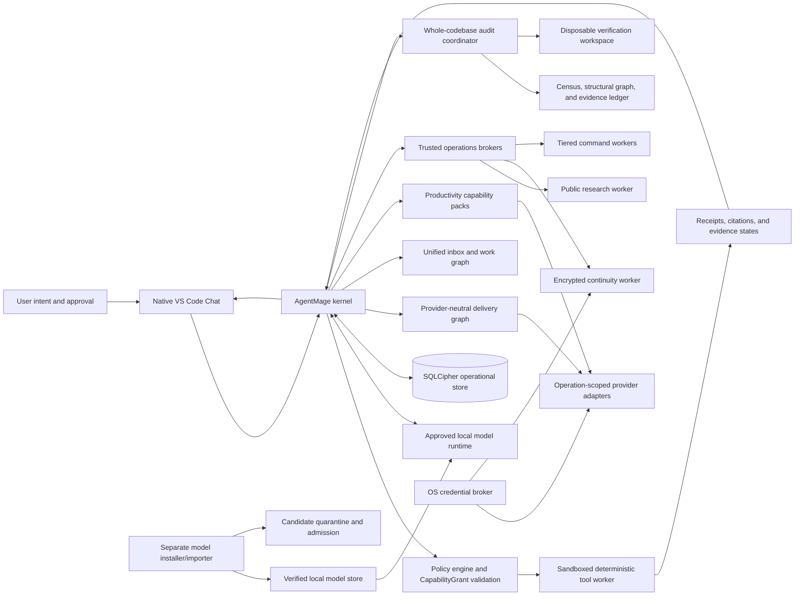
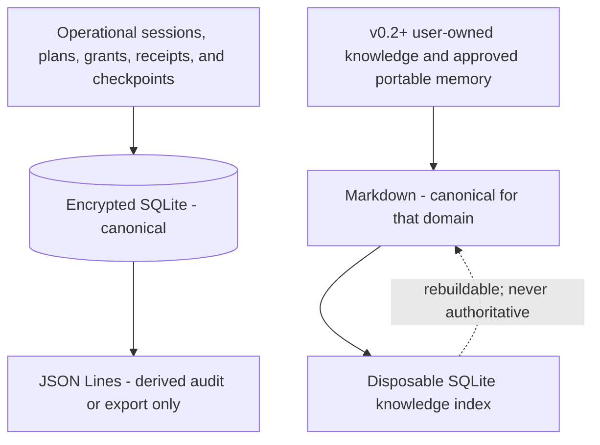

# AgentMage

**AgentMage is a brand-new, from-scratch project.** It is a portable, local-first development, delivery, productivity, research, continuity, whole-codebase audit, and financial-management assistant that combines deterministic tools with approved local models under enforceable Linux and Windows security boundaries.

AgentMage is an independent, privately developed product created by Aaron N. Horvitz on personal time, on personally controlled hardware, with independently obtained tools and services. It is not sponsored, commissioned, or developed on behalf of an employer. It is intended for public distribution. Any future installation on a managed device is a separate decision by that device's owner or operator and does not change project ownership.

| Field | Current baseline |
|---|---|
| Status | Pre-alpha scaffold; stabilization closed and numbered roadmap resumed under Decision 0021; no integrated end-user workflow or supported binary |
| First supported public release | v1.0 GA Local-First Delivery, Productivity, Trusted Operations, and Whole-Codebase Audit System |
| Internal milestones | v0.1-v0.7 and the inherited v1+ capability sequence |
| First interface target | Native Visual Studio Code Chat beside the separate Codex tab |
| Current enabled model | None; evaluated Gemma 4 E4B and Gemma 4 12B Unified candidates are rejected and disabled |
| Model runtime target | Native `llama.cpp`; gated Docker Model Runner compatibility adapter; neither is integrated into an end-user workflow |
| v1.0 GA platforms | Fedora, Ubuntu, and Windows 11 x64; Apple Silicon macOS retained as a post-GA lane |
| Delivery boundary | Full GitHub.com/GitHub Enterprise support within a published matrix, plus versioned provider adapters for planning, CI/CD, artifacts, deployment, infrastructure, observability, incidents, security, catalogs, releases, communications, productivity, finance, read-only cloud observation, public research, and encrypted continuity |
| Execution plan | 17 epics and 169 numbered dependency gates; completed work is preserved and all expansions are appended under Decisions 0008, 0009, 0010, and 0011 |
| License | [Apache License 2.0](./LICENSE) |

## Current Implementation Truth

Current product lifecycle: `scaffolded`.

Current integrated workflow: none.

Current enabled models: none.

Current supported platforms: none.

Stabilization scope freeze: inactive.

These statements describe the integrated product, not the amount of contract,
test, planning, or isolated Linux security work in the repository. The
machine-readable source is
[`architecture/status-model.json`](./architecture/status-model.json), governed
by [`Decision 0012`](./docs/decisions/0012-stabilization-truth-and-status-model.md).
The accepted 17-epic, 169-sprint, 227-requirement scope is preserved. Under
[`Decision 0021`](./docs/decisions/0021-stabilization-resumption.md), the user
accepted the recorded residual risks and authorized the original numbered
roadmap to resume at its first incomplete dependency gate. Independent review
remains required before signed release or connected-authority promotion.

Accepted Decisions 0013 through 0016 define the current authority transaction,
opaque effect permit, canonical held targets, exact-object Linux worker,
SQLCipher authority, and restart recovery. Accepted Decision 0017 records the
Phase 8 independent release trust, Fedora/Ubuntu aggregate, native configuration,
private state/key lifecycle, IPC cleanup, and process-identity candidate. These
remain isolated pre-alpha mechanisms, not an integrated product or release
claim.

Accepted Decision 0018 defines the Phase 9 source candidate for one exact Linux
workspace-file read through the real Visual Studio Code language-model provider
surface. The candidate includes a closed protocol, authenticated IPC client and
server framing, two explicit confirmations, one exact Linux worker projection,
bounded UTF-8 output, a local citation, a durable receipt, replay denial, and
restart verification. The installed extension still uses a fail-closed
unavailable bridge because no independently signed host package, trusted
endpoint bootstrap, or production launch credentials exist. It is therefore
source-level vertical-slice evidence, not a supported or integrated workflow.

Accepted Decision 0019 separates immutable historical evidence from current
applicability, composes platform lanes independently, records exact review
provenance, retains real fuzzing as a separately approved manual security task,
and reports zero enabled models. Accepted Decision 0020 adds deterministic
unsigned RPM, DEB, and VSIX candidates with installed-payload verification and
real candidate lifecycle tests. Those candidates cannot pass signed-release
verification, and the trusted packaged host bootstrap remains absent. Decision
0020 also adds a versioned Windows contract scaffold and Windows CI boundary;
Windows remains blocked because native enforcement and native evidence do not
exist.

AgentMage uses a strict division of responsibility: deterministic code performs checkable work, an approved local model proposes explanations and synthesis, the kernel verifies evidence and enforces authority, and the user decides anything that requires judgment or expanded access.

## Document Authority

The project documents have distinct responsibilities:

1. [`PRD.md`](./PRD.md) governs product intent, release scope, architecture, and product-level requirements.
2. [`Agent-Scaffolding-Inventory.md`](./Agent-Scaffolding-Inventory.md) governs detailed requirements, stable `AM-*`, `AT-*`, and `CR-*` identifiers, capability gates, and the additions-only inventory.
3. [`SECURITY-REVIEW.md`](./SECURITY-REVIEW.md) governs the public product-security baseline, `SR-*` controls, `RV-*` reviewer protocols, and required evidence.
4. [`IMPLEMENTATION-PLAN.md`](./IMPLEMENTATION-PLAN.md) provides the derived high-level implementation sequence, workstreams, milestones, dependencies, and risks without redefining requirements.
5. [`TASKS.md`](./TASKS.md) governs granular execution order through epics, sprints, stories, tasks, sub-tasks, acceptance criteria, and PASS/BLOCKED gates.
6. This README is the orientation document and must summarize, rather than redefine, those authorities.

Supporting policies remain subordinate to those authorities: [`MODEL-PROVENANCE-POLICY.md`](./MODEL-PROVENANCE-POLICY.md) controls model admission procedure, [`SECURITY.md`](./SECURITY.md) controls public vulnerability and support communication, [`RUNTIME-BOUNDARIES.md`](./RUNTIME-BOUNDARIES.md) records the shared process, privilege, socket, lifecycle, and data-flow specification, [`DELIVERY-SYSTEM.md`](./DELIVERY-SYSTEM.md) defines the connected delivery architecture, [`docs/security/repository-safety.md`](./docs/security/repository-safety.md) defines the normative Git and GitHub preservation boundary, [`PRODUCTIVITY-SYSTEM.md`](./PRODUCTIVITY-SYSTEM.md) defines communications, autonomy, personal-information, finance, and cloud-observer architecture, [`TRUSTED-OPERATIONS.md`](./TRUSTED-OPERATIONS.md) defines command authority, public research, credential brokering, continuity, and model management, [`CODEBASE-AUDIT.md`](./CODEBASE-AUDIT.md) defines comprehensive read-only repository audit, and [`WINDOWS-BOUNDARIES.md`](./WINDOWS-BOUNDARIES.md) defines the first-GA Windows boundary. Accepted clarifications and supersessions are recorded under [`docs/decisions/`](./docs/decisions/).

If documents conflict, the narrower safety boundary or release scope wins until an approved decision record resolves the conflict. Accepted identifiers are never silently removed, weakened, merged away, or renumbered.

Current development follows [`Decision 0003`](./docs/decisions/0003-blocked-platform-lane-continuation.md) as superseded for release scope by [`Decision 0008`](./docs/decisions/0008-first-ga-delivery-system-and-windows.md), expanded by [`Decision 0009`](./docs/decisions/0009-productivity-finance-and-cloud-observer-expansion.md), [`Decision 0010`](./docs/decisions/0010-trusted-operations-research-continuity-and-model-management.md), and [`Decision 0011`](./docs/decisions/0011-whole-codebase-audit.md). [`Decision 0012`](./docs/decisions/0012-stabilization-truth-and-status-model.md) governs current status and pauses the numbered roadmap without removing its scope. MacBook Pro M5 tasks remain required for the retained Apple Silicon lane and remain unchecked while the hardware is unavailable. They no longer block v1.0 GA, which requires Fedora, Ubuntu, and Windows 11. No platform's evidence substitutes for another's.

## Internal v0.1 Milestone

v0.1 remains intentionally narrow: a **read-only local evidence assistant** in native Visual Studio Code Chat. It is a partially implemented internal engineering target and foundation, not the first supported public release. The Phase 9 candidate implements only one approved exact-file read; the larger acceptance contract still includes:

- Fedora is the active Linux development and performance reference, and the identical target workflow must pass on clean Ubuntu. Windows 11 x64 is required for first-GA. Apple Silicon macOS on a MacBook Pro M5 remains a blocked, retained post-GA lane.
- A model profile may run only after a new manifest-bound admission passes. Gemma 4 E4B and Gemma 4 12B Unified are currently rejected and disabled; neither is an enabled baseline model. A future admitted profile would use native `llama.cpp` and, on Linux, may use a separately gated Docker Model Runner compatibility adapter behind the same `LocalModelRuntime` contract.
- A separate model installer/importer checks hardware fit, disk and memory requirements, license, publisher, lineage, the [model provenance policy](./MODEL-PROVENANCE-POLICY.md), artifact or OCI hashes, runtime compatibility, quarantine, recovery, and clean activation before enabling the profile.
- A redacted `agentmage doctor` response is rendered inside native Visual Studio Code Chat; v0.1 does not require an end-user command-line interface. It reports the active model, runtime, sandbox, workspace grant, encrypted store, repository-map health, receipt sequence, recovery state, and offline condition.
- An admitted model appears in the native Chat model picker only after its exact artifact/runtime pair passes activation gates.
- The user selects one workspace and can list, read, search, inspect metadata, calculate hashes, and inspect Git without changing it.
- A deterministic, Git-aware repository map inventories permitted files, identifies supported languages and symbols with pinned Tree-sitter parsers, records reliable definitions, imports, and relationships, and cites every structural fact to an exact source range.
- Every tool attempt has a receipt and every file-grounded claim has a resolvable citation. Answers visibly distinguish **Observed**, **Derived**, **Inferred**, and **Unknown/Blocked** statements. Changed evidence makes prior citations stale rather than silently reinterpreting them.
- AgentMage can render a local, reviewable Codex handoff packet with classification and disclosure warnings, but only the user can switch tabs and submit selected content.
- One encrypted session can resume safely after interruption without repeating completed actions.
- After the installer/importer exits, normal v0.1 operation has no cloud model, external API, telemetry, analytics, cloud storage, update check, or cloud fallback.

The internal v0.1 milestone does **not** include semantic/vector indexing, a language-server write surface, Codex invocation or transfer, Obsidian, writes, coding changes, frontier delivery, a full CLI, a desktop application, GitHub access, browser access, connectors, scheduling, plugins, Model Context Protocol servers, or child agents. Those exclusions describe that milestone only and do not describe v1.0 GA.

## First Supported Release

AgentMage v1.0 GA builds the delivery system on the internal milestones. Its supported contract includes:

- Native Visual Studio Code Chat for repository reading, local changes, test execution, delivery evidence, and Markdown authoring with inline and display LaTeX mathematics.
- Fedora, Ubuntu, and Windows 11 x64 packages with separate clean-install, sandbox, path, secret-store, IPC, accessibility, performance, and release evidence.
- Full GitHub.com and user-approved GitHub Enterprise Server behavior within a versioned matrix covering repositories, branches, commits, issues, pull requests, reviews, checks, workflows, releases, local commits, signed pushes, and separately approved hosted mutations.
- Kernel-mediated repository mutation with pre/post preservation manifests, exact namespaced fetches, AgentMage-owned worktrees and temporary indexes, pinned signers, separately approved ordinary fast-forward pushes, short-lived host-bound credentials, and structural absence of generic pull, force, reset, clean, discard, implicit ref updates, and hook or filter execution.
- Provider-neutral adapters for Jira, Azure DevOps, GitLab, Jenkins, artifacts, Kubernetes/GitOps, infrastructure, OpenTelemetry and observability, incidents, security findings, catalogs, feature flags, migrations, and release operations.
- Removable communications and productivity packs for Outlook and Exchange Online, Teams, Gmail, Slack, Proton Mail Bridge, generic mail protocols, Linux mail-client interoperability, calendars, contacts, tasks, document repositories, a unified activity inbox, and a confirmed cross-provider work graph.
- A kernel-enforced Autonomy Center with Disabled, Read only, Draft only, Confirm each write, Scoped autonomy, and Autonomous within policy levels, narrowed independently by pack, connector, account, operation, destination, recipient, channel, and schedule.
- A local-first Finance and Budgeting pack with fixed-point arithmetic, statement import and reconciliation, Actual Budget integration, read-only bank data, budgets, cash-flow forecasts, bills, subscriptions, receipts, accounting workflows, and explainable anomaly indicators. Money movement and trading are absent.
- A read-only Cloud Observer pack for bounded AWS, Azure, and Google Cloud inventory, configuration, health, logs, security observations, and cost summaries. It has no cloud write, remote-command, deploy, secret-read, identity, policy, or administration authority.
- Current public Internet research through an isolated search and retrieval worker with recency controls, claim-level citations, source provenance, bounded downloads, and prompt-injection and private-disclosure defenses.
- A fully capable local command surface with Disabled, Inspect, Workspace Autonomous, Connected Operations, and explicitly activated Owner / Unrestricted Session levels. Owner mode is time bounded, visibly active, panic-stoppable, and never enabled or renewed by a model, schedule, workflow, or external content.
- Operating-system-backed credential brokering using non-secret references and operation-scoped resolution; raw credentials never enter model context, prompts, chat logs, command arguments, diagnostics, exports, or continuity snapshots.
- Local encrypted snapshots and optional client-side-encrypted cloud continuity through an exact backup namespace. The live operational store remains local, and backup write authority does not broaden read-only Cloud Observer.
- A signed approved-model catalog and chat-guided model manager for compatible-model discovery, user-confirmed acquisition or import, quarantine, verification, admission testing, activation, comparison, rollback, removal, and storage cleanup.
- Meta Muse Glimmer as a candidate only until its exact first-party license, open-source or open-weight classification, provenance, artifacts, runtime, resource, quality, security, and platform evidence produce a normal admission disposition.
- Comprehensive read-only whole-codebase audit with exact repository identity, complete path disposition, deterministic structural graphs, semantic review in bounded coherent units, persistent evidence cards, cross-module reconciliation, checkpoint resume, transitive invalidation, calibrated findings, and explicit coverage and uncertainty.
- Strict separation between `observe`, `draft`, `local-write`, `remote-write`, `execute`, `deploy`, `secrets`, and `admin` capability classes.
- Exact previews, current remote preconditions, single-use grants, idempotency or reconciliation, verified postconditions, rollback or compensation plans, and immutable receipts for every external effect.
- A removable connected layer: uninstalling every provider adapter restores the independently tested strict-local product.

“Full integration” is bounded by the shipped provider/version/capability matrix. Undocumented, unavailable, unsafe, and provider-administrative operations are not implied.

## System Architecture



AgentMage has three one-way product layers:

1. **Kernel** - policy, `CapabilityGrant`, receipts, encrypted operational storage, model adapters, sandboxed tools, classification, retention, and recovery.
2. **Capability packs** - Core Read-Only first, followed by Knowledge and Obsidian, Controlled Writes, Coding, Manual Frontier Consultation, Administrative and Document Work, provider-neutral delivery capabilities, Communications and Personal Information, Finance and Budgeting, read-only Cloud Observation, Public Research, Continuity, Approved Model Management, and Whole-Codebase Audit.
3. **Shells** - native Visual Studio Code Chat first, followed later by a complete CLI and standalone macOS and Linux desktop applications.

Shells and models carry no authority. Only the kernel can validate and consume a capability grant. Codex is an adjacent user-controlled surface, not an AgentMage shell, model, tool, fallback, router destination, or subagent.

Platform adapters implement inference, workspace authorization, secure paths, tool confinement, secret storage, process limits, installation, and updates. Provider adapters implement the lifecycle in [`DELIVERY-SYSTEM.md`](./DELIVERY-SYSTEM.md). Capability packs, provider adapters, and shells cannot bypass those contracts or weaken them on one operating system.

The current Linux candidate obtains expected runtime and mechanism identities
from a strictly parsed, detached-signature-verified release manifest independent
of native observations. Its aggregate gates workspace and state construction,
holds private roots by descriptor, owns native configuration publication and
explicit key provisioning, binds IPC peers and inventory to process start
identity, and fails closed because no production signed package is present. The
detailed boundary is recorded in
[`docs/architecture/linux-platform-lifecycle.md`](./docs/architecture/linux-platform-lifecycle.md).

## Platform Support

- **Fedora:** the Linux development and performance reference uses an unprivileged AgentMage kernel, fresh Bubblewrap workers, seccomp, user cgroup limits, Linux Secret Service, and native `llama.cpp`. Docker Model Runner remains a separately gated compatibility adapter.
- **Ubuntu:** v1.0 GA must pass the same supported workflow, shared contracts, native reference path, delivery adapters, and acceptance fixtures as Fedora.
- **Windows 11 x64:** v1.0 GA uses a signed per-user MSIX package, authenticated named-pipe IPC, a restricted AppContainer tool boundary, Job Objects, DPAPI-protected keys, handle-relative NTFS path defenses, native `llama.cpp`, and the dedicated [`WINDOWS-BOUNDARIES.md`](./WINDOWS-BOUNDARIES.md) gate.
- **Apple Silicon macOS:** retained as a post-GA MacBook Pro M5 lane. The arm64 Developer ID, notarization, App Sandbox, XPC, Keychain, security-scoped bookmark, and Metal requirements remain unchanged and `BLOCKED-MACOS` until genuine hardware evidence exists.
- **Deferred:** Intel Mac, Windows on Arm, Windows Subsystem for Linux as a security boundary, and network-share workspaces remain unsupported until separately promoted and assessed.

The clean Windows and Linux installations must not require a cloud account, hosted model, ambient Git, Python, or administrator access after installation. The retained clean Mac installation must not require Homebrew, Rosetta, Xcode command-line tools, Docker Desktop, Python, ambient Git, or administrator access after installation. Docker prerequisites remain visible platform dependencies and AgentMage never describes a Docker-backed profile as wholly unprivileged without evidence.

Shipping the later Mac package requires an isolated Apple Silicon release runner and an Apple Developer Program identity for Developer ID signing and notarization. These are maintainer release requirements, not end-user dependencies. Production on every platform uses a pinned stable Visual Studio Code language-model provider API and never requires a proposed API or Visual Studio Code Insiders.

## Security and Authority

`CapabilityGrant` is the only authority-bearing object. It binds the actor, session, task, action, tool, workspace-relative targets, arguments, preimages, expected side effects, expiration, nonce, use limit, parent scope, and user-confirmed preview digest.

The kernel validates and atomically consumes a grant immediately before execution. A changed target, argument, preimage, task, policy, scope, expiry, or nonce invalidates it. Models, prompts, tools, plugins, connectors, shells, and child agents cannot mint or broaden grants.

- The Visual Studio Code extension has display and interaction authority only and never calls a raw model runtime.
- Every v0.1 file and Git operation runs in a fresh, read-only, no-network platform sandbox.
- Tool inputs use canonical workspace-relative `WorkspacePath` values. Absolute paths exist only as non-authoritative display links.
- Repository instructions, source comments, documents, connector content, and model output are untrusted. They cannot alter policy, mint grants, expand scope, enable tools, or override the current user request.
- Messages, attachments, calendar records, contacts, tasks, financial descriptions, cloud metadata, logs, and provider links are equally untrusted. They cannot select recipients, authorize sends, move money, mutate cloud state, or broaden autonomy.
- Every denied, cancelled, failed, timed-out, uncertain, or successful tool attempt produces one schema-valid receipt.
- Security-sensitive behavior fails closed when identity, policy, path, sandbox, encryption, network, evidence, or recovery checks are unavailable.

The product-security baseline targets a bounded, single-user desktop application. It supplies reproducible evidence for public release review, customer evaluation, and optional managed-device assessment without treating local execution as sufficient proof of security or claiming an external certification that has not been independently assessed.

## Data Authority



Classification, secret detection, minimization, retention assignment, and encryption selection happen before persistence. Private or restricted records never fall back silently to plaintext. The local data root must be user-selected and outside cloud-synchronized or remote storage under the strict-local profile.

Continuity snapshots are immutable, versioned, and encrypted on the client before an optional cloud
backup worker receives them. The live operational database, model store, locks, indexes, queues,
sockets, and temporary files never operate from a cloud-synchronized or network path. Restored
installations reauthenticate connected accounts instead of restoring raw credentials.

## Model Policy

v0.1 uses explicit user model selection. It attempts deterministic operations first, never switches models automatically, never contacts a frontier model, and stops visibly when the selected model cannot satisfy the task contract.

The initial candidate is Gemma 4 E4B. Its manifest pins identity, license, publisher, upstream lineage, conversion and quantization recipe, native artifact or immutable OCI digest, tokenizer and template hashes, runtime compatibility, platform support, and resource limits. Every enabled model, embedding model, reranker, tokenizer, conversion, runtime, and derived artifact must satisfy [`MODEL-PROVENANCE-POLICY.md`](./MODEL-PROVENANCE-POLICY.md), including the project's non-Chinese and non-Chinese-derived model rule, as a supply-chain requirement.

Gemma 4 12B Unified is the named disabled fallback candidate if E4B fails a mandatory quality or tool-calling threshold. Gemma 4 26B A4B and other later candidates remain disabled until their separate registry, lineage, license, origin, resource, quality, security, and platform gates pass. Meta Muse Glimmer is recorded as a candidate only; no open-source, support, compatibility, download, or activation claim is made until first-party evidence and the complete admission pipeline pass. A broad model marketplace is not a v0.1 objective, and AgentMage never switches models or adapters automatically.

For first GA, the user can ask Chat to list hardware-compatible approved profiles and to download,
import, verify, activate, compare, roll back, remove, or clean up one. A deterministic model manager
shows the exact artifact, license, source, size, hardware fit, network use, checks, and rollback before
confirmation; the separate installer performs the operation. A post-GA Experimental Model Lab may
evaluate user-selected unapproved artifacts with no network, credentials, command, connector, or
canonical-workspace-write authority, but promotion still requires ordinary model admission.

## Codex Handoff Boundary

AgentMage may prepare and display a local handoff packet containing the objective, acceptance criteria, cited evidence, constraints, disclosure list, unresolved questions, data-classification status, and unresolved redaction warnings. Handoff stops at that preview.

AgentMage cannot invoke Codex, activate or populate the Codex tab, write the packet to the clipboard, call a Codex or OpenAI endpoint, or transmit content. The preview warns that manual submission discloses the selected content to a separate product under that product's policies. The user manually switches to Codex, resolves or accepts each warning, chooses what to disclose, and submits it. This rule cannot be overridden by standing consent, routing, failure recovery, scheduling, or a model decision.

## Delivery Roadmap

```mermaid
flowchart LR
    E0["Epic 0<br/>Foundation"] --> E1["Epic 1<br/>v0.1 Read Only"]
    E1 --> E2["Epic 2<br/>v0.2 Knowledge"]
    E2 --> E3["Epic 3<br/>v0.3 Writes"]
    E3 --> E4["Epic 4<br/>v0.4 Coding and CLI"]
    E4 --> E5["Epic 5<br/>v0.5 Frontier"]
    E5 --> E6["Epic 6<br/>v0.6 Admin and Documents"]
    E6 --> E7["Epic 7<br/>v0.7 GitHub and Connectors"]
    E7 --> E8["Epic 8<br/>Extended Capabilities"]
    E8 --> E9["Epic 9<br/>Inherited Scope Closure"]
    E9 --> E10["Epic 10<br/>Delivery System and Windows"]
    E10 --> E11["Epic 11<br/>v1.0 GA Verification"]
    E11 --> E12["Epic 12<br/>Productivity and Communications"]
    E12 --> E13["Epic 13<br/>Finance and Cloud Observer"]
    E13 --> E14["Epic 14<br/>Expanded GA Verification"]
    E14 --> E15["Epic 15<br/>Trusted Operations and Codebase Audit"]
    E15 --> E16["Epic 16<br/>Experimental Model Lab"]
```



| Epic | Increment | Sprint range |
|---|---|---|
| 0 | Foundation and traceability | 0-3 |
| 1 | v0.1 Read-Only Local Evidence Assistant | 4-25 |
| 2 | v0.2 Knowledge, Obsidian, and Memory | 26-34 |
| 3 | v0.3 Controlled Writes | 35-40 |
| 4 | v0.4 Coding and Complete Local CLI | 41-50 |
| 5 | v0.5 Manual Frontier Consultation | 51-53 |
| 6 | v0.6 Administrative and Document Work | 54-69 |
| 7 | v0.7 Read-Only GitHub and Connectors | 70-75 |
| 8 | Extended interfaces, packages, actions, scheduling, and agents | 76-100 |
| 9 | Inherited-roadmap closure checkpoint; superseded as final release gate | 101-102 |
| 10 | Provider-neutral delivery system and Windows 11 | 103-125 |
| 11 | Delivery-and-Windows GA checkpoint; superseded as final gate | 126 |
| 12 | Productivity, communications, personal information, documents, and autonomy | 127-141 |
| 13 | Finance, budgeting, accounting, and read-only cloud observation | 142-155 |
| 14 | Expanded v1.0 GA verification and release decision | 156 |
| 15 | Trusted operations, research, credentials, continuity, model management, whole-codebase audit, and superseding v1.0 GA decision | 157-166 |
| 16 | Post-GA Experimental Model Lab | 167-168 |

Sprints are ordered dependency and evidence gates, not calendar promises. A sprint contains one or more bounded stories only when their combined gate remains reviewable; each story has numbered tasks and sub-tasks, 2-4 Given/When/Then criteria, evidence requirements, and a binary PASS/BLOCKED gate. Oversized work is split through a recorded decision without renumbering accepted identifiers.

## Release Gates

Each internal milestone is governed by its own stable requirements, sprints, security controls, and reviewer protocols. v1.0 GA additionally requires every promoted delivery, productivity, communications, finance, cloud-observer, public-research, continuity, command-authority, credential-broker, model-management, and whole-codebase audit capability; the Windows gate; complete cross-provider lifecycle evidence; published support matrices; and the extreme verification matrices in [`DELIVERY-SYSTEM.md`](./DELIVERY-SYSTEM.md), [`PRODUCTIVITY-SYSTEM.md`](./PRODUCTIVITY-SYSTEM.md), [`TRUSTED-OPERATIONS.md`](./TRUSTED-OPERATIONS.md), and [`CODEBASE-AUDIT.md`](./CODEBASE-AUDIT.md). Required results include zero sandbox, path, grant, privacy, credential-isolation, injection, cross-tenant, cross-account, cross-pack, IPC-authentication, unauthorized-network, canonical-repository mutation, silent audit omission, stale audit evidence, money-movement, cloud-mutation, private-research-disclosure, backup-namespace, model-substitution, or command-authority violations; exact deterministic repository-map, structural-graph, work-graph, financial-reconciliation, delivery-graph, citation, snapshot, and restore results; complete receipts, citations, audit coverage, and finding evidence; reliable local-model calls and recovery; deterministic crash, checkpoint, invalidation, and uncertain-result recovery; and explicit latency, memory, rate, and data-volume ceilings on each recorded reference machine and provider fixture.

A gate is only `PASS` or `BLOCKED`. Failed, skipped, stale, unavailable, flaky, quarantined, suppressed, unreconciled, or unreviewed blocking checks cannot be represented as passing. Feature completeness never overrides a failed platform, security, privacy, authority, evidence, recovery, or clean-install gate.

## Documents

- [Product Requirements Document](./PRD.md) - product intent, architecture, release boundaries, security posture, and product-level acceptance.
- [Agent Scaffolding Inventory](./Agent-Scaffolding-Inventory.md) - stable requirements, detailed capability roadmap, build order, and acceptance matrix.
- [Security Review and Verification Guide](./SECURITY-REVIEW.md) - public product-security baseline, security requirements, reviewer protocols, and evidence contract.
- [High-Level Implementation Plan](./IMPLEMENTATION-PLAN.md) - architectural sequence, cross-cutting workstreams, milestones, risks, and release strategy.
- [Story-Based Sprint Plan](./TASKS.md) - 17 epics, 169 dependency-bounded sprints, stories, tasks, sub-tasks, tests, acceptance criteria, and gates.
- [Model Provenance and Admission Policy](./MODEL-PROVENANCE-POLICY.md) - origin, lineage, license, artifact, runtime, quality, and fallback admission rules.
- [Security Policy](./SECURITY.md) - private reporting, supported versions, remediation, signed manual patch delivery, emergency disablement, and end of support.
- [Runtime Boundaries](./RUNTIME-BOUNDARIES.md) - trust boundaries, classified data flows, privileges, processes, sockets, lifecycle, and runtime parity.
- [Delivery System Architecture](./DELIVERY-SYSTEM.md) - provider-neutral delivery graph, adapter contract, capability classes, operation lifecycle, conformance levels, and extreme tests.
- [Productivity System Architecture](./PRODUCTIVITY-SYSTEM.md) - autonomy, communications, personal-information, document, finance, workflow, and read-only cloud-observer contracts.
- [Trusted Operations Architecture](./TRUSTED-OPERATIONS.md) - command authority, public research, credential brokering, encrypted continuity, approved-model management, and experimental-model isolation.
- [Whole-Codebase Audit Architecture](./CODEBASE-AUDIT.md) - exhaustive repository census, deterministic structure, bounded semantic review, reconciliation, read-only verification, checkpoints, findings, and coverage truth.
- [Windows 11 Boundaries](./WINDOWS-BOUNDARIES.md) - package, process, IPC, path, sandbox, key, runtime, network, and verification requirements for first GA.
- [Machine-Readable Requirement Registry](./requirements/README.md) - deterministic inventory and field contract for every canonical `AM-*`, `AT-*`, and `CR-*` identifier.
- [Product CI and Clean-Build Evidence](./docs/product-ci-and-clean-build.md) - independent product gates, native-test truth, exact source binding, network isolation, and branch-protection guidance.
- [Accepted Architecture Decisions](./docs/decisions/) - dated clarifications and supersessions that preserve stable requirement history.
- [Apache License 2.0](./LICENSE) - permissions and conditions for use, modification, and distribution.

## Documentation Validation

From a clean checkout, one command installs the lockfile-pinned documentation tools with package lifecycle scripts disabled and runs the same blocking gate used by continuous integration:

```bash
npm run docs:clean-check
```

The gate validates Markdown, Mermaid diagrams, local links, secret signatures,
prohibited deployment claims, stable identifiers, the generated requirement
registry, required files, cross-document platform/model/runtime assertions, and
the current Phase 10 evidence, platform, review-provenance, and model-activation
views. Historical artifact validity and current applicability are separate;
retained reports are not regenerated merely to make the current gate pass. It
writes generated renderer output only to temporary or ignored paths.

The complete pre-stabilization replay remains available for historical audit:

```bash
npm run requirements:historical-replay
```

That command intentionally invokes old source-currentness assertions and may
report retained records as stale against a later tree. It is not the current CI
gate and its failures must not be relabeled as passes.

Product compilation and tests run through a separate contract and workflow:

```bash
npm run product-ci:check
npm run product:check
python3 scripts/product_ci.py --inventory-native
```

A successful native-inventory command records eleven tests as pending native
execution; it does not claim that those tests ran. Clean-build evidence uses the
complete committed Git tree and disables container networking after dependency
bootstrap. See
[`docs/product-ci-and-clean-build.md`](./docs/product-ci-and-clean-build.md) for
the exact status and evidence semantics.
