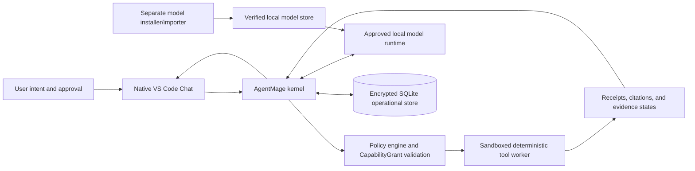
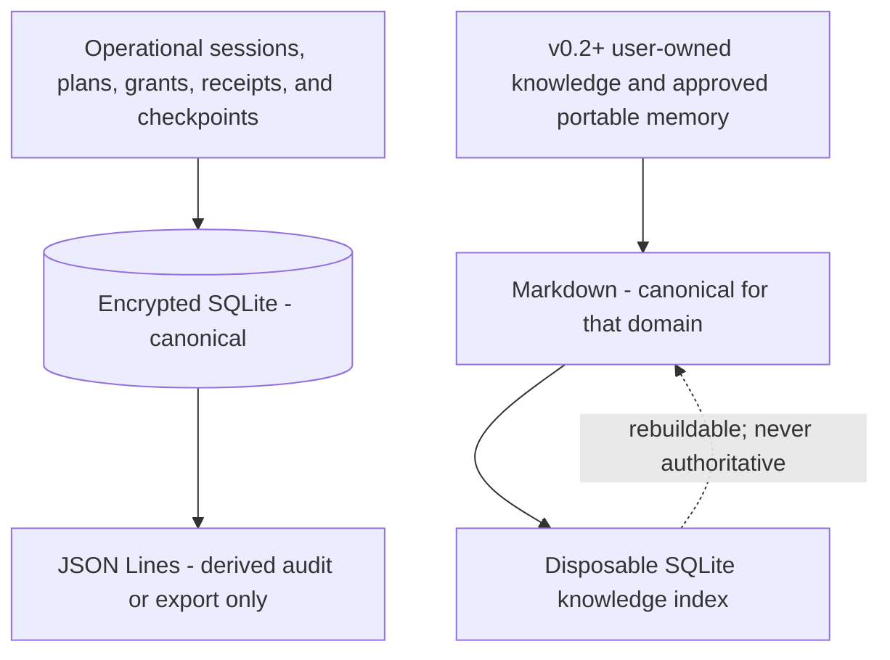
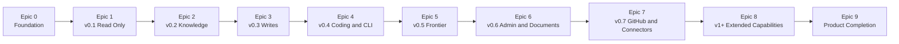

# AgentMage

**AgentMage is a brand-new, from-scratch project.** It is a portable, local-first assistant that combines deterministic tools with approved local models under enforceable macOS and Linux security boundaries.

AgentMage is an independent, privately developed product created by Aaron N. Horvitz on personal time, on personally controlled hardware, with independently obtained tools and services. It is not sponsored, commissioned, or developed on behalf of an employer. It is intended for public distribution. Any future installation on a managed device is a separate decision by that device's owner or operator and does not change project ownership.

| Field | Current baseline |
|---|---|
| Status | Design and planning; implementation has not started |
| First product release | v0.1 Read-Only Local Evidence Assistant |
| First interface | Native Visual Studio Code Chat beside the separate Codex tab |
| First enabled model | Manifest-pinned Gemma 4 E4B |
| v0.1 platforms | Apple Silicon macOS, Fedora, and Ubuntu |
| Execution plan | 10 epics and 103 sequential two-week sprints |

AgentMage uses a strict division of responsibility: deterministic code performs checkable work, an approved local model proposes explanations and synthesis, the kernel verifies evidence and enforces authority, and the user decides anything that requires judgment or expanded access.

## Document Authority

The project documents have distinct responsibilities:

1. [`PRD.md`](./PRD.md) governs product intent, release scope, architecture, and product-level requirements.
2. [`Agent-Scaffolding-Inventory.md`](./Agent-Scaffolding-Inventory.md) governs detailed requirements, stable `AM-*`, `AT-*`, and `CR-*` identifiers, capability gates, and the additions-only inventory.
3. [`SECURITY-REVIEW.md`](./SECURITY-REVIEW.md) governs the public product-security baseline, `SR-*` controls, `RV-*` reviewer protocols, and required evidence.
4. [`IMPLEMENTATION-PLAN.md`](./IMPLEMENTATION-PLAN.md) provides the derived high-level implementation sequence, workstreams, milestones, dependencies, and risks without redefining requirements.
5. [`TASKS.md`](./TASKS.md) governs granular execution order through epics, sprints, stories, tasks, sub-tasks, acceptance criteria, and PASS/BLOCKED gates.
6. This README is the orientation document and must summarize, rather than redefine, those authorities.

If documents conflict, the narrower safety boundary or release scope wins until an approved decision record resolves the conflict. Accepted identifiers are never silently removed, weakened, merged away, or renumbered.

## v0.1

v0.1 is intentionally narrow: a **read-only local evidence assistant** in native Visual Studio Code Chat.

- Apple Silicon macOS on a MacBook Pro M5 is the primary launch and deployment reference. Fedora is the Linux performance reference, and the identical supported workflow must pass on clean Ubuntu in the same release.
- A manifest-pinned Gemma 4 E4B profile runs through signed native `llama.cpp` with Metal on macOS and an approved local runtime on Fedora and Ubuntu.
- A separate model installer/importer checks hardware fit, disk and memory requirements, license, publisher, lineage, project model-origin policy, artifact hashes, runtime compatibility, quarantine, recovery, and clean activation before enabling the profile.
- A redacted local `agentmage doctor` report proves the active model, runtime, sandbox, workspace grant, encrypted store, repository-map health, receipt sequence, recovery state, and offline condition.
- **AgentMage - Gemma 4 E4B (Local, Read Only)** appears in the native Chat model picker.
- The user selects one workspace and can list, read, search, inspect metadata, calculate hashes, and inspect Git without changing it.
- A deterministic, Git-aware repository map inventories permitted files, identifies supported languages and symbols with pinned Tree-sitter parsers, records reliable definitions, imports, and relationships, and cites every structural fact to an exact source range.
- Every tool attempt has a receipt and every file-grounded claim has a resolvable citation. Answers visibly distinguish **Observed**, **Derived**, **Inferred**, and **Unknown/Blocked** statements. Changed evidence makes prior citations stale rather than silently reinterpreting them.
- AgentMage can render a local, reviewable Codex handoff packet, but only the user can switch tabs and submit selected content.
- One encrypted session can resume safely after interruption without repeating completed actions.
- After the installer/importer exits, normal v0.1 operation has no cloud model, external API, telemetry, analytics, cloud storage, update check, or cloud fallback.

v0.1 does **not** include semantic/vector indexing, a language-server write surface, Codex invocation or transfer, Obsidian, writes, coding changes, frontier delivery, a full CLI, a desktop application, GitHub access, browser access, connectors, scheduling, plugins, Model Context Protocol servers, or child agents.

## System Architecture

AgentMage has three one-way product layers:

1. **Kernel** - policy, `CapabilityGrant`, receipts, encrypted operational storage, model adapters, sandboxed tools, classification, retention, and recovery.
2. **Capability packs** - Core Read-Only first, followed by Knowledge and Obsidian, Controlled Writes, Coding, Manual Frontier Consultation, Administrative and Document Work, GitHub and Connectors, then separately gated v1+ capabilities.
3. **Shells** - native Visual Studio Code Chat first, followed later by a complete CLI and standalone macOS and Linux desktop applications.

Shells and models carry no authority. Only the kernel can validate and consume a capability grant. Codex is an adjacent user-controlled surface, not an AgentMage shell, model, tool, fallback, router destination, or subagent.

Platform adapters implement inference, workspace authorization, secure paths, tool confinement, secret storage, process limits, installation, and updates. Capability packs and shells cannot bypass those contracts or weaken them on one operating system.

## Platform Support

- **Apple Silicon macOS:** v0.1 targets a MacBook Pro M5. The package is arm64, Developer ID-signed, notarized, stapled, Hardened Runtime-enabled, and App-Sandboxed. It uses a signed native Visual Studio Code bridge, authenticated App Group IPC, a read-only security-scoped workspace bookmark, sandboxed XPC tools, Keychain, and native Metal inference.
- **Fedora:** the v0.1 Linux performance reference uses an unprivileged kernel, fresh Bubblewrap workers, seccomp, user cgroup limits, Linux Secret Service, and an approved local inference adapter.
- **Ubuntu:** v0.1 must pass the same supported workflow, shared contracts, and acceptance fixtures as Fedora.
- **Deferred:** Intel Mac and Windows are unsupported until separately promoted and assessed.

The clean Mac installation must not require Homebrew, Rosetta, Xcode command-line tools, Docker Desktop, Python, ambient Git, or administrator access after installation. Docker Desktop may become an optional adapter only after separate licensing and security gates; it is not part of the reference path.

Shipping the Mac package requires an isolated Apple Silicon release runner and an Apple Developer Program identity for Developer ID signing and notarization. These are maintainer release requirements, not end-user dependencies. Production uses a pinned stable Visual Studio Code language-model provider API and never requires a proposed API or Visual Studio Code Insiders.

## Security and Authority

`CapabilityGrant` is the only authority-bearing object. It binds the actor, session, task, action, tool, workspace-relative targets, arguments, preimages, expected side effects, expiration, nonce, use limit, parent scope, and user-confirmed preview digest.

The kernel validates and atomically consumes a grant immediately before execution. A changed target, argument, preimage, task, policy, scope, expiry, or nonce invalidates it. Models, prompts, tools, plugins, connectors, shells, and child agents cannot mint or broaden grants.

- The Visual Studio Code extension has display and interaction authority only and never calls a raw model runtime.
- Every v0.1 file and Git operation runs in a fresh, read-only, no-network platform sandbox.
- Tool inputs use canonical workspace-relative `WorkspacePath` values. Absolute paths exist only as non-authoritative display links.
- Repository instructions, source comments, documents, connector content, and model output are untrusted. They cannot alter policy, mint grants, expand scope, enable tools, or override the current user request.
- Every denied, cancelled, failed, timed-out, uncertain, or successful tool attempt produces one schema-valid receipt.
- Security-sensitive behavior fails closed when identity, policy, path, sandbox, encryption, network, evidence, or recovery checks are unavailable.

The product-security baseline targets a bounded, single-user desktop application. It supplies reproducible evidence for public release review, customer evaluation, and optional managed-device assessment without treating local execution as sufficient proof of security or claiming an external certification that has not been independently assessed.

## Data Authority

Classification, secret detection, minimization, retention assignment, and encryption selection happen before persistence. Private or restricted records never fall back silently to plaintext. The local data root must be user-selected and outside cloud-synchronized or remote storage under the strict-local profile.

## Model Policy

v0.1 uses explicit user model selection. It attempts deterministic operations first, never switches models automatically, never contacts a frontier model, and stops visibly when the selected model cannot satisfy the task contract.

The initial profile is Gemma 4 E4B. Its manifest pins identity, license, publisher, upstream lineage, conversion and quantization recipe, artifact and tokenizer hashes, runtime compatibility, platform support, and resource limits. Every enabled model, embedding model, reranker, tokenizer, conversion, runtime, and derived artifact must satisfy the project's documented non-Chinese and non-Chinese-derived model-origin policy as a supply-chain requirement.

Gemma 4 26B and `ai/devstral-small-2:24B` remain disabled until their separate registry, lineage, license, origin, resource, quality, security, and platform gates pass. A broad model marketplace is not a v0.1 objective.

## Codex Handoff Boundary

AgentMage may prepare and display a local handoff packet containing the objective, acceptance criteria, cited evidence, constraints, disclosure list, and unresolved questions. Handoff stops at that preview.

AgentMage cannot invoke Codex, activate or populate the Codex tab, write the packet to the clipboard, call a Codex or OpenAI endpoint, or transmit content. The user manually switches to Codex, reviews the packet, chooses what to disclose, and submits it. This rule cannot be overridden by standing consent, routing, failure recovery, scheduling, or a model decision.

## Delivery Roadmap

| Epic | Increment | Sprint range |
|---|---|---|
| 0 | Foundation and traceability | 0-3 |
| 1 | v0.1 Read-Only Local Evidence Assistant | 4-25 |
| 2 | v0.2 Knowledge, Obsidian, and Memory | 26-34 |
| 3 | v0.3 Controlled Writes | 35-40 |
| 4 | v0.4 Coding and Complete Local CLI | 41-50 |
| 5 | v0.5 Manual Frontier Consultation | 51-53 |
| 6 | v0.6 Administrative and Document Work | 54-69 |
| 7 | v0.7 Read-Only GitHub and Connectors | 70-75 |
| 8 | v1+ Desktop, Extensions, Actions, Scheduling, and Agents | 76-100 |
| 9 | Requirement closure and final product verification | 101-102 |

The two-week cadence is the current planning baseline, not a product guarantee. Work proceeds in dependency order. Every sprint contains one bounded story, numbered tasks and sub-tasks, 2-4 Given/When/Then story criteria, 3-5 sprint criteria, evidence requirements, and a binary PASS/BLOCKED gate.

## Release Gates

v0.1 is governed by Foundation Sprints 0-3, the stable-ID executable backlog, the quantitative acceptance matrix, v0.1 Sprints 4-25, the Universal Story Definition of Done, applicable `SR-*` controls, and reviewer protocols. Required results include zero sandbox, path, grant, privacy, injection, IPC-authentication, or network violations; exact deterministic repository-map results; complete receipt and citation resolution; correct evidence-state and stale-citation handling; zero false completion claims; reliable Gemma tool calls and recovery; deterministic crash recovery; and explicit latency and memory ceilings on the recorded reference machines.

A gate is only `PASS` or `BLOCKED`. Failed, skipped, stale, unavailable, flaky, quarantined, suppressed, unreconciled, or unreviewed blocking checks cannot be represented as passing. Feature completeness never overrides a failed platform, security, privacy, authority, evidence, recovery, or clean-install gate.

## Documents

- [Product Requirements Document](./PRD.md) - product intent, architecture, release boundaries, security posture, and product-level acceptance.
- [Agent Scaffolding Inventory](./Agent-Scaffolding-Inventory.md) - stable requirements, detailed capability roadmap, build order, and acceptance matrix.
- [Security Review and Verification Guide](./SECURITY-REVIEW.md) - public product-security baseline, security requirements, reviewer protocols, and evidence contract.
- [High-Level Implementation Plan](./IMPLEMENTATION-PLAN.md) - architectural sequence, cross-cutting workstreams, milestones, risks, and release strategy.
- [Story-Based Sprint Plan](./TASKS.md) - 10 epics, 103 sprints, stories, tasks, sub-tasks, tests, acceptance criteria, and gates.
