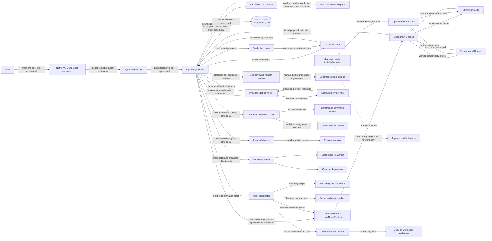
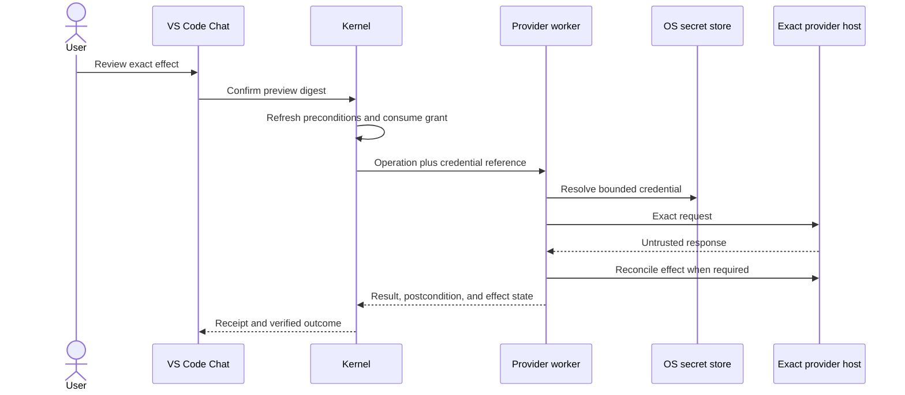

# AgentMage Runtime Boundaries

| Field | Value |
|---|---|
| Status | Derived architecture and verification specification; shared/Linux implementation in progress |
| Effective date | 2026-08-12 |
| Product authority | `PRD.md` |
| Security authority | `SECURITY-REVIEW.md` |
| Model admission authority | `MODEL-PROVENANCE-POLICY.md` |
| Delivery authority | `DELIVERY-SYSTEM.md` |
| Trusted-operations authority | `TRUSTED-OPERATIONS.md` |
| Whole-codebase audit authority | `CODEBASE-AUDIT.md` |
| Windows specialization | `WINDOWS-BOUNDARIES.md` |
| Model construction decision | `docs/decisions/0027-muse-first-model-neutral-runtime-and-evaluation.md` |

## 1. Purpose

This document gives reviewers and implementers one concrete description of AgentMage processes, privileges, sockets, lifecycle, and classified data flows. It does not replace the PRD or security baseline. A discrepancy blocks implementation until a decision record resolves it under the document-authority rule.

## 2. Trust Boundaries and Data Flow

Data labels on an edge describe the strictest expected class before the receiving boundary applies classification and minimization. `Ephemeral`, `Operational`, `Durable`, and `Restricted` retain their meanings from PRD Section 13. Model output, repository content, and external-product output are untrusted regardless of sensitivity.

The dotted handoff edge is not an AgentMage network path. It depicts a separate user action. The preview must identify restricted content, unresolved redactions, citations, and the fact that the destination's policies apply after the user discloses it.

## 3. Process Inventory

| Process or component | Authority | Explicitly prohibited |
|---|---|---|
| Visual Studio Code extension | Display, interaction, cancellation, and authenticated protocol transport | Workspace reads, raw model access, grant minting, key access, network transfer, and tool execution |
| Native bridge | Authenticate the installed extension and carry typed messages | Workspace, model, tool, key, and policy authority |
| AgentMage kernel | Policy, grants, orchestration, storage, receipts, classification, and approved adapter selection | Unreviewed ambient filesystem or network access |
| Sandboxed tool worker | One consumed grant and one bounded read-only workspace scope | Network, persistence, credentials, model access, and authority reuse |
| Native model service | Inference for one hash-pinned model profile | Workspace, tools, grants, credentials, and network authority |
| Docker Model Runner | Local inference for one digest-pinned model profile | AgentMage authority of any kind; non-loopback exposure; runtime artifact acquisition |
| Model-family codec | Translate one exact tokenizer, template, reasoning, message, end-token, streaming, and tool protocol into the closed proposal schema | Policy, grants, completion, workspace handles, credentials, network, runtime selection, automatic fallback, or accepting malformed/partial output |
| Deterministic proposal verifier | Validate proposal identity, schema, task/snapshot binding, policy, tool catalog, arguments, budgets, and postconditions | Model inference, semantic authority, grant minting outside the kernel transaction, or treating confidence/classifier output as completion |
| Model installer/importer | Bounded acquisition or user-selected import into staging | Workspace, session, tool, grant, operational-store, and inference authority |
| Review verifier | Read signed packages and synthetic evidence in an explicit test directory | Modifying user workspaces or trusting AgentMage summaries over raw evidence |
| Provider adapter worker | One destination-, account-, capability-, and operation-scoped credential reference and network grant | Raw workspace access, model authority, unrelated credentials, alternate hosts, ambient network, and grant reuse |
| Command execution broker | Validate command plans, effective command level, activation state, grant, worker profile, limits, cancellation, and receipt | Executing commands directly, minting authority, resolving raw credentials, or silently selecting Owner mode |
| Constrained command worker | One command grant under Inspect, Workspace Autonomous, or Connected Operations authority | Access outside declared paths, environment, credentials, network, descendants, persistence, resources, or time |
| Owner-session worker | Host-user command authority during one directly authenticated, expiring Owner / Unrestricted Session | Automatic elevation, hidden activation, scheduling, inheritance, renewal, survival after revocation, or undeclared secret injection |
| Public research worker | One query/retrieval grant, approved public destinations, bounded cache/download scratch, and citation capture | Authenticated browser reuse, private-context upload, external effects, credentials, workspace writes, or content-created authority |
| Credential broker | Validate typed references and resolve one secret inside the exact authenticated operation worker | Returning raw secret values to the kernel, model, shell plan, logs, diagnostics, exports, or backups |
| Local snapshot worker | Read classified canonical state and write one encrypted immutable local snapshot | Live-store relocation, plaintext snapshot output, provider network, model authority, or unrelated filesystem writes |
| Cloud backup worker | Read one completed encrypted snapshot and access one exact backup namespace | Plaintext access, live-store access, Cloud Observer mutation, unrelated cloud resources, model authority, or general provider writes |
| Model catalog and manager | Read signed catalog state and compile deterministic user-visible model operations | Artifact acquisition, admission self-approval, workspace authority, secret resolution, or inference |
| Experimental Model Lab worker | Load one quarantined unapproved artifact with synthetic corpus and bounded scratch | Network, credentials, commands, connectors, canonical workspace writes, approved-store writes, or direct promotion |
| Audit coordinator | Compile exact repository scope, deterministic work queues, model packets, reconciliation passes, checkpoints, and report state | Direct source reads or writes, parser execution, raw secret access, authority minting, hosted mutations, or treating model output as evidence without validation |
| Repository census worker | Enumerate one exact repository scope through read-only handles and produce path dispositions | Writes, links outside policy, network, credentials, model access, commands, silent exclusion, or completion claims |
| Parser and graph worker | Parse one bounded admitted source unit into exact structural records and edges | Canonical writes, network, credentials, model authority, unbounded plugins or descendants, and unsupported inference represented as fact |
| Audit verification worker | Run one approved command inside a disposable copy-on-write repository with bounded scratch | Canonical-root writes, hosted effects, credentials by default, undeclared network, writes outside disposable storage, or surviving descendants |
| Audit report compiler | Validate current evidence, coverage, contradictions, finding schemas, and report claims | Repository access, model inference, authority changes, unsupported certainty, or hiding non-pass coverage |

Every shipped process, helper, executable, interpreter, container, image, listener, socket, entitlement, and durable path appears in the release manifest and `agentmage doctor` diagnostics. An undeclared component or endpoint blocks startup or release.

## 4. Privilege and Installation

### macOS

- The user-facing package supports installation in a user-controlled location without requiring administrator access after installation.
- The host, bridge, XPC helper, model service, installer, and extension are signed and tied to the recorded release identity.
- The host uses App Sandbox and Hardened Runtime; the tool helper and native inference service receive only their declared entitlements.
- The workspace is selected through a native picker and represented by a read-only app-scoped security-scoped bookmark.
- Keychain stores encryption keys. No product process receives an exportable key unless the platform contract explicitly requires and tests it.

### Fedora and Ubuntu

- The native reference package installs and operates in user-owned locations as a standard user.
- Tool workers use fresh Bubblewrap isolation, read-only binds, seccomp, and user cgroup limits. Startup records whether user namespaces and the required confinement mechanisms are available; an unavailable mandatory control blocks the profile.
- Native `llama.cpp` is the security-reference inference adapter.
- The initial Linux native runtime package is a deterministic CPU-library-only
  b10333 bundle. It includes the upstream MIT notice, `libllama`, core `ggml`,
  and exact CPU backends; it excludes every upstream executable, server, RPC,
  downloader, utility implementation library, Vulkan backend, and model. The
  inactive AgentMage adapter remains the only product entry point.
- Docker Model Runner is a supported compatibility adapter only after its package, Docker Engine or rootless mode, container, socket, namespace, graphics, and local-API gates pass.
- Installing Docker Engine, Docker Model Runner, graphics drivers, or operating-system packages is an external platform prerequisite and is never hidden inside AgentMage's installer. Diagnostics state whether that prerequisite required elevated administration.
- Linux Secret Service stores the encrypted-store key.

AgentMage never describes a Docker-backed installation as wholly unprivileged unless the recorded Docker configuration proves that claim. Rootless Docker is evaluated separately; it is not assumed merely because AgentMage itself runs as a standard user.

### Windows 11

- The first-GA package is signed and timestamped MSIX installed per user and run as a standard non-administrator user.
- The Visual Studio Code bridge and kernel authenticate over an access-controlled named pipe using user, logon-session, integrity-level, executable/package, protocol, sequence, and fresh launch identity.
- Fresh AppContainer or equivalently reviewed restricted-token tool workers run under Job Objects with one workspace handle, one consumed grant, bounded scratch, no network, and denied ambient profile, registry, credential, clipboard, device, and process access.
- Handle-relative NTFS operations reject unsupported device, UNC, alternate-stream, reparse, link, alias, case, Unicode, rename, replace, and race states.
- DPAPI protects the operational data key and approved Credential Manager references protect provider credentials without exposing values to the model or process arguments.
- Native signed `llama.cpp` is the first-GA Windows model adapter. Docker, Docker Model Runner, and Windows Subsystem for Linux are not first-GA Windows runtime dependencies.

## 5. Local IPC and Socket Inventory

| Connection | Transport | Required controls |
|---|---|---|
| VS Code extension to bridge/kernel | macOS authenticated App Group IPC or Linux mode `0600` Unix socket | Peer identity, launch challenge, session binding, replay defense, version negotiation, size limits, and cancellation |
| Kernel to tool worker | Private per-operation IPC | One consumed grant, worker identity, bounded schema, timeout, descendant cleanup, and one terminal receipt |
| Kernel to candidate-neutral model adapter | Private local IPC, preferably a mode `0600` Unix socket | Exact model/artifact/tokenizer/template/codec/runtime/context/decoding/profile verification, process identity, no non-local bind, limits, cancellation, and no model authority |
| Kernel adapter to Docker Model Runner | Authenticated Unix socket to a dedicated guard; guard-only loopback connection inside the private runner namespace | Exact private wildcard bind and loopback connect target, immutable image/model digest, no non-loopback or ordinary-container access, no acquisition, egress proof, and local-client probes |
| Windows extension/bridge to kernel | Access-controlled named pipe | Exact user and logon session, integrity level, executable/package identity, fresh challenge, version, sequence, size limits, cancellation, and replay defense |
| Kernel to provider adapter worker | Private operation-scoped IPC | One consumed connected grant, exact host/tenant/account/capability, credential reference, byte/time budget, cancellation, result schema, and one terminal receipt |
| Provider adapter worker to approved host | Transport Layer Security to the exact granted destination | Host and certificate validation, redirect/proxy/DNS revalidation, bounded methods and bytes, no alternate credential use, effect reconciliation, and no workspace/model-store access |
| Kernel to command execution broker | Private authenticated IPC | Exact command plan, effective authority level, grant identity, activation state, limits, cancellation, and one terminal receipt |
| Command broker to constrained worker | Private per-command IPC | One consumed grant, exact process profile, path/environment/network/credential limits, descendant cleanup, and changed-file report |
| Command broker to owner-session worker | Private session-bound IPC | Direct-user activation record, current login-session identity, expiry, visible state, panic stop, sequence, command ledger, and forced descendant termination |
| Kernel to public research worker | Private per-research IPC | Exact query, destinations, recency, item/byte/media/download limits, disclosure state, cancellation, citations, and terminal receipt |
| Research worker to public destination | Transport Layer Security to exact approved hosts | Certificate, DNS, redirect, proxy, scheme, media, byte, archive, script, tracking, cache, and download-quarantine enforcement |
| Kernel to credential broker | Private authenticated IPC | Caller process identity, typed reference, exact provider/host/tenant/account/operation/scope, grant, expiry, and no raw secret response |
| Kernel to local snapshot worker | Private per-snapshot IPC | Exact source domains, classifications, exclusions, destination, encryption metadata, retention, limits, integrity, and atomic completion |
| Kernel to cloud backup worker | Private per-transfer IPC | Completed encrypted snapshot identity, exact account and backup namespace, credential reference, object/byte/rate limits, resume state, and terminal receipt |
| Cloud backup worker to backup host | Transport Layer Security to exact backup destination | Least privilege, opaque keys, no plaintext, redirect/proxy/DNS revalidation, integrity, version, retention, deletion, and no Cloud Observer credential reuse |
| Kernel to model manager | Private authenticated IPC | Exact catalog state, hardware facts, user-confirmed plan digest, installer launch identity, cancellation, activation result, and rollback |
| Experimental lab controller to lab worker | Private disposable IPC | One quarantined artifact, synthetic corpus, no-network policy, no secret/path authority, strict resources, cancellation, and residue report |
| Kernel to audit coordinator | Private audit-scoped IPC | Repository and audit identity, read-only capability grant, policy, resources, cancellation, checkpoint, and one terminal receipt |
| Audit coordinator to census worker | Private per-census IPC | Read-only root handle, exact path policy, source-control identity, file/byte/time limits, dispositions, errors, and no-follow rules |
| Audit coordinator to parser and graph worker | Private per-unit IPC | Exact admitted files or handles, parser/version, output schema, resource budget, cancellation, typed redactions, and no ambient plugin discovery |
| Audit coordinator to verification worker | Private per-command IPC | Disposable workspace identity, exact command, no canonical write handle, network and credential state, resource limits, descendant cleanup, and mutation attestation |
| Audit coordinator to model adapter | Existing private model IPC | Bounded redacted evidence packet, exact source references, audit/model identity, context and output limits, no repository handle, and untrusted observation result |
| Audit coordinator to report compiler | Private per-report IPC | Current census, structural graph, reconciled evidence, findings, gaps, profile, coverage rules, cancellation, and deterministic output schema |

Docker Model Runner's API is unauthenticated. A local address can prevent remote access but does not prevent other local processes from sending inference requests, and the pinned runner does not expose a supported host-bind setting. Decision 0030 pins the optional Linux compatibility tuple, records the rootful-daemon prerequisite, prohibits the ordinary AgentMage runtime user from holding host-equivalent Docker-group authority, prohibits Docker-socket and workspace mounts, and requires acquisition-disabled, no-tracking, zero-egress operation. It does not make the raw API safe. The Docker-backed strict-local profile therefore remains `BLOCKED` unless its implemented namespace, guard, firewall, socket, and platform boundary satisfy the approved threat model. The extension and tool workers never receive the raw endpoint.

Decisions 0031 and 0033 select the required Linux guard shape: Model Runner and a dedicated exact-identity guard share one private, route-free network namespace whose sole active interface is `lo`. The runner's immutable `0.0.0.0:12434` listener exists only there; the guard connects to `127.0.0.1:12434`. The guard exposes only a mode-`0660` Unix socket owned by the guard and grouped to the exact runtime user's primary group beneath a non-writable mode-`0710` parent. Group access is not authentication. An unforgeable permit is returned only for the exact guard UID, executable, cgroup, fresh challenge, inherited one-use secret, and authenticated kernel session; extension, tool-worker, unrelated-process, arbitrary-container, and undeclared caller classes are unconditional denials. The profile and contract are compiled; the production guard and collector are owned by Sub-task `9.2.1.5` before native Docker Engine and hostile-reachability evidence can begin.

Decision 0032 makes a complete fresh topology observation mandatory before Docker mode can be admitted. Preflight contract version 2 must match the configured collector protocol and administrator identity, daemon and socket identities, users and groups, private namespace, runner and guard process closure, private wildcard bind, guard loopback target, sole-loopback interface set, route closure, guard-socket metadata, immutable OCI manifests, mounts, cgroup limits, container privileges, and zero-egress state exactly. Missing, stale, replayed, partial, or drifted observations return one content-free terminal refusal and cannot activate a weaker Docker topology or claim a native fallback. The validator is compiled and package-bound; production collection, live execution, and hostile reachability remain separate gates.

## 6. Lifecycle

1. The separate installer/importer performs preflight, displays identity and license, acquires or imports into staging, verifies all hashes and manifests, runs malware and compatibility checks, activates atomically, and exits.
2. Offline startup verifies package, platform, policy, workspace, storage, process, socket, model, runtime, and installer-absence state before registering tools.
3. The kernel starts only declared helpers. Model services load one exact admitted, explicitly selected profile on demand and unload on cancellation, pressure, idle policy, disablement, shutdown, or incident containment. No family codec, classifier, model output, failure, or resource event can select or activate a replacement.
4. Each tool worker is fresh and operation-scoped. It terminates with descendants and scratch cleanup after success, denial, cancellation, timeout, or failure.
5. Shutdown closes sockets, unloads the model, completes or invalidates checkpoints, expires temporary authority, and records residue.
6. Uninstall removes product-owned packages and optional user-selected data according to the published procedure while preserving user workspaces and unrelated platform dependencies.
7. Owner / Unrestricted Session starts only from a direct authenticated user action and ends on expiry, panic stop, lock, logout, restart, policy change, emergency disablement, or integrity failure; termination includes every descendant.
8. A continuity run snapshots local canonical state into staging, encrypts and seals it, completes the immutable manifest atomically, and only then permits an optional cloud transfer. Restore occurs into separate staging and swaps only after integrity, compatibility, and user confirmation pass.
9. A model-manager operation launches the separate installer/importer for one confirmed catalog profile, keeps all acquisition in quarantine, and changes the active profile only through verified atomic activation or rollback. Muse-first evaluation priority and a Gemma catalog entry create no activation authority.
10. A whole-codebase audit freezes its exact source and scope identity, inventories the repository, builds deterministic structure, processes bounded semantic packets, reconciles cross-module evidence, and compiles a report. Cancellation checkpoints current work; removal terminates every audit worker and deletes only retention-selected audit state.

No AgentMage process silently persists as a system-wide daemon. Any user-session launch mechanism is declared, visible in diagnostics, removable, and tested for stop, restart, update, rollback, and uninstall behavior.

## 7. Proposal, Classification, and Completion Boundary

One inference run binds the exact model, artifact, tokenizer, template, family
codec, runtime build, quantization, modalities, context, decoding, platform,
hardware, driver, policy, evaluation profile, session, task, turn, model run,
context packet, repository snapshot, tool catalog, proposal, and correlation
identities. Streaming fragments are display data until the complete proposal
passes the closed decoder. Unknown fields, duplicate identities, invalid UTF-8,
trailing bytes, malformed tool arguments, partial output, stale snapshots,
replays, oversized values, unsupported versions, and ambiguous terminal claims
remain inert.

Data sensitivity, action risk, and model capability are separate typed inputs.
Static checks and deterministic deny-first policy run before learned or
model-based classification. A classifier may deny, narrow, redact, isolate, or
request user review. It cannot issue or widen a grant, override a denial, select
a prohibited destination, change the active profile, authorize an effect, or
establish completion.

The persisted agent loop records named terminal states: `SUCCESS`, verified
`NO_OP`, `BLOCKED`, `DECLINED`, `STALLED`, `EXHAUSTED`, `UNCERTAIN`, `CANCELLED`,
and `FAILED`. Only current deterministic postcondition evidence can produce
`SUCCESS` or verified `NO_OP`. Restart revalidates task, snapshot, policy,
profile, pending authority, consumed grants, and uncertain effects; model prose,
confidence, a model judge, or a classifier cannot convert any non-success state.

## 8. Runtime Parity and Evaluation Gate

Every enabled adapter for the same exact profile runs the same pinned corpus with
the same template, codec, context, decoding, tool schemas, limits, and evidence
rules. Quality profiles use the first-party recommended settings;
diagnostic-repeatability profiles pin the complete sampler and environment tuple
and remain separately reported. The gate records:

- Artifact, tokenizer, template, runtime, backend, and environment identities.
- Tool-call schema validity and malformed-stream behavior.
- Grounding, evidence-state, citation, uncertainty, and task-quality metrics.
- Streaming, cancellation, timeout, memory, context, and resource-pressure behavior.
- Prompt-injection, tool-authority, workspace, credential, and endpoint probes.
- Socket exposure, container reachability, Domain Name System activity, outbound attempts, and outbound bytes after acquisition.

Neither adapter, candidate, family, context, or decoding profile may borrow
another profile's result. A Docker failure blocks only the Docker profile unless
it reveals a shared-contract defect; a shared-contract defect blocks every
affected profile. Repeated output within one exact tuple is not evidence of
cross-runtime, cross-driver, cross-device, cross-release, or universal model
determinism.

## 9. Reviewer Evidence

Each release preserves a machine-readable process, privilege, entitlement, package, path, socket, container, and data-flow inventory. Before-and-after system snapshots, raw socket observations, packet captures, sandbox results, endpoint probes, install logs, and residue scans reconcile with that inventory.

The evidence distinguishes product behavior from Visual Studio Code, Docker, operating-system, endpoint-security, and unrelated user-process behavior. Local execution alone is never represented as proof of confidentiality or exclusive access.

## 10. Connected Delivery Topology

Connected operation is a removable capability pack, not a new kernel mode with ambient network authority.

File/tool workers and model workers never receive connected credentials or provider network access. Provider workers receive no arbitrary workspace handle. When a provider operation needs a repository artifact, the kernel supplies an exact bounded artifact or immutable hash through the work packet after classification and approval.

Read, draft, local-write, remote-write, execute, deploy, secrets, and admin capabilities are distinct registrations. The provider worker process may implement several classes in code, but each invocation receives exactly one class and cannot dispatch another class internally.

## 10. Provider Worker Lifecycle

1. The kernel verifies adapter package identity, manifest, provider version, support tuple, destination, account label, requested capability class, credential reference, limits, and current policy.
2. Read operations receive a temporary connected grant. Effectful operations also require refreshed preconditions and a user-confirmed preview digest.
3. A fresh or cleanly reset worker starts with one destination policy and no unrelated provider state.
4. The worker resolves the credential from the platform secret store after identity validation and never returns its value.
5. Redirects, callbacks, downloads, subrequests, and provider links are revalidated against the exact host and operation grant.
6. The worker returns a typed result and explicit effect state: effect, non-effect, partial, duplicate, or unknown.
7. Unknown and partial effects trigger reconciliation and block automatic retry.
8. Cancellation stops new requests, terminates bounded descendants, records whether an in-flight external effect is uncertain, and preserves only authorized evidence.
9. Worker shutdown clears credential material, closes sockets, deletes scratch, emits one terminal receipt, and proves residue state.

## 11. Cross-Platform Parity

Fedora, Ubuntu, and Windows 11 run the same delivery-object, adapter-lifecycle, grant, preview, receipt, reconciliation, and removal fixtures. Platform-specific process and network enforcement differs, but no platform may weaken host, tenant, account, credential, operation, effect, or evidence semantics.

## 12. Productivity, Finance, and Cloud Workers

The packs in [`PRODUCTIVITY-SYSTEM.md`](./PRODUCTIVITY-SYSTEM.md) use the existing operation-scoped
provider worker boundary with narrower domain rules:

- A communication worker receives one exact provider, tenant, account, sender, operation,
  destination, recipient or channel set, payload digest, attachment set, visibility, budget,
  credential reference, and consumed grant. It has no workspace, unrelated-account, or model-store
  access.
- A Proton Mail Bridge worker can reach only the authenticated loopback Bridge endpoint and the
  exact mailbox operation. Bridge credentials never enter the kernel model context or another mail
  adapter.
- Linux mail-client support uses provider or standard protocol workers. It does not write private
  Outlook, Thunderbird, Evolution, or KMail profile databases.
- A finance-import worker receives only the approved input and scratch output. A financial-data
  worker has one read-only account scope and no payment, transfer, trade, credit, tax, beneficiary,
  administration, or credential-recovery operation.
- A Cloud Observer worker has one provider, organization or tenant, account, subscription or
  project, region, service, resource, query, time, field, byte, and rate scope. It has no remote
  command, shell, deploy, write, secret-value, identity, policy, or administration operation.
- A cross-pack workflow coordinator holds descriptive plan state only. Each effect requires its own
  independently validated and consumed operation grant.

Provider content is classified and minimized before entering model context. Raw message bodies,
attachments, contacts, financial records, and cloud logs are not copied into general memory by
default. Pack disablement cancels queued work, reconciles in-flight effects, terminates workers,
removes network scopes, and preserves only retention-authorized receipts and evidence.

Fedora, Ubuntu, and Windows 11 run the same autonomy, communication, synchronization, financial,
cloud-observer, cross-pack, and removal fixtures. Platform-specific secret-store, sandbox, IPC, and
network enforcement can differ, but no platform may broaden a provider or domain capability.

Apple Silicon macOS retains the same shared contracts for its post-GA lane. Its unavailable evidence remains `BLOCKED-MACOS` and cannot be borrowed from Linux or Windows.

## 13. Trusted Operations Workers

The workers defined in [`TRUSTED-OPERATIONS.md`](./TRUSTED-OPERATIONS.md) never run as one shared
ambiently connected process:

- The command broker computes the effective command level outside the model. Constrained workers
  receive declared paths, environment, network, credentials, resources, and descendants. The Owner
  worker instead receives the explicit host-user session authority and a hard expiry; diagnostics
  state that this mode is not confined against commands the user authorizes.
- The public research worker receives no authenticated-browser profile or broad workspace handle.
  Any private disclosure is a separate classified input bound to the exact destination and grant.
- The credential broker resolves a typed reference only after validating the destination worker and
  exact operation. The kernel receives status and metadata, never the raw value.
- The local snapshot worker can read only selected canonical domains and can write only the staged
  encrypted snapshot. The cloud worker can read completed encrypted objects but cannot read their
  plaintext or local canonical stores.
- The model manager can read the catalog and hardware facts but cannot download. The separate
  installer/importer receives one confirmed artifact plan and no workspace or ordinary session
  authority.
- The Experimental Model Lab is a post-GA process and data root. Its network is denied, its corpus is
  synthetic, and it has no IPC route to command, credential, provider, backup, workspace-write, or
  approved-model activation services.

Pack disablement rejects new operations, expires grants, stops schedules, cancels or reconciles
in-flight work, revokes temporary network rules, terminates workers and descendants, closes sockets,
clears scratch and credential material, and preserves only retention-authorized receipts. Removal
then deletes product-owned caches, quarantines, incomplete snapshots, catalog extensions, and
provider registrations according to explicit retention while preserving user work and completed
user-selected backups.

## 14. Whole-Codebase Audit Workers

The workers defined in [`CODEBASE-AUDIT.md`](./CODEBASE-AUDIT.md) separate source authority,
deterministic analysis, model inference, disposable execution, and report completion:

- The audit coordinator receives one exact repository and audit identity. It owns the deterministic
  queue and checkpoint but has no direct source-write, command, credential, or hosted-effect path.
- The census worker receives read-only handles and records every path class and terminal
  disposition. It cannot follow a link, mount, worktree, submodule, archive, or external reference
  outside the exact policy.
- Parser and graph workers are fresh and bounded by source unit, parser identity, recursion,
  process, file, byte, output, time, and resource limits. Build scripts and repository plugins do
  not become parser authority.
- The verification worker receives a disposable copy-on-write repository. Commands that may write
  cannot reach the canonical root, and network and credentials remain absent unless the exact audit
  plan grants a separately reviewed acquisition operation.
- The existing model adapter receives only redacted bounded evidence packets and returns untrusted
  observations. It receives no repository handle, audit authority, completion state, or path grant.
- The report compiler accepts only current deterministic coverage, graphs, reconciled evidence,
  finding records, and gap states. It cannot infer missing coverage or suppress a blocker.

Audit checkpoints remain in the encrypted local operational store and bind source, scope, parser,
model, runtime, policy, graph, queue, evidence, contradiction, resource, and completion identities.
Changed input invalidates reverse-dependent records before reuse. Audit removal terminates workers,
deletes disposable roots, indexes, cards, checkpoints, findings, caches, and registrations according
to retention, and then proves the canonical repository and neighboring user data are unchanged.
