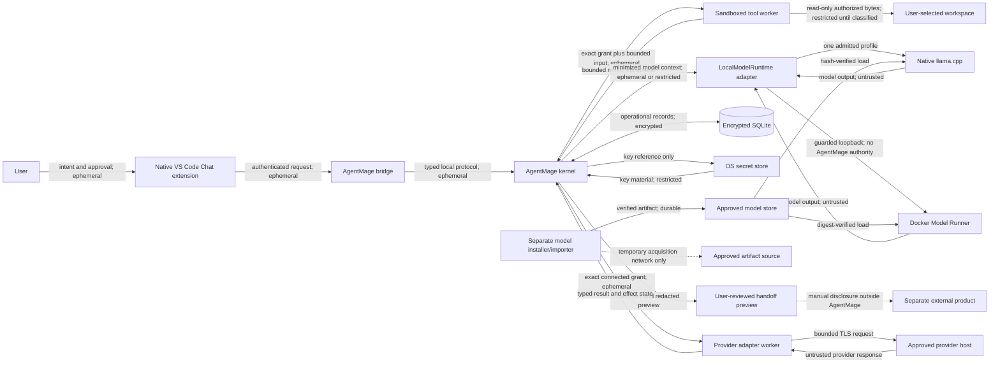
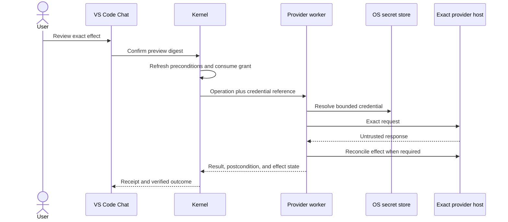

# AgentMage Runtime Boundaries

| Field | Value |
|---|---|
| Status | Derived architecture and verification specification; shared/Linux implementation in progress |
| Effective date | 2026-08-11 |
| Product authority | `PRD.md` |
| Security authority | `SECURITY-REVIEW.md` |
| Model admission authority | `MODEL-PROVENANCE-POLICY.md` |
| Delivery authority | `DELIVERY-SYSTEM.md` |
| Windows specialization | `WINDOWS-BOUNDARIES.md` |

## 1. Purpose

This document gives reviewers and implementers one concrete description of AgentMage processes, privileges, sockets, lifecycle, and classified data flows. It does not replace the PRD or security baseline. A discrepancy blocks implementation until a decision record resolves it under the document-authority rule.

## 2. Trust Boundaries and Data Flow

Data labels on an edge describe the strictest expected class before the receiving boundary applies classification and minimization. `Ephemeral`, `Operational`, `Durable`, and `Restricted` retain their meanings from PRD Section 13. Model output, repository content, and external-product output are untrusted regardless of sensitivity.

The dotted handoff edge is not an AgentMage network path. It depicts a separate user action. The preview must identify restricted content, unresolved redactions, citations, and the fact that the destination's policies apply after the user discloses it.

## 3. Process Inventory

| Process or component | Authority | Explicitly prohibited |
|---|---|---|
| Visual Studio Code extension | Display, interaction, cancellation, and authenticated protocol transport | Workspace reads, raw model access, grant minting, key access, network transfer, and tool execution |
| Native bridge | Authenticate the installed extension and carry typed messages | Workspace, model, tool, key, and policy authority |
| AgentMage kernel | Policy, grants, orchestration, storage, receipts, classification, and approved adapter selection | Unreviewed ambient filesystem or network access |
| Sandboxed tool worker | One consumed grant and one bounded read-only workspace scope | Network, persistence, credentials, model access, and authority reuse |
| Native model service | Inference for one hash-pinned model profile | Workspace, tools, grants, credentials, and network authority |
| Docker Model Runner | Local inference for one digest-pinned model profile | AgentMage authority of any kind; non-loopback exposure; runtime artifact acquisition |
| Model installer/importer | Bounded acquisition or user-selected import into staging | Workspace, session, tool, grant, operational-store, and inference authority |
| Review verifier | Read signed packages and synthetic evidence in an explicit test directory | Modifying user workspaces or trusting AgentMage summaries over raw evidence |
| Provider adapter worker | One destination-, account-, capability-, and operation-scoped credential reference and network grant | Raw workspace access, model authority, unrelated credentials, alternate hosts, ambient network, and grant reuse |

Every shipped process, helper, executable, interpreter, container, image, listener, socket, entitlement, and durable path appears in the release manifest and `agentmage doctor` diagnostics. An undeclared component or endpoint blocks startup or release.

## 4. Privilege and Installation

### macOS

- The user-facing package supports installation in a user-controlled location without requiring administrator access after installation.
- The host, bridge, XPC helper, model service, installer, and extension are signed and tied to the recorded release identity.
- The host uses App Sandbox and Hardened Runtime; the tool helper and native inference service receive only their declared entitlements.
- The workspace is selected through a native picker and represented by a read-only app-scoped security-scoped bookmark.
- Keychain stores encryption keys. No product process receives an exportable key unless the platform contract explicitly requires and tests it.

### Fedora and Ubuntu

- The native reference package installs and operates in user-owned locations as a standard user.
- Tool workers use fresh Bubblewrap isolation, read-only binds, seccomp, and user cgroup limits. Startup records whether user namespaces and the required confinement mechanisms are available; an unavailable mandatory control blocks the profile.
- Native `llama.cpp` is the security-reference inference adapter.
- Docker Model Runner is a supported compatibility adapter only after its package, Docker Engine or rootless mode, container, socket, namespace, graphics, and local-API gates pass.
- Installing Docker Engine, Docker Model Runner, graphics drivers, or operating-system packages is an external platform prerequisite and is never hidden inside AgentMage's installer. Diagnostics state whether that prerequisite required elevated administration.
- Linux Secret Service stores the encrypted-store key.

AgentMage never describes a Docker-backed installation as wholly unprivileged unless the recorded Docker configuration proves that claim. Rootless Docker is evaluated separately; it is not assumed merely because AgentMage itself runs as a standard user.

### Windows 11

- The first-GA package is signed and timestamped MSIX installed per user and run as a standard non-administrator user.
- The Visual Studio Code bridge and kernel authenticate over an access-controlled named pipe using user, logon-session, integrity-level, executable/package, protocol, sequence, and fresh launch identity.
- Fresh AppContainer or equivalently reviewed restricted-token tool workers run under Job Objects with one workspace handle, one consumed grant, bounded scratch, no network, and denied ambient profile, registry, credential, clipboard, device, and process access.
- Handle-relative NTFS operations reject unsupported device, UNC, alternate-stream, reparse, link, alias, case, Unicode, rename, replace, and race states.
- DPAPI protects the operational data key and approved Credential Manager references protect provider credentials without exposing values to the model or process arguments.
- Native signed `llama.cpp` is the first-GA Windows model adapter. Docker, Docker Model Runner, and Windows Subsystem for Linux are not first-GA Windows runtime dependencies.

## 5. Local IPC and Socket Inventory

| Connection | Transport | Required controls |
|---|---|---|
| VS Code extension to bridge/kernel | macOS authenticated App Group IPC or Linux mode `0600` Unix socket | Peer identity, launch challenge, session binding, replay defense, version negotiation, size limits, and cancellation |
| Kernel to tool worker | Private per-operation IPC | One consumed grant, worker identity, bounded schema, timeout, descendant cleanup, and one terminal receipt |
| Kernel to native model adapter | Private local IPC, preferably a mode `0600` Unix socket | Model/runtime hash verification, process identity, no non-local bind, limits, cancellation, and no model authority |
| Kernel adapter to Docker Model Runner | Guarded loopback endpoint scoped by the approved Linux boundary | Exact host and port, immutable image/model digest, no non-loopback or ordinary-container access, no acquisition, egress proof, and local-client probes |
| Windows extension/bridge to kernel | Access-controlled named pipe | Exact user and logon session, integrity level, executable/package identity, fresh challenge, version, sequence, size limits, cancellation, and replay defense |
| Kernel to provider adapter worker | Private operation-scoped IPC | One consumed connected grant, exact host/tenant/account/capability, credential reference, byte/time budget, cancellation, result schema, and one terminal receipt |
| Provider adapter worker to approved host | Transport Layer Security to the exact granted destination | Host and certificate validation, redirect/proxy/DNS revalidation, bounded methods and bytes, no alternate credential use, effect reconciliation, and no workspace/model-store access |

Docker Model Runner's API is unauthenticated. `127.0.0.1` prevents remote access but does not prevent other local processes from sending inference requests. The Docker-backed strict-local profile therefore remains `BLOCKED` unless its implemented namespace, proxy, firewall, socket, or equivalent platform boundary satisfies the approved threat model. The extension and tool workers never receive the raw endpoint.

## 6. Lifecycle

1. The separate installer/importer performs preflight, displays identity and license, acquires or imports into staging, verifies all hashes and manifests, runs malware and compatibility checks, activates atomically, and exits.
2. Offline startup verifies package, platform, policy, workspace, storage, process, socket, model, runtime, and installer-absence state before registering tools.
3. The kernel starts only declared helpers. Model services load on explicit demand and unload on cancellation, pressure, idle policy, disablement, shutdown, or incident containment.
4. Each tool worker is fresh and operation-scoped. It terminates with descendants and scratch cleanup after success, denial, cancellation, timeout, or failure.
5. Shutdown closes sockets, unloads the model, completes or invalidates checkpoints, expires temporary authority, and records residue.
6. Uninstall removes product-owned packages and optional user-selected data according to the published procedure while preserving user workspaces and unrelated platform dependencies.

No AgentMage process silently persists as a system-wide daemon. Any user-session launch mechanism is declared, visible in diagnostics, removable, and tested for stop, restart, update, rollback, and uninstall behavior.

## 7. Runtime Parity Gate

The native and Docker adapters run the same pinned corpus with the same model profile, template, context setting, decoding parameters, tool schemas, limits, and evidence rules. The gate records:

- Artifact, tokenizer, template, runtime, backend, and environment identities.
- Tool-call schema validity and malformed-stream behavior.
- Grounding, evidence-state, citation, uncertainty, and task-quality metrics.
- Streaming, cancellation, timeout, memory, context, and resource-pressure behavior.
- Prompt-injection, tool-authority, workspace, credential, and endpoint probes.
- Socket exposure, container reachability, Domain Name System activity, outbound attempts, and outbound bytes after acquisition.

Neither adapter may borrow another adapter's result. A Docker failure blocks only the Docker profile unless it reveals a shared-contract defect; a shared-contract defect blocks every affected profile.

## 8. Reviewer Evidence

Each release preserves a machine-readable process, privilege, entitlement, package, path, socket, container, and data-flow inventory. Before-and-after system snapshots, raw socket observations, packet captures, sandbox results, endpoint probes, install logs, and residue scans reconcile with that inventory.

The evidence distinguishes product behavior from Visual Studio Code, Docker, operating-system, endpoint-security, and unrelated user-process behavior. Local execution alone is never represented as proof of confidentiality or exclusive access.

## 9. Connected Delivery Topology

Connected operation is a removable capability pack, not a new kernel mode with ambient network authority.

File/tool workers and model workers never receive connected credentials or provider network access. Provider workers receive no arbitrary workspace handle. When a provider operation needs a repository artifact, the kernel supplies an exact bounded artifact or immutable hash through the work packet after classification and approval.

Read, draft, local-write, remote-write, execute, deploy, secrets, and admin capabilities are distinct registrations. The provider worker process may implement several classes in code, but each invocation receives exactly one class and cannot dispatch another class internally.

## 10. Provider Worker Lifecycle

1. The kernel verifies adapter package identity, manifest, provider version, support tuple, destination, account label, requested capability class, credential reference, limits, and current policy.
2. Read operations receive a temporary connected grant. Effectful operations also require refreshed preconditions and a user-confirmed preview digest.
3. A fresh or cleanly reset worker starts with one destination policy and no unrelated provider state.
4. The worker resolves the credential from the platform secret store after identity validation and never returns its value.
5. Redirects, callbacks, downloads, subrequests, and provider links are revalidated against the exact host and operation grant.
6. The worker returns a typed result and explicit effect state: effect, non-effect, partial, duplicate, or unknown.
7. Unknown and partial effects trigger reconciliation and block automatic retry.
8. Cancellation stops new requests, terminates bounded descendants, records whether an in-flight external effect is uncertain, and preserves only authorized evidence.
9. Worker shutdown clears credential material, closes sockets, deletes scratch, emits one terminal receipt, and proves residue state.

## 11. Cross-Platform Parity

Fedora, Ubuntu, and Windows 11 run the same delivery-object, adapter-lifecycle, grant, preview, receipt, reconciliation, and removal fixtures. Platform-specific process and network enforcement differs, but no platform may weaken host, tenant, account, credential, operation, effect, or evidence semantics.

Apple Silicon macOS retains the same shared contracts for its post-GA lane. Its unavailable evidence remains `BLOCKED-MACOS` and cannot be borrowed from Linux or Windows.
