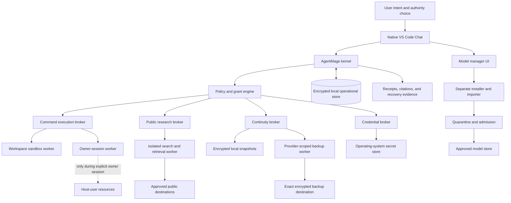

# AgentMage Trusted Operations, Research, Continuity, and Model Management Architecture

| Field | Value |
|---|---|
| Status | Normative first-GA architecture; post-GA Experimental Model Lab boundary retained |
| Effective date | 2026-08-12 |
| Product authority | `PRD.md` |
| Security authority | `SECURITY-REVIEW.md` |
| Model authority | `MODEL-PROVENANCE-POLICY.md` |
| Runtime authority | `RUNTIME-BOUNDARIES.md` |
| Whole-codebase audit authority | `CODEBASE-AUDIT.md` |
| Scope decisions | `docs/decisions/0010-trusted-operations-research-continuity-and-model-management.md`; `docs/decisions/0027-muse-first-model-neutral-runtime-and-evaluation.md` |

## 1. Purpose

This document defines the shared architecture for five capabilities that make AgentMage useful as a
complete local agent without quietly turning it into an ambiently privileged process:

1. A fully capable local command-line execution surface with explicit authority levels.
2. Current public Internet research with evidence, freshness, and hostile-content controls.
3. Operating-system-backed credential brokering for approved connected services.
4. Local-first, encrypted, versioned backup and optional cloud continuity.
5. An approved-model catalog and chat-guided model acquisition, verification, activation, and
   rollback workflow.

It also defines the post-GA Experimental Model Lab. The lab may evaluate arbitrary user-selected
model artifacts, but it cannot silently convert an unreviewed model into an authoritative AgentMage
runtime.

## 2. Non-Negotiable Invariants

- The model, prompt, webpage, repository, shell output, downloaded artifact, and connector response
  are untrusted inputs. None can mint, widen, or extend authority.
- Every operation is authorized by the kernel immediately before execution and produces one
  terminal receipt, including denial, cancellation, timeout, uncertainty, or failure.
- A capable shell language does not imply permanent ambient authority over the workstation.
- Only a user can activate Owner / Unrestricted Session authority. No model, task, schedule,
  workflow, plugin, webpage, or repository instruction can activate or renew it.
- Raw credentials never enter model context, prompts, chat transcripts, process arguments, shell
  history, ordinary logs, diagnostics, exports, or continuity snapshots.
- The canonical operational store remains local. Cloud continuity receives only client-side
  encrypted, versioned snapshot objects, never a live database or a writable model-store mount.
- Model acquisition and import are separate from model inference and from workspace, shell,
  connector, credential, and operational-store authority.
- A candidate model is not approved because it is described as open source, open weight, local,
  popular, or published by a familiar organization.
- Removing a connected or experimental pack restores the independently tested strict-local
  product without residual credential, network, process, schedule, model, or storage authority.

## 3. System Topology

No worker receives the union of these authorities. A task that researches a package, downloads an
approved model, changes a repository, and backs up the result is compiled into separate operations,
each with its own worker, grant, destination, inputs, limits, and receipt.

## 4. Authority Center and Command Execution

### 4.1 Command Authority Levels

The global Autonomy Center and command-specific policy intersect to produce one effective command
level:

| Level | Command authority | Required behavior |
|---|---|---|
| Disabled | No process execution | Tool remains unregistered or denies before launch. |
| Inspect | Bounded read-only commands | Exact executable, arguments, working directory, environment, limits, and receipt. |
| Workspace autonomous | Build, test, format, edit, and project-local dependency work inside approved roots | Workspace confinement, declared network and package operations, resource limits, cancellation, and changed-file accounting. |
| Connected operations | Exact commands needed for separately granted provider or delivery operations | One provider, account, destination, credential reference, effect class, and current grant; no general credential inheritance. |
| Owner / Unrestricted Session | Host-user command authority for an explicitly activated, expiring session | Fresh user authentication, persistent warning, automatic expiry, panic stop, complete command ledger, no silent privilege escalation, and explicit risk disclosure. |

The first four levels use constrained workers. Owner / Unrestricted Session deliberately permits
commands with the same broad filesystem, process, and network authority as the logged-in user. It
does not bypass operating-system controls and does not grant administrator or root authority by
itself. Because host-user authority can reach user-readable sensitive material, the product must
state plainly that confinement against commands executed in this mode is not guaranteed.

### 4.2 Owner / Unrestricted Session

Activation requires all of the following:

- A direct user gesture in the authenticated local interface.
- Fresh operating-system authentication when supported.
- A displayed scope, duration, working-directory default, network state, credential state, and
  explicit statement that host-user files and processes may be affected.
- A non-replayable activation record tied to the current user, device, login session, AgentMage
  release, and kernel launch.
- A continuously visible high-risk indicator with remaining duration and a one-action panic stop.
- Automatic revocation at the earliest of expiry, explicit stop, screen lock, logout, AgentMage
  restart, policy change, incident disablement, or integrity failure.

Owner mode cannot be scheduled, inherited by a child agent, activated from chat text alone, or
renewed automatically. AgentMage does not supply `sudo`, elevation, credential-broker values, or
selected secret environment variables unless the user separately authorizes that exact operation.
The initial environment remains minimized even though the spawned command otherwise runs with the
user's host authority.

### 4.3 Command Contract

Every command plan records:

- Shell or direct-executable identity and hash where available.
- Literal command, arguments, pipeline, redirections, substitutions, and interpreter boundaries.
- Working directory, readable and writable roots, expected changes, and rollback point.
- Environment allowlist, intentionally supplied credential references, and redaction rules.
- Network destinations and byte limits, child-process policy, resource budget, timeout, and output
  cap.
- Risk classification, effective authority level, approval or standing-policy source, expiry, and
  cancellation behavior.

Direct executable invocation remains preferred when it preserves semantics. Shell syntax is
supported when a task genuinely needs pipelines, redirection, expansion, scripting, or an
interactive program. Interactive processes use an explicit PTY contract and cannot outlive their
grant or authority session.

## 5. Public Internet Research

Public research is a distinct network capability, not generic browser or connector access. A
research plan records the question, query, recency requirement, allowed or denied domains, result
and byte limits, expected evidence, and whether downloads or screenshots are permitted.

The research subsystem must:

- Search current public sources and preserve query, provider, retrieval time, publication date,
  event date when known, URL, redirects, title, media type, relevant content hash, and cache state.
- Prefer first-party documentation, original research, official records, and primary data while
  allowing clearly labeled secondary corroboration.
- Attach claim-level citations and distinguish observed source statements from AgentMage inference.
- Revalidate time-sensitive facts instead of treating a cached answer as current.
- Enforce domain, scheme, redirect, Domain Name System, proxy, certificate, item, byte, archive,
  media-type, script, and download-quarantine boundaries.
- Treat instructions, tool requests, authentication prompts, hidden text, scripts, metadata, and
  downloaded content as untrusted evidence rather than authority.
- Keep public research cookies and state separate from authenticated browser sessions.
- Require a separate exact grant for authentication, form submission, upload, publication,
  purchase, account change, or any other external effect.

Private workspace, memory, communication, financial, credential, and connector records are not sent
to a research provider or website unless a separate disclosure preview identifies the exact fields,
destination, purpose, retention expectation, and user approval.

## 6. Credential Broker

AgentMage stores long-lived secrets only through the supported operating-system facility: Linux
Secret Service, macOS Keychain, and Windows Credential Manager or DPAPI-protected storage. Product
databases store typed, non-secret references.

The broker supports system-browser and device authorization OAuth flows, short-lived tokens,
scoped personal access tokens where unavoidable, certificate or Secure Shell agent references, and
provider-specific reauthentication. It records provider, host, tenant, account, scopes, creation and
expiry state, rotation state, and revocation state without recording the secret value.

A worker may resolve one credential reference only after the kernel validates its process identity,
provider, host, tenant, account, operation, scope, grant, and expiry. The value remains in bounded
memory for the operation, is never returned to the kernel or model, and is cleared when the worker
terminates.

Continuity snapshots exclude raw credentials and credential-store exports by default. A restored
installation reconstructs non-secret account references and requires reauthentication. Any future
portable credential export is a separately designed, independently encrypted product with its own
threat model; it is not implied by backup support.

## 7. Local-First Continuity and Cloud Backup

### 7.1 Canonical and Snapshot State

The encrypted local operational store and user-owned files remain canonical. AgentMage never runs a
live SQLite database, model store, queue, index, lock file, socket, or temporary directory from a
cloud-synchronized or network filesystem.

A continuity snapshot is immutable and contains a versioned manifest, encrypted data chunks,
integrity tree, source release and schema identities, classifications, retention, exclusions,
required model references, and restore prerequisites. Client-side authenticated encryption occurs
before a cloud worker receives any object. Object names and provider metadata reveal no plaintext
record names where the provider permits opaque keys.

### 7.2 Backup Destinations

First GA supports:

- A user-selected local destination with atomic snapshot completion.
- One fully conformance-tested reference cloud backup adapter.
- Additional S3-compatible, OneDrive, Google Drive, Box, Dropbox, or other adapters only after the
  same object, identity, encryption, retention, deletion, throttling, version, and restore matrix
  passes.

The Cloud Observer pack remains read-only. Backup writes belong exclusively to the Continuity pack
and can target only one declared backup container, bucket prefix, drive folder identity, or
equivalent opaque namespace. A backup credential cannot list or modify unrelated cloud resources.

### 7.3 Restore and Recovery

Restore verifies snapshot identity, encryption metadata, complete object set, hashes, schema and
release compatibility, rollback plan, available disk, and target ownership before changing local
state. It restores into staging, runs migration and consistency checks, displays included and
excluded domains, and swaps atomically only after explicit confirmation.

Required tests cover interruption, duplicate objects, missing chunks, stale manifests, corrupted or
replayed objects, revoked credentials, provider versioning, ransomware-like local deletion,
retention expiry, partial cloud deletion, cross-account confusion, rollback, and complete disaster
recovery on clean supported systems.

## 8. Approved Model Catalog and Chat-Guided Installation

### 8.1 Catalog States

Every exact model profile is in one of these states:

- `candidate`: named for evaluation but unavailable for ordinary use.
- `evaluating`: evidence collection is active; unavailable for ordinary use.
- `approved`: exact artifacts and supported runtime/platform tuples passed admission.
- `degraded`: usable only within published limitations.
- `quarantined`: disabled because integrity, security, provenance, or support changed.
- `rejected`: failed a non-waivable requirement.
- `retired`: no longer supported and unavailable for new activation.

The catalog records exact publisher, developer, model and artifact revision, origin and lineage,
license disposition, format, transformation, hashes, size, tokenizer, template, family codec,
runtime, context, decoding, modality, platform/hardware/driver support, measured resource envelope,
role, quality, diagnostic repeatability, security, support, and re-review state. Marketing names and
mutable tags are display metadata only.

### 8.2 Chat Workflow

A user can ask AgentMage to list compatible approved models, explain tradeoffs, install an approved
model, import an already downloaded artifact, verify an installation, activate a profile, compare
approved profiles, roll back, remove a profile, or free storage.

Before acquisition, the deterministic model manager displays the exact profile, publisher, license,
source host, artifact, tokenizer, template, codec, runtime, context, decoding, modality,
platform/hardware identities, expected size, required free space, measured hardware fit, network
use, destination, verification steps, and rollback. The user confirms the plan. The separate
installer then downloads or imports into quarantine, supports bounded resume, verifies hashes and
signatures, scans and validates the files, runs admission self-tests, and activates the profile
atomically. The model never downloads or approves itself.

Automatic comparison means AgentMage can execute a user-approved bounded sequence over approved
profiles. It does not mean silent acquisition, silent activation, automatic fallback, or bypass of
resource, origin, license, quality, or security gates.

### 8.3 Muse-First and Model-Neutral Candidate Strategy

Meta Muse Glimmer is the primary deep-evaluation candidate only. Its open-source or open-weight
classification, official model card, exact license and use terms, publisher artifact, lineage,
formats, transformation history, hashes, tokenizer, template, codec, runtime, context, decoding,
hardware fit, coding quality, tool behavior, repeatability, security behavior, and support state
must be verified from first-party evidence before an admission disposition is issued.

No release claim may describe Muse Glimmer as approved, supported, downloadable, open source, or
compatible until its exact profile receives `PASS`. A failed or incomplete admission does not block
another eligible exact profile or first GA when that other profile independently passes every
model and release gate.

The initial development inventory also reconciles every eligible official first-party Gemma model
from a pinned source freeze. Each exact entry receives role, applicability, provenance, policy,
artifact, runtime, hardware preflight, applicable suite, and result records. Safety, embedding,
specialist, research, multimodal, and legacy profiles cannot silently become coding planners;
hardware-incompatible entries receive visible `BLOCKED-HARDWARE` results. Other eligible
first-party candidates use the same intake. No family, catalog entry, or runtime compatibility
creates approval, automatic activation, or fallback.

## 9. Post-GA Experimental Model Lab

The Experimental Model Lab is a separate, visibly non-production capability for user-selected model
artifacts that are not in the approved catalog. It retains the project's model-origin rule unless a
later accepted decision explicitly changes that rule.

An experimental model initially receives:

- No credential references or secret-store access.
- No public or authenticated network access.
- No command execution, connected provider, messaging, finance, delivery, cloud, or backup
  authority.
- No canonical workspace write or operational-memory authority.
- Read access only to a disposable synthetic evaluation corpus and bounded scratch storage.
- Explicit CPU, memory, graphics, disk, context, output, duration, and cancellation limits.

Import records the user-selected source, artifact identity, observed license and provenance gaps,
hashes, quarantine state, and warnings. The lab runs deterministic format, parser, resource,
malformed-output, prompt-injection, tool-request, data-exfiltration, and quality evaluations. Results
remain labeled experimental.

Promotion into ordinary AgentMage use is never automatic. It requires the complete
`MODEL-PROVENANCE-POLICY.md` admission process, independent review, an approved catalog entry, and
fresh platform/runtime evidence. Deleting the lab removes its models, scratch, indexes, processes,
and network-denial rules according to selected retention without affecting approved models.

## 10. Whole-Codebase Audit Relationship

The first-GA whole-codebase audit in [`CODEBASE-AUDIT.md`](./CODEBASE-AUDIT.md) reuses trusted
operations without combining their authority. Audit census and parser workers are read-only and
have no network or credentials. Commands that may write use a disposable copy-on-write workspace
under an exact constrained command grant. The model manager supplies only an already approved
profile, and the model receives bounded redacted evidence packets rather than a repository handle.
Encrypted audit checkpoints are operational state, not continuity snapshots; backup includes them
only under the selected classification and retention policy.

Owner / Unrestricted Session is never an audit prerequisite and cannot be activated by repository
content, an audit plan, a semantic packet, a finding, or a recovery workflow. Public research,
provider connectors, GitHub writes, and external issue or history retrieval are separate evidence
sources with separate grants. A read-only audit cannot borrow their authority.

## 11. Verification and Removal

Every supported platform runs the same authority-state, command, research, credential, continuity,
model-manager, interruption, and removal corpus. Platform-specific enforcement may differ, but
another platform's result never substitutes.

The integrated gate must prove:

- Zero model- or content-created authority across all command levels.
- Deterministic activation, expiry, cancellation, panic stop, and residue removal for owner mode.
- Zero private-data disclosure during public research and complete citation/freshness evidence.
- Zero raw-secret appearance across model context, process metadata, logs, receipts, diagnostics,
  exports, crash output, and backups.
- Successful encrypted local and cloud restore from clean systems, plus fail-closed behavior for
  every corrupt, missing, stale, replayed, cross-account, and partial state.
- Zero model activation before exact admission and zero artifact substitution after preview.
- Structural absence of connected authority from the Experimental Model Lab.
- Complete restoration of strict-local operation after every trusted-operations pack is disabled or
  removed.

No feature-completeness result overrides a failed security, provenance, restore, removal,
accessibility, platform, or evidence gate.
