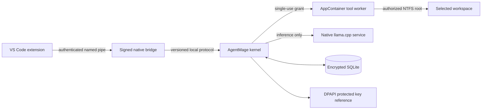

# AgentMage Windows 11 Boundaries

| Field | Value |
|---|---|
| Status | Normative first-GA platform architecture under Decision 0008 |
| Effective date | 2026-08-11 |
| Product authority | [`PRD.md`](./PRD.md) |
| Security authority | [`SECURITY-REVIEW.md`](./SECURITY-REVIEW.md) |
| Shared runtime authority | [`RUNTIME-BOUNDARIES.md`](./RUNTIME-BOUNDARIES.md) |

## 1. Scope

Windows 11 is a required v1.0 GA platform. The supported matrix begins with current serviced Windows 11 x64 releases, stable x64 Visual Studio Code, one standard non-administrator interactive user, NTFS workspaces, and the manifest-pinned native local-model profile. Windows on Arm, network shares, Windows Subsystem for Linux as an execution boundary, and containerized model inference remain disabled until separately promoted.

## 2. Process Topology

The extension has display and interaction authority only. The bridge transports authenticated protocol messages only. The kernel owns policy and storage. Each tool worker receives one consumed grant, one workspace handle, bounded scratch, process limits, and no network. The model service receives bounded prompt input and no workspace, credential, grant, tool, or network authority.

## 3. Packaging and Identity

- Ship an MSIX package signed with an Authenticode certificate and timestamp bound to the release manifest.
- Publish package, executable, library, extension, model, and configuration hashes.
- Install per-user and operate without administrator authority after installation.
- Reject elevated kernel, bridge, worker, model, or extension processes unless a separately designed maintenance operation explicitly requires and records elevation.
- Register no system service, driver, kernel extension, scheduled task, shell extension, browser extension, or machine-wide environment mutation in v1.0.
- Test installation, repair, upgrade, rollback, uninstall, and residue from a clean standard-user account.

## 4. Local IPC

The extension bridge and kernel use access-controlled named pipes. The server validates the connecting process token, user security identifier, logon session, integrity level, executable identity, package identity where present, protocol version, and fresh launch challenge. Pipe access control permits only the expected user and process boundary.

Every message is size-bounded, schema-versioned, sequence-checked, session-bound, cancellable, and replay-resistant. Handle inheritance is disabled unless explicitly needed. Wrong-user, elevated, low-integrity, unsigned, replaced, stale, replaying, and malformed peers are denied and receipted.

## 5. Workspace and Path Contract

The Windows adapter accepts only canonical workspace-relative `WorkspacePath` values and resolves them beneath an already-open authorized workspace handle. It rejects:

- Drive-relative, device, extended-length, volume-GUID, UNC, WebDAV, and named-pipe paths unless a later profile explicitly supports them.
- Traversal, NUL, alternate separators where ambiguous, trailing-dot or trailing-space aliases, reserved device names, and invalid Unicode.
- Reparse points, junctions, symbolic links, mount points, cloud placeholders, and changed file identities that escape or invalidate the approved boundary.
- Alternate data streams except the unnamed primary stream.
- Case-folding, short-name, normalization, hard-link, rename, replace, and time-of-check/time-of-use collisions.

The adapter uses handle-relative operations and verifies final path, volume, file identity, link count where relevant, access mask, and reparse state immediately before use. Display paths never carry authority.

## 6. Tool Confinement

Tool workers run in an AppContainer or equivalently reviewed restricted-token boundary with:

- No network capability.
- One read-only or explicitly granted writable workspace scope.
- No ambient profile, registry, credential, clipboard, desktop, camera, microphone, device, process, job-control, or neighboring workspace access.
- A Job Object controlling descendants, CPU, memory, process count, wall time, and termination.
- Mitigations appropriate to the shipped binaries, including data-execution prevention, control-flow protection, image-load restrictions, and child-process policy where compatible.
- A fresh worker and scratch directory per operation, followed by descendant termination and residue verification.

Windows Sandbox and Windows Subsystem for Linux are not treated as the product sandbox. The shipped and tested worker boundary is the only mechanism allowed to carry that claim.

## 7. Secrets and Storage

The operational database uses authenticated encryption with a random data-encryption key protected to the current user by DPAPI through a reviewed Windows cryptographic provider. Credential Manager may store provider credential references when its lifecycle and access behavior match the adapter contract. Secret values never enter model context, logs, diagnostics, receipts, crash dumps, command lines, environment variables, or repository configuration.

The strict-local data root must be a local fixed NTFS volume outside OneDrive, redirected profile folders, remote shares, removable media, and cloud synchronization unless a later profile explicitly supports and tests that location. Private persistence fails closed when the key, provider, location, ACL, or database integrity cannot be verified.

## 8. Native Model Runtime

Native signed `llama.cpp` is the Windows reference adapter. The runtime package and model artifacts are hash-pinned, scanned, admitted, and loaded from product-controlled per-user paths. The model process has inference authority only and no listening network socket. GPU acceleration is an optional manifest-bound profile; CPU fallback is explicit and never silently changes the resource or quality claim.

Docker Desktop, Docker Model Runner, Windows Subsystem for Linux, and other local servers are not first-GA Windows runtime dependencies. They remain separate future adapters with independent licensing, privilege, endpoint, isolation, provenance, and parity gates.

## 9. Connected Delivery Workers

Networked provider adapters run separately from no-network file and model workers. A connected worker receives one exact host, tenant, account, capability class, operation, byte budget, expiry, and credential reference. Windows Filtering Platform or an equivalently enforceable policy limits destinations where technically supportable; application-level host, TLS, redirect, proxy, and DNS checks remain mandatory.

Provider content is untrusted. Connected workers cannot access arbitrary workspace content, model stores, unrelated credentials, or another adapter's cache. Remote mutations use the lifecycle in [`DELIVERY-SYSTEM.md`](./DELIVERY-SYSTEM.md).

## 10. Endpoint Compatibility

The package must coexist with Microsoft Defender Antivirus, Windows Firewall, Smart App Control or applicable application control, endpoint monitoring, software inventory, and common per-user software deployment without disabling or bypassing them. The product publishes signed process, file, path, pipe, package, hash, and network indicators for reviewer reconciliation.

No blanket antivirus exclusion, firewall disablement, developer mode, test-signing mode, PowerShell execution-policy weakening, or system-wide long-path policy change may be required.

## 11. Windows Verification Gate

The Windows release gate requires:

- Three independent clean standard-user installations using published instructions only.
- Signature, timestamp, package identity, hash, component, dependency, and bill-of-material reconciliation.
- Named-pipe identity, ACL, replay, malformed-message, wrong-user, integrity-level, and replacement attacks.
- At least 1,000 path and race attacks spanning reparse points, hard links, alternate streams, aliases, case, Unicode, rename, replace, and device/UNC syntax with zero boundary escape.
- At least 500 ambient-access and sandbox attacks with zero unauthorized file, registry, process, credential, device, clipboard, or network access.
- A 60-minute strict-local run with zero AgentMage outbound attempts or bytes and no undeclared listener.
- Crash injection around every durable transition and remote-effect boundary with no repeated completed operation.
- Provider adapter conformance, cancellation, removal, and cross-account isolation on Windows.
- Visual Studio Code Chat keyboard, screen-reader, zoom, focus, cancellation, progress, error, and high-contrast verification.
- Install, upgrade, rollback, repair, safe mode, backup, restore, migration, uninstall, and residue tests.

Passing Linux or Apple Silicon evidence cannot satisfy a Windows result. Passing Windows evidence cannot satisfy another platform result.
