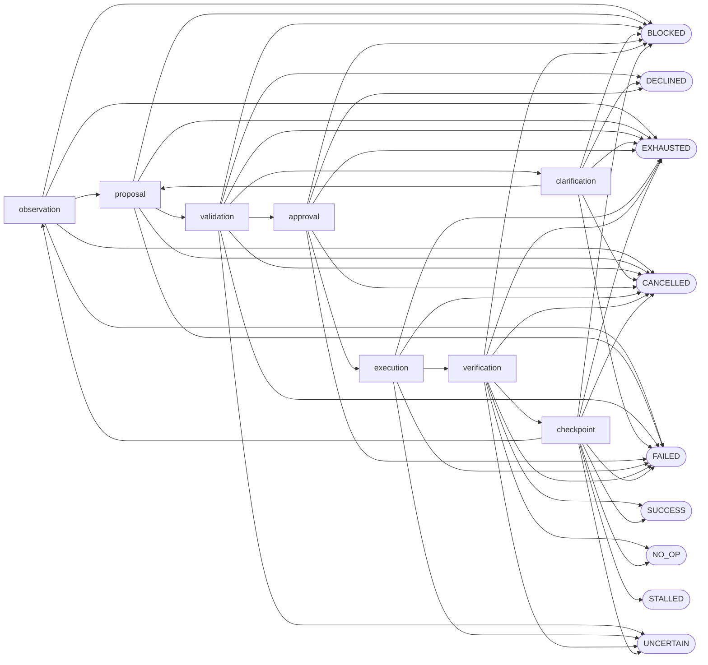

# Agent State Contract Reference

## Scope

This reference describes the version-one shared contracts and kernel controls completed by
Tasks 12.2.1.1 through 12.2.1.5. The Rust source remains authoritative for executable behavior.

## Contract Index

| Contract | Source | Schema | Purpose |
|---|---|---:|---|
| `AgentStateKind` and `AgentStateTransition` | `kernel/contracts/src/agent_state.rs` | Shared v1 | Active and terminal state vocabulary plus append-only revisions |
| `AgentProposal` | `kernel/contracts/src/agent_proposal.rs` | Shared v1 | Exact non-authoritative proposal identity envelope |
| `AgentRestartSnapshot` | `kernel/contracts/src/agent_restart.rs` | Shared v1 | Current task, snapshot, policy, profile, state, authority, grant, and receipt facts |
| `VerifierCandidate` and `PostconditionResult` | `kernel/contracts/src/agent_verifier.rs` | Shared v1 | Untrusted typed deterministic completion candidate |
| `AgentCeilingController` | `kernel/engine/src/agent_ceiling.rs` | Kernel v1 | Thirteen bounded runtime resource counters |
| `AgentStateController` | `kernel/engine/src/agent_state.rs` | Kernel v1 | Closed legal transition graph and restored-state lock |
| `ProposalAdmissionRegistry` | `kernel/engine/src/agent_proposal.rs` | Kernel v1 | Exact-turn proposal admission and replay refusal |
| `RestartReconciler` | `kernel/engine/src/agent_restart.rs` | Kernel v1 | Fail-closed restart and authority reconciliation |
| `VerifierRegistry` | `kernel/engine/src/agent_verifier.rs` | Kernel v1 | Opaque verified-completion proof issuer |

## State Vocabulary

| Class | State | Success | Terminal | Meaning |
|---|---|---:|---:|---|
| Active | `observation` | No | No | Gather bounded current evidence |
| Active | `proposal` | No | No | Hold one non-authoritative candidate |
| Active | `validation` | No | No | Validate exact identity, policy, and shape |
| Active | `clarification` | No | No | Await a material user answer |
| Active | `approval` | No | No | Await exact explicit authority |
| Active | `execution` | No | No | Run one separately authorized attempt |
| Active | `verification` | No | No | Evaluate deterministic postconditions |
| Active | `checkpoint` | No | No | Retain a safe bounded continuation point |
| Terminal | `SUCCESS` | Yes | Yes | Current deterministic postconditions prove changed completion |
| Terminal | `NO_OP` | Yes | Yes | Current deterministic postconditions prove work was already satisfied |
| Terminal | `BLOCKED` | No | Yes | A dependency or safe policy boundary prevents continuation |
| Terminal | `DECLINED` | No | Yes | The user declined requested authority or continuation |
| Terminal | `STALLED` | No | Yes | Repeated no-progress ceiling was exceeded |
| Terminal | `EXHAUSTED` | No | Yes | A non-progress resource ceiling was exceeded |
| Terminal | `UNCERTAIN` | No | Yes | Completion or possible effects cannot be established safely |
| Terminal | `CANCELLED` | No | Yes | Cancellation stopped work before verified completion |
| Terminal | `FAILED` | No | Yes | A typed terminal failure ended work |

## Legal Transition Graph

The graph has **17 states**, **289 ordered state pairs**, and **52 legal edges**. Every omitted edge
is illegal. Ordinary transition calls cannot enter `SUCCESS` or `NO_OP`; those two edges require
an opaque current `VerifiedCompletion` proof. Every terminal state is sticky.

## Proposal Identity

One proposal binds all of the following before admission:

| Field | Required invariant |
|---|---|
| `schema_version` | Exact supported shared-contract version |
| `proposal_id` | Unique admitted proposal identity |
| `session_id` | Exact current session |
| `task_id` | Exact current user-directed task |
| `turn` | Positive exact expected turn |
| `model_run_id` | Exact bounded model invocation |
| `context_packet_id` | Exact assembled context packet |
| `repository_snapshot_id` | Exact observed repository state |
| `tool_catalog_id` | Exact frozen available-tool catalog |
| `policy_id` | Exact deterministic policy revision identity |
| `correlation_id` | Exact related-record correlation identity |
| `proposal_sha256` | Lowercase digest of exact proposal material |

The registry admits one exact proposal for one turn. Partial, malformed, oversized, unknown-field,
duplicate-field, stale, future, replayed, competing, or identity-drifted candidates remain inert.

## Resource Ceilings

The runtime ceiling controller requires one positive limit for each of these 13 resources:

1. Turns
2. Input tokens
3. Output tokens
4. Context tokens
5. Retries
6. Denials
7. Tool calls
8. Effect attempts
9. Elapsed milliseconds
10. Memory bytes
11. Disk bytes
12. Process count
13. Repeated no progress

The exact inclusive limit is admitted. A one-unit overage is rejected without changing recorded
usage. Repeated no progress terminates as `STALLED`; every other first ceiling breach terminates as
`EXHAUSTED`. The first terminal breach is sticky.

## Completion Verification

A verifier registry freezes the exact verifier, task, admitted proposal, repository snapshot,
agent-state revision, and ordered unique postcondition identities. Each postcondition requires a
passing result and one or more current content-addressed evidence references. Model prose,
confidence, self-review, model-judge output, and classifier output are explicitly rejected sources.

`VerifiedCompletion` has private fields and no public constructor or deserializer. The state
controller consumes it only when its state revision is still current and the requested result is
`SUCCESS` or verified `NO_OP` from `verification` or `checkpoint`.

## Restart Reconciliation

A restored active state is transition-locked. Restart reconciliation compares:

| Current fact | Required result |
|---|---|
| Task | Exact identity match |
| Repository snapshot | Exact identity match |
| Policy | Exact identity and digest match |
| Selected profile | Exact identity and digest match |
| Agent state | Exact active state and revision match |
| Pending authority | None remains unresolved |
| Consumed grants | Every consumption resolves to one exact terminal transaction and receipt |
| Receipts | Ordered, content-addressed, unique, and terminal-bound |
| Possible effects | No launched, reconciling, or explicitly uncertain effect remains |

Only `RestartReconciler` can issue the opaque non-cloneable permit that unlocks the exact restored
state revision. Context drift, receipt replay or tampering, pending authority, unresolved consumed
grants, and uncertain effects cannot resume.

## Evidence Boundary

These contracts and focused deterministic tests do not establish encrypted agent-state-store
wiring, production model or worker provenance, platform adapter behavior, packaging, release
support, or manual fuzzing. Those remain assigned to later tasks and gates.
