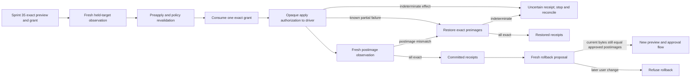

# Atomic Write Transaction and Rollback

## Boundary

Sprint 36 adds the kernel coordinator that consumes one exact Sprint 35 write grant, delegates the
bounded effect to a platform driver, verifies fresh postimages, restores known partial changes, and
emits a complete hash-chained receipt history. It also builds a fresh rollback proposal from retained
exact preimages. The Fedora implementation delegates one-file replacement and restoration to the
Linux descriptor-relative atomic exchange driver. It does not run post-write commands, access the
network, publish through Git, or prove crash durability or equivalent behavior on every supported
operating system.

## Requirement Traceability

| Legacy identity | Implementation | Focused verification |
|---|---|---|
| `S-029-I07` | `execute_write_transaction` consumes one exact grant, accepts ordered complete or partial driver reports, verifies postimages, and restores retained preimages after known partial failure | Complete success, pre-effect failure, partial failure, postimage mismatch, malformed report, uncertain effect, and restoration failure fixtures |
| `S-029-I08` | Every operation emits ordered hash-chained proposed, approved, applied, verified, failed, rolled-back, or superseded receipts with exact preimage, postimage, grant, transaction, sequence, time, and failure bindings | Legal transition pairs pass; mutation, reordering, truncation, identity drift, and illegal transitions fail |
| `S-029-I09` | Previewed formatter, test, build, migration, and other command labels return as unexecuted `SeparateVerificationRequirement` records | Successful transactions assert no command ran and every label requires a separate command grant |
| `S-029-I10` | `propose_fresh_rollback` observes every target and creates a reversed Sprint 35 shadow request only while current bytes exactly match the approved postimages | Exact postimages produce a new authority-free proposal; any later byte change refuses rollback |

## Authority Contract

The transaction coordinator accepts the exact approved `ShadowChangeSet`, `WriteApprovalReceipt`,
issued `CapabilityGrant`, current `PolicyEngine`, one bounded request, and an `AtomicWriteDriver`.
Before any effect delegation, the coordinator:

1. validates the transaction identity and retained approval bindings;
2. asks the driver for a fresh ordered observation of every held target;
3. reruns Sprint 35 preapply validation against those exact observations;
4. constructs the current deterministic policy context;
5. consumes the existing short-lived, single-use `WorkspaceWrite` grant; and
6. passes an opaque authorization token tied to that consumption into the driver.

The opaque apply and restore authorizations cannot be constructed by platform code. A platform
driver receives only the ordered operations and the appropriate token. This is an authority
interface. The Linux implementation additionally holds descriptors, stages in the authorized parent,
rechecks identity before exchange, and verifies the displaced object. Those controls have local race
fixtures, but they are not evidence that every mount, kernel, filesystem, or crash boundary is proven.

The Linux driver also reopens and compares the authorized parent before exchange and at every
post-exchange cleanup boundary. If a parent rename is detected while the displaced preimage still
exists, it exchanges the preimage back. If cleanup already removed that object, it reconstructs the
exact retained preimage in the held directory only while the approved postimage identity and bytes
still match. A competing target is never overwritten during reconciliation.

## Apply and Restoration Contract

An apply report must be internally consistent and ordered. Complete success names every operation
index and no failure. A known partial failure names one failure index and only its exact applied
prefix. A pre-effect failure names no applied index. An uncertain report makes no exact claim about
the resulting bytes.

After a claimed success, the coordinator freshly observes every target and compares object, path,
byte count, and SHA-256 with the approved postimage. A mismatch triggers restoration of every index
known to have changed. A known partial failure restores the exact applied prefix from Sprint 35's
retained preimage bytes. Restoration is accepted only after a fresh observation proves every target
equals its original preimage.

An indeterminate apply or restoration result is terminally `Uncertain`. AgentMage does not guess,
retry the write, or overwrite a later state. Dependent work must stop until a separate reconciliation
flow can establish current reality.

## Receipt Contract

Receipts form one ordered SHA-256 chain beginning at a fixed zero digest. Each digest commits to the
transaction and operation identities, monotonic sequence, lifecycle status, exact preimage and
postimage hashes, grant identity, kernel time, stable content-free failure code, and previous receipt
digest. `verify_write_receipts` recomputes the chain, checks every field against the approved change
set and grant, rejects every illegal transition, and requires a terminal state for every operation.

The legal per-operation transitions are:

- proposed to approved or superseded;
- approved to applied, failed, or superseded;
- applied to verified or failed; and
- failed to rolled back.

Terminal transaction outcomes are `Committed`, `FailedNoChange`, `Restored`, and `Uncertain`.
Receipt verification reconstructs operation history; it does not elevate an uncertain native state
into a known one.

## Rollback Contract

Rollback is not an undo method on a consumed transaction. It is a new authority-free Sprint 35
proposal. The rollback builder freshly observes every target and refuses unless all current bytes
still equal the exact approved postimages. It reverses each operation's preimage and postimage,
retains the original syntax, line-ending, generated-file, and scope rules, and supplies a new review
narrative. The result must traverse complete preview, explicit approval, grant issuance, immediate
revalidation, and transaction execution again.

This compare-before-propose rule preserves later user work. It does not yet prove native descriptor
continuity across the comparison and a later apply; that responsibility belongs to the native driver
and the complete Sprint 36 race matrix.

## Separate Verification

The transaction returns every previewed verification label with `executed` set to false and
`requires_separate_command_grant` set to true. Formatters, tests, builds, migrations, and all other
commands therefore remain outside write authority. The transaction coordinator contains no generic
shell, process, network, Git, or external-delivery path.

## Open Gate

The local in-memory and Fedora native-driver fixtures prove kernel state transitions, exact
restoration logic, one-file atomic exchange, stale-approval refusal, grant replay refusal, and
preservation of competing state during selected replacement, symlink, rename, and concurrent-writer
races. The Fedora subprocess matrix additionally stops without destructors at ten apply boundaries,
ten restoration boundaries, and immediately before and after apply/restoration verification; every
reopened target contains only the reviewed preimage or approved postimage. These results do not prove
real mount replacement, every boundary on every promised platform, authority/checkpoint-store crash
transitions, or machine/power-loss durability. Sprint 35 is also blocked, and independent transaction
review is absent. Sprint 36 remains blocked until those dependencies and the complete native
`S-029-ST01` and `S-029-RT01` evidence are current.
