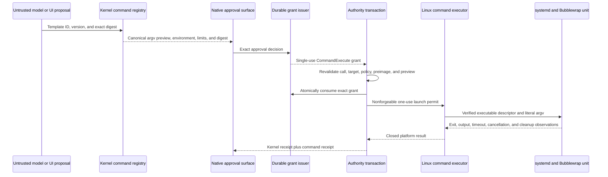

# Bounded Command Runner

## Status And Scope

Sprint 41 implements an inactive bounded-command subsystem for Fedora and Ubuntu development. It
does not activate command execution in the product, register a production command catalog, add a
generic shell, or satisfy `G-V0.3`. The implementation is a locally exercised dependency for later
coding capabilities.

The subsystem admits one complete, immutable direct-process template at a time. A model can propose
a registered template identity. It cannot choose an executable, append an argument, inherit an
environment variable, broaden a working directory, raise a limit, or create authority.

## Authority And Execution Flow

The only executable route is
[`CommandEffectDriver`](../../kernel/engine/src/command_runner.rs). It receives an opaque
[`EffectAuthorization`](../../kernel/engine/src/authority_transaction.rs) after the durable
transaction consumes one exact `CommandExecute` grant. The platform executor receives a
`CommandLaunchPermit` whose fields are private and whose constructor is unavailable outside the
kernel. Construction of a registry, preview, driver, or model response does not cross the effect
boundary.

## Exact Command Contract

`CommandSpec` binds all of the following into one canonical SHA-256 identity:

- schema, template identity, and immutable semantic version;
- absolute executable path and exact executable-content digest;
- a complete literal argument vector;
- the initial `empty_scratch` working-directory mode;
- a complete replacement environment;
- low or moderate review risk;
- mandatory exact-grant use and explicit noninteractive, offline, no-inheritance state; and
- wall-clock, output, memory, task-count, and CPU ceilings.

`CommandRegistry` is non-empty, bounded to 64 exact templates, rejects duplicate identities, and
resolves only an exact identity/version/digest tuple. A request contains no executable, free-form
argument, environment, path, or limit field. The preview renders argv as an ordered array rather
than a reconstructed shell string.

The current admission contract rejects:

- relative paths, parent components, malformed versions, digest drift, duplicates, and oversize;
- shell and interpreter executables, including environment launchers;
- shell substitution, separators, redirection, globbing, control bytes, and response files;
- configuration, evaluator, plugin, pager, editor, hook-helper, and loader-style argument prefixes;
- every environment variable except `LANG`, `LC_ALL`, `NO_COLOR`, and `TZ`; and
- interactive mode, network mode, inherited environment, or execution without a grant.

Repository commands are not in a production registry. Later repository work must use separately
reviewed templates and the repository-preservation controls in Sprint 42. It must not weaken this
contract or introduce a generic pull, shell, arbitrary setup command, hook, filter, pager, editor,
or credential-helper route.

## Linux Process Boundary

[`LinuxBoundedCommandExecutor`](../../platforms/linux/src/command_runner.rs) verifies and holds
root-owned, non-writable descriptors for `systemd-run`, `systemctl`, Bubblewrap, and each registered
executable. It reopens and hashes every launcher immediately before each attempt. Changed bytes,
links, writable ownership, missing executable bits, or registry/hash mismatch fail before launch.

The executor starts one random transient user unit with:

- `NoNewPrivileges`, SUID/SGID restriction, locked personality, control-group kill mode, and forced
  final `SIGKILL`;
- exact memory, task-count, CPU, stop-time, and runtime ceilings;
- a fresh Bubblewrap user, PID, IPC, UTS, cgroup, and network namespace;
- dropped capabilities, a fixed seccomp policy, private `/proc`, `/dev`, `/tmp`, and `/work`;
- only read-only runtime-library mounts, with no `/usr/bin`, home, workspace, credential, browser,
  SSH, cloud, or unrelated repository mount;
- the exact executable passed through a systemd `OpenFile` descriptor and mounted as
  `/app/command`; and
- an empty inherited environment followed by only the four safe fixed variables in the template.

The target is launched directly as `/app/command`. No shell parser, command string, `PATH` lookup,
interactive standard input, repository configuration, or network namespace is available. Model
text never reaches the process boundary as syntax.

Cancellation and timeout both request a control-group kill and stop, wait for the supervisor, and
verify through systemd that the unit is inactive or absent. Cleanup is not inferred from model text
or from a timeout request alone.

## Output, Resources, And Receipts

Standard output and error are drained concurrently to avoid pipe deadlock. The platform retains no
more than each declared byte limit while hashing and counting the complete observed streams. A
command receipt records:

- authority, operation, command, template, request, and preview identities;
- exited, cancelled, timed-out, output-limit, or launch-failed termination;
- deterministic operation outcome, exit code or signal, and stable platform code;
- complete stream digests, total bytes, retained bytes, and truncation state;
- monotonic elapsed time and verified descendant-cleanup state; and
- a canonical receipt digest.

Exit zero is the only successful process result. Nonzero exit, launch failure, and output-limit
termination are failures. Cancellation and timeout retain their own outcomes. A model narration is
not execution evidence.

The preview records configured memory, task, CPU, time, and output budgets. Current command receipts
record observed elapsed time and stream use. They do not yet retain platform-observed peak memory,
CPU time, or maximum concurrent tasks.

## Verification And Remaining Work

The retained injection corpus is
[`sprint-41-command-injection-corpus.json`](../verification/sprint-41-command-injection-corpus.json).
Kernel tests cover exact registry selection, shell/interpreter/environment denials, one-use grant
ordering, receipt classification, and cancellation before launch. Fedora live tests cover an exact
literal command plus real timeout and cancellation cleanup through the native isolation stack.

Sprint 41 remains blocked from closure until all of the following exist:

- an independently admitted production command registry and product configuration;
- complete native Fedora, Ubuntu, macOS, and Windows sandbox runs at minimum and maximum limits;
- hostile child and grandchild process-tree, descriptor, scratch, and crash fixtures;
- measured peak-memory, CPU, and task accounting where the platform can supply it safely;
- complete workspace/grant/network/credential canary campaigns;
- clean installed-package execution through the trusted launcher;
- independent command-boundary review; and
- deferred manual fuzzing and the upstream `G-V0.3` dependency.

No local fixture, Linux result, schema validation, or documentation check substitutes for those
missing gates.
