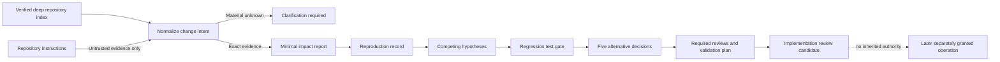

# Change Intent and Planning

## Purpose

Sprint 44 turns an exact deep repository index into a reviewable proposal before any
code is modified. The capability normalizes requested and current behavior, derives the
smallest cited impact surface, records reproduction outcomes and competing hypotheses,
requires an explicit regression-test disposition, compares material alternatives, and
selects required reviews and validation. It remains descriptive and grants no write,
command, Git, model, credential, or network authority.

The implementation is in
[`change_intent.rs`](../../capabilities/repository-map/src/change_intent.rs) and
[`change_plan.rs`](../../capabilities/repository-map/src/change_plan.rs). The public
wire contracts are
[`change-intent-record.schema.json`](../../schemas/runtime/change-intent-record.schema.json)
and
[`reproduction-record.schema.json`](../../schemas/runtime/reproduction-record.schema.json).

## Boundary

The functions accept immutable caller-supplied records. They do not inspect a live
filesystem, execute a reproduction step, run a test, create a decision approval, or
apply a change. `ready_for_implementation_review` means only that the descriptive
record is internally consistent.

## Intent Record

A change intent binds one deep-index digest to:

- requested and cited current behavior;
- exact current and target fact identities and their source citations;
- affected user classes and sorted acceptance checks;
- explicit exclusions, typed risks, and rollback procedure;
- one assessment or justified exclusion for every impact surface;
- material and nonmaterial clarification questions;
- every repository-instruction fact and citation rejected as authority.

At least one target fact must intersect the current-behavior evidence. Instruction
facts cannot be change targets. A material clarification produces
`clarification_required`; it cannot be overwritten by a model confidence score or a
repository instruction. Every accepted record has `mutation_authority = false` and an
exact recomputable digest.

## Minimal Impact

The impact report derives proposed paths only from target-fact citations. It always
assesses files, callers, data, permissions, tests, documentation, configuration,
migrations, interfaces, and dependencies. Each surface is one of:

- `evidence_backed`, with exact facts and canonical paths;
- `not_applicable`, with an explicit rationale;
- `unknown_blocked`, when current evidence cannot establish the answer.

The report is complete only when the intent is ready and no surface remains unknown.
An added path, changed fact, stale index, forged exclusion, or changed digest fails
deterministic verification.

## Reproduction and Hypotheses

A reproduction record binds exact environment, input, expected-result, observed-result,
log, and ordered step identities. Every step requires a separate later grant and has no
write authority. Outcomes are derived rather than asserted:

| Outcome | Required evidence |
|---|---|
| `reproduced` | Completed run, observed result, declared failure signature, and observed identity different from expected |
| `not_reproduced` | Completed run with an observed result but without the declared failure signature |
| `inconclusive` | Cancellation, timeout, or dependency failure without a declared observed failure |
| `unsafe_to_reproduce` | Policy denial, no observed result, no failure claim, and an explicit rationale |

Reproduction never proves root cause. A supported hypothesis requires a reproduced
failure and passing discriminating evidence or correlated logs. A rejected hypothesis
requires at least one failed check and a rationale. Inconclusive checks remain proposed.
Exactly one supported hypothesis may be selected.

## Regression and Alternatives

A reproducible defect cannot become review-ready until one of these states is explicit:

- an already cited failing test is retained inside the minimal target;
- a failing test is required before the fix, which blocks readiness;
- the test is unsafe or infeasible, with a rationale.

Nondefect work must use the explicit `not_defect` disposition. A test fact outside the
minimal target is unexplained scope and is rejected.

Every plan compares at least two options in each closed decision dimension:
architecture, dependency, access, cost, and irreversibility. Each dimension names one
selected option, a decision-record identity, evidence where available, tradeoffs, and a
rationale. The selected option is reviewable; this layer does not approve it.

## Reviews and Validation

Security, privacy, data, accessibility, performance, migration, and rollback reviews
are selected deterministically from typed risks and evidence-backed impact surfaces.
Rollback review is always present. Planned validation must cover every acceptance
check, use a closed validation class, require a separate grant, and retain
`write_authority = false`.

Status is derived in fail-closed order: clarification, incomplete impact,
reproduction, regression test, hypothesis, then implementation review. No status is a
success receipt, code-change approval, or release claim.

## Hostile and Golden Evidence

The fixed Sprint 44 corpus contains repository instructions that request broader scope,
test suppression, secret disclosure, unrelated edits, and false completion. The test
matrix verifies that the content never enters planning records, all instruction
citations remain auditable as rejected authority, and no instruction path becomes a
proposed change. A fictional two-file defect plan is compared with a checked golden for
paths, impact surfaces, required reviews, status, and authority.

The deterministic 10,000-mutation campaign changes source identities, status,
validation authority, selected alternatives, reviews, and record digests and requires
zero forged records to verify. This campaign is not manual or coverage-guided fuzzing.

## Current Limitations

- No production shell or coordinator projects user chat into these records.
- No trusted worker executes reproduction or planned validation steps.
- No production decision-record or scope-approval UI is connected.
- Live parser and language-service adapters and complete repository coverage remain
  blocked in Sprint 43.
- Native cross-platform, trusted-package, independent-review, and manual-fuzz evidence
  is absent.
