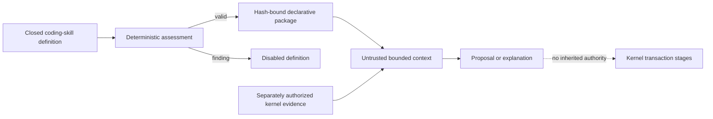
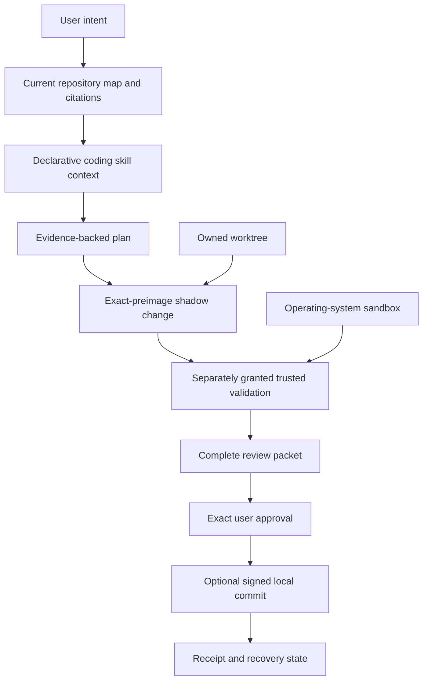

# Coding Skills and v0.4 Release Boundary

## Declarative Skill Layer

The v0.4 source candidate adds nine built-in coding skills: Repository Cartographer, Feature
Trace, Change Impact, Debugging, Test and Verification, Repository Documentation, Bug
Reproduction, Git History Analysis, and Bounded Review. Each skill is a hash-bound data-only
package admitted through the existing declarative-skill contract. A skill definition records its
exact workflow identity, bounded purpose, language coverage, advisory evidence sources, mandatory
validation classes, evidence-specific completion criteria, maximum path count, denied authority,
and the complete prohibited-operation set.

Definitions that contain vague completion, hidden authority, unsupported tools or languages,
missing validation, excessive path scope, identity drift, or incomplete exclusions are disabled.
Unsupported languages are lexical-only and visibly limited. Advisory tool names identify evidence
that an independently authorized kernel stage may supply; they do not let a skill invoke a tool.

The context receipt fixes filesystem, shell, secrets, network, connectors, approvals, grant
creation, tool registration, code execution, workspace expansion, memory promotion, and writes to
false. All thirteen prohibited autonomous operations are checked for every skill, including
commit, push, pull-request publication, merge, release, deployment, dependency upgrade, broad
refactor, migration, arbitrary shell, frontier handoff, network publication, and unattended write.

## Coding Transaction Composition

The planned integrated workflow composes existing kernel contracts without moving authority into
the model, skill, client, repository, or worktree:

An owned Git worktree isolates repository state but is not an operating-system sandbox. Every
read, write, command, review, and commit stage retains its own grant, currentness, path, process,
storage, receipt, cancellation, and recovery checks. A failed or stale stage cannot be reinterpreted
as success by a later stage. Local commit authority does not imply remote publication authority.

## Interface Boundary

Native Chat, interactive CLI, JSON, software-development-kit, and Agent Client Protocol surfaces
are thin clients to one kernel decision. They cannot mint grants, retain private canonical state,
invoke models directly, register tools, execute commands, or bypass offline policy. The source tree
contains a command parser and interface-neutral schemas, but no authenticated product transport or
coding coordinator currently composes the complete transaction. Consequently, no full Chat/CLI
workflow or parity claim exists.

## Release Boundary

The current v0.4 candidate is blocked. Local contracts and corpora do not prove a supported
installation, live admitted model, native interface workflow, cross-platform acceptance,
accessibility, upgrade, recovery, package signature, independent review, or manual fuzz campaign.
`G-V0.4` remains false and automatic publication remains structurally excluded until all owning
sprint gates and independent release evidence are current.
