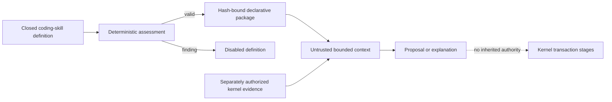
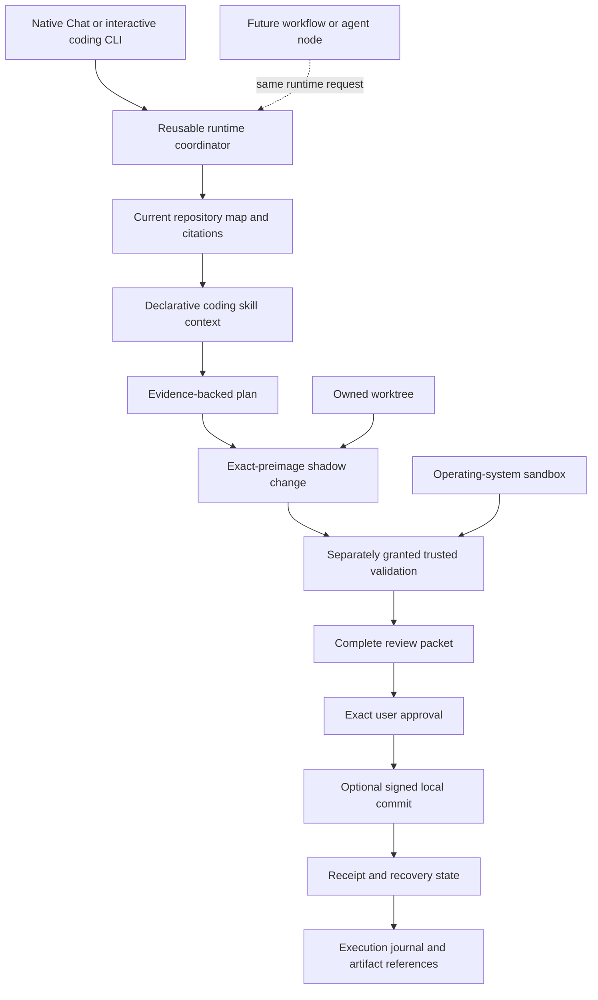

# Coding Skills and v0.4 Release Boundary

## Declarative Skill Layer

The v0.4 source candidate adds nine built-in coding skills: Repository Cartographer, Feature
Trace, Change Impact, Debugging, Test and Verification, Repository Documentation, Bug
Reproduction, Git History Analysis, and Bounded Review. Each skill is a hash-bound data-only
package admitted through the existing declarative-skill contract. A skill definition records its
exact workflow identity, bounded purpose, language coverage, advisory evidence sources, mandatory
validation classes, evidence-specific completion criteria, maximum path count, denied authority,
and the complete prohibited-operation set.

Definitions that contain vague completion, hidden authority, unsupported tools or languages,
missing validation, excessive path scope, identity drift, or incomplete exclusions are disabled.
Unsupported languages are lexical-only and visibly limited. Advisory tool names identify evidence
that an independently authorized kernel stage may supply; they do not let a skill invoke a tool.

The context receipt fixes filesystem, shell, secrets, network, connectors, approvals, grant
creation, tool registration, code execution, workspace expansion, memory promotion, and writes to
false. All thirteen prohibited autonomous operations are checked for every skill, including
commit, push, pull-request publication, merge, release, deployment, dependency upgrade, broad
refactor, migration, arbitrary shell, frontier handoff, network publication, and unattended write.

## Coding Transaction Composition

The planned integrated workflow composes existing kernel contracts without moving authority into
the model, skill, client, repository, or worktree:

An owned Git worktree isolates repository state but is not an operating-system sandbox. Every
read, write, command, review, and commit stage retains its own grant, currentness, path, process,
storage, receipt, cancellation, and recovery checks. A failed or stale stage cannot be reinterpreted
as success by a later stage. Local commit authority does not imply remote publication authority.

## Interface Boundary

Native Chat, interactive CLI, JSON, software-development-kit, and Agent Client Protocol surfaces
are thin clients to one kernel decision. They cannot mint grants, retain private canonical state,
invoke models directly, register tools, execute commands, or bypass offline policy. The source tree
contains a command parser, interface-neutral schemas, the reusable coordinator, a native coding
catalog, and a controlled Linux coding vertical slice. It still lacks the authenticated product
transport, real admitted-model client path, and complete durable host composition needed for a full
Chat/CLI workflow or parity claim.

The coordinator is shared kernel composition, not a second agent implementation. It binds one
runtime request to bounded agent state, an exact selected local model profile, bounded context, the
native tool registry and dispatcher, policy disposition, journal cursor, runtime artifacts,
cancellation, and terminal outcome. `ALLOW`, `ASK`, and `DENY` remain projections of the existing
grant transaction: only a current consumed grant reaches an effect, an approval request pauses
without effect, and a denial remains a no-effect result.

Built-in repository exploration, file read/search, patch, controlled create, command, validation,
and Git inspection tools register natively through the common dispatcher. MCP remains a later
extension adapter for reviewed external capabilities and is not inserted between the coordinator
and built-in tools.

## Earliest Interactive Harness Milestone

`M-HARNESS-MVP` is one interactive `agentmage code` session using one admitted local model, one
approved repository and AgentMage-owned worktree, native exploration/read/search, patch and
controlled-create tools, bounded commands, targeted tests, Git status/diff/log/show, protected
approval prompts, streaming and cancellation, bounded output with explicit truncation, current
receipts, and a final evidence-backed change summary.

The milestone excludes persistent session resume, the complete durable-journal and
content-addressed-artifact lifecycle, remote Git, commit, push, advanced deep indexing, measured
model routing, MCP, the complete conversation library, desktop UI, workflow design, and multiple
agents. Those capabilities retain their existing tasks and gates. Passing the milestone does not
close Sprint 48, Sprint 50, or `G-V0.4`.

## Workflow Attachment Point

A later workflow or agent node submits the same versioned runtime request or bounded work packet
and consumes the same events, artifacts, receipts, and terminal outcome. Its effective authority is
the intersection of workflow, node, parent, task, and user scope and can be narrower than an
interactive session. The runtime exposes no terminal or editor assumptions, so later deterministic,
validation, approval, execution, branch, retry, and multi-agent nodes compose around it rather than
replacing it.

## Release Boundary

The current v0.4 candidate is blocked. Local contracts and corpora do not prove a supported
installation, live admitted model, native interface workflow, cross-platform acceptance,
accessibility, upgrade, recovery, package signature, independent review, or manual fuzz campaign.
`G-V0.4` remains false and automatic publication remains structurally excluded until all owning
sprint gates and independent release evidence are current.
