# Controlled Filesystem Mutations

## Boundary

Sprint 37 adds five closed filesystem operations on top of the exact-preview and single-use-grant
boundaries from Sprints 35 and 36: create, exact structured patch, copy, move, and trash-first
delete. The model can propose an operation, but it cannot construct a grant, an apply authorization,
or a restoration authorization. No operation accepts a shell command, wildcard, recursive flag,
implicit parent creation, overwrite option, or permanent-delete option.

```mermaid
flowchart LR
    O["Held source and destination observations"] --> P["Authority-free operation plan"]
    P --> V["Exact operation-specific preview"]
    V --> A["Explicit approval"]
    A --> G["Single-use write or delete grant"]
    G --> F["Fresh source, parent, sibling, and destination observation"]
    F --> C["Atomic grant consumption"]
    C --> D["Opaque Linux driver authorization"]
    D --> E["No-replace create, patch, copy, move, or trash rename"]
    E --> H["Fresh bytes, hash, mode, and location verification"]
    H -->|"exact"| R["Hash-chained verified receipts"]
    H -->|"known mismatch"| B["Bounded reverse operation"]
    E -->|"indeterminate"| U["Terminal uncertain state"]
    B -->|"exact pre-state"| X["Rolled-back receipts"]
    B -->|"indeterminate"| U
```

## Plan And Preview

`build_filesystem_plan` accepts only canonical workspace targets already covered by a current
session-read grant. Existing sources carry an exact held regular-file target, complete bytes, mode,
and work-ownership disposition. New destinations carry an exact held parent directory, a direct
child path, and a bounded sibling snapshot. The planner rejects:

- sources or destinations outside the granted root or inside an exclusion;
- stale preimages, duplicate operation identities, and overlapping source/destination paths;
- missing destination parents, implicit hierarchy creation, and existing or case-folded names;
- changes to protected instructions, handoffs, source records, secrets, Git metadata, and internal
  state roots;
- mutation of unrelated or unclassified existing work;
- mixed trash and non-trash transactions; and
- file, aggregate-byte, path-depth, operation-count, patch, review, and directory-list overflows.

The fixed unit matrix exercises each exact resource ceiling and its one-over refusal, every
operation's nominal and missing/wrong-type state, case and Unicode collisions, empty content, and
permission variants from zero through `0777`. Inputs with undeclared mode bits fail before a plan
or grant exists.

Structured patches are closed JSON objects with ordered, one-based exact-old-line hunks. Unknown
fields, stale lines, overlaps, no-op results, malformed UTF-8, and a caller-supplied result hash that
does not match the complete computed postimage are rejected. Patch syntax never contains a path or
command.

The preview displays source and destination paths, source and postimage SHA-256 values, source and
destination modes, complete escaped create/patch content, operation hashes, rollback narrative, and
separately authorized verification labels. It states that overwrite, implicit parent creation, and
permanent deletion are false. Any changed plan, operation, preview, permission, path, patch digest,
policy, verification label, lifetime, or confirmation invalidates approval.

## Grant Contract

Ordinary plans derive one `WorkspaceWrite` grant. An all-trash plan derives one
`WorkspaceDelete` grant only when the decision separately confirms the high-risk delete preview.
Trash cannot share a plan with any other operation. The grant is valid for at most five minutes,
has a use limit of one, carries the complete plan hash as its argument identity, and binds exact
source targets, destination-parent targets, file preimages, operation-specific side-effect hashes,
and the preview digest.

Destination directories have no file preimage but remain exact held-object targets. Every source
file has an indexed preimage. Each side-effect hash includes the operation hash, operation kind,
source and destination paths, source and postimage hashes, modes, sibling and patch hashes, and the
separate verification set. A false decision or mismatched delete confirmation is inert.

## Transaction And Receipts

Immediately before consumption, the coordinator freshly observes every source, exact destination
parent, bounded sibling list, and destination. Cancellation, a stale source, changed mode, changed
parent, existing destination, or case-folded collision invalidates the grant before any driver
effect. Policy then revalidates the exact grant and atomically consumes it once.

The driver returns an ordered complete, known-prefix failure, or uncertain report. A claimed
success is accepted only after a fresh observation proves the exact bytes, SHA-256, mode, and
source/destination location for each operation. Known changes are reversed only through an opaque
restoration authorization. An uncertain apply or restoration advances the consumed grant to the
terminal `Uncertain` state and cannot replay.

Each operation emits a SHA-256-chained sequence of proposed, approved, applied, verified, failed,
rolled-back, or superseded receipts. Receipts bind operation kind, paths, source and postimage
hashes, modes, grant, transaction, sequence, time, failure code, and previous receipt hash. Tests,
formatters, builds, and other commands remain unexecuted and require separate command grants.

## Linux Implementation

The Fedora/Ubuntu implementation uses descriptor-relative path resolution with `openat2` beneath,
no-symlink, no-magic-link, and no-mount-crossing rules where supported, or the existing verified
descriptor walk. Regular files must be single-link objects. Parent directories and source files are
revalidated through exact adapter targets.

| Operation | Linux primitive | Collision behavior | Restoration |
|---|---|---|---|
| Create | Exclusive same-directory staging, file `fsync`, `RENAME_NOREPLACE`, directory `fsync` | Refuse | Remove only the exact approved new postimage |
| Exact patch | Exclusive staging and `RENAME_EXCHANGE`; verify displaced exact preimage before removal | Exact target required | Fresh exchange from exact postimage to retained preimage |
| Copy | Fresh exact source plus create sequence | Refuse | Remove only exact copied postimage; source remains |
| Move | Same-device `RENAME_NOREPLACE` and both parent `fsync` calls | Refuse | Reverse no-replace rename only from exact postimage |
| Trash delete | Same move primitive into an exact approved existing trash parent | Refuse; never unlink as the requested effect | Reverse no-replace rename only from exact trash postimage |

A multi-operation plan is not presented as one filesystem-wide atomic primitive. Each rename is an
atomic namespace operation where Linux supports it; a later known failure triggers exact reverse
operations for the applied prefix. Failure after an effect when durability or state cannot be
proven is visible as `Uncertain`, never guessed into success or restoration.

## Cross-Platform Status

| Platform | Implementation | Current evidence | Status |
|---|---|---|---|
| Fedora Linux | Native descriptor-relative driver | Local create/patch/copy/move/trash, collision, link, limit, and restoration tests | Implemented locally |
| Ubuntu Linux | Same Rust/Linux code path | No current native Ubuntu execution for Sprint 37 | Compatible design; evidence blocked |
| macOS | No Sprint 37 native driver | No Apple hardware execution | Blocked |
| Windows 11 | No Sprint 37 native driver | No native Windows execution | Blocked |

No Fedora result substitutes for another platform. Cross-platform parity, a complete race campaign,
disk-full and process-death recovery, write-worker operating-system isolation, and independent
review remain open release evidence.
