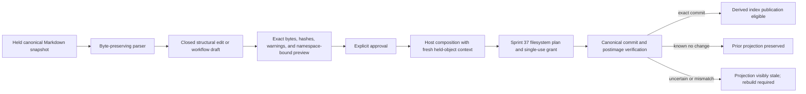

# Controlled Markdown And Knowledge Writes

## Boundary

Sprint 38 composes authority-free Markdown and knowledge previews into the closed filesystem
transactions introduced by Sprint 37. The model can propose exact bytes and a user can approve a
preview, but the knowledge capability cannot create a grant, open a path, write a file, publish an
index, launch Obsidian, invoke a plugin, execute a command, or access a network.

## Exact Markdown Model

`MarkdownDocument` retains the complete original byte sequence and records the detected line-ending
convention, stable frontmatter identity, structural elements, source ranges, raw-note regions, and
fidelity warnings. It recognizes frontmatter, ATX headings, ordinary lists, tasks, tables, fenced
code, Markdown links, wiki links, and text blocks. Fenced content remains inert and is not promoted
to a task or link.

The writer accepts only closed edits:

- set or insert one allowlisted scalar frontmatter field;
- replace the body of one unique heading;
- replace one exact structural line while retaining its structural kind; or
- replace one exact UTF-8 text span on a bounded line.

Every update binds the stable record identity and exact source SHA-256. The preview contains the
complete proposed bytes, postimage digest, changed source range, preserved-prefix and
preserved-suffix digests, parser warnings, and a digest over all displayed fields. The writer
reparses the postimage and rejects identity drift, line-ending drift, structural drift, ambiguous
headings, invalid UTF-8, mixed line endings, malformed frontmatter, oversized input, no-op changes,
and any change to a meeting note's `Raw Notes` section.

Raw HTML, reference-style links, duplicate headings, and setext-like headings are retained exactly
but produce visible fidelity warnings where semantic interpretation is incomplete. Unsupported
syntax is never silently normalized.

## Creation And Namespace Consistency

The creation coordinator supports task, decision, commitment, correspondence, meeting, handoff,
and memory workflows through one renderer. Each workflow has a closed section schema, a stable
path-independent identifier, an allowlisted scalar frontmatter surface, and explicit LF or CRLF
output. Meeting creation requires a `Raw Notes` section.

Memory creation additionally requires a promotion binding derived from an already approved durable
`MemoryItem`. The binding carries the memory identity, candidate digest, explicit decision digest,
and approved-content digest. The `Memory` section must hash to that approved content, all four
values are retained in canonical frontmatter, and the preview verifier recomputes the workflow
shape and content binding. A missing, rejected, stale, mismatched, or non-memory promotion proof is
refused before host composition.

A create preview is compared against a complete bounded namespace snapshot. Exact, case-folded,
and Unicode-normalized path collisions; duplicate identities; duplicate namespace entries; broken
wiki targets; prohibited targets; malformed digests; and resource-limit overflow fail closed. The
host subsequently requires the same namespace digest and derived-index revision together with the
fresh held destination parent and sibling snapshot. Namespace or directory drift therefore cannot
be translated into a filesystem draft.

No Obsidian application, plugin, cache, workspace file, or cloud API participates. Obsidian and
plain-folder canonical stores both delegate to the same `KnowledgeStore` preview implementation;
ordinary noncanonical Obsidian notes stay outside that view.

## Host And Filesystem Composition

The host exposes two authority-free composition functions:

- a verified creation preview maps only to one closed `Create` draft; and
- a verified update preview maps only to one exact whole-document `StructuredPatch` draft.

Composition requires an exact held directory or regular-file target, a matching workspace path,
valid mode, exact observed bytes, and clean or current-task-owned work. It does not issue grants or
apply effects. The kernel planner rechecks protected paths, limits, collisions, preimages, policy,
and approval before the native transaction can consume one grant.

Moves, renames, supersession, and trash deletion are separate single-file structural previews.
They always require an additional confirmation. A bulk structural action is not representable,
and permanent deletion is not a knowledge operation.

## Canonical-First Projection

`CanonicalKnowledgeMutation` binds the path, stable identity, expected preimage when present,
proposed postimage, and preview digest. A derived index can publish only after a verified canonical
commit reports the exact proposed SHA-256. A verified no-change failure preserves the prior
projection. Any mismatch, partial result, unknown result, or uncertain result requires a visible
stale state and deterministic rebuild from canonical Markdown.

The index is disposable. It cannot become canonical, overwrite source Markdown, hide a conflict,
or convert prompt text into durable memory. Memory promotion remains a separate explicit user
decision under the memory lifecycle contract.

## Current Evidence Boundary

Local unit and composition tests cover exact byte preservation, structure classes, line endings,
malformed and ambiguous input, protected raw notes, hidden metadata refusal, namespace collisions,
link validation, all seven creation workflows, high-risk structural previews, canonical-first
index publication, stale context, unrelated work, and exact kernel patch application.

Complete native crash and external-edit race injection, an end-to-end native knowledge-write
worker, non-Fedora execution, independent review, and deferred manual fuzzing are not yet proven.
Sprint 38 remains blocked until those dependencies and evidence are complete.
