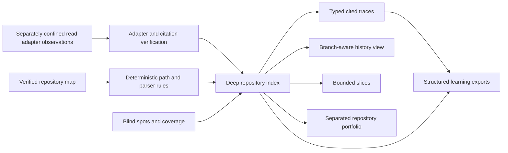

# Deep Repository Comprehension

## Purpose

Sprint 43 extends the bounded repository map into deterministic, source-resolvable
profiles, facts, traces, views, slices, and learning exports. It does not grant
filesystem, process, network, Git, model, or write authority. Repository content,
names, comments, documentation, configuration, and instructions remain untrusted data.

The implementation is in
[`deep_analysis.rs`](../../capabilities/repository-map/src/deep_analysis.rs) and
[`deep_views.rs`](../../capabilities/repository-map/src/deep_views.rs).

## Boundary

The capability accepts an already verified `RepositoryMap`. It cannot discover files,
run a parser process, invoke a language server, read Git history, or obtain source bytes
on its own. A platform host must perform those operations through separately reviewed
boundaries and supply exact observations.

## Evidence Model

Every retained fact has one explicit state:

- `observed` for an exact parser or confined-adapter observation;
- `derived` for a deterministic rule over observed repository records;
- `inferred` for a visible interpretation that is never presented as observed;
- `unknown_blocked` when admitted evidence cannot establish the relationship.

Every nonblocked fact contains one or more citations. A citation binds the workspace
path, complete file digest, optional exact byte/line range and syntax digest,
deterministic method or adapter identity, parser/grammar identity where applicable,
and exact repository/worktree/branch/commit identity. Index verification recomputes
the complete result and rejects stale source, parser, policy, branch, worktree, or
commit evidence.

Repository prose cannot create structural claims. Conventional path rules can derive
only their closed signal, such as a `Cargo.toml` package-manager/build signal or a
`.github/workflows` continuous-integration signal. Comments and strings are not used
to infer architecture, authentication, authorization, data flow, or completion.

## Repository Profile

The first rule set identifies only closed, reviewable classes:

- supported languages;
- exact conventional framework configuration;
- package managers and build artifacts;
- entry points, applications, services, and libraries;
- tests, continuous integration, configuration, scripts, schemas, and migrations;
- linter/formatter and type-system configuration;
- repository instruction files, explicitly marked untrusted;
- parser-backed modules, definitions, interfaces, symbols, and imports.

The profile is not a build-system emulator. A matching filename proves the presence of
that artifact, not that the repository builds, deploys, authenticates, or implements a
feature successfully.

## Analysis Adapters

`RepositoryAnalysisAdapter` is a closed, hash-bound descriptor for parser,
language-native, or language-server reads. It requires:

- an exact adapter and implementation identity;
- a stable implementation version and optional language;
- a sorted subset of definitions, references, calls, types, diagnostics, and symbols;
- `read_only = true`;
- `network_allowed = false`;
- `repository_execution_allowed = false`.

An adapter fact is admitted only when its capability matches its fact class, all
citations resolve to the current map, its method identity matches the registered
adapter, and its state is `observed` or `derived`. Model prose and unregistered adapter
claims cannot enter the index.

No production language-native or language-server process adapter is enabled by this
sprint. The contracts support separately confined future adapters without treating
their absence as coverage.

## Traces and Views

The trace set always contains architecture, feature, data-flow, authentication,
authorization, schema, migration, interface, test, continuous-integration, and
dependency records. A trace with no supporting facts is `unknown_blocked`. Feature
surface assembled from names and entry points is explicitly `inferred` because names
do not establish behavior.

History observations contain commit and parent object identities, changed canonical
paths, and a monotonic collector sequence. They do not contain diffs or source text.
The history view records whether the exact current commit was observed and whether the
collector truncated history.

Portfolio entries preserve repository, worktree, branch, commit, and index identity
separately. Cross-repository relationships remain absent until a later adapter supplies
separately cited evidence; indexes are never silently combined.

Documentation drift is represented only by one documentation citation, one or more
implementation citations, and an exact deterministic checker digest. Without such a
checker, the state must be `unknown_blocked`. A glossary is a label index, not a set of
invented semantic definitions.

## Large Repository Strategy

Slices can start from package/component facts, entry points, dependency facts, bounded
history paths, or exact user-selected fact/path/kind targets. Neighborhood expansion is
limited to facts sharing exact cited paths, with a maximum depth of four and maximum
output of 50,000 facts. A result records available, matched, returned, omitted, and
unresolved identities. All source-index blind spots remain attached to every slice.

This design supports piecewise review without claiming that a slice represents the
whole repository. A whole-repository claim is currently always prohibited. It remains
prohibited until every file and semantic relationship class has complete current
coverage under a separately approved future decision.

## Invalidation

The deep index binds the complete base-map digest. Any file, policy, freshness,
worktree, branch, commit, grammar, parser, or base-map change makes the index stale.
Adapter implementation, version, capability, authority, citation, or fact changes alter
the index digest. History, traces, slices, portfolios, and exports bind the exact deep
index identity and fail closed on stale substitution.

## Privacy and Side Effects

The index retains bounded labels and source identities, not complete source files,
comments, strings, command output, environment values, remote URLs, credentials, or
secret values. The hostile corpus embeds secret canaries in comments, strings, and
unsupported files and verifies that none appear in the index, trace set, or exports.

All Sprint 43 capability functions are pure over caller-supplied values. They do not
execute repository code, write files, modify Git state, contact a network, or authorize
a model/tool action.

## Current Limitations

- No production host collector supplies complete `.gitignore`, policy, history, or
  cross-repository observations.
- No confined language-native or language-server process adapter is active.
- Calls, references, types, diagnostics, authentication, authorization, and data-flow
  traces therefore remain visibly incomplete unless exact adapter facts are supplied.
- Complete native platform, packaged-worker, cancellation, parser-crash, and independent
  review evidence is absent.
- Manual fuzzing remains deferred and is not represented by the deterministic mutation
  campaign.
