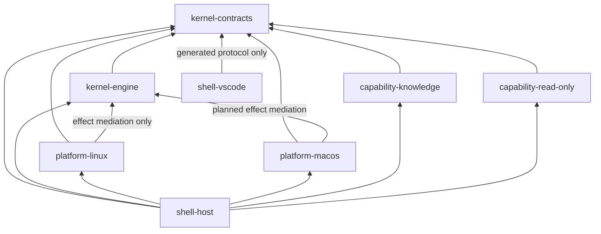
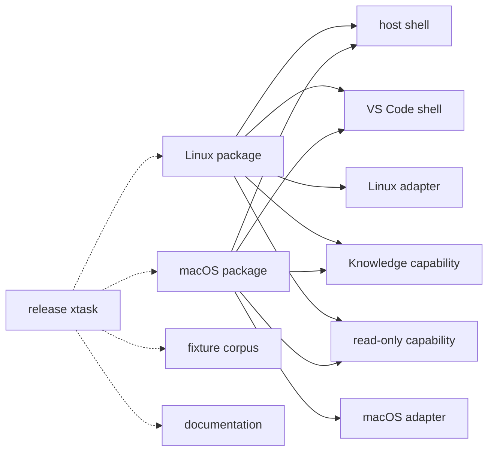

# Dependency Direction

AgentMage uses one-way compile dependencies so interface, capability, and
platform code cannot become kernel authority. The machine-readable source is
[`architecture/dependency-rules.json`](../../architecture/dependency-rules.json),
and `python3 scripts/dependency_rules.py` validates it against the repository
module inventory.

## Compile Graph

An arrow means the source may import the target. Contracts import nothing. The
kernel engine imports only contracts. An effect-bearing platform adapter imports
the kernel engine only for the consuming mediation interface and imports
contracts for shared values. Observation-only capability packs continue to
import contracts alone. Platform adapters and capability packs do not import
one another. Shells compose implementations but cannot be imported by any
authority-bearing lower layer.

The host's platform imports are mutually exclusive at build and package time.
Their common behavior is expressed through kernel contracts; no runtime selects
an undeclared adapter.

The platform-to-engine edge does not expose grant issuance, policy evaluation,
or transaction construction to the adapter. The engine issues an opaque,
non-cloneable permit only after consuming one exact grant, and the adapter's
driver method consumes that permit by value. Decision 0014 and the
[effect-mediation boundary](effect-mediation.md) define and test this amendment
to Decision 0004.

## Assembly Graph

Assembly and orchestration arrows are not source imports. Packaging may consume
verified output only for its declared platform. Release tooling invokes builds
and checks but cannot link to product internals, modify source, or waive a gate.

## Enforcement

- Every module has an exact import allowlist; undeclared imports fail.
- Kernel imports from a platform adapter, capability pack, or shell fail with a
  precise prohibited-edge diagnostic.
- Raw platform effects, shell-side process effects, permit forgery, and permit
  reuse fail dedicated source or compile-fail checks.
- Compile cycles fail.
- Linux and macOS package inputs cannot cross platform boundaries.
- Sub-task 1.1.1.4 binds these selected rules to actual Cargo, npm, and Swift
  manifests. The graph records current build-manifest edges and the Phase 8
  Linux implementation, but it does not claim an integrated host, package,
  supported platform, macOS implementation, or Windows implementation.
