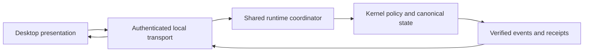

# Desktop Thin-Client Architecture

## Status

Sprint 76 selects a local thin-client architecture as a source-level contract. It does not claim a
packaged desktop application, platform support, native rendering, accessibility acceptance, or a
released workflow. The desktop projection depends on the existing authenticated local runtime
protocol and kernel-owned conversation, workspace, policy, grant, receipt, and checkpoint
identities.

## Boundary

The desktop client owns display state only. It has no external web service, canonical store,
filesystem traversal authority, model access, tool dispatcher, secret store, connector, approval
minting path, or direct effect implementation. All packaged assets must be local. Every displayed
action is an inert preview bound to an exact kernel request or existing protected grant.

## Selected contracts

- Navigation is a deterministic projection over kernel-owned conversation rows and supports exact
  local date, workspace, project, model, tag, status, pinned, and archived filters.
- Transcript items cover Markdown, links, tasks, backlinks, previews, citations, tools, approvals,
  errors, checkpoints, and branches. They are non-executable and cannot grant authority.
- Open, continue, branch, rename, archive, export, and delete remain request previews. Delete is
  rejected without a visible approval decision.
- Checkpoint comparison reports changes to files, instructions, repository, model, permissions,
  and next action without interpreting or modifying canonical state.
- Workspace and vault selection admits user-selected relative components only, grants no client
  path authority, and has no Obsidian dependency.
- Exact-diff, command, write, and delete screens bind operation, target, preview, policy, and
  optional existing grant identities. The screens apply no effect.

## Remaining evidence

Native Linux and supported macOS rendering, protocol parity, accessibility, hostile-boundary,
crash, clean-install, and package evidence remain external. No local contract result substitutes
for those artifacts.
