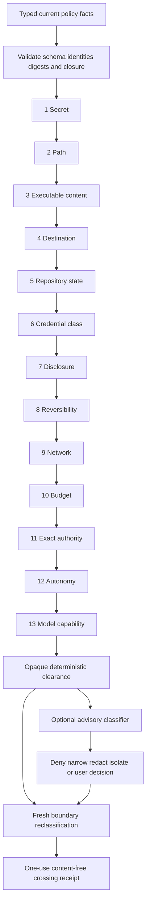

# Deterministic and Advisory Policy Reference

Status: implemented Sprint 12 contract reference  
Contract schema: `CONTRACT_SCHEMA_VERSION`  
Normative sources: `kernel/contracts/src/classification.rs`,
`kernel/engine/src/preclassification_policy.rs`,
`kernel/engine/src/advisory_policy.rs`, and
`kernel/engine/src/reclassification.rs`

This document is a review aid for the implemented policy boundary. The Rust
contracts and kernel gates remain authoritative. A learned or model-based
classifier can only reduce an already established deterministic boundary or ask
for a user decision. It cannot grant authority or establish completion.

## Evaluation Order

Any failed or malformed deterministic check stops evaluation at its exact
position. No advisory call is needed or permitted to reverse that result. An
empty complete advisory result means no additional restriction; it is not an
allow decision.

## Deterministic Policy Fact Table

`DeterministicPolicyFacts` is a closed 28-field record. Unknown JSON fields are
rejected. Digests are lowercase SHA-256 values and bounded identities are
validated before policy evaluation.

| # | Field | Deterministic meaning | Gate use |
|---:|---|---|---|
| 1 | `schema_version` | Exact shared contract version | Reject incompatible input |
| 2 | `fact_set_id` | Stable fact-set identity | Reject empty or oversized identity |
| 3 | `policy_id` | Exact policy identity | Bind evaluation to one policy |
| 4 | `policy_sha256` | Exact policy revision digest | Bind clearance and advisory use |
| 5 | `actor_id` | Bounded pseudonymous actor identity | Bind the requesting principal |
| 6 | `session_id` | Exact session identity | Bind the active session |
| 7 | `task_id` | Exact task identity | Bind clearance and later crossings |
| 8 | `action_id` | Exact action identity | Bind clearance and later crossings |
| 9 | `autonomy` | Current user-selected authority ceiling | Deny operations above the ceiling |
| 10 | `operation` | Canonical operation and authority class | Derive risk and required authority |
| 11 | `source` | Closed origin class | Describe the input trust origin |
| 12 | `source_sha256` | Exact source-identity digest | Detect source identity drift |
| 13 | `destination` | Closed proposed destination class | Reject unknown destinations |
| 14 | `destination_sha256` | Exact destination-identity digest | Detect destination drift |
| 15 | `path_state` | Resolved path-scope disposition | Require in-scope or inapplicable path |
| 16 | `path_sha256` | Exact resolved path identity digest | Detect path drift or substitution |
| 17 | `repository_state` | Clean, dirty, conflicted, detached, unborn, non-repository, or unknown | Deny conflicted and unknown state |
| 18 | `credential_class` | None, brokered, environment, file, platform store, or unknown | Deny exposed or unresolved credentials |
| 19 | `data_sensitivity` | Ephemeral, operational, durable, or restricted | Preserve a separate data dimension |
| 20 | `action_risk` | Minimal, controlled, elevated, or critical | Require exact operation-derived risk |
| 21 | `model_capability_role` | One of seven measured model roles | Name the required measured role |
| 22 | `model_capability_status` | Supported, unsupported, blocked, or unknown | Require current measured support |
| 23 | `reversible` | Mechanical reversibility flag | Deny irreversible write/deploy/admin effects |
| 24 | `network` | None, loopback, local network, internet, or unknown | Enforce connected-operation authority |
| 25 | `disclosure` | None, local, same-tenant, external, public, or unknown | Deny public, unknown, or unauthorized disclosure |
| 26 | `budget` | Within, at limit, exceeded, or unknown | Require strictly within budget |
| 27 | `exact_authority` | None, pending, current exact, stale, consumed, or uncertain | Require one current exact grant |
| 28 | `static_checks` | Complete ordered secret, path, executable-content, and destination observations | Run static checks before semantic classification |

## Deterministic Check Inventory

| Order | Check | Admitted condition | Denial class |
|---:|---|---|---|
| 1 | Secret | Static result is `clear` | `Secret` |
| 2 | Path | Static result is `clear`; path is `in_scope` or `not_applicable` | `Path` |
| 3 | Executable content | Static result is `clear` or `not_applicable` | `ExecutableContent` |
| 4 | Destination | Static result is `clear`; destination is not `unknown` | `Destination` |
| 5 | Repository state | State is not `conflicted` or `unknown` | `RepositoryState` |
| 6 | Credential class | No credential, or approved broker/store with exact authority | `CredentialClass` |
| 7 | Disclosure | Boundary is known, non-public, and within autonomy and exact authority | `Disclosure` |
| 8 | Reversibility | Local/remote write, deploy, and admin actions are reversible | `Reversibility` |
| 9 | Network | Requirement is known and connected use has exact authority | `Network` |
| 10 | Budget | State is exactly `within` | `Budget` |
| 11 | Exact authority | State is exactly `current_exact` | `ExactAuthority` |
| 12 | Autonomy | Operation authority class is within the selected level | `Autonomy` |
| 13 | Model capability | Required role is exactly `measured_supported` | `ModelCapability` |

Malformed schemas, identities, digests, risk derivations, or static-check sets
fail at position zero with `InvalidFacts`. The resulting
`PreclassificationClearance` is opaque and non-cloneable. It contains only the
fact-set digest, policy digest, task, action, and completed-check count; it is
not a grant and has no execution or completion method.

## Advisory Classifier Output Schema

`AdvisoryClassifierResult` is a closed ten-field record. It is accepted only
after deterministic clearance and only when task, action, and input digest
match that clearance exactly.

| # | Field | Constraint |
|---:|---|---|
| 1 | `schema_version` | Exact shared contract version |
| 2 | `classifier_run_id` | Bounded exact model or classifier run identity |
| 3 | `task_id` | Must match deterministic clearance |
| 4 | `action_id` | Required by the policy gate and must match clearance |
| 5 | `input_sha256` | Must equal the canonical deterministic fact-set digest |
| 6 | `status` | One of eight closed availability or quality states |
| 7 | `dispositions` | Unique subset of `deny`, `narrow`, `redact`, `isolate`, `escalate` |
| 8 | `confidence_basis_points` | Optional integer from 0 through 10,000; never authority |
| 9 | `rationale_sha256` | Digest of bounded rationale or result material |
| 10 | `evidence` | At most 64 content-addressed advisory evidence references |

The schema has no grant, operation, destination selection, model selection,
execution, denial-override, or completion field. Duplicate dispositions,
oversized evidence, malformed hashes, identity drift, and incomplete results
cannot produce an `AdvisoryBoundaryDecision`.

## Authority Matrix

| Capability | Deterministic gate | Complete advisory result | Classifier failure map | Reclassification gate |
|---|---|---|---|---|
| Validate current facts | Yes | No | No | Exact identity checks only |
| Deny an operation | Yes | May add `deny` | May block | May refuse crossing |
| Narrow scope | Establishes maximum boundary | May add `narrow` | Low confidence narrows | Requires replacement classification before crossing |
| Require redaction | Policy facts describe disclosure | May add `redact` | No | Refuses crossing while restriction remains |
| Require isolation | Policy facts describe boundaries | May add `isolate` | Out-of-distribution isolates | Refuses crossing while restriction remains |
| Require user decision | Through exact authority state | May add `escalate` | Disagreement requires user decision | Refuses crossing while restriction remains |
| Create or widen a grant | No | No | No | No |
| Override deterministic denial | No | No | No | No |
| Select or change destination | No | No | No | No |
| Select or switch a model | No | No | No | No |
| Execute an operation | No | No | No | No |
| Establish `SUCCESS` or verified `NO_OP` | No | No | No | No |
| Authorize one content crossing | No | No | No | Yes, only with a one-use opaque permit |

## Classifier Failure Map

Only incomplete or unavailable statuses enter failure mapping. The mapping is
fixed and does not depend on classifier prose, proposed dispositions, or
confidence magnitude.

| Classifier status | Deterministic action | Effect |
|---|---|---|
| `low_confidence` | `Narrow` | Reduce the existing boundary |
| `disagreement` | `UserDecision` | Require explicit user resolution |
| `out_of_distribution` | `Isolate` | Isolate content or processing |
| `truncated` | `Blocked` | Enter the non-success blocked path |
| `unavailable` | `Blocked` | Enter the non-success blocked path |
| `timed_out` | `Blocked` | Enter the non-success blocked path |
| `malformed` | `Blocked` | Enter the non-success blocked path |

`complete` is rejected by the failure mapper and must use normal advisory
application. Every failure decision remains bound to the deterministic fact-set
digest.

## Reclassification Trigger Inventory

Every newly observed revision in any listed content class requires fresh
classification before its next distinct trust boundary.

| # | Content kind | Typical trigger |
|---:|---|---|
| 1 | `read_content` | File, record, or other content is newly read |
| 2 | `tool_output` | Registered tool returns output |
| 3 | `patch` | Patch is proposed or produced |
| 4 | `diff` | Diff is proposed or produced |
| 5 | `message` | Email, chat, or other message enters or leaves a boundary |
| 6 | `attachment` | User or provider attachment is observed |
| 7 | `connector_result` | Connector or provider returns content |
| 8 | `summary` | Summary is generated or imported |
| 9 | `diagnostic` | Diagnostic content is generated or received |
| 10 | `export_payload` | Payload is assembled for export |

The eight trust boundaries are `ingest`, `kernel`, `model_context`,
`tool_input`, `persistence`, `user_display`, `export`, and `network`. Source and
destination must differ, yielding 56 directed boundary pairs for each content
kind. Each request binds the content digest, observed revision, sensitivity
assessment, task, action, and deterministic fact-set digest.

Fresh content-addressed sensitivity evidence is mandatory. Any advisory
restriction prevents crossing until a separately typed transformation and new
classification resolve it. Restricted content cannot cross to `network`. A
successful gate mints one opaque, non-cloneable permit that produces one
content-free receipt and cannot be replayed for another revision or boundary.

## Review Limits

- These contracts do not collect platform facts or execute operations.
- Redaction, narrowing, and isolation transformations are owned by later
  integration tasks; this gate only refuses a crossing while they remain due.
- Production persistence, UI presentation, provider adapters, cross-platform
  execution, packaging, release acceptance, and manual fuzzing remain later
  tasks and gates.
