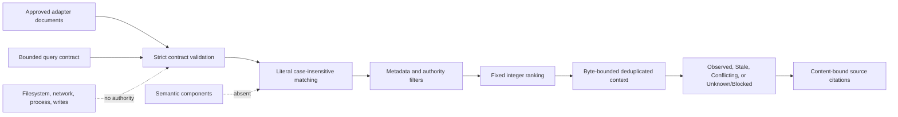

# Deterministic Knowledge Retrieval

## Purpose

Sprint 29 adds a pure, bounded retrieval decision engine over source documents supplied by an
approved knowledge adapter. It searches exact terms and phrases, filters explicit metadata,
orders candidates through a fixed integer table, assembles byte-bounded context, and preserves
source identity, range, hash, freshness, conflict, and denial state. It introduces no model,
embedding, reranker, regular-expression engine, filesystem access, network path, process launch,
or write authority.

## Contracts and Limits

Every source document carries one authorized root, canonical workspace-relative path, closed file
type, closed authority class, observed and current SHA-256 digests, verification date, source date,
optional normalized note kind, historical/denied markers, and bounded source fragments. Every
fragment retains its closed kind, exact text, one-based UTF-8 byte-column range, and optional
normalized fact key.

Queries require at least one literal term or phrase, at least one approved root, file type, and
authority class, an explicit as-of date, and nonzero result/context budgets. Dates are strict
Gregorian `YYYY-MM-DD` values. Digests are lowercase SHA-256 values. Paths are already normalized
kernel values and must belong to both the source's declared root and one queried root.

The fixed upper bounds are 100,000 documents, 100,000 fragments per document, 64 query items, 256
bytes per item, 1,000 results, 4 MiB assembled context, and 1 MiB per source fragment. Any invalid
contract or exceeded fixed bound fails before retrieval.

## Matching and Ranking

Terms and phrases are Unicode-lowercased and then treated as literal substrings. Every requested
item must occur in one fragment. Query text never becomes a regular expression, path, instruction,
command, or model prompt. Metadata filters run before candidate construction. Historical records
are excluded unless the query explicitly includes them.

The score table is additive and versioned by source:

| Factor | Points |
|---|---:|
| Each exact phrase | +100 |
| Each exact term | +20 |
| Title / heading / field | +30 / +28 / +26 |
| Tag / task / date / link | +24 / +22 / +20 / +18 |
| Metadata / body | +16 / +10 |
| Canonical Markdown / direct evidence / derived projection | +40 / +30 / +0 |
| Current / stale digest | +25 / -50 |
| Current handoff note | +30 |
| Explicit historical source | -25 |
| Verified within 30 / 180 days of query as-of date | +15 / +8 |

Future verification dates are invalid. Equal scores sort by canonical path, exact range, and
citation digest, so input order cannot change output. Every hit retains the complete score trace.

## Evidence and Citations

The citation digest binds the canonical path, observed content hash, exact range, and fragment
kind. Context deduplicates exact text in ranked order, retaining the highest-ranked citation, and
admits only complete UTF-8 strings that fit the byte budget. A candidate omitted by result,
deduplication, or byte limits remains counted.

Current fragments sharing one fact key but different exact values produce `Conflicting`. Any
returned stale source produces `Stale` unless conflict takes precedence. Current nonconflicting
evidence produces `Observed`. No admissible or budget-fitting evidence produces
`UnknownBlocked`. Denied matching sources are counted without exposing their content. Obvious
secret candidates are omitted before ranking and context assembly.

The synthesis envelope copies the exact evidence state, bounded context, admissible citation set,
and conflict keys. Deterministic rendering rejects a draft that changes the state, uses missing or
duplicate citations, contains control characters, exceeds the answer bound, supplies an uncited
nonblocked answer, or supplies any proposed answer for `UnknownBlocked`. The latter renders only a
fixed no-evidence response. This is an enforceable boundary for later synthesis, not a model or a
claim that application wiring already exists.

## Current Boundary

The engine accepts complete adapter-owned source documents and returns a source-traceable result.
It does not yet bridge raw canonical/Obsidian stores and rebuilt indexes into that contract, nor
does the application yet invoke the completed synthesis/final-rendering contract. Those
integrations, upstream Sprint 28 closure, and independent Sprint 29 review remain required before
the sprint can pass. Optional semantic retrieval remains entirely deferred to Sprint 30.
