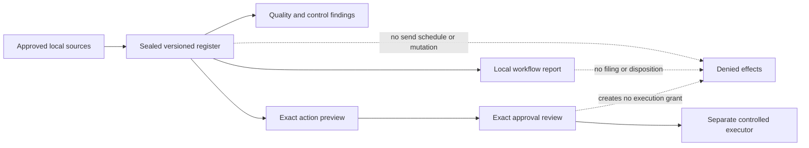
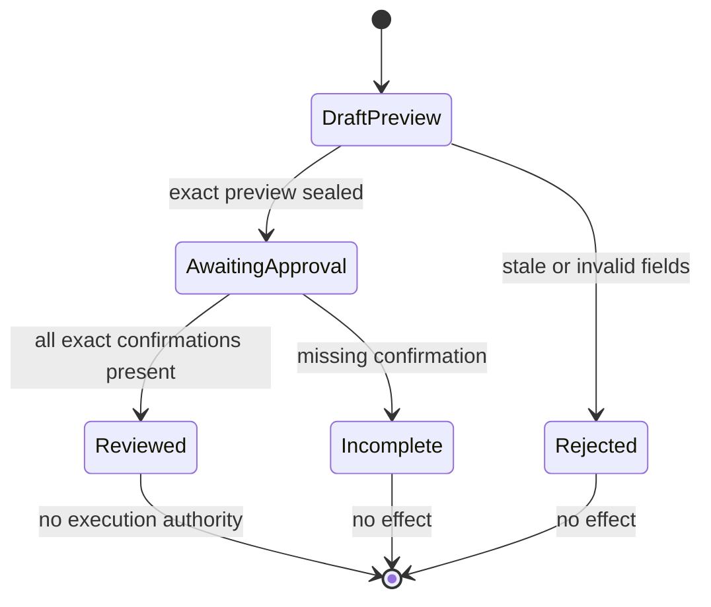

# Document, Correspondence, and Filing Control

## Boundary

Sprint 56 completes the source-level secretary and records-control contract. It creates immutable
local registers, deterministic quality findings, rendered local previews, and exact approval
reviews. It never sends correspondence, changes a calendar, selects a recipient, saves or renames a
file, moves or files a record, deletes source material, or decides records disposition.

The registered host coordinator admits all eight hash-bound document-control skills, verifies the
sealed register and every exact preview, derives findings, pairs each preview with exactly one
present or absent approval record, and builds the local workflow report. Sticky cancellation and
missing dependencies fail before record evaluation. The separate executor is intentionally absent
from this composition. A complete approval review proves only that the user confirmed the exact
preview fields; the kernel must still perform fresh policy, workspace, preimage, grant, transaction,
and postcondition checks before any future write.

Native Chat, interactive CLI, JSON, SDK, and ACP route through that same coordinator. Their closed
command carries only register/report identities, the sealed register digest, the closed workflow
kind, and one domain-separated SHA-256 binding the workspace, readiness/cancellation state, report
request, register, ordered previews, and present-or-absent approvals. Registers, preview content,
approval details, rendered output, sources, and attachments remain host-owned. The aggregate digest
cannot grant a send, calendar, filesystem, filing, or disposition effect.

## Registers

Each document or correspondence entry records its exact version, lifecycle state, approval,
attachments, named parties, quorum or workflow status, commitments, deadlines, statements, content
digest, source path, optional category, optional retention schedule, accessibility-review state,
supersession links, and exact source references.

Statements preserve six classes:

1. verbatim source;
2. observed fact;
3. derived action;
4. inferred summary;
5. unresolved conflict;
6. user-approved final language.

Verbatim source, observed fact, and user-approved final language require confirmed evidence.
Inferred summaries cannot be confirmed, and unresolved conflicts must remain disputed. Missing
owners and dates remain absent and unknown.

An approved or final entry requires an approval identity. A final entry also requires exact
user-approved final language. A superseded entry requires a named later record, and both directions
of the relationship must agree. Attachment approval binds the exact attachment digest.

## Local Workflows

The closed workflow inventory covers naming, duplicate detection, superseded versions, final-copy
review, quality, deadlines, routing slips, mail-merge previews, calendar-file drafts, and filing
suggestions. Reports contain deterministic findings and sealed preview digests and keep every
communication, calendar, filesystem, and disposition effect false.

Source text, attachments, and metadata are data. Embedded instructions, hidden recipients,
unsupported identity claims, malicious attachment claims, sensitive content, and disposition
requests cannot create authority.

## Exact Action Preview

Every proposed save, rename, move, or filing operation carries:

- exact source and destination paths;
- source and proposed content digests;
- exact content and metadata previews;
- metadata digest;
- records category and retention schedule when filing;
- a digest of the complete sealed preview;
- constant-true approval requirement and constant-false approval/effect fields.

A separate approval record must bind the preview digest and confirm destination, content, metadata,
category, retention, and the final decision as applicable. The review still reports
`execution_authority_created: false` and `effect_performed: false`.

## Security Mapping

- `SR-DAT-001` through `SR-DAT-003`: exact paths, hashes, versions, sources, metadata, retention
  fields, immutable registers, and no source mutation or disposition.
- `SR-AI-003`, `SR-AI-007`, `SR-AI-010`: closed truth classes, explicit unknown/conflict states,
  exact attribution, and untrusted-content refusal.
- `SR-CIV-003` through `SR-CIV-009`: exact preview and approval fields with zero communication,
  calendar, filesystem, and filing effects.

The source candidate does not prove installed native accessibility output, installed platform
acceptance, trusted package execution, independent records-owner review, or deferred manual
fuzzing.
