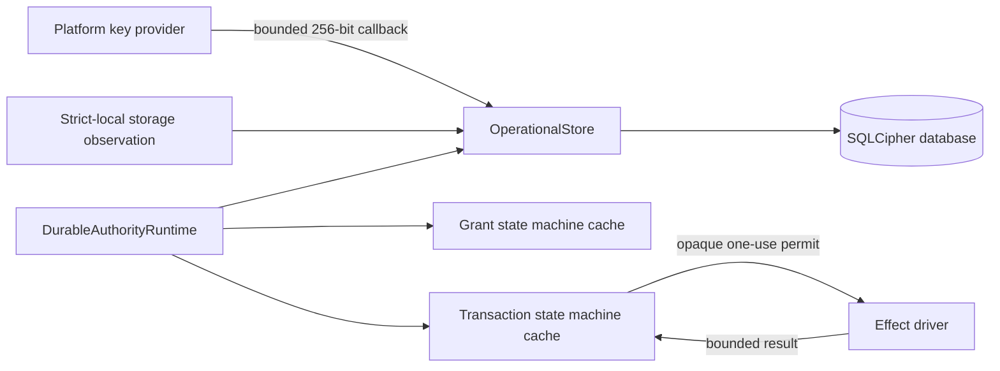
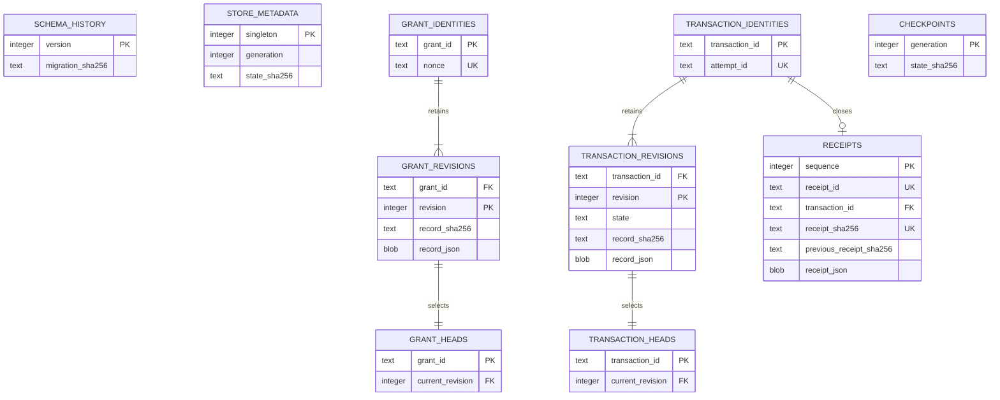

# Durable Authority Store

## Status and Scope

This document describes the Phase 7 candidate governed by proposed Decision
0016. It covers only canonical grant, nonce, authority-transaction, receipt,
and checkpoint state. It is not evidence that the complete Sprint 11 data
lifecycle, application host, Ubuntu execution, macOS, or a supported product is
implemented.

## Ownership

`DurableAuthorityRuntime` is the sole public effect-launch boundary. The grant
issuer and transaction coordinator hold deterministic candidate state but
cannot publicly launch an effect. The store is canonical; caches are rebuilt
only from validated rows after every process restart.

On Linux, `LinuxOperationalStoreKeyProvider` looks up one fixed
`operational-store-key-v1` Secret Service item for one profile. It never exposes
a general lookup, list, mutation, or returned-key API. Full state-root and key
lifecycle composition remain Phase 8 work.

## Schema

Revision rows are immutable. A duplicate insert must match the retained digest
and canonical bytes exactly. Head rows may advance only in the same transaction
as their newly inserted revisions. Receipt sequence and previous-receipt digest
form a validated hash chain.

## Publication Boundaries

| Boundary | Atomic publication before continuing | Recovery result |
|---|---|---|
| Prepared | Initial transaction identity and revision | Failed; grant remains issued |
| Grant consumed | Consumed grant revision and `grant_consumed` transaction revision | Failed; grant remains consumed |
| Attempt recorded | Non-replayable attempt revision | Failed; grant remains consumed |
| Launch committed | Launch commitment before driver invocation | Uncertain; no driver retry |
| Worker returned | No new state until bounded reconciliation is complete | Prior launch commitment becomes uncertain |
| Result reconciled | Result digest, outcome, and uncertainty classification | Publish one terminal receipt without retry |
| Terminal | Terminal revision, grant uncertainty when applicable, and receipt | Return the retained receipt idempotently |

Each publication uses an immediate SQLite transaction, expected-generation
compare-and-swap, deterministic full-authority digest, and checkpoint. Any
publication failure poisons the process-local runtime. Reopen and recovery are
required before another effect can be considered.

## Database Configuration

- bundled SQLCipher through pinned `rusqlite` 0.40.2, linked on Linux to the
  distribution OpenSSL 3 `libcrypto` selected by the support matrix;
- exact 32-byte key and no plaintext fallback;
- SQLCipher logging disabled before key validation;
- cipher, quick, and foreign-key integrity checks at open;
- exclusive single writer with zero busy timeout;
- WAL, full synchronization, secure deletion, trusted schema disabled, and
  memory-only temporary storage;
- mode `0600` regular database file with symlinks rejected; and
- separate encryption key and full verification for every online backup.

## Recovery Invariants

1. A consumed nonce, grant, or attempt remains non-replayable after restart.
2. Recovery never invokes an effect driver.
3. A possible effect without a verified result becomes `uncertain`.
4. A complete verified result without a receipt produces exactly one receipt.
5. Terminal recovery is idempotent.
6. Missing key, wrong key, future schema, record conflict, page corruption,
   foreign-key failure, concurrent writer, or state-digest mismatch fails
   closed with a content-free error.

## Evidence Boundary

Current tests inspect encrypted database, WAL, shared-memory, and backup
artifacts for plaintext canaries; force a rollback; corrupt an encrypted page;
exercise wrong and missing keys; reject ineligible storage; deny a second
writer; and restart from every authority transition. Retained historical story
artifacts are not regenerated or represented as current Phase 7 evidence.
