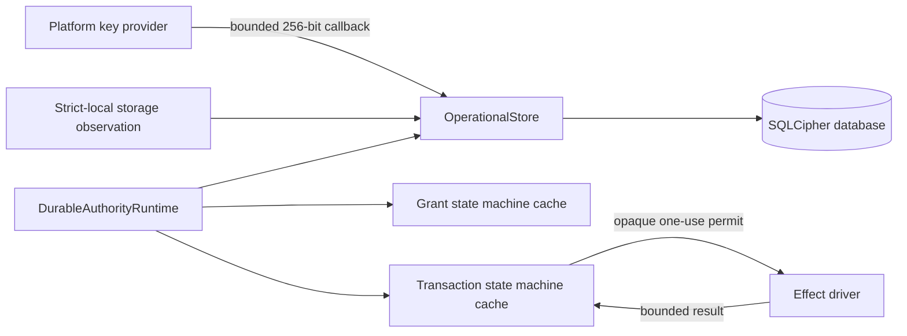
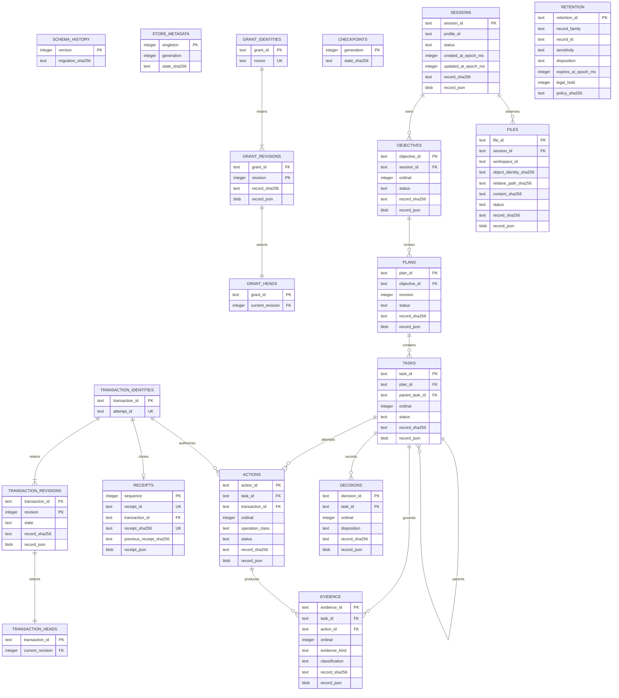

# Durable Authority Store

## Status and Scope

This document describes the durable authority candidate governed by accepted
Decision 0016 and composed on Linux by accepted Decision 0017. Schema v1 covers
canonical grant, nonce, authority-transaction, receipt, and checkpoint state.
Schema v2 adds normalized structural tables for sessions, objectives, plans,
tasks, actions, evidence, decisions, files, and retention. Those v2 tables have
no public domain-write API yet and are not included in the authority-state
digest until their owning transaction boundary is implemented. This is not
evidence that the complete Sprint 11 data lifecycle, application host, Ubuntu
execution, macOS, Windows, or a supported product is implemented.

## Ownership

`DurableAuthorityRuntime` is the sole public effect-launch boundary. The grant
issuer and transaction coordinator hold deterministic candidate state but
cannot publicly launch an effect. The store is canonical; caches are rebuilt
only from validated rows after every process restart.

On Linux, `LinuxOperationalStoreKeyProvider` looks up one fixed
`operational-store-key-v1` Secret Service item for one profile. It never exposes
a general lookup, list, mutation, or returned-key API. The Phase 8 aggregate
opens the fixed database through the exact
`/proc/self/fd/<held-root>/authority.db` shape after final-object creation or
verification rejects symbolic links. Ordinary non-descriptor paths retain
SQLite no-follow.

The production `open_linux_authority` composition accepts that concrete
fixed-purpose provider, not an arbitrary implementation of the kernel's
testable key callback contract. Missing, malformed, locked, substituted, or
otherwise unavailable Secret Service material fails before the database
callback runs and before a primary or backup file is created. Test-only builds
retain an explicitly named synthetic-provider constructor, which cannot enter a
normal build.

Initial key provisioning is a separate explicit operation that requires the
verified aggregate, a current-user owner-only strict-local root, and a
single-writer lifecycle lock. It refuses an existing key and refuses an
existing authority database without its key, obtains 256 random bits from the
operating system, sends encoded material only through Secret Service standard
input, and verifies exact lookup before success. Normal startup never provisions,
repairs, clears, or rotates a key. Rotation is explicitly unavailable until an
interruption-safe dual-key protocol exists.

## Schema

Revision rows are immutable. A duplicate insert must match the retained digest
and canonical bytes exactly. Head rows may advance only in the same transaction
as their newly inserted revisions. Receipt sequence and previous-receipt digest
form a validated hash chain.

Migration v2 is an additive transaction over an admitted v1 database. The
immutable v1 migration text and digest remain unchanged. A v2 conflict rolls
back its history row, `user_version`, and every table created by that
migration; reopening never treats a partial schema as current. The v2 domain
tables use closed status values, fixed SHA-256 shapes, unique per-parent
ordinals or revisions, and foreign keys that reject orphaned or cross-task
records.

Migration v3 adds the retention lifecycle without rewriting either earlier
migration. It distinguishes `none`, `user`, and `legal` holds, preserves the
pre-hold disposition, adds optimistic revisions and trusted transition times,
and records an append-only event chain bound to the complete current retention
state. Existing v2 retention rows receive one deterministic migration event.
Assignments require an existing canonical record. Hold application and release
require the exact current revision and hold kind. Due expiration selects only
unheld `session` or `retained` rows and commits all selected transitions in one
immediate transaction. Startup recomputes every event and current-state digest;
a gap, stale head, changed event, inconsistent hold, or state mismatch refuses
the store.

## Pre-Persistence Gate

The kernel classifies every candidate into one closed record family,
sensitivity, and retention intent before it can produce a sealed
`PreparedPersistence`. Each bounded, uniquely named field must declare
`persist`, `digest_only`, or `ephemeral` handling. Persisted values must be
UTF-8; digest-only values retain only byte count and SHA-256; ephemeral values
retain neither content nor digest. Known credential field names, private-key
envelopes, bearer values, provider-token prefixes, cloud access-key identities,
and URI user information are detected deterministically. A finding in a
persist-marked field denies the record; a finding in an omitted field removes
both value and digest.

Every valid candidate produces a content-free, policy-bound receipt. Only an
admitted receipt selects the SQLCipher operational store and carries a bounded
expiration assignment. Ephemeral candidates select no storage. Restricted
persistence fails closed until a separately reviewed restricted-data policy is
implemented. The detector covers declared signatures and is not represented as
a complete secret-discovery system; later canary and integration gates remain
required before the story closes.

## Publication Boundaries

| Boundary | Atomic publication before continuing | Recovery result |
|---|---|---|
| Prepared | Initial transaction identity and revision | Failed; grant remains issued |
| Grant consumed | Consumed grant revision and `grant_consumed` transaction revision | Failed; grant remains consumed |
| Attempt recorded | Non-replayable attempt revision | Failed; grant remains consumed |
| Launch committed | Launch commitment before driver invocation | Uncertain; no driver retry |
| Worker returned | No new state until bounded reconciliation is complete | Prior launch commitment becomes uncertain |
| Result reconciled | Result digest, outcome, and uncertainty classification | Publish one terminal receipt without retry |
| Terminal | Terminal revision, grant uncertainty when applicable, and receipt | Return the retained receipt idempotently |

Each publication uses an immediate SQLite transaction, expected-generation
compare-and-swap, deterministic full-authority digest, and checkpoint. Any
publication failure poisons the process-local runtime. Reopen and recovery are
required before another effect can be considered.

## Database Configuration

- bundled SQLCipher through pinned `rusqlite` 0.40.2, linked on Linux to the
  distribution OpenSSL 3 `libcrypto` selected by the support matrix;
- exact 32-byte key and no plaintext fallback;
- SQLCipher logging disabled before key validation;
- cipher, quick, and foreign-key integrity checks at open;
- exclusive single writer with zero busy timeout;
- WAL, full synchronization, secure deletion, trusted schema disabled, and
  memory-only temporary storage;
- mode `0600` regular database file with symlinks rejected; and
- separate encryption key and full verification for every online backup.

The canonical connection acquires and proves its exclusive writer lock and WAL
mode before inspecting or applying migrations. Startup then re-reads the exact
foreign-key, trusted-schema, secure-delete, memory-temporary-store, full-sync,
WAL-autocheckpoint, zero-busy-timeout, locking, and journal settings before any
canonical row is admitted. A second process can therefore fail during keyed
open or explicit lock acquisition, but it cannot read, migrate, or publish
state. Publication uses an immediate transaction; metadata generation update
and checkpoint insertion either commit together or both roll back.

## Backup, Restore, Export, and Erasure

The implemented backup boundary produces only a separately keyed SQLCipher
database. It verifies runtime configuration, page/cipher integrity, foreign
keys, schema history, canonical authority state, retention event chains, and
generation before returning a content-free receipt with the encrypted-file
digest. A failed backup removes only files created by that invocation; an
already occupied or raced destination is preserved.

Restore accepts an existing encrypted backup, rejects wrong keys, corruption,
schema drift, and ineligible storage, and copies into a newly created candidate
under a separate destination key. It verifies the candidate's complete
canonical state and matching generation before returning. It never overwrites
or swaps the live canonical store. Atomic continuity selection, rollback points,
and clean-device restore remain assigned to Sprint 161.

No plaintext database or SQL export exists. The JSON Lines path is a separately
derived, content-free audit/export view. Its first line is a versioned,
non-executable header bound to canonical schema, generation, state hash, record
count, content mode, and `startup_authority: false`. Remaining lines contain
only a closed family, hashed record identity, revision, and already-retained
record/event hash. Raw identifiers, canonical JSON bodies, file content, and
record values are not emitted.

Rows are sorted deterministically and the complete bytes are bounded to 100,000
records and 64 MiB. Publication writes and syncs a mode-`0600` temporary file,
uses a same-directory hard link as an atomic create-without-overwrite operation,
verifies object identity, syncs the directory, and removes the temporary name.
Occupied, raced, linked, synchronized, remote, oversized, malformed-hash, or
ambiguous destinations fail without changing the canonical store or another
file. Repeated export of unchanged canonical state is byte-identical. Deleting
or modifying the derivative has no effect on SQLite, and the encrypted-store
startup path rejects JSON Lines. No JSON Lines parser or import authority is
implemented; any future import requires a separate explicit validated contract.

Cryptographic erasure is implemented only at the complete operational-key scope.
The live store is consumed and closed before the platform adapter destroys the
exact operational-store key and verifies that lookup returns absent. Known
database, WAL, and shared-memory ciphertext files are then removed. The same
key is the HKDF root for the separately labeled Linux runtime artifact payload
key, so verified key absence also prevents retained payload-file keys from
being rederived even when storage media retains ciphertext. A failed
key-destruction attempt preserves ciphertext. This operation does not erase a
separately keyed backup, does not claim independently keyed per-record or
per-payload erasure, and makes no physical-overwrite promise for SSD or
copy-on-write storage.

## Recovery Invariants

1. A consumed nonce, grant, or attempt remains non-replayable after restart.
2. Recovery never invokes an effect driver.
3. A possible effect without a verified result becomes `uncertain`.
4. A complete verified result without a receipt produces exactly one receipt.
5. Terminal recovery is idempotent.
6. Missing key, wrong key, future schema, record conflict, retention-chain
   mismatch, page corruption,
   foreign-key failure, concurrent writer, or state-digest mismatch fails
   closed with a content-free error.
7. A hold cannot be replaced, released under the wrong kind, or bypassed by
   expiration; stale revisions change no lifecycle row or event.
8. Restore never changes the live canonical store and never deletes a
   pre-existing destination after a failed exclusive create.

## Evidence Boundary

Current tests inspect encrypted database, WAL, shared-memory, and backup
artifacts for plaintext canaries; force a rollback; corrupt an encrypted page;
exercise wrong and missing keys; reject ineligible storage; deny a second
writer; migrate a real encrypted v1 database to v2; reject a partial v2 schema;
exercise normalized relationship constraints; and restart from every authority
transition. Linux tests additionally
exercise private-root owner/mode drift, unsafe authority-state objects, and
exclusive lifecycle locking. Current lifecycle tests cover both hold kinds,
stale revisions, held expiration, release, expiry, event tampering, encrypted
backup receipts, wrong-key and corrupted restore refusal, occupied-destination
preservation, fresh-candidate restore, successful whole-key erasure, and failed
key-destruction ciphertext preservation. Live Secret Service tests remain
explicitly environment-dependent. Retained historical story artifacts are not
regenerated or represented as current Phase 8 evidence.
