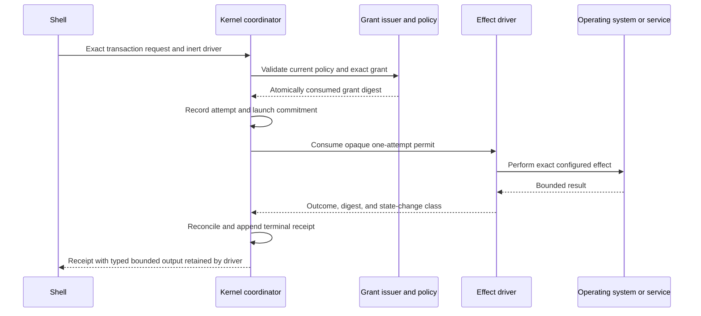
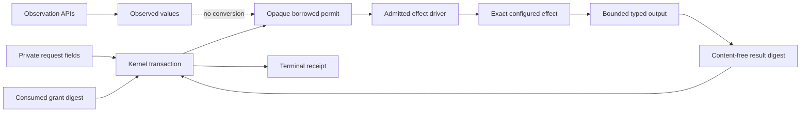

# Effect Mediation Boundary

This document describes the live Phase 5 candidate boundary between kernel
authority and code that can change or actively inspect external state. Decision
0014 is the normative architecture decision; the machine check is
`python3 scripts/effect_boundary.py`.

## Authority Flow

The shell supplies a request and an inert driver. It never receives the permit.
The driver cannot be invoked through its effect method without the permit, and
the permit cannot be constructed, copied, serialized, or reused outside the
kernel transaction.

## Process and Socket Boundary

The Linux sandbox driver is the only public façade over worker process launch.
It starts the already-verified `systemd-run` and Bubblewrap chain only after it
receives an exact `workspace_read` permit. The Linux Secret Service driver is
the only public façade over `secret-tool` process launch and requires an exact
`credential_access` permit. Both retain bounded outputs and return only a
content-free result identity to transaction reconciliation.

The Unix listener remains module-private and has no product driver. Host and
capability crates may not launch processes, create listeners, or mutate files
directly; the repository guard rejects those source patterns. A future network
or command driver must add a closed operation mapping and consume the same
permit type before the effect becomes available.

## Data Boundary

Secret bytes are never placed in the permit, transaction record, result digest,
or receipt. Sandbox diagnostics remain hashed and bounded. Configuration-driver
debug output omits paths and candidate content. Observation values remain
non-authoritative and have no conversion into a permit.

## Public Surface Rules

- The coordinator owns permit construction and grant consumption.
- Drivers consume one permit by value and cannot retain its borrowed lifetime.
- Raw sandbox, secret, configuration-mutation, and socket entry points are not
  public.
- New permit consumers must be added to the explicit source inventory.
- Kernel code cannot import platform, capability, or shell crates.
- Read-only capability packs import contracts only.
- Shell and capability source cannot directly launch a process, create a socket,
  or call common filesystem mutation functions.

## Current Limits

This boundary establishes mediation, not complete product integration. Exact
target-object parity and per-object worker mounts remain Phase 6 work. Durable
atomic transaction storage and restart recovery remain Phase 7 work. macOS is a
declared but unmaterialized mediation edge and remains `blocked-macos`.
