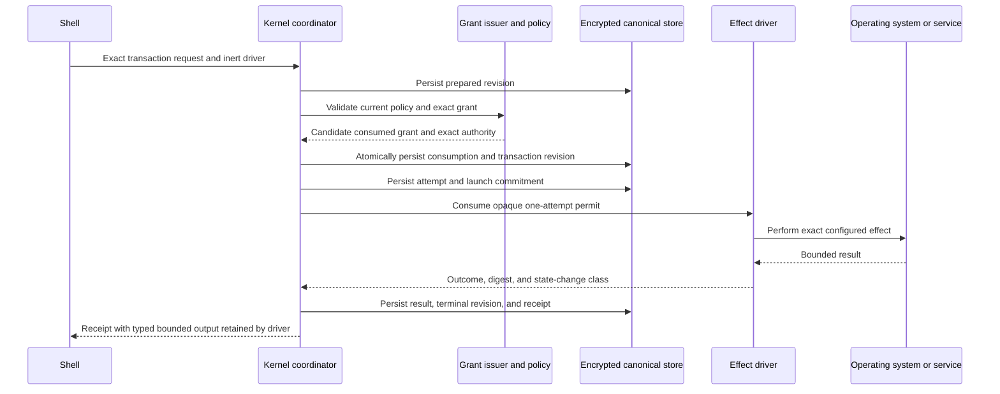
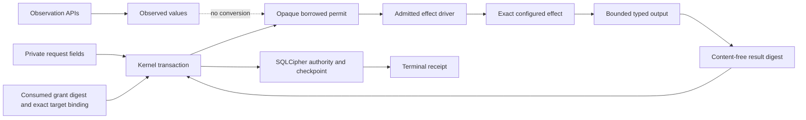

# Effect Mediation Boundary

This document describes the live mediation boundary through the Phase 8
candidate. Decision 0014 governs opaque effect permits, Decision 0015 governs
their exact held-target payload and Linux object exposure, Decision 0016 governs
encrypted checkpoints and recovery, and accepted Decision 0017 governs Linux
composition and native configuration effects. The machine boundary check is
`python3 scripts/effect_boundary.py`.

## Authority Flow

The shell supplies a request and an inert driver to the durable runtime. It
never receives the permit.
The driver cannot be invoked through its effect method without the permit, and
the permit cannot be constructed, copied, serialized, or reused outside the
kernel transaction. A held-object driver also must match its path,
authorization, adapter, platform, identity, and preimage to the consumed target.

## Process and Socket Boundary

The Linux sandbox driver is the only public façade over worker process launch.
It owns one continuously held object and starts the already verified
`systemd-run` and Bubblewrap chain only after it receives a matching exact
`workspace_read` permit. A file worker receives only a sealed projection that
exactly matches the grant-bound preimage; a directory worker receives only a
sealed bounded exclusion-safe projection. The original held objects and
workspace root never enter either worker. The Linux
Secret Service driver is
the only public façade over `secret-tool` process launch and requires an exact
`credential_access` permit. Both retain bounded outputs and return only a
content-free result identity to transaction reconciliation.

The Unix listener remains module-private and has no product driver. Host and
capability crates may not launch processes, create listeners, or mutate files
directly; the repository guard rejects those source patterns. A future network
or command driver must add a closed operation mapping and consume the same
permit type before the effect becomes available.

The Linux listener owns the exact socket identity it creates and removes it on
drop only while the private parent and named socket remain unchanged. Peer
authentication binds kernel UID and PID to process start time and executable
digest. Process inventory holds a pidfd where available, always compares start
time before and after collection, and exposes the weaker start-time-only binding
when the kernel does not support pidfd.

## Data Boundary

Secret bytes are never placed in the permit, transaction record, result digest,
or receipt. Sandbox diagnostics remain hashed and bounded. Configuration-driver
debug output omits paths and candidate content. Observation values remain
non-authoritative and have no conversion into a permit. The operational-store
key is exposed only during a platform key-provider callback and never enters a
receipt, command argument, environment variable, or plaintext fallback.

Configuration parsing, canonicalization, migration calculation, policy
comparison, and result binding remain in the kernel. Linux owns the fixed
configuration target, descriptor-relative reads, owner/mode/link validation,
immutable backups, atomic exchange, interrupted-exchange completion, and parent
synchronization. Native apply, migrate, and rollback methods are private and
reachable only through `LinuxConfigurationEffectDriver` with an exact
administration permit.

## Public Surface Rules

- The durable authority runtime is the sole public launch surface.
- The coordinator owns permit construction and grant consumption but has no
  public launch method.
- Drivers consume one permit by value and cannot retain its borrowed lifetime.
- Raw sandbox, secret, configuration-mutation, and socket entry points are not
  public.
- New permit consumers must be added to the explicit source inventory.
- Kernel code cannot import platform, capability, or shell crates.
- Read-only capability packs import contracts only.
- Shell and capability source cannot directly launch a process, create a socket,
  or call common filesystem mutation functions.

## Current Limits

This boundary is not complete product integration. Canonical target parity,
exact-object Linux exposure, encrypted authority checkpoints, restart recovery,
independent platform trust, private Linux state composition, and native
configuration mediation exist as isolated candidate mechanisms. The application
host does not yet compose the real Visual Studio Code workflow. Production
signed manifests and packages do not exist; Ubuntu-native execution, macOS,
Windows, model execution, and supported product behavior remain unclaimed.
