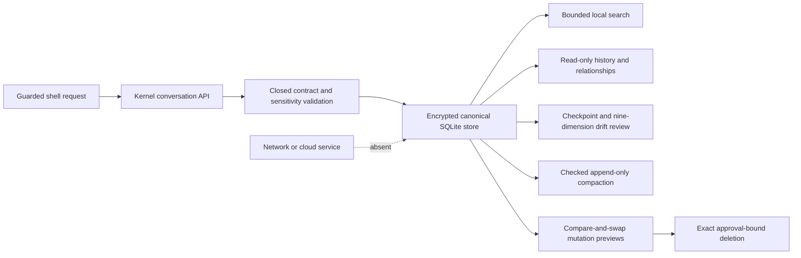
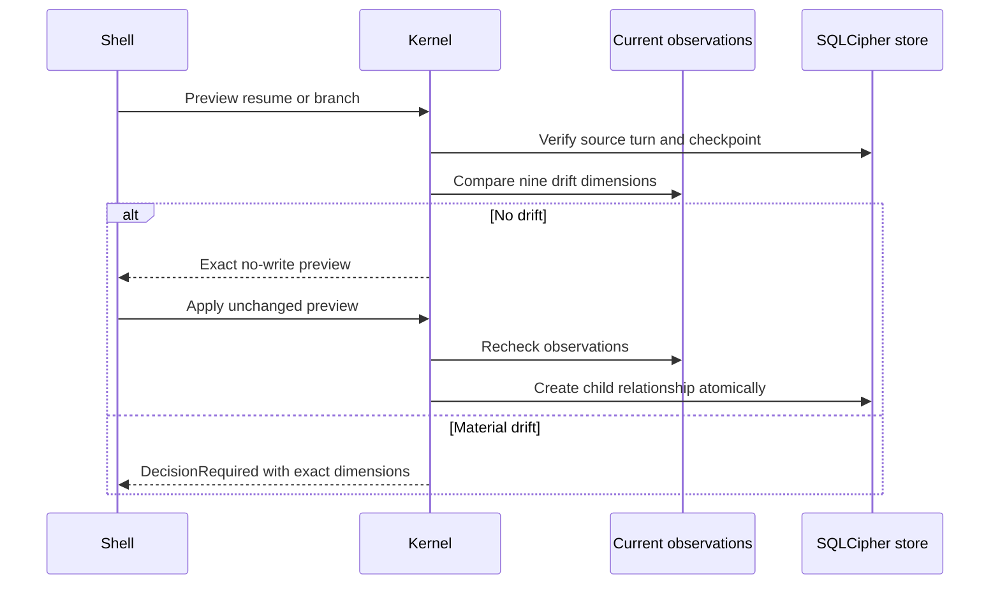

# Encrypted Conversation Library

## Purpose

Sprint 32 places persisted conversation metadata, immutable turns, checked compactions, branch
relationships, and deletion state inside the kernel-owned SQLCipher operational store. Shells do
not receive a database handle, and the conversation library has no network path.

## Canonical Records

Version-five storage retains a hash-verified `ConversationRecord` and immutable ordered
`ConversationTurn` records. Conversation metadata includes sensitivity, title, UTC and local date
fields, IANA timezone, workspace, optional project, exact model profile, status, parent and branch
identities, current turn, sorted tags, visible retention, pin state, and persistence policy. Turns
carry their own sensitivity and store exact text only when persistence is enabled and policy has
admitted it.

Attachments remain display-name, media-type, identity, and content-hash references. Grants,
receipts, checkpoints, citations, and source evidence remain stable references in normalized
tables. Canonical JSON and every search projection are cross-checked before content is returned.
Malformed identities, hashes, dates, order, bounds, duplicate references, projection drift, and
canonical row drift fail closed.

## Search, History, and Control

Local search combines inclusive local date ranges with exact workspace, project, model, status,
tag, and pinned filters. Case-insensitive literal search covers titles, retained turn text,
attachment metadata, citation/grant/receipt identities, and checked summary material. The API
enforces fixed scan, query, preview, and result limits and returns no database or path authority.
Archived conversations stay out of default results.

History returns hash-verified turns in strict ordinal order plus checked compactions in creation
order. Relationship views expose only exact parent turn and direct child branch identities.
Rename, pin, archive, tag, and retention changes require an unchanged compare-and-swap preview;
stale or mutated previews do not write. Deletion separately previews exact row/reference counts,
blocks while child branches exist, requires explicit approval bound to the preview digest, and
rechecks canonical state inside one transaction.

## Resume and Branching

Latest and historical resume review loads the exact hash-verified checkpoint referenced by the
selected immutable turn. It delegates to the existing resume engine to compare current and
recorded workspace/files, instructions, repository branch/map, citation set, model profile and
runtime, permissions, and policy. Any drift produces a sorted `DecisionRequired` result and blocks
branch creation until the caller handles the existing recheckpoint, restart, or cancel path.

An exact-point branch is a new empty child conversation linked to one immutable parent turn. It
does not copy, delete, or rewrite the original transcript. The branch preview binds the complete
source-history digest, checkpoint digest, drift result, and proposed child record. Apply recomputes
all of them before atomically creating the child.

## Compaction and Recovery

Compaction appends a checked summary; original turns remain canonical. The record must name the
exact source prefix and preserve the complete citation, receipt, and sorted source-hash sets. A
missing or substituted reference blocks storage. Search and history can use the checked summary
while still reopening every original source turn.

SQLCipher backup and fresh-candidate restore preserve complete conversation turns and compactions.
The test corpus also proves plaintext canaries are absent from database pages, persistence-disabled
text is omitted, interrupted or stale comparisons do not partially mutate state, and approved leaf
deletion removes exactly the previewed canonical records.

## Open Gate

The local kernel implementation does not close upstream Sprint 31 or provide independent Sprint 32
review evidence. Interface-specific visual rendering and later encrypted portable archive/evidence
bundle behavior belong to subsequent sprints. These limits keep the Sprint 32 release gate blocked
even though its locally executable conversation behavior passes.
