# Engineering Runtime Vertical Slice

## Status

Story 22.5 now has a complete deterministic local source-to-terminal slice. It admits real text
bytes through the production source-preparation service, delivers completely accounted sections to
the shared model-context port, treats the fake exact model only as a proposal source, executes its
bounded source search through the common native artifact dispatcher, and permits success only from
the existing deterministic verifier. The same runtime event and terminal contracts remain the
input to native Chat, interactive CLI, and headless/workflow callers.

This is local implementation evidence, not an installed-product or model-qualification claim. The
checked-in exact fake profile is deliberately incapable of satisfying production-model admission.

## Composed Path

```mermaid
flowchart LR
    BYTES[Request-bound source bytes] --> PREP[SourcePreparationService]
    PREP --> MANIFEST[Prepared source manifest]
    PREP --> CONTEXT[PreparedSourceRuntimeContext]
    CONTEXT --> PACKET[Bounded ModelContextPacket]
    PACKET --> MODEL[Exact fake model port]
    MODEL --> PROPOSAL[Inert typed proposal]
    PROPOSAL --> REGISTRY[Common ToolRegistry]
    REGISTRY --> DISPATCH[Production prepared-source dispatcher]
    DISPATCH --> RESULT[ToolResult and receipt]
    RESULT --> CONTEXT
    RESULT --> VERIFY[Deterministic verifier]
    VERIFY --> EVENTS[Ordered runtime events]
    EVENTS --> TERMINAL[Canonical RuntimeOutcome]
    EVENTS --> CLIENTS[Chat CLI headless callers]
```

No arrow transfers policy, grant, execution, persistence, or completion authority to the model or
client. `PreparedSourceRuntimeContext` has immutable access to already-admitted sources only. It
cannot acquire references, mutate lifecycle state, dispatch tools, or publish artifacts.

## Context Closure

Each turn recompiles a `PreparedSourceContextManifest` through the existing context manager. Before
returning a model packet, the adapter verifies:

- the exact admitted profile and manifest;
- the tokenizer and token-counter identities;
- the checked window plan and source partition;
- every required source has at least one included exact section;
- current tool results and independently retained evidence fit the message, byte, token, and
  refresh ceilings; and
- the packet digest covers the exact task objective and model-visible bytes.

Evidence already carried by a tool result is not copied into a second message. Independently
restored evidence remains visible as a separate typed tool message. A stale, unavailable,
restricted, omitted, or tokenizer-drifted required source stops before a model call.

## Verified Fixture

The deterministic repository-analysis fixture uses one current prepared source containing a known
function. Turn one delivers the source to the fake exact model. The model proposes one
`artifact.search` call with no direct dispatcher or grant access. The common validator and
production prepared-source adapter return one hash-bound result, one receipt, and one evidence
reference whose content-free fragment binds the exact source-manifest digest. Turn two receives the
source plus that result; the model proposes an answer, and the verifier alone admits terminal
success. The retained golden contains both context manifests, the complete runtime event chain,
the exact terminal outcome, its inferred-answer evidence assignment, and zero replay or duplicate
effects.

The durable companion fixture interrupts after the read and safe checkpoint, reconstructs a new
coordinator from the verified continuation, recompiles the same prepared source, and reaches
success with one total worker execution. Story 22.4's 100-seed recovery campaign remains the
authoritative exhaustive before/after boundary matrix; Story 22.5 proves the composed source path
uses that no-replay runtime rather than creating a private recovery loop.

## Caller Parity and Hostile Outcomes

The existing thin-client parity campaign independently compares native Chat, interactive CLI, and
workflow/headless projections from identical canonical events and outcomes. None of those clients
can dispatch a tool, mint a grant, alter the event chain, or claim completion.

The retained Story 22.5 campaign also runs the shared coordinator's malformed model result,
denial, cancellation, dependency failure, timeout, resource exhaustion, repeated-call,
no-progress, expired approval, and canary-redaction cases. The new source-specific cases add stale
required material and tokenizer drift. Each becomes an explicit non-success; no model or client
claim overrides the deterministic result.

## Evidence and Remaining Qualification

[`vertical-slice-report.json`](../../artifacts/sprints/sprint-22/story-22.5/vertical-slice-report.json)
hashes the implementation, architecture, raw commands, and golden lineage. The report recomputes
its claims from raw records and maps the locally applicable portions of `RV-50` through `RV-56`.

The following remain external or later qualification and are fixed to false in the report:

- execution with the first independently qualified production model profile;
- installed native Chat, CLI, and headless campaigns on supported platforms;
- native cross-platform resource and lifecycle campaigns; and
- independent human security review and release approval.
