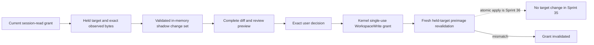

# Exact-Preimage Write Approval

## Boundary

Sprint 35 introduces the authority-free preparation and exact approval half of the controlled-write
transaction. It does not contain a file writer, an atomic apply path, rollback, generic shell,
network access, Git publication, or post-write command execution.

The shadow object is process-memory data outside user-owned files. Constructing, validating,
rendering, approving, or freshly revalidating it performs no target I/O. A preview, approval
decision, receipt, or preapply result is descriptive and cannot substitute for the existing
kernel-owned capability grant.

## Requirement Traceability

| Legacy identity | Implementation | Focused verification |
|---|---|---|
| `S-029-I01` | Current issued session-read parent, exact held regular-file target, object identity, byte count, and SHA-256 must agree | Changed, partial, expired, excluded, and inaccessible observations fail closed |
| `S-029-I02` | `ShadowChangeSet` retains stable operation identities and complete proposed postimages in memory | No API in the module writes a target or launches an effect |
| `S-029-I03` | Closed UTF-8/JSON syntax, canonical paths, exact line endings, duplicate rejection, explicit generated-file permission, resource limits, and caller-expected postimage hashes | Invalid syntax, CRLF/LF drift, duplicate targets, generated targets, stale bytes, and wrong hashes are denied |
| `S-029-I04` | `WriteApprovalPreview` binds complete escaped before/after diffs, rationale, affected files, behavior, verification plan, risks, rollback, and unverified assumptions | Any preview mutation fails exact recomputation |
| `S-029-I05` | `GrantIssuer::derive_operation` creates one short-lived `WorkspaceWrite` grant bound to workspace targets, operation hashes, change-set digest, preview, parent revision, policy, expiry, and verification labels | Parent revision reuse, nonce reuse, widened verification, policy drift, expiry, and cancelled decisions fail |
| `S-029-I06` | `revalidate_before_apply` checks every current held target and byte preimage and invalidates a mismatch | Fresh bytes leave the grant issued; changed bytes terminalize it as invalidated |

## Validation Contract

Only exact held regular files inside one current parent scope are admitted. Excluded paths, multiple
workspaces, partial source state, duplicate operation identities, duplicate targets, unchanged
postimages, malformed identifiers, invalid review fields, and aggregate changes above the fixed
operation or byte limits fail before a change-set identity exists.

Every operation digest includes the exact target, observed preimage, complete proposed bytes,
expected postimage, syntax, line endings, generated-file classification, and complete escaped diff.
The change-set digest includes every operation, the current parent grant identity and revision
digest, observation time, review narrative, workspace, and permitted verification labels. The
preview then binds the complete review projection of that exact change set.

## Grant Contract

An explicit confirmed decision must name the exact change-set and preview digests, repeat the exact
visible verification labels, and expire no more than five minutes after approval. Issuance rechecks
the current parent revision before calling the existing kernel `GrantIssuer`. The resulting grant:

- has canonical `WorkspaceWrite` authority and a use limit of one;
- names every exact held target and preimage in order;
- carries the change-set digest as its argument identity;
- binds each operation postimage and the visible verification set into expected-side-effect hashes;
- names the exact workspace through each authorization-bound target;
- retains the reviewed rollback statement, policy, preview, approval, expiry, and anti-replay nonce.

Verification labels are descriptive scope only. Formatters, tests, builds, migrations, and every
future command still require separate command authority; Sprint 35 launches none of them.

## Preapply Contract

Fresh revalidation compares the retained issued grant, exact held object, native object identity,
byte count, content digest, operation target, preimage sequence, preview identity, change-set
identity, and expiry. Any mismatch invalidates the single-use grant through the existing grant
lifecycle. A successful `WritePreapplyReceipt` neither consumes the grant nor permits a write.
Sprint 36 must preserve held-object continuity, atomically consume the same grant, apply the exact
postimages, and produce terminal receipts before any controlled-write release can claim completion.

## Open Gate

Local implementation and product tests do not satisfy the blocked Sprint 34 dependency or the
required independent transaction review. Sprint 35 remains blocked until both are current.
