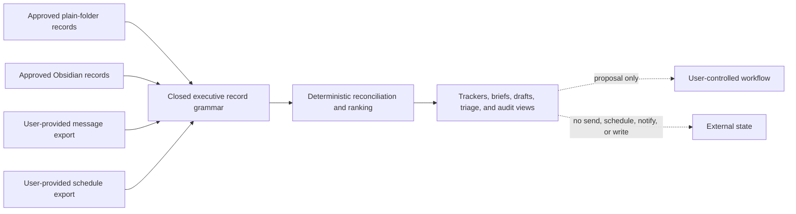

# Executive Assistant and Task Portfolio

## Boundary

The Sprint 54 source candidate projects already-approved local records into rankings, trackers,
briefs, drafts, triage rows, portfolio history, and audit views. It does not read a vault, folder,
calendar, or inbox directly. Existing authorized adapters must first produce exact local records.

Every record and source field distinguishes `confirmed`, `inferred`, `historical`, `disputed`,
and `unknown`. Active or completed decisions and commitments require confirmed evidence. Person and
organization briefs reject inferred sensitive-trait fields. Source correction and supersession
create a new snapshot and preserve earlier records in history.

## Priority Method

The fixed v1 method uses integer contributions for urgency, importance, explicit user preference,
consequence of delay, closed due window, schedule conflict, unresolved dependencies, bounded effort,
and evidence uncertainty. Every component and limitation is visible. Equal scores are ordered by
stable record identity. A ranking is a recommendation only and cannot assign an owner or change a
task, notification, reminder, or schedule.

## Privacy Classes

Ordinary records may use the general local index. Private and confidential records require
separate indexes; confidential retrieval and export require exact-source handling and explicit
review. Highly restricted records cannot enter a general or separate index and cannot be exported;
exact approved retrieval and retention of no more than seven days are the only representable
proposals. Policy decisions perform no operation.

## Product Composition and Open Boundaries

The registered host coordinator binds one immutable canonical snapshot to the ranking, tracker,
view, privacy decisions, and all eight admitted authority-free skills. It rejects partial
cross-privacy composition and verifies that every output remains proposal-only, source-preserving,
and unable to notify, send, schedule, write, or mutate.

Native Chat, interactive CLI, JSON, SDK, and ACP surfaces use one closed identity-only portfolio
command and the same host coordinator. The command carries the snapshot, ranking, tracker, and view
identities plus a domain-separated digest over all host-owned records, history, privacy scope, and
projection choices. Raw executive records never cross the thin-client command boundary. The host
rejects stale requests, workspace or record substitution, privacy-scope drift, and aggregate-input
mismatch before composition; successful routing still grants no notification, send, schedule,
write, or source-mutation effect.

The kernel now provides a durable, authority-free reminder lifecycle over the existing canonical
record grammar. Creation binds the exact record digest and sorted source identities; snooze,
reschedule, acknowledge, and complete are explicit user-originated, hash-chained transitions.
Trusted host composition supplies the canonical compare-and-swap store, so restart reconstruction
verifies the complete chain and stale writers or replayed event identities fail closed. Persistence
never grants notification, calendar, source-mutation, or external-effect authority.

Live calendar or message connectors, installed-platform acceptance, accessibility, independent
review, signing, and manual fuzzing remain separate later evidence.
