# Foundational Artifact and Workflow Runtime

| Field | Value |
|---|---|
| Status | Accepted implementation-ready architecture plan; production implementation incomplete |
| Governing decision | [Decision 0042](../decisions/0042-universal-artifact-ingestion-and-verified-workflow-execution.md) |
| Product authority | [`PRD.md`](../../PRD.md) |
| Execution authority | [`TASKS.md`](../../TASKS.md) |
| Runtime boundary | [`RUNTIME-BOUNDARIES.md`](../../RUNTIME-BOUNDARIES.md) |
| Security boundary | [`SECURITY-REVIEW.md`](../../SECURITY-REVIEW.md) |

## 1. Purpose

This document defines the implementation architecture for two cross-cutting
foundational AgentMage runtime epics:

1. **FRE-INGEST - Universal Artifact Ingestion and Context Preparation**
2. **FRE-WORKFLOW - Verified Workflow Execution and Recovery**

It refines existing requirements and owning sprints. It does not claim that the
complete services, format matrix, supported VS Code participant accounting path, or
workflow supervisor are implemented.

## 2. Current Implementation Baseline

The design extends these existing foundations:

| Existing boundary | Current role | Required extension |
|---|---|---|
| `kernel/contracts` | Agent state, model, context, event, runtime artifact, tool, approval, evidence, and resume contracts | Source-artifact, extraction, context-manifest, workflow-plan, step, preflight, execution-evidence, retry, and terminal-diagnostic contracts |
| `kernel/engine` | Context management, runtime coordination, journal, artifact lifecycle, verification, recovery, tools, policy, and operational storage | Extractor orchestration port, budgeter, index/retrieval coordination, workflow transition engine, preflight registry, retry classifier, completion guard, and evaluation adapters |
| `capabilities/knowledge` | Existing text, document, PDF, spreadsheet, archive, and deterministic retrieval implementations | Format extractors and canonicalizers behind path-free contracts, without policy, storage, or source-opening authority |
| `platforms/*` | Sandboxed file and command workers, protected storage, IPC, platform identity | Bounded source streams, optional isolated native extractors, resource ceilings, and platform packaging evidence |
| `shells/host` | Installed Rust host, runtime transport, native Chat and CLI services | Artifact-ingress transport, streaming backpressure, participant request adapter, workflow resume and diagnostic projection |
| `shells/vscode` | Thin provider, model discovery, host bootstrap, transport, and rendering | Stable chat-participant ingress, accessible-reference resolution, bounded byte streaming, context manifest, approvals, cancellation, and progress UI |
| SQLite operational store | Sessions, checkpoints, runtime journal, artifacts, evidence, and recovery state | Versioned source artifacts, sections, extraction records, workflow plans/steps, attempts, preflights, verifications, approvals, retry history, and diagnostics |

Existing completed evidence remains evidence only for its exact boundary. It is
not evidence that these expanded services already pass.

## 3. System Placement

```mermaid
flowchart LR
    U["User"] --> V["AgentMage VS Code participant"]
    V -->|"stable references and bounded bytes"| H["Rust host transport"]
    P["Provider compatibility path"] -->|"surviving message parts only"| H
    H --> I["Artifact ingress and staging"]
    I --> X["Extractor and canonicalizer registry"]
    X --> S[("Encrypted metadata and content-addressed artifacts")]
    X --> B["Context budgeter"]
    S --> R["Artifact retrieval tools"]
    B --> C["Context manifest and packet"]
    R --> C
    C --> M["Candidate-neutral local model"]
    M -->|"untrusted proposal"| W["Verified workflow supervisor"]
    W --> F["Deterministic preflight"]
    F --> E["Policy-gated executor"]
    E --> O["Executor-authored observation"]
    O --> Q["Verifier registry"]
    Q -->|"continue, retry, replan, diagnose, complete"| W
    W <--> J[("Append-only journal and materialized workflow state")]
    O --> S
```



The artifact service prepares trustworthy, bounded evidence for the model. The
workflow service treats resulting model actions as proposals and establishes
what actually happened. Neither service grants the other ambient authority.

## 4. Rust and TypeScript Boundary

### 4.1 TypeScript adapter responsibilities

The VS Code adapter is limited to:

- receiving AgentMage participant or custom-agent requests;
- enumerating the stable references available to that request;
- resolving string, `Uri`, and `Location` values through supported VS Code APIs;
- feature-detecting supported binary message parts without private API use;
- collecting user-selected workspace, selection, diagnostic, terminal, and
  notebook context within current policy;
- streaming bounded bytes and source descriptors to the Rust host;
- rendering progress, context manifests, approvals, diagnostics, citations,
  and final outcomes;
- forwarding cancellation and managing the installed host lifecycle.

It does not parse PDF, DOCX, or XLSX semantics, choose workflow transitions,
classify side effects, execute tools, retain canonical state, or decide
completion.

Story 1.2 has now narrowed `architecture/language-build-matrix.json` together
with its validator and mutation evidence. The contract's
`vscode_contract.request_reference_contract` permits exactly one thing: bounded
resolution of a reference explicitly supplied to the active AgentMage participant
request, through stable VS Code APIs, for that request only. The closed reference
set is the request-attached file, selection, URI, and editor context; the Rust
host remains the resolution authority; and a reference that cannot be resolved is
declared unsupported or unavailable rather than reported as bytes.

The permission is narrower than a generic workspace read, and `workspace-read`
and `workspace-write` both remain in `extension_prohibited_authority`. Ambient
workspace reads, ambient enumeration, arbitrary path selection, background
indexing, policy-bypassing reads, persistence beyond the current request, and any
dependency on proposed APIs all remain prohibited, and the validator fails closed
if any one of them is switched on. This is a contract change only: the
participant resolution path itself is not implemented by this change.

### 4.2 Rust runtime responsibilities

Rust owns:

- artifact type detection, admission, extraction, canonicalization, redaction,
  provenance, hashing, storage, retention, chunking, indexing, and retrieval;
- token-aware context budgeting and context-manifest construction;
- workflow state, plan and step validation, preflight, approval, execution,
  observations, verification, retry, recovery, completion, and diagnostics;
- transactional persistence, migrations, event ordering, checkpoints, and
  resume reconciliation;
- deterministic and real-model evaluation infrastructure.

Format-specific parsing remains in the existing Rust knowledge capability and
is composed by the host behind kernel contracts. The kernel engine does not
import capability implementations.

## 5. Visual Studio Code Integration Status

| Surface | Status used by the plan | Supported responsibility | Explicit limitation |
|---|---|---|---|
| Chat Participant API | Stable public API | Guaranteed AgentMage-owned request flow, accessible references, selected model, progress, and response rendering | It governs only requests routed through the participant |
| Language Model Chat Provider | Stable public API | Local model registration, normalized messages, token counting, streaming, and tool metadata | It cannot reconstruct original references or bytes omitted upstream |
| Language Model Tool API | Stable public API | AgentMage-owned artifact and workflow tools | It does not wrap neighboring built-in tools |
| MCP integration | Supported product protocol | Optional later artifact-resource and tool adapter | It needs an addressable path, URI, resource, handle, or staged artifact |
| Custom agents | Supported declarative surface | Instructions, tool selection, and AgentMage workflow packaging | It is not a byte-level interceptor |
| Agent hooks | Preview | Optional audit and lifecycle hardening | It is not required for supported ingestion or execution truth |
| Proposed reference APIs | Proposed | Isolated experiments only | Feature flag, version guard, fallback, and non-support label required |
| Private Copilot implementation | Private | Research and regression understanding only | No production dependency or compatibility claim |

When VS Code exposes only a display label and no resolvable value, AgentMage
records `content_unavailable_upstream`. It does not claim to have ingested the
missing content.

## 6. Extension to Runtime Protocol

The existing framed local protocol remains authoritative over mode `0600` Unix
sockets, authenticated App Group IPC, or access-controlled named pipes. The
protocol adds versioned frames equivalent to:

- `artifact.ingress.begin`
- `artifact.ingress.chunk`
- `artifact.ingress.finish`
- `artifact.ingress.cancel`
- `artifact.progress`
- `context.manifest`
- `workflow.submit`
- `workflow.event`
- `workflow.approval.challenge`
- `workflow.approval.response`
- `workflow.cancel`
- `workflow.resume`
- `workflow.diagnostic`

Every frame carries protocol version, message identity, session and request
identity, sequence, payload length, correlation identity, and integrity data.
The transport enforces maximum frame, artifact, aggregate-request, and queued-
byte sizes; ordered delivery; bounded backpressure; cancellation; idle and total
timeouts; peer identity; replay rejection; and one terminal result.

For remote SSH, WSL, and Dev Containers, the extension and host negotiate
whether accessible bytes must cross the extension/host boundary. No remote-
workspace mode opens an unauthenticated loopback listener or assumes that a
local path is valid on the remote side.

## 7. Universal Artifact Ingestion

### 7.1 Contract families

The implementation should introduce repository-conforming traits equivalent to:

```rust
trait ArtifactSourceResolver;
trait ArtifactTypeDetector;
trait ArtifactExtractor;
trait ArtifactCanonicalizer;
trait ArtifactChunker;
trait ArtifactIndexer;
trait ContextBudgeter;
trait ArtifactRetriever;
```

Traits carry no path, network, model, or execution authority. Platform adapters
open bounded sources under current grants and return opaque read handles or
bounded byte streams. Extractors receive those streams plus declared limits.
Source-artifact persistence extends the existing runtime payload backend through
a logical service; it does not define a second `ArtifactStore` trait.

### 7.2 Artifact envelope

The versioned source-artifact envelope extends, rather than overloads,
`RuntimeArtifactManifest`. It records:

- logical artifact ID and cryptographic content digest;
- parent and child artifact identities;
- source kind, protected original source descriptor, redacted display name,
  media type, encoding,
  byte length, and extracted text length;
- ingestion, extraction, extractor, and cache schema versions;
- creation, source-observation, ingestion, and invalidation times;
- trust, sensitivity, retention, redaction, and remote-disclosure policy;
- extraction method, warnings, confidence, and unsupported features;
- page, heading, paragraph, table, sheet, cell, line, and byte-range provenance;
- exact `inline`, `summarized`, `chunked`, `indexed`, `omitted`, or
  `retrievable` disposition;
- exact truncation, omission, failure, cancellation, or upstream-unavailable
  reason;
- immutable section identities, token estimates, and index revision.

Absolute paths and original URIs remain policy-protected metadata and never
enter model-visible manifests. Content identity derives only from canonical
content and versioned transformation inputs; timestamps, display names, URIs,
and tokenizer estimates cannot change the content digest.

Content never disappears silently. Each request yields a context manifest that
reconciles every offered reference with one admitted, rejected, unavailable,
cancelled, or omitted disposition.

### 7.3 Type detection and source safety

Detection uses bounded magic-byte, container, media-type, and structural probes;
file extensions are advisory only. Before extraction, the runtime enforces:

- workspace trust and source-scope policy;
- compressed and decompressed byte, entry, depth, ratio, page, row, cell, line,
  and elapsed-time limits;
- archive path normalization, traversal, symlink, hard-link, special-file, and
  duplicate/collision denial;
- temporary storage scoping and deterministic cleanup;
- cancellation and process/descendant termination;
- secret and credential redaction hooks before model inclusion;
- no network transmission by default and explicit remote-provider disclosure
  policy when remote inference is later enabled.

### 7.4 Plain text and logs

The text path provides streaming reads, BOM and encoding detection, UTF-8
normalization, invalid-sequence diagnostics, line provenance, byte and line
limits, ANSI removal, repeated-line collapse, and incremental growth handling.

Large logs retain bounded head and tail windows plus error, warning, panic,
exception, stack-trace, test-failure, and timestamp clusters. Full admitted
bytes remain retrievable when retention and sensitivity policy permit.

### 7.5 PDF

The PDF adapter preserves page boundaries, text items, source ranges,
extraction warnings, and explicit reading-order and table limitations. It
detects low-text or image-only pages and invokes OCR only through a separately
admitted per-page fallback.

Encrypted, password-protected, malformed, cyclic, decompression-heavy, or
resource-exceeding files fail with typed diagnostics. OCR text is labeled as
machine-derived with method and confidence; it never silently replaces native
text.

### 7.6 DOCX

The DOCX adapter extracts paragraphs, headings, lists, tables, hyperlinks, and
supported footnotes/comments while preserving ZIP/XML source provenance. It
reports unsupported drawings, tracked changes, text boxes, embedded objects,
external relationships, macros, and layout ambiguity.

Archive traversal, entity expansion, ZIP bombs, relationship escapes, duplicate
parts, malformed XML, and excessive nesting fail before unbounded allocation.

### 7.7 XLSX and related spreadsheets

The spreadsheet adapter preserves workbook and sheet identity, hidden-sheet
policy, used ranges, typed cell values, formula text, cached results, dates,
errors, hyperlinks, merged cells, and exact sheet/cell provenance. It applies
workbook, sheet, row, column, cell, string, formula, and decompression limits.

Formula text and cached values remain distinct. Extraction performs no formula
execution, external-link retrieval, macro execution, or automatic workbook
recalculation.

### 7.8 OCR adapters

OCR is an optional extractor adapter behind the common trait. The roadmap first
evaluates a pure-Rust candidate, then permits an isolated native adapter only if
quality materially requires it. Evaluation covers license, maintenance,
platforms, model-file provenance and packaging, binary size, CPU/GPU behavior,
memory, cancellation, timeout, confidence, language support, sandboxing, and
residue. Normal digital documents never pay the OCR cost by default.

## 8. Artifact Storage and Retrieval

Source bytes are memory-only by default. When session resume or explicit user
retention requires caching and policy permits it, payloads are encrypted and
content-addressed under the approved local data root through the existing
runtime payload backend. SQLite remains authoritative for logical identity,
ownership, classification, retention, lifecycle, extraction version, section
graph, index revision, references, and cleanup eligibility. Paths carry no
authority. A source-artifact manifest may persist without the raw source when
hashes, bounded excerpts, and provenance are sufficient.

Cache reuse requires matching source digest, extractor and canonicalizer
versions, limits, policy, and trust/sensitivity state. Source changes or policy
narrowing invalidate dependent sections, summaries, indexes, context manifests,
and workflow evidence deterministically.

Initial lexical retrieval uses SQLite FTS5 unless a measured ADR selects
another implementation. Optional semantic retrieval remains non-authoritative,
local, deletable, and provenance-preserving. Artifact tools include:

- `artifact.list`
- `artifact.metadata`
- `artifact.read`
- `artifact.read_range`
- `artifact.list_sections`
- `artifact.search`
- `artifact.get_page`
- `artifact.get_sheet`
- `artifact.get_log_errors`

Every result includes source and section identity, provenance, classification,
truncation, omission, index revision, and current digest.

## 9. Context Budgeting

The budgeter reserves capacity in this order:

1. current user goal and immutable constraints;
2. system and agent instructions;
3. open plan and workflow state;
4. tool schemas and expected observations;
5. recent executor and verifier evidence;
6. verification and recovery reserve;
7. selected artifact evidence;
8. lower-priority conversation history.

It accounts for model context, reserved output, tokenizer availability, token-
count uncertainty, server profile, model family and size, tool calling, vision,
and configured safety margin. Blind prefix truncation is never the default.

Policy modes are:

- small: inline complete canonical text;
- medium: inline selected structural sections plus manifest;
- large: index, inline structural summary, and expose retrieval tools;
- large log: head, tail, diagnostic clusters, and repetition summary;
- multi-document: hierarchical retrieval with source-preserving chunks;
- near limit: preserve goal, constraints, plan, recent evidence, and
  verification reserve before low-priority history.

When exact tokenization is unavailable, the profile uses a conservative tested
estimate and discloses the uncertainty.

## 10. Verified Workflow Execution

### 10.1 State machine

The existing agent state contracts are extended through a persisted workflow
projection equivalent to:

```text
RECEIVE -> PLAN -> PREFLIGHT -> AWAIT_APPROVAL -> EXECUTE
        -> OBSERVE -> VERIFY -> CONTINUE | RETRY | REPLAN
        -> DIAGNOSE | COMPLETE | FAILED | CANCELLED
```

`AWAIT_APPROVAL` is entered only when policy requires it. Invalid transitions
fail closed and emit an attributable diagnostic event. Transitions outside
model decision points are deterministic.

### 10.2 Plan and step contract

Each versioned plan step records:

- workflow, step, parent, and dependency identities;
- goal, action class, registered tool, validated inputs, and expected
  observations;
- deterministic preconditions and postconditions;
- verifier identity and required evidence;
- side-effect class, approval requirement, retry policy, timeout, and budgets;
- current state, attempts, failures, evidence references, and deferral policy;
- model proposal, runtime, schema, policy, snapshot, and tool-catalog identity;
- created, admitted, started, observed, verified, and terminal timestamps.

Model text cannot mutate persisted step state or mark completion.

### 10.3 Tool-call admission

The tool registry generates closed schemas. Admission validates tool identity,
version, call ID, complete stream assembly, payload size, unknown fields,
required fields, types, path canonicalization, environment references, command
shape, duplicate signatures, current catalog, and policy.

Repair is bounded:

1. reassemble known ordered fragments;
2. apply allowlisted deterministic normalization without inventing values;
3. validate the exact schema;
4. permit at most the profile's single targeted model repair when policy allows;
5. emit structured failure evidence and diagnose or replan.

Malformed or truncated calls are never silently discarded.

### 10.4 Deterministic preflight

Registered preflights cover workspace trust, current directory, repository and
revision, branch and dirty state, files, executables and versions, environment
references without values, network policy, local service health, ports,
containers, permissions, writable targets, disk, process state, interactivity,
and operating-system support.

Preflight returns typed facts and evidence. Model prose is not a preflight
result.

### 10.5 Execution evidence

Only a trusted executor creates the immutable result envelope. It records
invocation, workflow, step, tool and version, exact validated-input digest,
approval, attempt, executor and sandbox identity, start/end, exit/protocol
status, output and error artifact references, truncation, changed resources,
process or request identity, timeout/cancellation, classification, receipt, and
result digest.

The model cannot create, overwrite, or upgrade this record.

### 10.6 Verification and completion

Verifier traits cover exit status, file identity/content/digest, Git diff,
compilation, unit tests, lint, HTTP status/schema/JSON path, service and process
health, ports, database queries, expected artifacts, current approval, and
tool-specific predicates.

The workflow reaches `COMPLETE` only when every required step has current
verifier evidence or an explicit policy records a permitted deferral with its
reason. A model final answer with open work is a premature-stop observation.

### 10.7 Side effects, idempotency, and retries

The policy uses closed classes:

| Class | Default retry rule |
|---|---|
| `READ_ONLY` | Bounded retry for classified transient failure |
| `IDEMPOTENT_WRITE` | Retry only with verified idempotency key or desired state |
| `CONDITIONALLY_IDEMPOTENT` | Reconcile current state before a new attempt |
| `NON_IDEMPOTENT` | No automatic retry; exact policy and approval required |
| `DESTRUCTIVE` | No automatic retry; fresh narrow approval per attempt |
| `EXTERNAL_SIDE_EFFECT` | No automatic retry after uncertain outcome; reconcile first |
| `UNKNOWN` | Fail toward approval and no automatic retry |

Error classes distinguish transport, rate, timeout, crash, unavailable service,
missing command, invalid arguments, authentication, permission, policy denial,
deterministic verification failure, malformed model output, context overflow,
and user rejection. Backoff and jitter apply only to classified transient
failures.

Budgets are independent for step, tool, error class, workflow recovery, model
repair, replanning, elapsed time, and inference. An identical action, error, and
state fingerprint without progress cannot consume an unlimited budget.

### 10.8 Premature stop and no progress

The supervisor detects no actionable call with open work, false `done`, empty
responses, reasoning-only responses, length-stopped calls, stop-after-success,
stop-after-error, and environment-resolvable user questions. Within policy and
budget, it sends a focused recovery packet containing open steps, last verified
evidence, failure class, remaining budget, and permitted next-action classes.

Loop detection fingerprints canonical calls, relevant state, verification
failures, and regenerated plans. A soft threshold requests a changed strategy;
a hard threshold produces `STALLED` with exact repeated evidence and attempted
recoveries.

### 10.9 Persistence, restart, and exactly-once behavior

The append-only event journal remains canonical for history while materialized
workflow tables provide current state. Transactions bind authority, execution
receipts, events, verifications, artifact references, and checkpoints where an
atomic boundary is required.

Restart revalidates workflow schema, task, source snapshot, policy, model
profile, tool catalog, journal order, artifacts, checkpoint, approval, and
effect state. Consumed grants never replay. A possibly completed external or
non-idempotent effect enters reconciliation, not automatic execution.

### 10.10 Terminal diagnostics

Every non-user-cancelled terminal failure returns a redacted structured report
with workflow and trace identity, goal, final state, failed step, failure class,
last verified step, attempts, exit/status data, artifact references, exhausted
budgets, blocked retry reason, approval need, safe next action, and resume token.
Generic failure prose is not a terminal contract.

## 11. Model-Adaptive Policy

Profiles may tune plan horizon, exposed-tool count, one-tool-per-turn behavior,
parallel read calls, repair attempts, no-progress threshold, observation budget,
recovery scaffolding, checkpoint horizon, and recommended sampling.

Initial configurable profiles cover smaller Gemma 4 variants, larger Gemma 4
variants, Muse Glimmer 30B, unknown OpenAI-compatible, unknown Messages-
compatible, and unknown local models. The values remain hypotheses until the
evaluation corpus measures them.

Profiles never alter side-effect classification, approval, grant scope,
idempotency, executor authority, evidence requirements, or deterministic
completion.

## 12. Persistence Schema Families

Migration work extends the operational store with tables or equivalent closed
records for:

- source artifacts, extraction attempts, sections, relationships, indexes,
  cache versions, redactions, and context manifests;
- workflows, plans, steps, dependencies, attempts, preflights, approvals,
  invocations, observations, verifications, retries, events, checkpoints,
  resume bindings, and diagnostics;
- model calls and exact orchestration profiles used by each attempt.

Every schema has version negotiation, migration, rollback/recovery evidence,
retention, sensitivity, foreign-key and ownership constraints, content digests,
and corruption tests. SQLite is authoritative for state; artifact payload bytes
remain in the private content-addressed store.

The machine-readable [schema-evolution and rollback
plan](../../architecture/schema-evolution-and-rollback.json) closes the Task
1.2.4.2 design boundary. Closed records never gain an optional or required
field, or changed semantics, in place: a new schema identity and version are
required. An old record is readable only by its exact decoder, a pure admitted
migration that retains the source bytes and identity, or an explicit
unsupported result. Migration has no tool or effect authority.

Events remain append-only and hash-chained. An unknown event type or version
stops projection before that event; gaps, reordering, and identity/byte
conflicts are corruption, and projection never replays an effect or
reinterprets a terminal state. Cache generations are disposable and keyed by
source, extractor, canonicalization, schema, policy, redaction, model profile,
tokenizer, and index identities. A stale entry is a miss, including when a
bounded rebuild fails.

Protocol and readable-version ranges are negotiated before persistent session
state or effects. A client with no compatible range receives a bounded
`unsupported-client` result; fields are not dropped and there is no silent,
legacy, or read-only fallback into the live store. Store migration remains
owned by the existing operational store and selects either the exact verified
old generation or the complete verified new generation after interruption.
Downgrading a binary does not downgrade data: an older binary unable to read
the current store is blocked without overwriting it. Reverse migration is
unsupported unless a separately versioned, lossless, interruption-tested path
with an exact backup and fresh local approval is admitted.

The plan is not migration-runtime, native-platform, compatibility-campaign, or
release evidence. Those claims remain open until their owning implementation
and execution gates pass.

## 13. Dependency Evaluation

No crate is admitted by this architecture document. Each candidate requires a
separate pinned dependency review covering license, maintenance, platform
support, MSRV, native dependencies, binary/package size, security history,
malformed-input behavior, cancellation, and supported release packaging.

Candidates to evaluate include `tokio`, `serde`, `serde_json`, `schemars`, a
JSON Schema validator, `thiserror`, `reqwest`, the existing SQLite stack,
`blake3`, `tracing`, `tokio-util`, `futures`, `proptest`, `insta`, `criterion`,
`lopdf` or `pdf-extract`, `docx-rs` or bounded ZIP/XML parsing, `calamine`,
`chardetng`, and `ocrs`. Retrieval begins with SQLite FTS5 unless a measured ADR
justifies `tantivy` or another index.

Pure Rust is preferred where it satisfies quality and packaging requirements.
Native PDF/OCR helpers remain optional, isolated, feature-gated adapters with a
pure-Rust or explicit unsupported fallback.

The machine-readable [dependency disposition
record](../../architecture/dependency-dispositions.json) closes the bounded
Task 1.2.4.1 review as of 2026-08-29. It retains only the already locked
Tree-sitter, `lopdf`, `quick-xml`, `zip`, and SQLCipher-backed `rusqlite`
components plus in-tree MIME probes and exact profile-owned token counting.
Every accepted Cargo identity is cross-checked against the existing locked
provenance graph; the record does not create a second dependency authority.

`file-format` and Tesseract remain deferred pending their owning license,
hostile-corpus, model-data, packaging, cancellation, accuracy, and native
platform gates. Broader archive formats and `calamine` remain deferred until a
named format requirement reaches its owning story. A universal Hugging Face
tokenizer, Tantivy as a first-GA index, and cloud OCR are rejected for this
boundary: exact route tokenization and SQLite FTS5 preserve smaller, singular
authorities. Unknown or unavailable functionality remains visible; there is no
silent parser, tokenizer, index, or remote fallback.

This review adds no dependency, changes no lockfile, enables no ingestion or
OCR capability, admits no model, and supplies no native-platform, support, or
release evidence. Every version, feature, upstream, license, advisory,
platform-package, resource, or behavior change triggers a new review.

The Task 1.2.4.3 [parser and OCR platform-placement
record](../../architecture/parser-ocr-platform-placement.json) places the
installed Rust host in the workspace execution locus and every complex parser
or optional OCR engine in a fresh operation-scoped worker launched by the
platform adapter. TypeScript remains limited to UI reference resolution,
bounded streaming, progress, approval, cancellation, and rendering; it gains no
fallback parser. Workers receive a sealed read handle or private digest-bound
stream, never a path as authority, command-line source bytes, plaintext shared
temporary file, ambient workspace, credential, or network access.

Fedora and Ubuntu use a user-service host plus Bubblewrap, user namespaces,
seccomp, and cgroup controls. Windows uses the user host, an access-controlled
named pipe, and a fresh AppContainer or equivalently reviewed restricted-token
worker under a Job Object. The planned macOS App Group host and sandboxed
helpers remain blocked post-GA without native or professional-review evidence.
For WSL, Remote SSH, and Dev Containers, the host and worker are workspace-side:
workspace bytes stay there, while a UI-only attachment may cross once as a
bounded digest-bound stream. Paths are never reinterpreted across loci, no
loopback listener is opened, and a container runtime socket is never exposed.

All parser features remain disabled by default and OCR remains deferred and
unavailable. Missing sandbox or execution-locus conformance blocks before byte
disclosure or launch. Cancellation propagates through UI, host, kernel,
platform, and worker; after a bounded cooperative grace period the worker is
terminated and reaped, with no partial derivative or cache publication. This
placement decision supplies no implementation, native conformance, platform
support, or release evidence.

## 14. Security and Privacy Gates

The Task 1.2.5.1 [contract-boundary verification
report](../../artifacts/sprints/sprint-1/story-1.2/contract-boundary-report.json)
is rebuilt only after six local check classes pass: Engineering Runtime schema
mutation, dependency direction, forbidden duplicate ownership, VS Code API
surface, capability absence, and current-versus-planned truth. Its source
ledger binds the schemas, machine architecture, validators, and mutation tests
by SHA-256. The gate directly refuses enabling parser, OCR, MCP, model,
platform, package, remote-placement, fallback, integrated-workflow, or release
truth merely because its architecture has been planned.

This is local contract evidence only. It supplies no native-platform campaign,
external review, support, or release evidence.

The Task 1.2.5.2 [contract evidence
index](../../artifacts/sprints/sprint-1/story-1.2/contract-evidence-index.json)
retains exact hashes for the machine-readable contract indexes, dependency
dispositions and supply-chain records, architecture diagrams, migration and
placement notes, raw local test output, gate implementations, and its [security
mapping](../../artifacts/sprints/sprint-1/story-1.2/security-evidence-map.json).
The raw result is synthetic local output from `contract-boundary:check`; success
markers, failure-marker absence, and its SHA-256 are enforced.

The security map covers `RV-03`, `RV-04`, `RV-08`, `RV-11`, `RV-12`, and
`RV-17` in exact order. Each entry distinguishes the contract control actually
demonstrated from the native, integrated, corpus-size, crash, or independent
review work still required. Every protocol remains incomplete; the index makes
no native-platform, external-review, support, or release claim.

The two epics must prove:

- no untrusted artifact or model output creates policy or authority;
- no local artifact reaches a remote provider without current explicit policy;
- no secret values enter logs, diagnostics, event metadata, or model context
  outside the authorized turn;
- archive bombs, traversal, links, collisions, malformed containers, oversized
  inputs, cancellation, and resource exhaustion fail within bounds;
- artifact reads and model inclusion emit attributable audit events;
- destructive or external operations are never automatically retried;
- executor evidence cannot be forged by a model, shell, or client;
- completion requires current verifier evidence;
- restart cannot duplicate a consumed grant or guarded side effect;
- retention and removal leave no undeclared payload, index, process, socket,
  temporary file, or credential residue.

## 15. Evaluation Plan

### 15.1 Deterministic fixture families

Artifact fixtures include 999/1,001-character pastes; encodings and invalid
bytes; large and growing logs; searchable, malformed, encrypted, and scanned
PDFs; structured and hostile DOCX; formula-, date-, hidden-sheet-, and size-
heavy XLSX; remote URIs; label-only references; and combined context overflow.

Workflow fixtures include malformed and truncated tool calls; empty call arrays;
missing executables; delayed services; port mismatch; transient 429/503;
authentication and permission denial; deterministic test failure; dirty Git;
unknown side-effect outcome; hallucinated result claims; repeated calls;
premature completion; crash after effect; oversized output; cancellation; and
provider disconnect.

### 15.2 Metrics

Required scorecards report:

- verified workflow completion, baseline completion, recovery, premature-stop
  recovery, malformed-call recovery, false completion, silent failure, unsafe
  action, approval bypass, duplicate effect, retry efficiency, and termination;
- extraction and artifact question-answer accuracy, provenance accuracy,
  context-limit violations, silent attachment drops, ingestion latency, token
  use, runtime overhead, cancellation, and cache behavior;
- crash-resume success, exactly-once preservation, diagnostic usefulness, and
  no-progress detector precision/recall.

### 15.3 Comparative matrix

Compare the same initial state and fault across:

1. raw supported VS Code local Agent Mode;
2. AgentMage ingestion only;
3. AgentMage verified workflow runtime only;
4. both foundational epics.

Run deterministic mocks first, then admitted real local profiles across declared
server, protocol, context, quantization, and platform tuples. Preserve raw
trajectories with source and secret redaction.

### 15.4 Blocking release targets

Initial blocking targets are:

- zero destructive automatic retries and zero approval bypasses;
- zero silent attachment drops in supported AgentMage participant paths;
- zero false `COMPLETE` states in deterministic fault fixtures;
- zero duplicate guarded side effects across restart fixtures;
- 100 percent termination within declared budgets;
- one structured diagnostic for every non-user-cancelled failure;
- context requests remain within the selected profile limit;
- workflow completion improves over the paired baseline corpus without an
  unsafe-action or false-completion regression.

Numerical quality and latency thresholds not already governed by the PRD are
set only after a baseline measurement and accepted decision.

## 16. Rollout and Feature Flags

Rollout is additive and fail-closed:

1. deterministic contracts, fake adapters, migrations, and fixture corpus;
2. plain-text/log ingestion plus context manifest;
3. workflow state, validation, preflight, evidence, and verifier vertical slice;
4. supported VS Code participant reference-accounting path with fake model;
5. native retrieval and oversized-artifact tools plus persisted recovery;
6. text/log and workflow core hardening with real admitted-model evaluation;
7. DOCX, PDF, XLSX, and separately admitted optional OCR adapters;
8. native Agent Mode compatibility, optional MCP exposure, packaging, and
   release gates.

Feature flags distinguish artifact ingress, each extractor, OCR, retrieval,
workflow supervision, model-assisted repair, participant integration, provider
compatibility, and MCP exposure. Disabled features leave no registration,
process, socket, cache, schema authority, or support claim beyond retained
migration compatibility.

Runtime rollout is a separate local decision from compile-time availability. An absent legacy
setting migrates to an explicit disabled generation and preserves the zero-hidden-retry baseline.
The implemented text/log and verified-workflow surfaces activate only after an exact beta opt-in
that acknowledges the published limitations. A missing acknowledgement blocks activation. Any
rollback request is evaluated before ordinary activation and produces a new monotonic disabled
configuration generation; reenrollment requires another explicit opt-in.

Fresh local emergency-disable state has highest precedence. Verified active disable material turns
off artifact ingress, text/log extraction, retrieval, and workflow supervision before registration
or work acceptance. Present but invalid disable material also fails closed rather than falling
through to beta. Neither rollout configuration nor its diagnostic projection grants tool, process,
socket, model, retry, or network authority.

The rollout diagnostic contains only schema version, phase, effective mode, stable reason family,
configuration generation, and fixed safety booleans. It has no prompt, source, path, host identity,
credential, endpoint, or arbitrary string field. Candidate rehearsal and later post-release review
use the same local projection; no automatic telemetry transport exists, and any file export still
uses the separately previewed, one-use local diagnostic export workflow.

The implemented source-artifact and verified-supervisor owners also have independent Cargo feature
boundaries. `source-artifacts` is the only host path that activates the engine's
`source-preparation` modules, and `workflow-supervisor` is the only host path that activates the
engine's `verified-workflow-supervisor` module. Clean targets may omit either or both while keeping
the caller-neutral coding runtime, native read baseline, configured clients, and strict lint gates.
The DOCX structured parser adapter is now compiled only with the existing `source-artifacts` host
feature and uses the common artifact dispatcher. PDF/OCR and spreadsheet adapters remain absent
rather than being compiled behind invented placeholder features. The DOCX adapter does not close
its still-open installed-client or hostile lifecycle gates. DOCX restart and retention reuse the
existing path-free runtime-artifact reference and publish only an exactly recomputed digest-sealed
projection, without adding another storage authority. Canonical DOCX sections use the same checked
model-window plan, context composer, source-artifact budget, and complete accounting verifier as
prepared text/log sources.

## 17. Roadmap Ownership

| Work | Owning roadmap location |
|---|---|
| Architecture, package seams, transport decision | Story 1.2 |
| Shared deterministic artifact/workflow fixture and fault corpus | Story 2.3 |
| Side-effect, approval, and retry policy | Story 5.2 |
| Transactional workflow and artifact metadata persistence | Story 11.2 |
| Model capability, tokenizer, context, and orchestration profiles | Story 13.4 |
| Artifact tool schemas, registry ports, and fake backend; tool validation and preflight | Stories 16.2 and 16.3 |
| Workflow state, transition, and event journal integration | Story 21.3 |
| Artifact core, production native artifact tools, context preparation, persistence, retry, and resume | Stories 22.3 and 22.4 |
| VS Code participant ingress and workflow supervision | Stories 23.5 and 23.6 |
| Text/log and verified-workflow core parity, fault, performance, and hardening | Story 50.3 |
| DOCX source extraction adapter | Story 58.2 |
| PDF native extraction and OCR adapter | Story 60.2 |
| XLSX source extraction adapter and complete foundational-runtime milestone | Story 62.2 |
| Optional artifact-tool MCP exposure | Story 81.2 |

Every owning story is dependency-ordered by its existing sprint. Sprint 50 may
close only `M-FOUNDATIONAL-RUNTIME-CORE` for text/log and workflow behavior.
The required DOCX, PDF/OCR, and spreadsheet adapters close the complete
`M-FOUNDATIONAL-RUNTIME` no earlier than Sprint 62. Optional MCP exposure
remains later and does not block either core architecture or the complete
non-MCP milestone.

## 18. Open Questions and Required Prototypes

- Which Rust PDF parser provides acceptable text order and malformed-input
  isolation across the supported package matrix?
- Does pure-Rust OCR meet the declared accuracy and packaging envelope, or is
  an optional isolated native adapter required?
- Should DOCX use `docx-rs` or a smaller bounded ZIP/XML adapter after security
  and fidelity comparison?
- Is SQLite FTS5 sufficient for the measured artifact corpus before optional
  `tantivy` evaluation?
- Which exact VS Code versions preserve each stable reference kind at the
  participant and provider boundaries?
- What per-model profile values improve recovery without increasing false
  completion or unsafe-action rates?

Each question has an owning task and must end in a measured decision, visible
unsupported state, or explicit follow-up gate. None blocks writing the common
contracts and deterministic fixture corpus.
