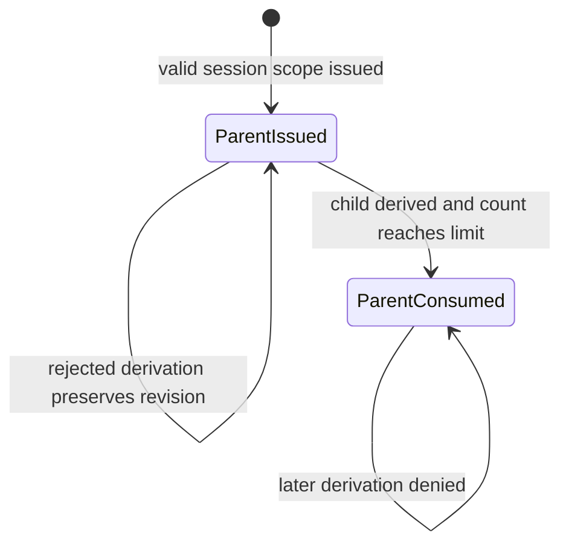
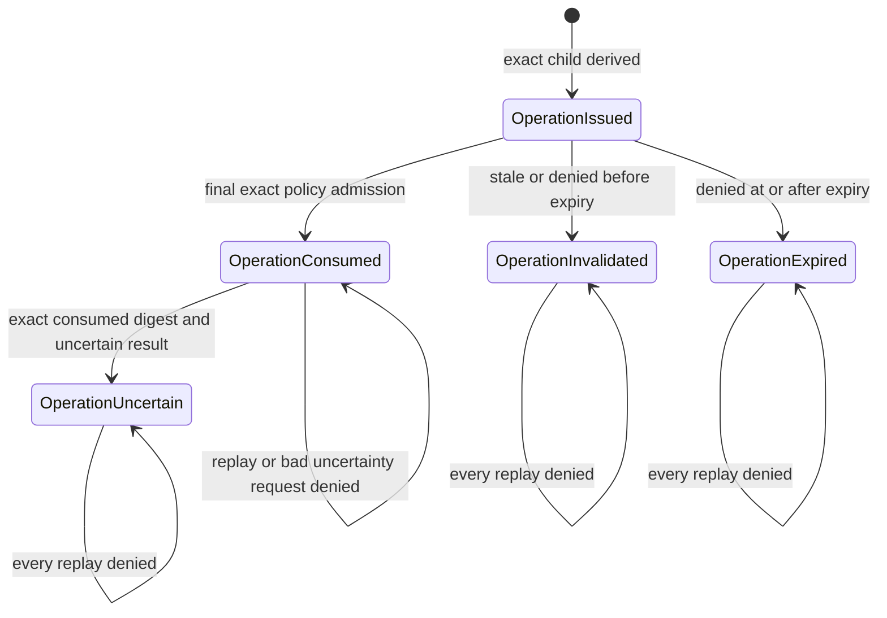

# Capability Grant State Transitions

## Status and Scope

This document describes the shared/Linux in-memory grant lifecycle implemented for AgentMage
Story 5.1. It separates session-read parent behavior from derived operation behavior because the
same status has different transition triggers for each grant class.

The diagrams and tables describe retained kernel state. They do not claim durable storage,
authenticated IPC, worker execution, effect reconciliation, a revocation API, or macOS behavior.
A parsed or caller-constructed `CapabilityGrant` is only a candidate; it has no authority unless
it exactly matches the current revision retained by the originating `GrantIssuer`.

## Status Model

`GrantStatus` is a closed six-value wire enum:

| Status | May authorize an operation? | Implemented meaning |
|---|---|---|
| `issued` | Only after every exact policy and issuer check | Current candidate retained by the issuer. |
| `consumed` | No | Parent derivation limit reached, or one operation attempt admitted. |
| `revoked` | No | Reserved terminal wire value; no current issuer transition produces it. |
| `expired` | No | Unused operation encountered at or after its exact expiration during final admission. |
| `invalidated` | No | Unused operation became stale or failed an exact policy observation before expiry. |
| `uncertain` | No | A consumed operation may have produced an unreconciled effect and cannot be retried. |

`consumed` is terminal for authority. A consumed operation has one further evidence-only
transition to `uncertain`; that transition never restores or creates authority.

## Session Parent Diagram

A successful derivation creates a distinct operation grant and atomically advances the retained
parent revision and `use_count`. The parent remains `issued` below its limit and becomes
`consumed` exactly at its limit. Parent validation failure, changed policy, broadened scope,
nonce reuse, expiration detected during derivation, or arithmetic/hash failure creates no child
and does not mutate the parent. In particular, `ParentExpired` is currently an error classification,
not a retained `expired` parent transition.

## Operation Diagram

Final admission and consumption occur under one exclusive issuer borrow. Integrity validation,
policy evaluation, checked revision/use arithmetic, canonical hashing, and record construction all
complete before current state is replaced. An exact success increments revision and `use_count`,
sets `consumed`, and retains both revision hashes. A policy denial against an otherwise well-formed
unused operation advances it to `expired` when `now >= expires_at_epoch_ms`; every other policy
denial advances it to `invalidated`. Corrupt retained state fails without a transition.

`mark_execution_uncertain` accepts only an operation already retained as `consumed`, with one use,
an exact current consumed-revision digest, and a non-pre-issuance occurrence time. It increments
revision and sets `uncertain`. A bad digest, wrong state, replay, missing grant, or corrupt retained
hash leaves the current record unchanged.

## Implemented Transition Table

`Absent` below means no grant with that identity is retained. It is not a wire status.

| ID | Grant class | From | To | Trigger | Revision and use effect |
|---|---|---|---|---|---|
| `P1` | Session parent | `Absent` | `Issued` | Valid bounded session-read issuance | Revision `1`; use `0 / limit` |
| `P2` | Session parent | `Issued` | `Issued` | Exact child derivation below parent limit | Revision `+1`; use `+1` |
| `P3` | Session parent | `Issued` | `Consumed` | Exact child derivation reaches parent limit | Revision `+1`; use equals limit |
| `O1` | Operation | `Absent` | `Issued` | Exact in-scope child derivation | Revision `1`; use `0 / 1` |
| `O2` | Operation | `Issued` | `Consumed` | Final policy admits exact current observations | Revision `+1`; use becomes `1 / 1` |
| `O3` | Operation | `Issued` | `Invalidated` | Policy denies otherwise-current unused grant before expiry | Revision `+1`; use remains `0 / 1` |
| `O4` | Operation | `Issued` | `Expired` | Policy denies otherwise-current unused grant at/after expiry | Revision `+1`; use remains `0 / 1` |
| `O5` | Operation | `Consumed` | `Uncertain` | Exact consumed hash accompanies unreconciled attempt | Revision `+1`; use remains `1 / 1` |

## Non-Transitions

| Condition | Retained-state result |
|---|---|
| Invalid new session request | No identity, nonce, hash, or grant is inserted. |
| Rejected child derivation | No child is inserted and the parent revision is unchanged. |
| Parent expiry observed by derivation | `ParentExpired` is returned; the parent remains unchanged. |
| Missing grant during consumption or lifecycle update | `NotFound`; no record is created. |
| Corrupt current hash during consumption | `CorruptState`; current grant is not replaced. |
| Terminal grant consumption replay | Policy denies at `Grant`; terminal revision remains unchanged. |
| Wrong consumed digest or uncertainty replay | Lifecycle error; consumed or uncertain revision remains unchanged. |
| `revoked` requested or inferred | No public or private issuer path currently performs this transition. |

Self-loops in the diagrams visualize state preservation after rejection. They do not represent a
new revision, another use, or an authority refresh.

## Transition Invariants

1. Every successful transition from an existing retained grant increments revision exactly once.
2. Prior revision hashes remain retained and the current record binds its new canonical hash.
3. A session parent can create only bounded children within its inclusions and exclusions.
4. An operation grant has `use_limit = 1` and can admit at most one execution attempt.
5. `expired`, `invalidated`, `revoked`, and `uncertain` have no implemented outgoing transition.
6. `consumed` never returns to `issued`; its only operation transition is to `uncertain`.
7. A denial never increments operation use count, and corrupt-state failures never replace state.
8. Lifecycle and consumption records are non-authoritative evidence, not reusable grants.

## Review Checklist

1. Compare the six documented values with the closed `GrantStatus` enum.
2. Confirm all eight implemented transition rows remain represented in both diagrams and tables.
3. Confirm session derivation updates parent and child only after every fallible check and hash.
4. Confirm operation consumption performs final policy evaluation before atomic replacement.
5. Confirm expiry uses the exclusive `now >= expires_at_epoch_ms` boundary.
6. Confirm stale observations terminalize an otherwise-current operation without consuming a use.
7. Confirm uncertainty requires the exact consumed revision digest and cannot be repeated.
8. Confirm `revoked` remains documented as unimplemented until a separately tested API exists.

## Limitations

- All issuer maps, nonce history, revision hashes, and transitions are currently in-memory.
- Session parents are not rewritten to `expired` when a derivation observes parent expiration.
- `revoked` is represented in the wire enum but no issuer transition currently produces it.
- No success/failure effect receipt currently follows consumed worker execution; only uncertainty is
  represented here.
- The concrete isolated worker and durable atomic dispatch transaction remain later work.
- No macOS implementation, execution, signing, sandbox, or packaging evidence is claimed.
