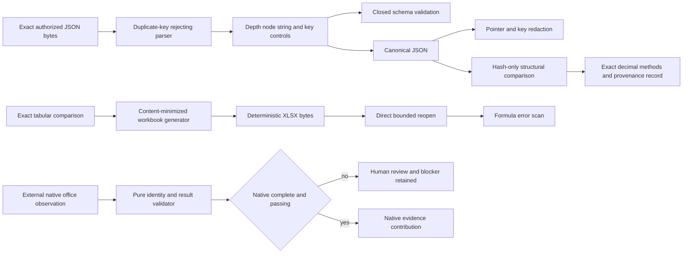

# JSON Reconciliation and Workbook Output

## Scope

Sprint 63 adds strict bounded JSON parsing, a closed recursive schema subset, canonical ordering,
full-regeneration redaction, structural comparison, deterministic reconciliation workbook
generation, direct reopen inspection, formula-error scanning, and pure validation of externally
supplied native office evidence. Exact string-backed decimal tolerance, explicit financial rounding,
deterministic weighted allocation, and stale-source admission supplement the hash-only comparison.

## JSON Boundary

The parser rejects malformed input, trailing bytes, duplicate object keys, prototype-like keys,
non-finite numbers, and profile-limit violations. The closed schema subset supports null, boolean,
number, bounded string, bounded homogeneous array, and exact object properties with required and
additional-property policies. Validation issues retain pointers and reason codes without changing
the source.

Object keys serialize in stable lexical order. Redaction accepts sorted exact RFC 6901 pointers and
key names, hashes removed canonical values, substitutes a fixed marker, and serializes a completely
new canonical document. Structural comparison walks objects and arrays deterministically and
retains only pointers, closed reasons, and canonical value hashes.

## Exact Reconciliation Methods

The advanced method boundary parses plain base-ten values directly into a sign, coefficient, and
scale, with a 4,096-digit resource ceiling and no floating-point conversion. It provides inclusive
absolute tolerance, half-even and half-away-from-zero rounding, exact weighted allocation with
stable remainder ordering, and digest-plus-age freshness admission. Its method record binds both
source hashes, schema and type decisions, formula policy, join keys, tolerance, rounding mode,
unmatched/conflicting counts, exact totals, and method identity/version. These operations are pure:
they cannot read a file, launch Office, calculate a workbook formula, or access a network.

## Workbook Boundary

The generator consumes the content-minimized tabular comparison from Sprint 62. It does not include
raw compared values. It emits:

- a summary sheet with exact source hashes, method identity, counts, and two fixed formulas;
- a reconciliation sheet with key hashes, reasons, source-row numbers, differing fields, and
  evidence state;
- explicit cell styles, text formatting for digests, column widths, a structured table, a closed
  reason validation list, and a static reason-count chart; and
- manual calculation settings with deterministic cached formula values.

All caller text is XML-escaped and encoded as inline string data. Formulas are generator-owned and
hash-bound. The output is returned in memory as a proposal and reopened by the bounded XLSX
inspector. Any unsafe finding, incomplete inspection, malformed package, or formula-error token
fails closed.

## Native Verification Boundary

AgentMage core does not launch LibreOffice, Excel, Numbers, a renderer, or an accessibility tool.
The pure verifier accepts an externally produced observation only when workbook, platform,
application, executable, package, font, formula, and side-effect fields are exact. Native-installed
evidence must contain every expected formula without errors and report zero structural, visual, or
accessibility failures. Synthetic evidence always requires human review and never passes the native
machine gate.

## Remaining Limits

Encrypted workbooks, legacy `.xls`, native recalculation, visual rendering, accessibility
evaluation, cross-platform acceptance, independent review, and manual fuzzing remain incomplete.
The generated workbook is not release-complete while those applicable requirements remain open.
