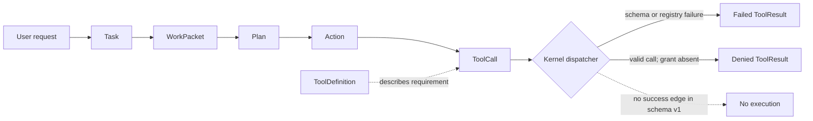
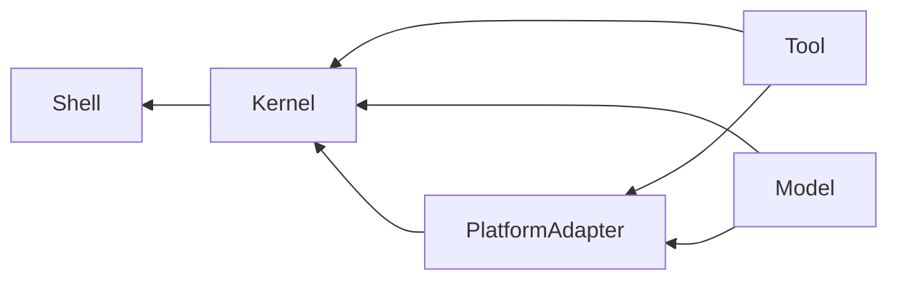

# Kernel Contract Reference

This reference describes wire schema version `1` of the unpublished
`agentmage-kernel-contracts` source package. The reviewed package is
[`agentmage-kernel-contracts-0.0.0.crate`](../../artifacts/sprints/sprint-4/story-4.1/agentmage-kernel-contracts-0.0.0.crate),
whose identity and verification result are recorded in the
[`kernel-contract-package-report.json`](../../artifacts/sprints/sprint-4/story-4.1/kernel-contract-package-report.json)
artifact.

The reproducible wire examples are published in the
[`version 1 fixture manifest`](../../fixtures/contracts/v1/manifest.json), with
version rejection and parser behavior recorded in the
[`compatibility record`](../../fixtures/contracts/compatibility.json). Each
fixture is hash-bound in the manifest and verified against the frozen package.

Cargo package version `0.0.0` and wire schema version `1` are separate
identities. This is a source-contract review package, not a supported product
release or a crates.io publication. Linux source-package verification has
passed locally. macOS packaging, build, and execution remain `blocked-macos`.

## Authority Boundary

The package contains descriptions and evidence, not execution authority.
`Task`, `WorkPacket`, `Plan`, `Action`, `Prompt`, `ToolDefinition`,
`RequiredGrantTemplate`, and `ToolCall` cannot authorize an operation. The
required-grant template is metadata describing a future requirement; it is not
a grant and cannot be consumed as one. A `CapabilityGrant` contract and the
only positive dispatch path are intentionally absent until Sprint 5.

Model text, prompt roles, workspace content, plan prose, expected effects, and
tool metadata may influence a proposal but never policy. Unknown top-level
fields such as `capability_grant` fail closed. Authority-looking text remains
ordinary inert text.

## Wire Rules

| Rule | Schema version 1 behavior |
|---|---|
| Encoding | UTF-8 JSON, one complete top-level value |
| Maximum encoded size | `MAX_CONTRACT_JSON_BYTES`, exactly 1,048,576 bytes |
| Supported version | `CONTRACT_SCHEMA_VERSION`, exactly `1` |
| Object shape | All structs are closed; unknown and duplicate fields fail |
| Required fields | Every declared field is required, including fields whose value may be `null` |
| Optional values | Rust `Option<T>` is encoded as a present value or JSON `null` |
| Enumerations | Lowercase `snake_case` strings |
| Identifiers | Distinct Rust newtypes encoded as JSON strings |
| Byte vectors | JSON arrays of unsigned integer byte values |
| Integer widths | The declared Rust width applies; overflow fails parsing |
| Sequence order | Preserved and semantically significant unless a type says otherwise |
| Maps | No map-valued field is exposed by the version 1 contract family |
| Canonical output | Compact JSON in Rust declaration order and sequence order |
| Trailing content | Rejected, including a second JSON value |

`to_canonical_json` is deterministic for these closed types, but its output is
an AgentMage contract encoding, not a claim of RFC 8785 JSON Canonicalization
Scheme compatibility. `from_json` checks the whole-contract byte ceiling before
parsing and checks the top-level schema version after structural parsing.

## Parse Failures

All boundary failures use a redacted `ContractError`. Candidate JSON and private
values are not copied into the message.

| Code | Category | Meaning |
|---|---|---|
| `contract.size.exceeded` | `resource` | Input or encoded output exceeds 1 MiB |
| `contract.serialization.failed` | `internal` | A supported value could not be encoded |
| `contract.parse.io` | `dependency` | Parser input could not be read |
| `contract.parse.syntax` | `validation` | JSON syntax or trailing content is invalid |
| `contract.parse.eof` | `validation` | Input ended before one complete value |
| `contract.field.missing` | `validation` | A required field is absent |
| `contract.field.unknown` | `validation` | A closed object contains an extra field |
| `contract.field.duplicate` | `validation` | An object repeats a field |
| `contract.value.unsupported` | `validation` | An enum wire value is not supported |
| `contract.parse.data` | `validation` | A value has the wrong closed-schema shape or range |
| `contract.version.unsupported` | `validation` | `schema_version` is not exactly `1` |

Parser errors use `RetryDisposition::AfterCorrection`. An unsupported version
identifies `schema_version` in `field_path`; parse errors otherwise avoid
retaining candidate field content.

## Contract Families

### Common Values

`SchemaReference` binds `schema_id`, `schema_version`, and the lowercase SHA-256
of exact schema bytes. `ContractPayload` keeps that schema reference, media
type, exact bytes, and payload SHA-256 separate. The common diagnostic types are
`ValidationIssue`, `ValidationSeverity`, `ContractError`, `ErrorCategory`, and
`RetryDisposition`.

Semantic digest, media-type, identifier, text, and collection bounds are
validated by the owning kernel boundary. Generic JSON parsing establishes only
the closed wire shape, byte ceiling, enum values, integer widths, and top-level
schema version.

### Task and Work Packet

`Task` records a user objective, acceptance criteria, constraints, session, and
`TaskStatus`. `WorkPacket` is the revision-controlled execution proposal. It
adds owner and reason, evidence, mutable and protected file declarations,
expected output, checks, capability class, budgets, stops, rollback,
sensitivity, review metadata, completion evidence, plan identity, and
`WorkPacketState`.

File declarations and `required_capability_class` are descriptive. They do not
resolve a path or create authority. `BudgetLimit` identifies a `BudgetResource`;
`StopCondition` identifies a `StopConditionKind`; `RollbackPlan`,
`CompletionEvidence`, and `DataSensitivity` complete the packet vocabulary.

The kernel engine validates packet fields before admission. Revisions append to
`WorkPacketHistory`; they do not overwrite prior revisions. Terminal packets do
not reopen. Completion requires exact evidence for every acceptance check and
every required evidence class.

### Plan and Action

`Plan` binds a `PlanId`, `TaskId`, exact work-packet revision, plan revision,
ordered `PlanStep` values, and `PlanState`. Each step has a stable `PlanStepId`,
ordinal, dependencies, expected evidence, description, and `PlanStepState`.

`Action` is a descriptive proposal identified by `ActionId`. It may reference a
plan step and records `ActionKind`, expected effects, description, and
`ActionState`. Neither a ready plan nor a ready action permits dispatch.

### Prompt

`Prompt` binds `PromptId`, `CorrelationId`, `TaskId`, a purpose, and ordered
`PromptMessage` values. `PromptRole` distinguishes product template, user
request, kernel context, workspace content, prior model output, and output
contract text. Role and ordering provide provenance; no role grants authority
or changes policy.

### Tools

`ToolDefinition` freezes an exact `ToolId` and tool version, display metadata,
input and output `SchemaReference` values, `ToolRiskLevel`, declared effects,
`RequiredGrantTemplate`, and timeout. Registration validates those values and
does not expose an execute callback.

`ToolCall` binds `ToolCallId`, `CorrelationId`, `ActionId`, exact tool identity
and version, and schema-bound arguments. `ToolResult` closes that attempt with
`OperationOutcome`, optional output, validation issues, evidence, optional
error, elapsed milliseconds, and `StateChange`.

In the current dispatcher, a malformed or unregistered call fails and a valid
call is denied with `tool.dispatch.grant_required`. Both paths report
`StateChange::NotChanged`; neither path executes a tool.

### Evidence and Receipts

`EvidenceReference` identifies an `EvidenceKind`, source, object, optional
fragment, content SHA-256, and optional observed revision. It is
content-addressed evidence, not filesystem authority.

`Receipt` binds `ReceiptId`, sequence, correlation, session, task, action,
optional tool call, `OperationOutcome`, operation digest, evidence, optional
error, previous and current receipt-chain digests, and occurrence time. Schema
version 1 defines the record shape only; canonical receipt hashing and durable
append-only persistence are delivered by later stories.

### Cancellation and Failures

`CancellationSignal` binds `CancellationId`, correlation, task,
`CancellationReason`, and the requesting `BoundaryKind`. `BoundaryFailure`
preserves task and correlation, origin, ordered route, `BoundaryOutcomeKind`,
the original error, and an optional cancellation signal.

Failure routes admit only declared reverse dependency edges, cannot repeat a
boundary, and preserve original context. Cancelled outcomes require a matching
cancellation error and signal. Denied, timed-out, failed, and uncertain
outcomes require their matching error categories. Cancellation tokens propagate
down declared shell/kernel/platform/tool/model edges to uncancelled descendants;
the first signal observed by a token remains stable.

## Versioned Top-Level Types

The following 13 types implement `VersionedContract` and may be passed directly
to `from_json` or `to_canonical_json`:

| Domain | Top-level types |
|---|---|
| Work | `Task`, `WorkPacket`, `Plan`, `Action` |
| Model | `Prompt` |
| Tool | `ToolDefinition`, `ToolCall`, `ToolResult` |
| Evidence | `EvidenceReference`, `Receipt` |
| Failure | `ContractError`, `CancellationSignal`, `BoundaryFailure` |

Nested records and enums are encoded only as part of their owning top-level
contract. Their fields remain closed even though they do not independently
implement `VersionedContract`.

## Compatibility

Version `1` accepts only exact version `1` input. It has no best-effort forward
compatibility, field aliases, implicit defaults, enum fallback, or unknown-field
retention. A client must stop on an unsupported version rather than stripping
or guessing fields.

Within one schema version, canonical bytes and enum strings are stable. A
future incompatible field, required-value, enum, encoding, or semantic change
requires a new schema version and compatibility fixtures. Cargo package version
changes do not by themselves change the wire schema, and a wire schema change
does not silently relabel an existing package artifact.

## Client Checklist

1. Enforce the 1 MiB ceiling before allocating or parsing a contract.
2. Require one complete JSON object and exact `schema_version` value.
3. Reject missing, unknown, duplicate, malformed, oversized, and unsupported
   values without partial admission.
4. Preserve identifier types internally even though their JSON values are
   strings.
5. Preserve sequence and declaration order when reproducing canonical bytes.
6. Treat optional fields as required keys whose value may be `null`.
7. Keep diagnostics bounded and avoid echoing candidate content.
8. Treat plans, prompts, descriptions, tool definitions, and grant templates as
   non-authoritative.
9. Preserve task, correlation, error, cancellation, and route context across
   boundaries.
10. Reproduce the success fixtures in the
    [`version 1 manifest`](../../fixtures/contracts/v1/manifest.json) and the
    failure behavior in the
    [`compatibility record`](../../fixtures/contracts/compatibility.json)
    before claiming schema compatibility.

## Public Symbol Index

The package exports 65 public symbols. The index is grouped by source family so
an implementation can distinguish wire types from helpers and identifiers.

- Boundary: `BoundaryFailure`, `BoundaryKind`, `BoundaryOutcomeKind`,
  `CancellationReason`, `CancellationSignal`.
- Common: `CONTRACT_SCHEMA_VERSION`, `ContractError`, `ContractPayload`,
  `ErrorCategory`, `RetryDisposition`, `SchemaReference`, `ValidationIssue`,
  `ValidationSeverity`.
- Evidence: `EvidenceKind`, `EvidenceReference`, `Receipt`.
- Identifiers: `ActionId`, `CancellationId`, `CorrelationId`, `ErrorId`,
  `EvidenceId`, `PlanId`, `PlanStepId`, `PromptId`, `ReceiptId`, `SchemaId`,
  `SessionId`, `TaskId`, `ToolCallId`, `ToolId`, `WorkPacketId`.
- Prompt: `Prompt`, `PromptMessage`, `PromptRole`.
- Serialization: `ContractResult`, `MAX_CONTRACT_JSON_BYTES`,
  `VersionedContract`, `from_json`, `to_canonical_json`.
- Task and plan: `Action`, `ActionKind`, `ActionState`, `BudgetLimit`,
  `BudgetResource`, `CompletionEvidence`, `DataSensitivity`, `Plan`,
  `PlanState`, `PlanStep`, `PlanStepState`, `RollbackPlan`, `StopCondition`,
  `StopConditionKind`, `Task`, `TaskStatus`, `WorkPacket`, `WorkPacketState`.
- Tool: `OperationOutcome`, `RequiredGrantTemplate`, `StateChange`, `ToolCall`,
  `ToolDefinition`, `ToolResult`, `ToolRiskLevel`.
- Diagnostic identity: `COMPONENT_ID`.

## Scope Limits

This reference does not claim published JSON Schema files, cross-version
compatibility or migration, durable receipt storage, capability grants,
production tools, process termination, a model adapter, a product binary, or
macOS verification. Those claims remain gated by their numbered tasks.
