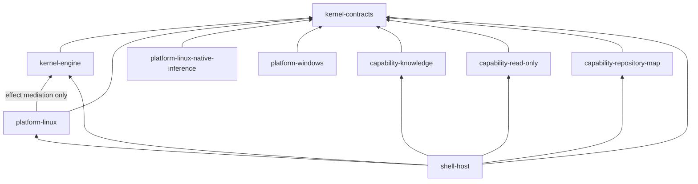

# Kernel Dependency Report

This report separates AgentMage's live Phase 5 candidate dependency policy from
the product edges that are currently materialized in repository manifests. Its
retained machine-verifiable companion is the
[`kernel-architecture-dependency-report.json`](../../artifacts/sprints/sprint-4/story-4.1/kernel-architecture-dependency-report.json)
artifact.

The companion artifact is regenerated only from the closed manifest inventory
and records the exact reviewed source revision.

## Evidence Boundary

The generator reads the accepted module inventory and dependency rules, every
Cargo product manifest, `Cargo.lock`, the Visual Studio Code shell manifest and
lockfile, and the Swift package manifest and resolution file. It reports direct
manifest edges and locked external-package identities. It does not infer a
runtime edge from a diagram, an allowlist, a planned module, or prose.

## Materialized Product Graph

An arrow means that the source manifest declares a product dependency on the
target. The Linux platform edge is conditional on `target_os = "linux"`.

The fourteen materialized internal product edges are:

- `capability-knowledge` -> `kernel-contracts`
- `capability-read-only` -> `kernel-contracts`
- `capability-repository-map` -> `kernel-contracts`
- `kernel-engine` -> `kernel-contracts`
- `platform-linux` -> `kernel-contracts`
- `platform-linux` -> `kernel-engine`
- `platform-linux-native-inference` -> `kernel-contracts`
- `platform-windows` -> `kernel-contracts`
- `shell-host` -> `capability-knowledge`
- `shell-host` -> `capability-read-only`
- `shell-host` -> `capability-repository-map`
- `shell-host` -> `kernel-contracts`
- `shell-host` -> `kernel-engine`
- `shell-host` -> `platform-linux` under `cfg(target_os = "linux")`

Both the amended eighteen-edge logical graph and this fourteen-edge materialized graph
are acyclic. Every materialized edge is in the source module's exact allowlist.

## Declared but Unmaterialized Edges

Four policy edges are intentionally not presented as implemented:

- `platform-macos` -> `kernel-contracts`: `blocked-macos`
- `platform-macos` -> `kernel-engine`: `blocked-macos`
- `shell-host` -> `platform-macos`: `blocked-macos`
- `shell-vscode` -> `kernel-contracts`: `protocol-not-yet-generated`

Their presence in the policy graph reserves a dependency direction. It is not
build, test, package, or execution evidence. A later task must materialize and
verify each edge before its status can change.

## External Dependencies

The Cargo manifests directly use `serde` and `serde_json` in contracts;
`ed25519-dalek`, `serde`, `serde_json`, and `sha2` in the kernel engine; and
`rustix`, `seccompiler`, `sha2`, and `zeroize` in the Linux adapter; and `rustix`,
`serde`, `serde_json`, `sha2`, and `zeroize` in the Linux inference adapter. The
knowledge and repository-map capabilities add their locked parsing, archive,
cryptographic, SQLite, and tree-sitter dependencies while depending on no other
AgentMage module beyond contracts. The
Windows adapter currently has only the contracts dependency on non-Windows hosts,
with target-gated `sha2` and `windows-sys` dependencies. `seccompiler` is a
pure-Rust classic-BPF policy compiler used to produce the fixed Bubblewrap
worker filter; it does not add a native `libseccomp` link. `zeroize` clears
credential and sensitive pipe buffers when they leave scope. Exact resolved
versions and checksums come from `Cargo.lock`. The VS Code shell has no runtime
npm package dependency; its seven npm packages are development tooling. The
Swift package has no external package dependency.

This architecture report identifies edges only. Package provenance,
vulnerability disposition, license review, and artifact integrity remain owned
by the supply-chain controls and are not duplicated here.

## Authority Findings

- `kernel-contracts` has zero internal product dependencies.
- `kernel-engine` has exactly one internal edge, to `kernel-contracts`.
- Neither the kernel, Linux adapters, Windows adapter, nor any capability imports a shell.
- The Linux adapter depends inward on contracts and the kernel's consuming
  effect-mediation interface. Each capability depends only on contracts among
  AgentMage modules; none imports another capability.
- Linux inference and Windows each depend inward on contracts without importing
  the kernel engine or a shell.
- The host shell is the only materialized composition root.
- No compile cycle or prohibited observed edge exists.

These findings describe compile direction. They do not grant execution,
filesystem, process, model, tool, network, or persistence authority.

## Scope Limits

Linux manifest analysis is `verified-local`. The macOS manifest remains an
interface-only scaffold; macOS implementation and execution are
`blocked-macos`. The VS Code generated protocol is not implemented. This report
does not verify runtime process boundaries, sockets, data flow, package
vulnerabilities, or transitive behavior.
