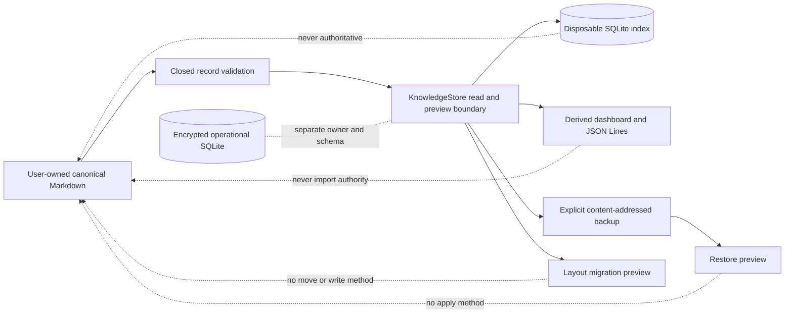

# Knowledge Authority Boundary

## Purpose

Sprint 26 introduces one platform-neutral capability pack for human-owned knowledge. The pack has
no filesystem handle, operational-store dependency, model access, network path, shell access, or
authority-bearing operation. A trusted platform adapter may later provide already-authorized
snapshots, but this capability can only validate, inspect, derive, and preview.

## Authority Model

Canonical identity is carried inside Markdown and never derived from a filename or folder. The
same record therefore retains its identity across rename, move, index deletion, index rebuild,
backup, restore, migration preview, and conversation restart. Typed links target stable identities,
not paths.

## Record Closure

The schema registry covers people, organizations, projects, meetings, tasks, decisions,
commitments, documents, correspondence, deadlines, approvals, risks, questions, and handoffs.
Every record carries privacy, durable sensitivity, retention, timestamps, fields, links, tags, and
content-addressed evidence. Highly restricted or non-durable records and obvious credential/private
key candidates are denied before Markdown rendering or indexing.

The field-level data dictionary assigns exactly one owner, purpose, sensitivity, storage rule,
retention rule, correction path, export behavior, deletion behavior, and recovery source to every
canonical and derived field. Canonical Markdown is not encrypted by AgentMage; users must select a
local storage location whose filesystem protections match their needs. The disposable index and
explicit exports do not improve that storage classification.

## Plain-Folder Contract

The adapter accepts immutable snapshots containing canonical workspace-relative paths, held bytes,
digests, and trusted entry/storage classifications. It rejects symlinks, directories, special
objects, hidden entries, synchronized roots, foreign workspaces, non-Markdown paths, oversized
inputs, duplicate paths, duplicate identities, hash drift, malformed frontmatter, unknown fields,
and non-canonical rendering.

Folder, filename, frontmatter key, tag, link, identifier, privacy-default, and retention-default
conventions are explicit bounded layout values. These conventions affect proposed storage and
rendering, never record identity.

## Derived State

The in-memory SQLite index has exactly three product tables: metadata, records, and links. Its fixed
authority marker is `derived_only`. A rebuild validates the complete canonical set in one
transaction. Clearing or corrupting the index cannot mutate caller-owned records; corruption is
detected and a full rebuild reproduces the same projection digest.

Dashboard and JSON Lines generation are deterministic explicit exports marked non-canonical. No
JSON Lines import route exists. Backup verification binds schema versions, paths, content hashes,
lengths, and exact bytes. Restore reports create, unchanged, or conflict and never overwrites.
Migration re-renders a destination convention while preserving the complete parsed record and
offers no apply operation.

## Deferred Authority

Canonical create, update, delete, move, restore, and migration effects remain unavailable until the
v0.3 grant path owns their exact platform-mediated implementation. Obsidian-specific parsing begins
in Sprint 27. Operational sessions, grants, receipts, checkpoints, and resume state remain owned
exclusively by encrypted operational SQLite and never depend on this capability.
