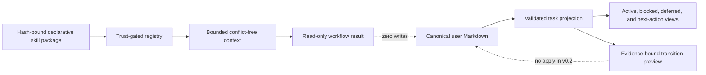

# Knowledge Tasks and Declarative Skills

## Authority Boundary

Canonical user-owned Markdown remains the sole authority for knowledge and tasks. Task views,
skill registries, composed contexts, workflow results, indexes, and exports are derivatives.
AgentMage v0.2 has no knowledge-file apply operation.

## Task Contract

The closed task projection retains stable identity, title, owner, optional project, status,
priority, blocker, next action, deferral boundary, dependencies, other source links, evidence, and
the complete canonical-record digest. Derived views are deterministically ordered by priority and
identity and carry duplicate warnings for normalized title, project, and owner matches.

Every lifecycle transition requires at least one new content-addressed evidence reference. Closed
transition rules require blockers for blocked tasks, dates for deferred tasks, next actions for
open or active tasks, and no next action for terminal tasks. A terminal task cannot be reopened by
this v0.2 API. The result is a hash-bound canonical-record preview with `applied: false`.

## Declarative Skill Contract

An exact manifest records identity, source and hash, signer or provenance, license, version,
knowledge and product compatibility, purpose, precedence, complete file inventory, requested
read-only scope, trust state, package digest, and manifest digest. Files are limited to:

- `*.prompt.md` prompt data;
- `*.schema.json` schema data;
- `*.example.md` example data; and
- `*.template.md` template data.

Package paths are relative and traversal-free. Assets are bounded UTF-8, exactly declared, and
hash-matched. Binary bytes, shebangs, executable extensions, hidden-tool markers, undeclared files,
tampering, unsupported versions, disabled or quarantined trust, duplicates, and excessive context
fail closed.

Skill context is sorted by visible precedence. Different bytes under the same semantic instruction
key create a visible conflict and all conflicting entries are omitted. The influence receipt names
exact skill, manifest, and content hashes, conflicts, context bytes, and context digest. Its
filesystem, shell, secret, network, connector, approval, grant, tool-registration, execution,
workspace-expansion, memory-promotion, and write fields are all fixed false.

## Built-In Workflows

Eight built-in skill packages implement Daily Setup, Daily Briefing, Issue Intake, Handoff,
Meeting Cleanup, Repository Learning, Plain-Workspace Steward, and Obsidian Vault Steward. The
workflow contract accepts only current non-conflicting evidence and preserves exact canonical
record and citation identities. Lexical and approved optional local-semantic paths produce the
same source/task evidence shape. Plain-folder and Obsidian stewardship share identical canonical
record semantics.

The later v0.4 source candidate reuses the same permanent authority ceiling for nine coding-skill
packages. Those packages are defined separately in the
[coding-skill architecture](./coding-skills-and-release-boundary.md); their presence does not
broaden the v0.2 knowledge workflow or release boundary.

## Open Release Boundary

Local capability tests do not establish native Chat integration, a public CLI, supported-platform
upgrade/downgrade evidence, accessibility acceptance, package signing, or independent review. The
v0.2 release gate remains blocked until those separate facts exist.
