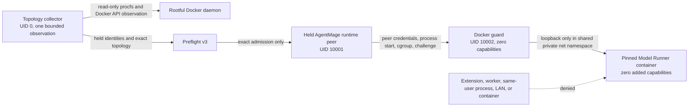
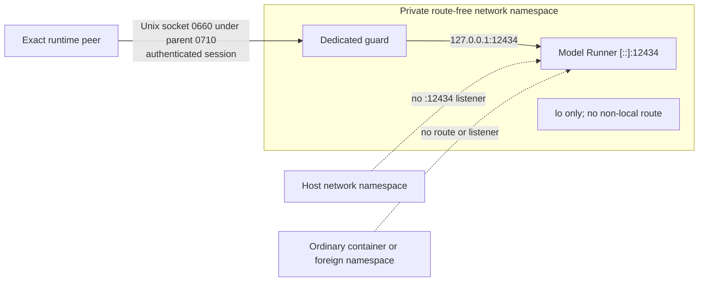
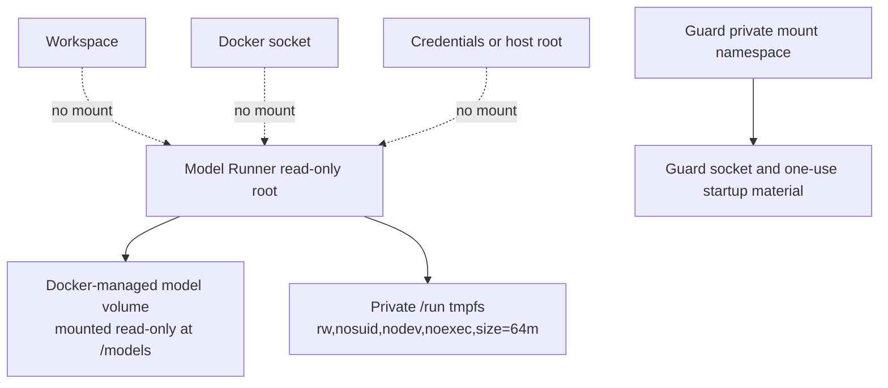

# Linux Docker Runtime Topology

## Status

This record describes the packaged and KVM-verified optional Docker Model
Runner compatibility boundary. Native `llama.cpp` remains the Fedora and Ubuntu
reference adapter. No model inference, physical-host certification, release
support, or product-wide requirement completion is claimed here.

## Processes and Privileges

The collector's effective-UID-0 requirement is explicit. It proves the current
topology but does not yet satisfy the product-wide standard-user requirement;
no hidden privileged helper or automatic elevation is admitted by this record.

## Sockets and Network Namespaces

Loopback and namespace placement provide reachability control, not
authentication. The Unix peer handshake and exact held identities provide the
authentication boundary before a request can reach the guard.

## Mounts and Writable State

The production collector refuses undeclared mounts, writable model content,
Docker-socket exposure, a writable root, privilege or capability broadening,
resource drift, or ambient network configuration. Evidence for each diagram is
retained in the Story 9.2 topology, reachability, and control-disablement
artifacts rather than inferred from this document.
