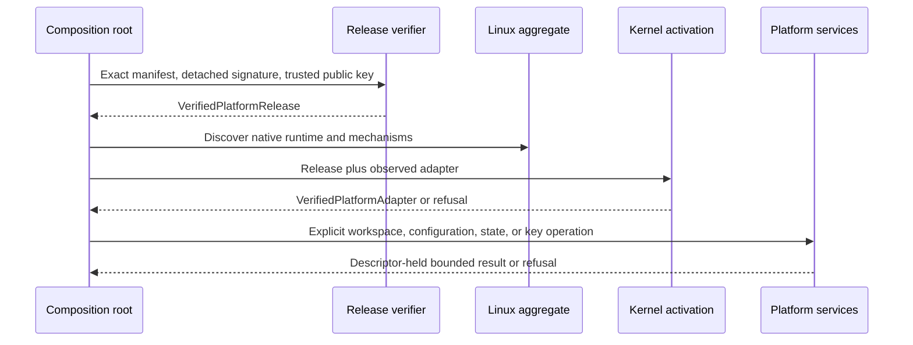
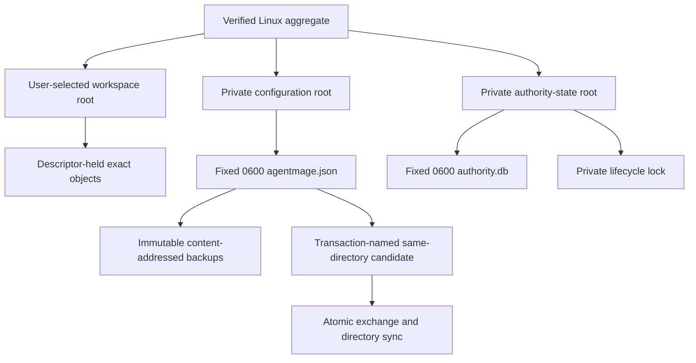
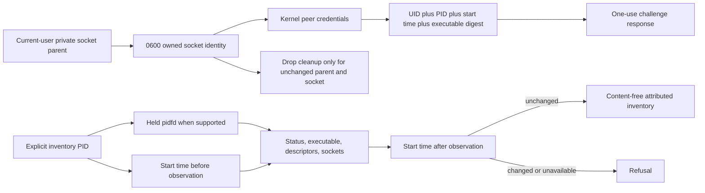

# Linux Platform Lifecycle

## Scope

This document describes the Phase 8 Fedora/Ubuntu candidate under accepted
Decision 0017. It composes independently verified release trust, workspace and
state roots, native configuration storage, operational-key provisioning, local
IPC, and process inventory. It is not a supported-package or integrated-product
claim.

## Startup and Authority

No workspace or state constructor accepts an unverified aggregate. The current
repository has no production signed manifest or package, so development-host
discovery does not imply successful production activation.

## Filesystem Lifecycles

Every admitted root is absolute, component-walked without symbolic links,
current-user owned, owner-only, locally attached, and rejected when a known
synchronization marker exists. The adapter retains root device, inode, mount,
filesystem, owner, mode, and synchronization evidence and revalidates it around
composition boundaries.

Configuration targets and backups must be current-user, `0600`, single-link
regular files on the held root filesystem. Reads compare metadata before and
after bounded content capture. Publication retains an immutable backup, writes
and synchronizes a private candidate, rechecks the exact preimage, atomically
exchanges names, verifies both resulting objects, synchronizes the directory,
and removes the displaced object. A retry after interruption between exchange
and cleanup recognizes only the exact transaction, old object, and new bytes.

Authority state opens through the exact
`/proc/self/fd/<held-root>/authority.db` shape after final-object creation or
verification rejects symbolic links. Ordinary paths retain SQLite no-follow.
Explicit first-install key provisioning serializes on a private fixed lock,
refuses existing state/key mismatch, generates 256 random bits, and verifies
Secret Service lookup. Startup lookup cannot provision or delete. Rotation
remains unavailable.

## IPC and Process Identity

Listener startup never unlinks an unknown pre-existing path. Orderly drop
removes only the same socket in the same private parent; a replacement remains.
Authentication binds the one-use frame to kernel peer credentials and stable
process identity.

Decision 0023 additionally permits one authentication-only bootstrap endpoint
after exact installed-package verification. That endpoint carries no platform
or product authority. The host verifies the external package signature and
payload before creating the endpoint, transfers fresh launch material only over
its inherited standard-output pipe, and binds the peer to the exact parent
process. A usable workflow still requires the independently signed aggregate
activation shown above.

Inventory records whether identity used `PidFdAndStartTime` or the explicit
`StartTimeOnly` fallback on kernels where pidfd is unsupported. Malformed or
partial `/proc` state, disappearance, and start-time drift fail without an
authoritative record. Paths, arguments, environment, socket names, and file
contents are not retained in inventory diagnostics.

## Deliberate Limits

- Detached package signing and verification mechanics plus a package-verified
  authentication-only bootstrap primitive are present. No production signer,
  approved trust-root provisioning, signed platform release, installer,
  updater, or model runtime is present.
- Unknown stale-socket recovery is not automated; startup fails closed and
  retains the object.
- Operational-key deletion, state deletion, uninstall orchestration, and key
  rotation are not implemented.
- The Phase 9 source candidate composes one exact read through host and Visual
  Studio Code provider contracts. The extension now supervises the fixed
  installed bootstrap host, but product authority remains unavailable until
  signed platform activation is complete.
- Fedora execution does not substitute for Ubuntu, macOS, or Windows evidence.
