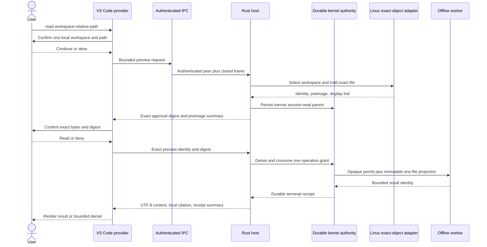

# Linux Visual Studio Code Read Workflow

## Scope

This document describes the Phase 9 source candidate governed by accepted
Decision 0018. It composes one user-approved exact file read. It does not add a
model, repository index, search, Git inspection, write, command, network,
connector, or general agent path.

The source harness runs the complete Rust read and receipt path on Fedora.
Decision 0023 adds the package-verified authentication-only bootstrap primitive.
The installed extension remains fail-closed until its supervised launch path is
wired and the host activates a signed platform release before constructing this
workflow. This document is not a supported-installation claim.

## Request Sequence

## Authority Boundary

- Prompt text can select only the closed `read` command and relative path
  components. The one active local workspace supplies the absolute root.
- The first confirmation permits only preparation of one bounded preview. It
  does not approve the worker attempt.
- The host resolves and continuously holds one file before rendering the second
  confirmation. The approval digest binds the target, preimage, tool call,
  policy, expected no-change effect, expiry, and parent grant.
- `DurableAuthorityRuntime::execute_effect` is the only public launch path. The
  host creates a Linux driver but never receives or constructs the opaque
  effect permit.
- The worker receives one immutable file projection. Adjacent files, parent
  paths, host descriptors, ambient environment, credentials, and network access
  are absent.
- A completed attempt publishes one encrypted receipt. Repeating the approval
  returns the retained receipt identity and never repeats the file read.

## IPC Boundary

The verified Linux aggregate owns the private `0600` Unix endpoint. Its listener
is never exported. Authentication binds user, process, process start time,
executable digest, protocol version, a fresh challenge, and a one-use secret.
Only the resulting opaque `LinuxAuthenticatedIpcSession` can read or write the
big-endian length-prefixed product frames.

The Visual Studio Code bridge is a Unix-socket client only. It serializes one
request at a time, validates closed response fields and bounds, erases its
copied launch secret, and returns a generic connection denial on framing,
parsing, or transport failure. Normal extension activation injects no endpoint
or secret and is therefore unavailable. The package-verified host can now
create the private endpoint and transfer fresh launch material over its
inherited pipe, but extension supervision is a separate increment.

## Recovery and Cancellation

- Pending previews are memory-only, bounded to eight, and expire after one
  minute. Mismatch, staleness, cancellation, or restart removes their only path
  to operation-grant derivation.
- Cancellation before consumption removes the exact pending preview and starts
  no worker. Cooperative cancellation after launch is not claimed.
- The worker has a fixed runtime limit. Worker failure closes the consumed
  attempt with a receipt and returns no partial content.
- The encrypted authority store resolves interrupted transactions during open.
  Completed transactions remain terminal and replay safe after restart.

## Verification Boundary

Default tests cover message versions, unknown fields, size bounds, malformed
identifiers and digests, command and path mutations, two confirmation denials,
cancellation, preview correlation, response validation, handshake bytes,
extension-facing rendering, static source authority, and compile-time effect
mediation.

Explicit Fedora tests additionally run the real systemd and Bubblewrap worker,
verify exact output and one receipt, deny replay, reopen SQLCipher state, reject
a stale preimage before worker launch, and cancel a pending preview without a
receipt. Existing Linux sandbox tests cover adjacent-file, parent-path,
descriptor, environment, process, write, network, seccomp, output, and runtime
attacks. Existing durable-authority tests cover every persisted crash boundary.

Sprint 25 still owns signed clean-install activation. Synthetic test-support
constructors are feature gated, absent from normal builds, and cannot satisfy a
release or support gate.
