# Linux Worker Isolation

## Status and Scope

The Linux adapter implements one fresh Bubblewrap worker per admitted read
operation. The worker boundary has been exercised natively on Fedora Kinoite
44 and against Ubuntu 26.04 userspace in a disposable rootless container. The
Ubuntu run required a privileged outer container envelope and therefore proves
userspace portability, not native Ubuntu isolation or release support. The
public mediated surface accepts one exact `LinuxHeldObject` and a matching
kernel-issued `EffectAuthorization`; it is not a general command runner.

## Process and Data Flow

```mermaid
flowchart LR
    K["Kernel authority transaction"]
    H["Continuously held exact object"]
    P["Sealed exact-file or bounded-directory projection"]
    U["systemd user manager"]
    B["Verified Bubblewrap"]
    W["One verified worker executable"]
    O["Bounded output and redacted diagnostics"]

    K -->|"consumed one-use permit"| H
    H -->|"identity and preimage revalidation"| P
    P -->|"one OpenFile descriptor"| U
    U -->|"transient cgroup v2 service"| B
    B -->|"private namespaces; /input/object only"| W
    W -->|"bounded stdout; stderr digest and size"| O
```

The kernel permit carries the exact consumed target, inherited exclusions, and
required preimage. The Linux effect driver compares that binding with its held
object before asking the runner to launch. The runner then revalidates the held
root identity, object identity, mode, link state, and file preimage. For a file
it copies only the approved bytes from the held descriptor, verifies their
preimage again, revalidates the held object, and seals the anonymous projection
before launch. A changed authorization, adapter, platform, path, object
identity, or preimage fails before a worker process starts.

The host separately verifies and continuously holds the worker executable,
dynamic runtime files, Bubblewrap, and `systemd-run`. Root-owned launch paths
must have no symbolic-link component and no group- or world-writable component.
The supervisors are digest-revalidated immediately before launch.

## Exact Object Boundary

Each worker receives only:

- one read-only object at `/input/object`;
- one verified executable at `/app/<verified-basename>`;
- up to 16 verified root-owned runtime files below `/lib`, `/lib64`,
  `/usr/lib`, or `/usr/lib64`;
- a private bounded `/tmp`, minimal private `/dev`, and new `/proc`;
- `PATH=/app`, `LANG=C`, and `PWD=/input`; and
- an already compiled seccomp program on standard input.

A file operation derives a private immutable projection from the continuously
held descriptor. The projection must exactly match the grant-bound byte count
and SHA-256, and Linux seals prohibit writing, growing, shrinking, or removing
the seals. Bubblewrap copies only those approved bytes to `/input/object`. The
original file descriptor and authorized workspace root are never passed to the
user manager, Bubblewrap, or worker. Siblings, parents, and an ambient
`/workspace` path are therefore absent at the operating-system boundary.

A directory operation also does not mount the source directory. The supervisor
enumerates the continuously held descriptor under fixed entry and byte limits,
conservatively removes the first descendant covered by each inherited
exclusion, sorts the remaining raw names, and writes a NUL-delimited projection
to a sealed private anonymous descriptor. It revalidates the held directory
after enumeration and before sealing. Bubblewrap copies only that bounded
projection to `/input/object`. The original directory, child descriptors, file
contents, and excluded entries never enter the worker namespace.

The worker does not receive the host home, `/etc`, `/sys`, `/run`, host devices,
host process namespace, inherited configuration, host network namespace,
secret-store socket, workspace root, or writable canonical object.
`--unshare-all` creates private namespaces, `--disable-userns` prevents a nested
user namespace, and `--cap-drop ALL` removes capabilities. The fixed seccomp
policy returns `EPERM` for network/socket, namespace/mount, kernel/module,
keyring, tracing, cross-process, io_uring, modern mount, clock/host-identity,
and related dangerous syscall families.

## Resource Enforcement

The transient user service applies exact `MemoryMax`, `MemorySwapMax=0`,
`TasksMax`, `CPUQuota`, and `RuntimeMaxSec` properties. It also requires
`NoNewPrivileges`, private devices, SUID/SGID restrictions, a locked
personality, and address-family restriction during Bubblewrap setup. Public
limit construction rejects values outside the closed supported ranges.

Standard output and diagnostics are drained concurrently. Retained bytes never
exceed the declared output bound. An over-limit stream fails closed;
diagnostics leave the boundary only as a SHA-256 digest and byte count.

## Trust and Failure Boundary

The worker is treated as potentially compromised. The operating-system account,
root-owned package paths, kernel, systemd user manager, and installed Bubblewrap
remain trusted dependencies. A process already running with the same user
authority, or a privileged administrator, is outside this boundary.

Manifest, identity, stale-object, target-mismatch, projection, process-start,
and output failures use stable content-free categories. There is no public raw
runner method and no fallback without the kernel permit, exact held object,
Bubblewrap, seccomp, systemd user service, or declared resource controls.

## Current Verification

The default workspace suite verifies target/path parity, exact permit matching,
sealed exact-file projection, directory projection bounds and exclusions,
stale-object pre-launch denial, and content-free serialization.
Environment-dependent tests remain explicitly marked. All 11 Linux sandbox
tests passed natively on Fedora Kinoite 44 and in the bounded Ubuntu 26.04
userspace envelope described above, including:

- exact canonical file reading and directory projection;
- foreign-workspace and stale-object denial before process start;
- sibling, parent, ambient-workspace, and `/proc/self/fd` discovery denial;
- read-only canonical objects and scratch isolation;
- absence of ambient host paths, devices, processes, and network access;
- fixed environment, `NoNewPrivileges`, and seccomp enforcement; and
- output and elapsed-runtime limits.

These are source, native Fedora, and constrained Ubuntu userspace results. They
do not establish native Ubuntu desktop execution, release support, or an
integrated product claim. Package lifecycle evidence is maintained separately.

## Secret Service Boundary

Linux credentials continue to use the separately mediated, verified
`secret-tool` client and desktop Secret Service. Credential bytes do not enter
arguments, inherited environment, configuration, receipts, diagnostics, model
context, or tool results. Live Secret Service tests remain separately gated on
an unlocked desktop service and are not part of the worker-isolation claim.
