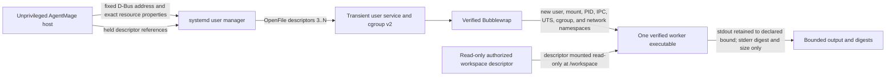

# Linux Worker Isolation

## Status and Scope

The Linux adapter implements one fresh Bubblewrap worker per admitted operation.
The implementation has been exercised locally on Fedora Kinoite 44. Ubuntu
package and clean-environment conformance remain unverified and are not claimed
by this document. The current public operation surface is read-only and accepts
one canonical `WorkspacePath`; it is not a general command-execution API.

## Process and Data Flow

The host verifies and continuously holds the workspace root, worker executable,
dynamic runtime files, Bubblewrap, and `systemd-run`. Root-owned launch paths
must have no symbolic-link component and no group or world-writable component.
The two supervisors are digest-revalidated immediately before launch. The user
manager opens held workspace, worker, and runtime descriptors through
`OpenFile=` and passes them to Bubblewrap; Bubblewrap mounts those exact file
descriptors rather than resolving their original names again.

## Worker Boundary

Each operation receives only:

- a read-only `/workspace` mounted from the authorized root descriptor;
- one verified executable at `/app/worker`;
- up to 16 verified, root-owned runtime files below `/lib`, `/lib64`,
  `/usr/lib`, or `/usr/lib64`;
- a private 16 MiB `/tmp`, a minimal private `/dev`, and a new `/proc` for the
  private PID namespace;
- `PATH=/app`, `LANG=C`, and Bubblewrap's deterministic `PWD=/workspace`;
- one canonical workspace file argument; and
- an already-compiled seccomp program on standard input, which Bubblewrap
  consumes before executing the worker.

The worker does not receive the host home, `/etc`, `/sys`, `/run`, host devices,
host process namespace, inherited configuration, inherited environment, host
network namespace, secret-store socket, or a writable workspace. `--unshare-all`
creates the namespaces, `--disable-userns` prevents a nested user namespace,
`--cap-drop ALL` removes capabilities, and the fixed seccomp policy returns
`EPERM` for network/socket, namespace/mount, kernel/module, keyring, tracing,
cross-process, io_uring, modern mount, clock/host-identity, and other dangerous
syscall families.

## Resource Enforcement

The transient user service requires and applies exact `MemoryMax`,
`MemorySwapMax=0`, `TasksMax`, `CPUQuota`, and `RuntimeMaxSec` properties. It also
requires `NoNewPrivileges`, private devices, SUID/SGID restrictions, a locked
personality, and address-family restriction during Bubblewrap setup. Public
limit construction rejects memory, task, CPU, elapsed-time, and retained-output
values outside the closed supported ranges.

Standard output and diagnostics are drained concurrently so a full pipe cannot
deadlock the supervisor. Retained bytes never exceed the declared output bound.
An over-limit stream fails closed; diagnostics leave the boundary only as a
SHA-256 digest and byte count.

## Trust and Failure Boundary

The worker is treated as potentially compromised. The operating-system account,
root-owned package paths, kernel, systemd user manager, and installed Bubblewrap
remain trusted dependencies. A process already running with the same user
authority, or a privileged administrator, is outside this isolation boundary;
this design does not claim to protect an AgentMage process from its own account
or from root.

Manifest, identity, architecture, policy-compilation, process-start, and output
bound failures return stable content-free categories. There is no direct worker
launch and no fallback without Bubblewrap, seccomp, the systemd user service, or
the declared resource controls. Platform startup probes and clean Fedora/Ubuntu
package evidence remain separate Sprint 9 gate requirements.

## Secret Service Boundary

Linux credentials use the root-owned `secret-tool` client and the desktop
session's `org.freedesktop.secrets` implementation. AgentMage supplies only
fixed schema/profile/purpose attributes on the process command line. Credential
bytes travel through standard input for storage and standard output for lookup;
they never enter process arguments, inherited environment, configuration,
receipts, diagnostics, model context, or tool results.

The client starts with a cleared environment containing only the constructed
user runtime directory and session-bus address. Client identity is verified and
digest-revalidated before each operation. Reads, diagnostics, and elapsed time
are bounded; client processes are terminated on timeout. Secret buffers use the
`zeroize` crate, have no serialization or display implementation, and expose
bytes only for the duration of a caller-provided closure. Receipts contain the
operation, hidden-diagnostic byte count, and hidden-diagnostic digest, but no
key attributes, value, or value digest.

The Fedora evidence performs a fresh no-match probe plus a synthetic
store/lookup/clear round trip and verifies the item is absent afterward. It does
not inspect, enumerate, export, or modify any pre-existing credential.

## Current Verification

The Linux adapter test suite verifies:

- fixed policy compilation to nonempty classic BPF;
- invalid limits and runtime destinations fail closed;
- foreign workspace identities do not start a worker;
- a canonical file read succeeds through the real Fedora isolation stack;
- a worker cannot alter a read-only workspace file;
- home, system, runtime, device, and host-process paths are absent;
- only the fixed worker environment is present;
- a network attempt cannot succeed; and
- output is drained but rejected when it exceeds the retained-output bound.

These tests are implementation evidence, not Fedora or Ubuntu package,
installation, update, recovery, or release evidence.
